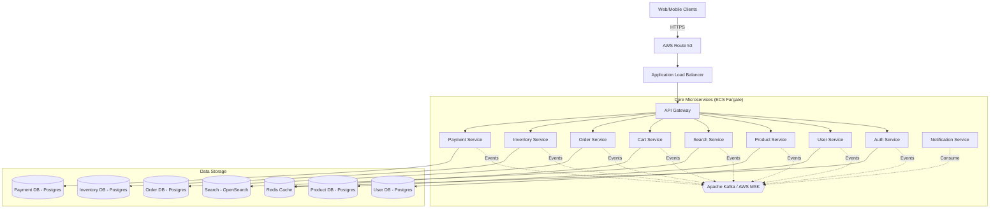

# ARCHITECTURE.md — Ecommerce Platform Design

## 1. High-Level System Architecture Diagram



## 2. Service Boundaries & Responsibilities

1. **API Gateway**: Entry point for all clients. Handles rate limiting, request validation, and routing.
2. **Auth Service**: Manages JWT generation, authentication, and RBAC. Uses Redis for token blacklisting.
3. **User Service**: Manages customer profiles, addresses, and account-related preferences.
4. **Product Service**: The System of Record for the product catalog. Manages categories, attributes, and pricing.
5. **Search Service**: Consumes product update events to build denormalized indices in OpenSearch for low-latency (<200ms) queries.
6. **Cart Service**: Manages user shopping carts using Redis for ultra-fast, ephemeral state.
7. **Order Service**: Manages order lifecycle. Acts as the orchestrator for the checkout Saga.
8. **Inventory Service**: Manages product stock levels. Critical for preventing overselling.
9. **Payment Service**: Integrates with external payment gateways (Stripe/PayPal) and records payment states.
10. **Notification Service**: Listens to system events and dispatches Emails, SMS, and Push notifications.

## 3. Domain Models for Each Service

- **User Domain**: `User` (id, email, passwordHash, status), `Address` (street, city, zip, type: billing|shipping)
- **Product Domain**: `Product` (id, name, description, basePrice, status), `Category`, `Attribute`
- **Cart Domain**: `Cart` (userId, sessionsId), `CartItem` (productId, quantity, snapshottedPrice)
- **Order Domain**: `Order` (id, userId, totalAmount, status: PENDING|CONFIRMED|FAILED), `OrderItem`
- **Inventory Domain**: `Stock` (productId, availableQuantity, reservedQuantity)
- **Payment Domain**: `PaymentTransaction` (orderId, amount, provider, status: PENDING|SUCCESS|FAILED)

## 4. Database Schema Design (PostgreSQL/Redis)

**Database per Service Pattern enforced.**

- **Product DB (PostgreSQL)**: Extensively read-heavy, uses read-replicas.
  - `products` (id UUID PK, name VARCHAR, price DECIMAL, status ENUM)
- **Inventory DB (PostgreSQL)**:
  - `inventory` (product_id UUID PK, available INT, reserved INT, version INT) -> Uses `version` for Optimistic Concurrency Control (OCC).
- **Order DB (PostgreSQL)**:
  - `orders` (id UUID PK, user_id UUID, total DECIMAL, status VARCHAR, created_at TIMESTAMP)
  - `outbox_events` (id UUID, type VARCHAR, payload JSONB, processed BOOLEAN) -> Outbox Pattern.
- **Cart Cache (Redis)**:
  - Hash: `cart:{userId}` -> Field: `productId`, Value: `quantity` + `price` (as JSON string). TTL: 7 days.

## 5. Kafka Event Architecture

**Topic Design Concepts:**
- Domain-based topics: `product.events`, `order.events`, `inventory.events`, `payment.events`.

**Partitioning Strategy:**
- Partition by primary entity ID (`productId` or `orderId`) to guarantee ordering for events related to the same entity.

**Delivery & Ordering Guarantees:**
- At-least-once delivery semantics (`acks=all` on producer, manual commits on consumer).
- **Idempotency**: All consumers implement idempotency using a `processed_events` table tracking `eventId`.
- **Transactional Outbox Pattern**: Services do not write to the DB and publish to Kafka directly. Instead, they write state and an `outbox` record in the same ACID transaction. A background worker pushes the event to Kafka.

## 6. Distributed Transaction Design (Saga Flow)

**Checkout Saga (Orchestrated by Order Service)**
1. `Order Service` creates Order (`PENDING`) & publishes `OrderCreated`.
2. `Inventory Service` consumes `OrderCreated`.
   - Reserves stock. If success: Publishes `InventoryReserved`.
   - If failure (insufficient stock): Publishes `InventoryReservationFailed`.
3. `Order Service` consumes `InventoryReserved`.
   - Instructs `Payment Service` to process payment.
4. `Payment Service` processes payment.
   - Publishes `PaymentProcessed` or `PaymentFailed`.
5. `Order Service` consumes payment event.
   - If `PaymentProcessed`: Updates order (`CONFIRMED`). Publishes `OrderConfirmed`.
   - If `PaymentFailed`: Updates order (`FAILED`). Publishes `OrderFailed`.
6. `Inventory Service` consumes `OrderFailed`.
   - Compensating transaction: Releases reserved stock.

## 7. Data Consistency Strategy

- **Strong Consistency**: Applied only within service boundaries (e.g., deducting inventory in the Inventory DB uses ACID transactions).
- **Eventual Consistency**: Across service boundaries via Kafka.
- **Concurrency Control**: Optimistic locking (version numbers) in DB; Redis distributed locks (Redlock) for strict sequences.

## 8. AWS Infrastructure Architecture

- **Networking**: VPC with 3 AZs. Public subnets (ALBs/NAT), Private subnets (ECS/RDS/ElastiCache).
- **Compute**: ECS clusters on AWS Fargate. Autoscales based on CPU/Memory tracking.
- **Data storage**: 
  - Amazon Aurora PostgreSQL Serverless v2 for relational data.
  - ElastiCache for Redis (cluster mode).
  - AWS MSK for the Apache Kafka backbone.
  - Amazon OpenSearch Service.
- **Security**: AWS Secrets Manager, IAM task roles, Security Groups for least privilege.

## 9. Terraform Module Architecture

```text
terraform/
├── environments/ (dev, staging, prod)
└── modules/
    ├── vpc/          
    ├── rds/          
    ├── elasticache/  
    ├── msk/          
    ├── opensearch/   
    ├── ecs_cluster/  
    └── microservice_base/ # Generates ECS task, Service, TG, IAM, SG per NestJS service
```
*Approach*: Remote state in S3 backend + DynamoDB locking.

## 10. Observability Architecture

- **OpenTelemetry (OTel)**: Inject OTel SDK into NestJS. Propagate context across HTTP headers and Kafka headers.
- **Metrics**: Prometheus `/metrics` endpoint on all services.
- **Centralized Logging**: JSON logs sent via FluentBit to CloudWatch/OpenSearch.
- **Tracing**: Jaeger or Grafana Tempo UI combining metrics, logs, and distributed traces using correlation IDs.

## 11. CI/CD Pipeline Design

- **CI (GitHub Actions)**: Format, Lint, Unit Tests, SonarCloud analysis -> Integration tests with Testcontainers -> Build & Push Docker image to AWS ECR.
- **CD (Deploy)**: `terraform apply` -> ECS Rolling Update / Blue-Green using AWS CodeDeploy.

## 12. Failure Scenarios and Recovery Strategies

- **Kafka Broker Failure**: MSK multi-AZ handles this; clients auto-reconnect.
- **DB Failover**: Aurora fails to replica. Circuit breakers trip to fail fast (503) instead of locking threads.
- **Downstream Timeout**: Circuit breaker fallback triggers compensations immediately to avoid cascade failure.
- **Poison Pill Event**: If a malformed message crashes a consumer repeatedly, route to `<topic>-dlq` (Dead Letter Queue) after 3 retries.

## 13. Project Folder Structure

```text
ecommerce-platform/
├── .gsd/                 # Planning & Tracking
├── terraform/            # IaC definitions
├── docker/               # Local dev compose files
├── packages/             # Monorepo Shared Libs (Nx/Turborepo)
│   ├── core/
│   └── events/
└── apps/                 # NestJS Microservices
    ├── api-gateway/
    ├── auth-service/
    ├── user-service/
    ├── product-service/
    └── ...
```

## 14. Step-by-Step Implementation Plan

Follows ROADMAP.md closely:
1. **Monorepo Setup**: Init workspace, NestJS configs.
2. **Terraform Foundation**: Write core data store and network modules.
3. **Core Libraries**: Build shared NestJS OTel tracing, DLQ handling, and Outbox implementation logic.
4. **Foundation Services**: Impl API Gateway route mapping & Auth/User basic flows.
5. **Product & Search Sync**: Model CQRS with OpenSearch sync consumer.
6. **Transactional Core**: Implement Saga orchestrator in Order Service and compensate flows in Inventory.
7. **Simulation & Polish**: Run load testing to validate 3k TPS orders capacity requirements.
