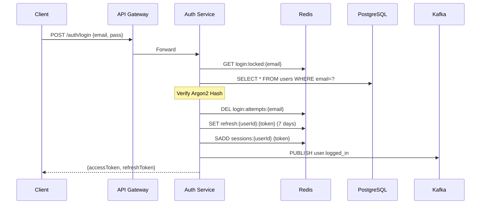
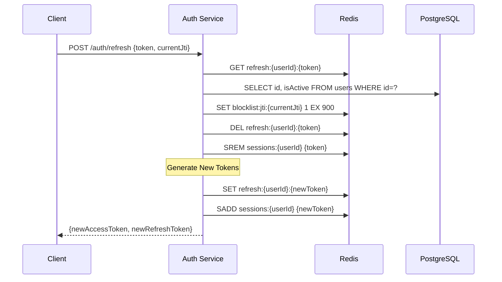

# Auth Service — Data Architecture & Models

This document extracts and reverse-engineers the complete data architecture of the `auth-service`, covering the relational database schema, Redis data models, Kafka events, JWT payload structures, and the authentication session model.

---

## STEP 1 — Database Architecture

The `auth-service` uses PostgreSQL via TypeORM. The entire service domain centers around a single `users` table that stores both password-authenticated users and OAuth-linked users.

### Table: `users`
**Purpose**: Central source of truth for all identities, access roles, and user state.

**Columns**:
- [id](file:///c:/source/apps/auth-service/src/domain/entities/user.entity.ts#32-33) (uuid, primary key) — Application-generated UUID (not DB-generated).
- [email](file:///c:/source/apps/auth-service/src/domain/entities/user.entity.ts#33-34) (varchar, unique) — The unique identifier for login.
- `passwordHash` (varchar, nullable) — Argon2 hash of the password. Null for OAuth-only users.
- [role](file:///c:/source/apps/auth-service/src/domain/entities/user.entity.ts#35-36) (varchar, length 50) — The RBAC role (`CUSTOMER` | `ADMIN`).
- [isEmailVerified](file:///c:/source/apps/auth-service/src/domain/entities/user.entity.ts#36-37) (boolean) — Status of email verification. Defaults to `false` for password signups, `true` for OAuth.
- [isActive](file:///c:/source/apps/auth-service/src/domain/entities/user.entity.ts#37-38) (boolean) — Soft-deactivation flag. Defaults to `true`.
- [provider](file:///c:/source/apps/auth-service/src/domain/entities/user.entity.ts#40-41) (varchar, nullable) — The OAuth provider name (e.g., `'google'`, `'github'`).
- [providerId](file:///c:/source/apps/auth-service/src/domain/entities/user.entity.ts#41-42) (varchar, nullable) — The opaque ID issued by the OAuth provider.
- [firstName](file:///c:/source/apps/auth-service/src/domain/entities/user.entity.ts#42-43) (varchar, nullable) — User's first name, primarily populated from OAuth.
- [lastName](file:///c:/source/apps/auth-service/src/domain/entities/user.entity.ts#43-44) (varchar, nullable) — User's last name.
- [picture](file:///c:/source/apps/auth-service/src/domain/entities/user.entity.ts#44-45) (varchar, nullable) — URL to the user's avatar.
- [tenantId](file:///c:/source/apps/auth-service/src/domain/entities/user.entity.ts#45-46) (varchar, nullable) — For SaaS multi-tenancy grouping.
- [orgId](file:///c:/source/apps/auth-service/src/domain/entities/user.entity.ts#46-47) (varchar, nullable) — For organizational grouping within a tenant.
- [createdAt](file:///c:/source/apps/auth-service/src/domain/entities/user.entity.ts#38-39) (timestamp) — Managed by TypeORM `@CreateDateColumn()`.
- [updatedAt](file:///c:/source/apps/auth-service/src/domain/entities/user.entity.ts#39-40) (timestamp) — Managed by TypeORM `@UpdateDateColumn()`.

**Indexes**:
- `UNIQUE INDEX "IDX_..._email" ON users (email)` — implicitly created by `@Column({ unique: true })`.
- `UNIQUE INDEX "IDX_..._provider_providerId" ON users (provider, providerId) WHERE provider IS NOT NULL` — Partial composite index to ensure an OAuth provider's ID can only be linked to one account in the system, while ignoring password-only accounts.

**Relationships**:
There are no foreign key relationships defined in the database schema. Session and token relationships are handled entirely in Redis.

**Authentication Flow Usage**:
- **Registration**: Inserts a new row with `passwordHash`.
- **Login**: Queries by [email](file:///c:/source/apps/auth-service/src/domain/entities/user.entity.ts#33-34) (using the unique index) to retrieve the hash for verification.
- **Refresh**: Queries by [id](file:///c:/source/apps/auth-service/src/domain/entities/user.entity.ts#32-33) (Primary Key) to ensure [isActive](file:///c:/source/apps/auth-service/src/domain/entities/user.entity.ts#37-38) is still true before issuing new tokens.

---

## STEP 2 — OAuth Data Model

The system does *not* use a separate `oauth_accounts` table. Instead, it uses a **Single-Table Inheritance / Union** approach where the `users` table handles both local and OAuth identities.

**How OAuth accounts are stored**:
- New OAuth user: A row is created where `passwordHash` is `null`, and [provider](file:///c:/source/apps/auth-service/src/domain/entities/user.entity.ts#40-41)/[providerId](file:///c:/source/apps/auth-service/src/domain/entities/user.entity.ts#41-42) are populated.
- Linked OAuth user: When an OAuth login email matches an existing password-based account, the existing row is updated to populate [provider](file:///c:/source/apps/auth-service/src/domain/entities/user.entity.ts#40-41) and [providerId](file:///c:/source/apps/auth-service/src/domain/entities/user.entity.ts#41-42).

**Schema Mapping**:
- Data from Google (`emails[0].value`, `name.givenName`, `photos[0].value`, [id](file:///c:/source/apps/auth-service/src/domain/entities/user.entity.ts#32-33)) maps directly to [email](file:///c:/source/apps/auth-service/src/domain/entities/user.entity.ts#33-34), [firstName](file:///c:/source/apps/auth-service/src/domain/entities/user.entity.ts#42-43), [picture](file:///c:/source/apps/auth-service/src/domain/entities/user.entity.ts#44-45), [providerId](file:///c:/source/apps/auth-service/src/domain/entities/user.entity.ts#41-42).
- Data from GitHub maps similarly, with care taken to ensure the email is verified by GitHub.

**Account linking logic**:
1. Search by [provider](file:///c:/source/apps/auth-service/src/domain/entities/user.entity.ts#40-41) and [providerId](file:///c:/source/apps/auth-service/src/domain/entities/user.entity.ts#41-42). If found, login succeeds.
2. If not found, search by [email](file:///c:/source/apps/auth-service/src/domain/entities/user.entity.ts#33-34). If found, the existing account is "linked" by updating the [provider](file:///c:/source/apps/auth-service/src/domain/entities/user.entity.ts#40-41) and [providerId](file:///c:/source/apps/auth-service/src/domain/entities/user.entity.ts#41-42) fields (and emitting a Kafka event). Note: The code currently mentions a need for an explicit user confirmation flow for this link to be fully secure against email collision attacks.
3. If no email matches, a new user is registered.

**Duplicate prevention**:
The partial unique index [(provider, providerId) WHERE provider IS NOT NULL](file:///c:/source/apps/auth-service/src/domain/entities/user.entity.ts#32-33) guarantees at the database level that an external identity (e.g., Google ID `10xx99xx`) can only ever map to a single user in our system. The unique index on [email](file:///c:/source/apps/auth-service/src/domain/entities/user.entity.ts#33-34) prevents the creation of a second account with the same email.

---

## STEP 3 — Redis Data Architecture

Redis is heavily utilized for stateful security operations. There are exactly four key patterns used in the system.

### 1. Refresh Token Store
**Key**: `refresh:{userId}:{refreshToken}`
**Value**: `userId` (string)
**TTL**: 7 days (604,800 seconds)
**Purpose**: Stores valid, opaque refresh tokens. Evaluated by checking key existence. Links the token to the specific user.

### 2. User Session Index
**Key**: `sessions:{userId}`
**Value**: Redis `SET` of `refreshToken` strings
**TTL**: 7 days (refreshed on every new login)
**Purpose**: Maintains a list of all active refresh tokens for a user. Allows [O(1)](file:///c:/source/apps/auth-service/src/infrastructure/database/user.repository.ts#62-79) global logout (revoking all devices) without needing a slow `SCAN` operation across the entire Redis keyspace.

### 3. Access Token Blocklist (Revocation)
**Key**: `blocklist:jti:{jti}`
**Value**: `'1'`
**TTL**: 15 minutes (900 seconds) — matches the maximum remaining lifetime of the access token.
**Purpose**: Stores the JWT ID ([jti](file:///c:/source/apps/auth-service/src/infrastructure/redis/token-store.service.ts#24-27)) of access tokens that were explicitly revoked (e.g., logged out, or rotated during a refresh) before their natural expiration time.

### 4. Brute Force Attempts Counter
**Key**: `login:attempts:{email}`
**Value**: Integer (incremented on failure)
**TTL**: 15 minutes (900 seconds) — sliding window.
**Purpose**: Tracks the number of consecutive failed login attempts for an email address.

### 5. Brute Force Account Lock
**Key**: `login:locked:{email}`
**Value**: `'1'`
**TTL**: 15 minutes (900 seconds)
**Purpose**: Created when `login:attempts` hits 5. Existence of this key instantly rejects login attempts for the email, saving database load and protecting the account.

---

## STEP 4 — JWT Token Model

The system uses standard JWTs (JSON Web Tokens) for stateless access authentication.

### Payload Schema
```json
{
  "sub": "b2f8a14c-1d9e-4a6f-b82b-9c3f4a5b6c7d", 
  "email": "user@example.com",
  "role": "CUSTOMER",
  "jti": "8f7e6d5c-4b3a-21f0-e9d8-c7b6a5091234",
  "tenantId": null,
  "orgId": null,
  "iat": 1710500000,
  "exp": 1710500900
}
```

**Token Expiration Strategy**:
The access token has a very short lifetime (`expiresIn: '15m'`). It is designed to be passed in the `Authorization: Bearer` header. When it expires, the client must use the refresh token to get a new one.

**The [jti](file:///c:/source/apps/auth-service/src/infrastructure/redis/token-store.service.ts#24-27) (JWT ID)**:
[jti](file:///c:/source/apps/auth-service/src/infrastructure/redis/token-store.service.ts#24-27) is a universally unique identifier injected into the payload (`crypto.randomUUID()`). It uniquely identifies *this specific token instance*.

**Revocation Strategy**:
Because a signed JWT is stateless, the API Gateway can verify it locally without asking the `auth-service`. To handle logouts or stolen tokens, the [jti](file:///c:/source/apps/auth-service/src/infrastructure/redis/token-store.service.ts#24-27) is extracted from the JWT and sent to the `auth-service` logout/refresh endpoints. The `auth-service` adds this [jti](file:///c:/source/apps/auth-service/src/infrastructure/redis/token-store.service.ts#24-27) to the Redis `blocklist:jti:*`. Any service validating the JWT must check the Redis blocklist to ensure the [jti](file:///c:/source/apps/auth-service/src/infrastructure/redis/token-store.service.ts#24-27) hasn't been revoked.

---

## STEP 5 — Kafka Event Architecture

The `auth-service` operates as an event producer. It publishes domain events so downstream systems (like Notification Service or User Analytics) can react.

**1. `user.registered`**
- **Emitted**: On successful password registration or new OAuth signup.
- **Payload**: `{ userId, email, provider?, providerId?, timestamp }`
- **Consumers**: User service (to create a profile), Notification service (welcome email).

**2. `user.logged_in`**
- **Emitted**: On successful password verification or OAuth login.
- **Payload**: `{ userId, email, provider?, timestamp }`
- **Consumers**: Analytics service, Security audit logs.

**3. `user.oauth_linked`**
- **Emitted**: When an OAuth provider matches an existing account's email domain.
- **Payload**: `{ userId, provider, providerId, timestamp }`
- **Consumers**: Notification service (security alert: "A Google account was linked to your profile").

**4. `user.login_failed`**
- **Emitted**: When password verification fails, or an inactive account tries to login.
- **Payload**: `{ email, reason, timestamp }`
- **Consumers**: Security audit logs, SIEM systems.

*(Note: The `user.password_changed` and `user.logged_out` events exist as TypeScript definitions in the domain layer, but are not actively emitted in the current handlers).*

---

## STEP 6 — Authentication Session Architecture

The session model is built around **Refresh Token Rotation**.

1. **Refresh Token Storage**: The refresh token is an 80-character high-entropy opaque hex string generated via `crypto.randomBytes(40)`. It is *not* a JWT. It is stored in Redis.
2. **Session Identification**: A "session" is implicitly defined by the existence of a valid refresh token in Redis. A single user can have multiple concurrent sessions (e.g., Phone and Desktop), tracked in the `sessions:{userId}` Redis set.
3. **Rotation handling**: When a client uses a refresh token:
   - The token is verified in Redis.
   - The *old* refresh token is deleted ([revokeRefreshToken](file:///c:/source/apps/auth-service/src/domain/ports/token-store.port.ts#17-21)).
   - The *old* access token's [jti](file:///c:/source/apps/auth-service/src/infrastructure/redis/token-store.service.ts#24-27) is blocklisted ([blocklistJti](file:///c:/source/apps/auth-service/src/domain/ports/token-store.port.ts#27-32)).
   - A *new* refresh token and *new* access token are generated and stored.
   This prevents stolen refresh tokens from being reused indefinitely.
4. **Logout handling**: Exhaustively revokes the specific refresh token and blocklists the current access token.

*(Note: Explicit Device IDs and IP tracking are present in the Domain Event schemas, but not currently extracted from the HTTP request or stored in the Redis session model).*

---

## STEP 7 — Security Data Structures

The system implements Brute Force and Dictionary Attack protection using a sliding window algorithm in Redis:

**1. Failed Attempt Tracking (`login:attempts:{email}`)**:
When a login fails, `INCR login:attempts:user@example.com` is executed. The key's TTL is immediately set/refreshed to 15 minutes (`EXPIRE`).

**2. Lock Trigger (`login:locked:{email}`)**:
If the increment returns `>= 5`, a lock key is created: `SET login:locked:user@example.com 1 EX 900`.

**3. Lockout Enforcement**:
At the very top of [LoginHandler](file:///c:/source/apps/auth-service/src/application/handlers/login.handler.ts#24-118), before touching PostgreSQL, `EXISTS login:locked:{email}` is evaluated. If true, the system halts and returns HTTP 429 immediately. 

This model ensures the database is shielded from aggressive brute-force scaling, pushing the load entirely onto Redis memory.

---

## STEP 8 — Data Flow Diagrams

### Authentication & Token Generation Flow



### Refresh Token Rotation Flow



---

## STEP 9 — Full Data Architecture Diagram


### Data Distribution Summary:
- **PostgreSQL**: Stores Long-term canonical truth. The `users` table holds identifiers, hashed credentials, roles, and status flags.
- **Redis**: Stores Short-term/Ephemera state. Holds active refresh tokens, session topologies, access token blocklists, and brute-force attempt counters.
- **Kafka**: Stores Immutable historical facts. The append-only log of domain events (registrations, logins) acts as the source for downstream data synchronization.

---

## STEP 10 — Architecture Review

Evaluating this data architecture against production-grade systems (e.g., Stripe, Shopify):

### Strengths
- **Argon2 Hashing**: Correctly chosen over BCrypt for memory-hard resistance.
- **Stateless/Stateful Hybrid**: Fast JWTs for edge validation combined with opaque, strictly revocable refresh tokens in Redis.
- **[O(1)](file:///c:/source/apps/auth-service/src/infrastructure/database/user.repository.ts#62-79) Session Revocation**: The `sessions:{userId}` set is an excellent pattern, avoiding [O(N)](file:///c:/source/apps/auth-service/src/infrastructure/database/user.repository.ts#62-79) scans characteristic of simpler Redis implementations.

### Missing Elements & Weaknesses

1. **OAuth Table Separation**: 
   - *Current*: OAuth properties are nullable columns on the `users` table.
   - *Risk*: A user can only link one Google account and one GitHub account. If they want to link two GitHub accounts, the schema fails.
   - *Recommendation*: Extract to a `user_identities` table ([id](file:///c:/source/apps/auth-service/src/domain/entities/user.entity.ts#32-33), `user_id`, [provider](file:///c:/source/apps/auth-service/src/domain/entities/user.entity.ts#40-41), `provider_id`, `created_at`).

2. **Device & IP Tracking**:
   - *Current*: Refresh tokens are completely anonymous in Redis.
   - *Risk*: Users cannot view active sessions (e.g., "MacBook Pro in London") and selectively revoke devices.
   - *Recommendation*: Convert `refresh:{userId}:{token}` from a raw String value to a Redis Hashes (`HSET`) containing `{ userAgent, ip, createdAt, lastUsedAt }`.

3. **Event Schema Inconsistencies**:
   - *Current*: Emitted Kafka objects do not map directly to the domain events defined in `src/domain/events`. 
   - *Risk*: Consumer parsing errors if properties change.
   - *Recommendation*: Use an Avro schema registry or Protobuf to strong-type Kafka payloads across the monorepo.

4. **Brute Force Flaw (DDoS vector)**:
   - *Current*: Lockout is tracked by [email](file:///c:/source/apps/auth-service/src/domain/entities/user.entity.ts#33-34) only.
   - *Risk*: An attacker can lock out legitimate users by spamming incorrect passwords for their emails (Denial of Service).
   - *Recommendation*: Implement a composite sliding window: lock by [email](file:///c:/source/apps/auth-service/src/domain/entities/user.entity.ts#33-34) (max 5 attempts) AND lock by `IP_address` (max 50 attempts).

5. **Redis Memory Concerns**:
   - *Current*: `SREM` is used for single token revocation, but the `sessions:{userId}` set itself only expires after 7 days from the *first* token issue, or is deleted entirely on global logout. Expired tokens are not naturally cleaned from the Set, leading to unbound set growth over time.
   - *Recommendation*: Periodically prune the session Sets of expired tokens during login events.
