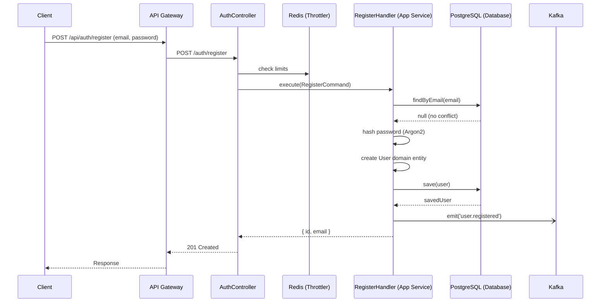
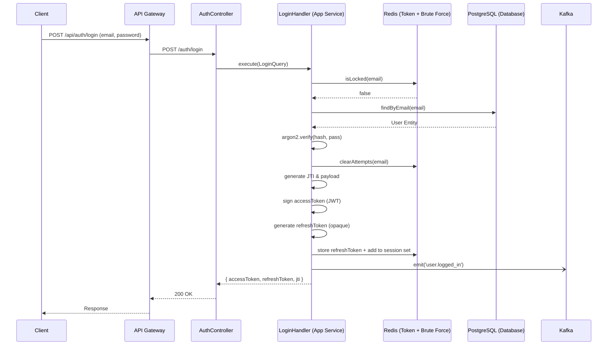
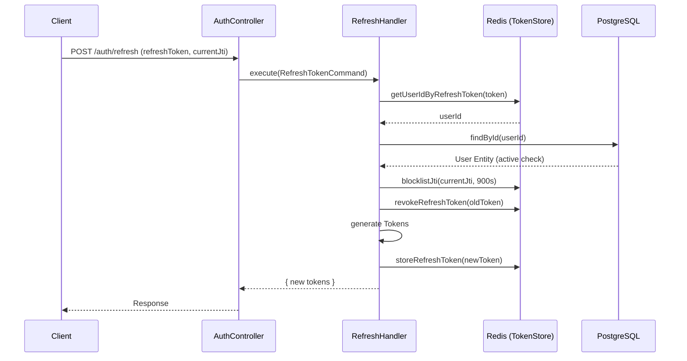
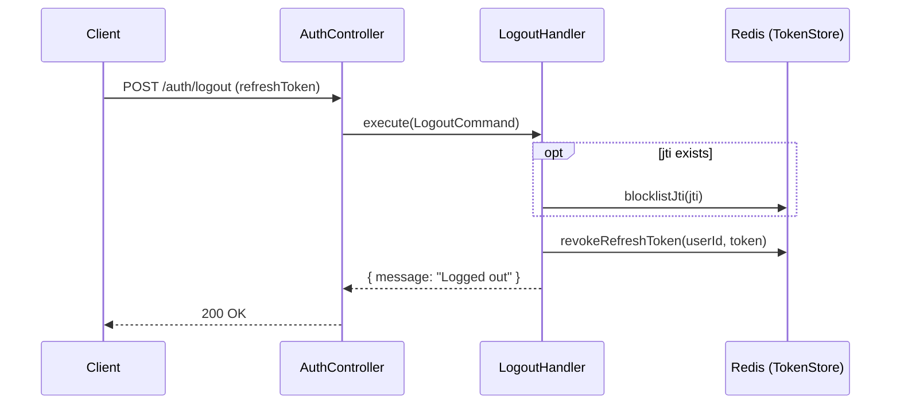
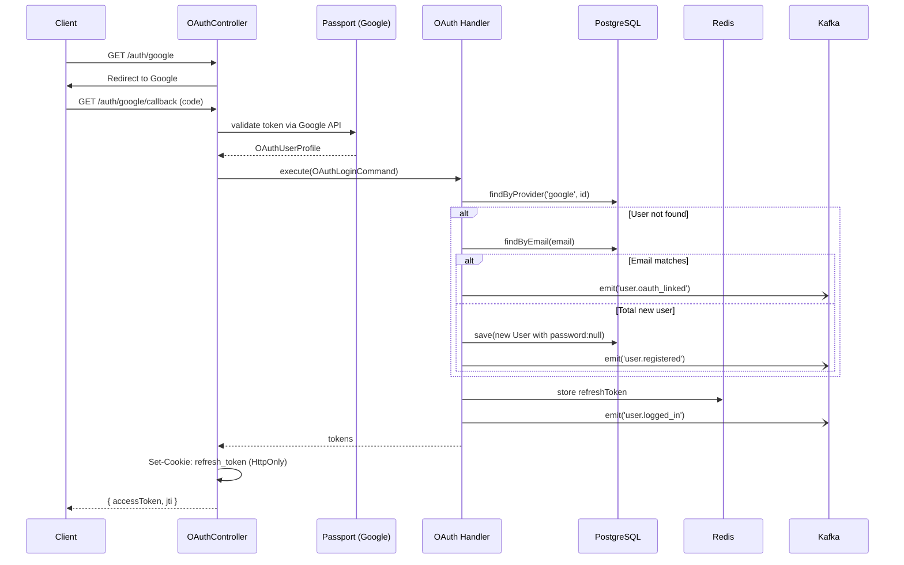
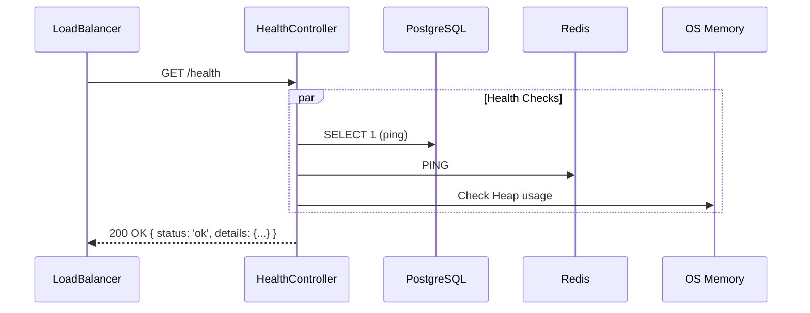

# Auth Service — API Endpoints & Flow Charts

This document provides a deep architectural analysis of every API endpoint in the `auth-service`, tracing the execution path through all layers (Controllers, Application, Domain, Infrastructure, and External Systems) and highlighting side effects, security mechanisms, and performance mechanisms.

---

## 1. POST `/auth/register` (Email & Password Registration)

### 1. API Description
Registers a new user account using an email and password. The password is hashed using Argon2, and the user is saved to the PostgreSQL database. An event is published to Kafka to notify other services of the new registration.

### 2. Request Flow (Step by Step)
1. **API Gateway** receives `POST /api/auth/register` and proxies it to Auth Service `POST /auth/register`.
2. **Global ValidationPipe** validates [RegisterDto](file:///c:/source/apps/auth-service/src/interfaces/dto/auth.dto.ts#4-22) (strips unknown fields, enforces email format, enforces minimum password length of 8).
3. **ThrottlerGuard** checks rate limits in Redis (max 10 requests per 60 seconds per IP).
4. **AuthController** dispatches [RegisterCommand](file:///c:/source/apps/auth-service/src/application/commands/register.command.ts#3-6) to the `CommandBus`.
5. **RegisterHandler** creates an [Email](file:///c:/source/apps/auth-service/src/domain/value-objects/email.value-object.ts#1-21) value object to validate domain rules.
6. **UserRepositoryPort (Infrastructure Adapter)** queries PostgreSQL to ensure the email is unique. If it exists, throws `409 ConflictException`.
7. **RegisterHandler** hashes the password using Argon2 and wraps it in a [Password](file:///c:/source/apps/auth-service/src/domain/value-objects/password.value-object.ts#1-16) value object.
8. **RegisterHandler** creates a new [User](file:///c:/source/apps/auth-service/src/domain/entities/user.entity.ts#25-71) domain aggregate root with a generated UUID.
9. **UserRepositoryPort** maps the domain entity to [UserOrmEntity](file:///c:/source/apps/auth-service/src/infrastructure/database/user.orm-entity.ts#10-69) and saves it to PostgreSQL.
10. **RegisterHandler** publishes a `user.registered` event to Kafka.
11. **AuthController** returns HTTP 201 with the new user's [id](file:///c:/source/apps/auth-service/src/domain/entities/user.entity.ts#32-33) and [email](file:///c:/source/apps/auth-service/src/domain/entities/user.entity.ts#33-34).

### 3. Sequence Diagram (Mermaid)

### Additional Details
- **Side effects**: DB Insert (users table), Kafka Event (`user.registered`).
- **Security mechanisms**: Input validation (class-validator), Argon2 hashing, Global Rate limiting.
- **Performance**: Standard TypeORM save; indexing on [email](file:///c:/source/apps/auth-service/src/domain/entities/user.entity.ts#33-34) field makes the uniqueness check fast.

---

## 2. POST `/auth/login` (Standard Login)

### 1. API Description
Authenticates a user using email and password. Returns an access token (JWT) and a refresh token (opaque string). Implements brute-force protection to lock accounts after multiple failed attempts.

### 2. Request Flow (Step by Step)
1. **API Gateway** receives `POST /api/auth/login` and proxies it to Auth Service.
2. **ValidationPipe** validates [LoginDto](file:///c:/source/apps/auth-service/src/interfaces/dto/auth.dto.ts#23-33).
3. **ThrottlerGuard** checks rate limits in Redis.
4. **AuthController** dispatches [LoginQuery](file:///c:/source/apps/auth-service/src/application/queries/login.query.ts#3-6) to the `QueryBus`.
5. **LoginHandler** calls [LoginAttemptService](file:///c:/source/apps/auth-service/src/application/services/auth.service.ts#8-24) to check Redis if the account is temporarily locked (HTTP 429 if locked).
6. **UserRepositoryPort** fetches user from PostgreSQL by email.
7. If user not found, inactive, or has no password (OAuth-only), [LoginAttemptService](file:///c:/source/apps/auth-service/src/application/services/auth.service.ts#8-24) increments failed attempts in Redis, emits `user.login_failed` to Kafka, and throws HTTP 401.
8. **LoginHandler** verifies the password hash using Argon2. If incorrect, records failed attempt and throws HTTP 401.
9. On success, [LoginAttemptService](file:///c:/source/apps/auth-service/src/application/services/auth.service.ts#8-24) clears failed attempts in Redis.
10. **JwtAdapterService** generates a new JWT payload containing a unique JTI (UUID), signs the access token, and generates an opaque 80-char hex refresh token.
11. **TokenStoreService** stores the refresh token in Redis (TTL 7 days) and adds it to the user's sessions set.
12. **LoginHandler** publishes a `user.logged_in` event to Kafka.
13. **AuthController** returns the tokens to the client.

### 3. Sequence Diagram (Mermaid)

### Additional Details
- **Side effects**: DB Select, Redis key creation (refresh token, session index), Redis key deletion (clear attempts), Kafka Event (`user.logged_in` OR `user.login_failed`).
- **Security mechanisms**: Brute-force protection (Redis sliding window counter), Timing-safe hash comparison (Argon2), Rate Limiting. JTI generation for revocation.
- **Performance**: Pre-check in Redis before DB query prevents DB load during brute-force attacks.

---

## 3. POST `/auth/refresh` (Token Rotation)

### 1. API Description
Takes an existing refresh token and the current access token's JTI. Verifies the refresh token, revokes it, blocklists the old access token, and issues a completely new token pair.

### 2. Request Flow (Step by Step)
1. **API Gateway** receives `POST /api/auth/refresh` and proxies to Auth Service.
2. **ValidationPipe** checks [RefreshTokenDto](file:///c:/source/apps/auth-service/src/interfaces/dto/refresh-token.dto.ts#4-23).
3. **AuthController** dispatches [RefreshTokenCommand](file:///c:/source/apps/auth-service/src/application/commands/refresh-token.command.ts#3-6).
4. **RefreshTokenHandler** calls [TokenStoreService](file:///c:/source/apps/auth-service/src/infrastructure/redis/token-store.service.ts#10-97) to get `userId` from Redis using the provided `refreshToken`. If missing/expired, throws HTTP 401.
5. **UserRepositoryPort** queries PostgreSQL to ensure the user still exists and is [isActive](file:///c:/source/apps/auth-service/src/domain/entities/user.entity.ts#37-38).
6. **TokenStoreService** blocklists the `currentJti` in Redis (TTL ~15 mins) to proactively revoke the old access token.
7. **TokenStoreService** deletes the old refresh token from Redis (Token Rotation).
8. **JwtAdapterService** generates new access token, new JTI, and new refresh token.
9. **TokenStoreService** stores the new refresh token in Redis.
10. **AuthController** returns the new tokens.

### 3. Sequence Diagram (Mermaid)

### Additional Details
- **Side effects**: DB Select, Redis key deletion (old refresh), Redis key creation (new refresh, JTI blocklist).
- **Security mechanisms**: Refresh Token Rotation (prevents stolen token reuse). JTI blocklisting (revokes access token). Active user check.
- **Performance**: Only 1 fast DB query, primarily relies on fast Redis lookups.

---

## 4. POST `/auth/logout`

### 1. API Description
Revokes the refresh token and blocklists the current access token's JTI.

### 2. Request Flow (Step by Step)
1. **API Gateway** validates bearer token, forwards request to Auth Service (`POST /auth/logout`), potentially extracting `userId` and [jti](file:///c:/source/apps/auth-service/src/infrastructure/redis/token-store.service.ts#24-27) from the gateway validation.
2. **AuthController** constructs [LogoutCommand](file:///c:/source/apps/auth-service/src/application/commands/logout.command.ts#1-8) with `refreshToken`, `userId`, and [jti](file:///c:/source/apps/auth-service/src/infrastructure/redis/token-store.service.ts#24-27).
3. **LogoutHandler** executes.
4. If [jti](file:///c:/source/apps/auth-service/src/infrastructure/redis/token-store.service.ts#24-27) is provided, **TokenStoreService** blocklists it in Redis (TTL 15 mins).
5. **TokenStoreService** revokes the specific `refreshToken` in Redis (removes from string key and session set).
6. **AuthController** returns success message.

### 3. Sequence Diagram (Mermaid)

### Additional Details
- **Side effects**: Redis key creation (blocklist), Redis key deletion (refresh token).
- **Security mechanisms**: Immediate invalidation of both access and refresh tokens. Does not require DB.

---

## 5. GET `/auth/google` & `/auth/google/callback` (OAuth)

### 1. API Description
Initiates Google OAuth 2.0 flow, handles the callback, verifies the user, links or creates an account, and issues system tokens.

### 2. Request Flow (Step by Step)
1. Client requests `GET /auth/google`.
2. **OAuthController** uses `AuthGuard('google')` (Passport), which redirects the client to the Google consent screen.
3. User logs into Google, authorizes the app.
4. Google redirects back to `GET /auth/google/callback`.
5. **AuthGuard('google')** triggers `GoogleStrategy.validate()`:
   - Validates the Google profile, extracting [id](file:///c:/source/apps/auth-service/src/domain/entities/user.entity.ts#32-33), `emails`, `name`, `photos`.
   - Ensures the email is `verified !== false`.
   - Populates `req.user` with [OAuthUserProfile](file:///c:/source/apps/auth-service/src/application/commands/oauth-login.command.ts#1-9).
6. **OAuthController** calls [handleOAuthCallback()](file:///c:/source/apps/auth-service/src/interfaces/controllers/oauth.controller.ts#60-89), dispatching [OAuthLoginCommand](file:///c:/source/apps/auth-service/src/application/commands/oauth-login.command.ts#10-13).
7. **OAuthLoginHandler** looks up [UserRepositoryPort](file:///c:/source/apps/auth-service/src/domain/ports/user-repository.port.ts#8-14) by [(provider='google', providerId=id)](file:///c:/source/apps/auth-service/src/domain/entities/user.entity.ts#32-33).
8. If not found, looks up by [email](file:///c:/source/apps/auth-service/src/domain/entities/user.entity.ts#33-34). If email exists, emits `user.oauth_linked` to Kafka (auto-linking).
9. If email doesn't exist, dispatches [OAuthRegisterCommand](file:///c:/source/apps/auth-service/src/application/commands/oauth-register.command.ts#3-6) -> creates [User](file:///c:/source/apps/auth-service/src/domain/entities/user.entity.ts#25-71) (password: null) -> saves to DB -> emits `user.registered`.
10. Checks `user.isActive`.
11. Generates system Tokens (JWT + Refresh).
12. Stores refresh token in Redis.
13. Emits `user.logged_in` to Kafka.
14. **OAuthController** sets the refresh token as an `HttpOnly`, `Secure`, `SameSite=strict` cookie on the response.
15. Returns the `accessToken` and [jti](file:///c:/source/apps/auth-service/src/infrastructure/redis/token-store.service.ts#24-27) in the JSON body.

### 3. Sequence Diagram (Mermaid)

### Additional Details
- **Side effects**: External API call (Google API verify), DB Select/Insert, Redis Write, Kafka Events.
- **Security mechanisms**: Google token verification, `verified` email enforcement, Safe linking by provider ID first, `HttpOnly` cookie for refresh token to mitigate XSS.

*(The flow for GitHub OAuth is functionally identical, using [GithubStrategy](file:///c:/source/apps/auth-service/src/infrastructure/oauth/github.strategy.ts#13-72) and verifying GitHub specific email objects).*

---

## 6. GET `/health`

### 1. API Description
Standard liveness/readiness probe used by load balancers and container orchestrators (e.g., Kubernetes).

### 2. Request Flow (Step by Step)
1. Request arrives at [HealthController](file:///c:/source/apps/auth-service/src/interfaces/controllers/health.controller.ts#12-44).
2. NestJS Terminus `HealthCheckService` executes registered checks in parallel:
   - TypeORM: Tests DB connection via `pingCheck`.
   - Redis: Executes raw `this.redis.ping()`.
   - Memory: Checks Node.js RSS memory size against a 512MB threshold.
3. Controller aggregates results and returns HTTP 200 (if all passing) or HTTP 503 (if failing).

### 3. Sequence Diagram (Mermaid)

### Additional Details
- **Side effects**: DB Ping, Redis Ping.
- **Security mechanisms**: None (Public endpoint).
- **Performance**: Extremely lightweight checks designed for high-frequency polling.
