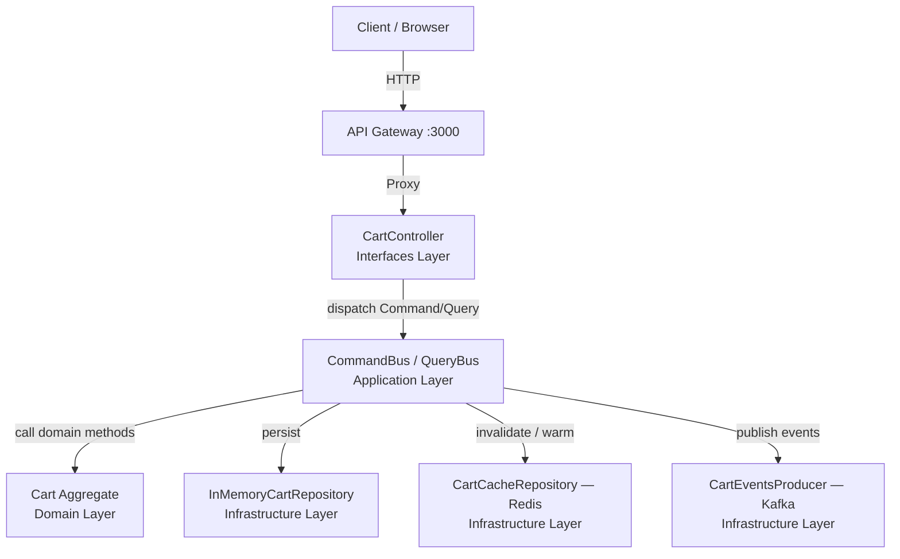
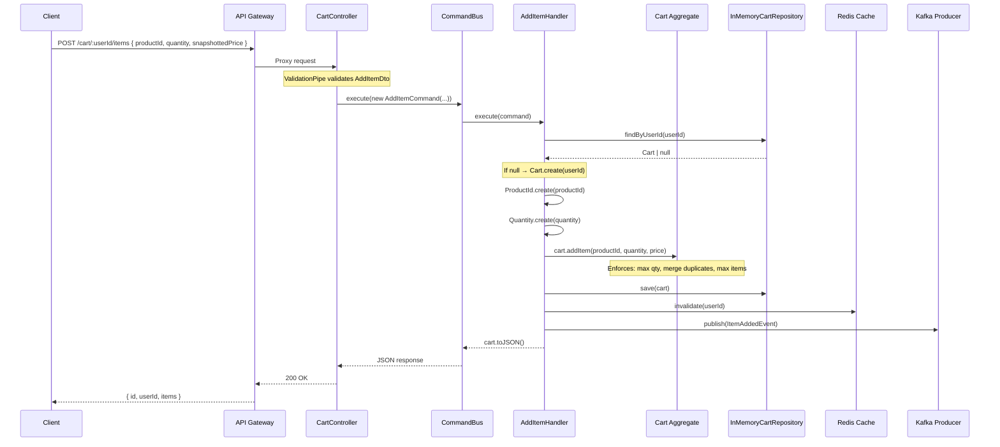
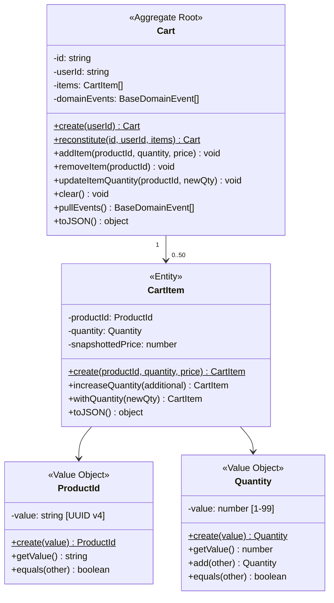
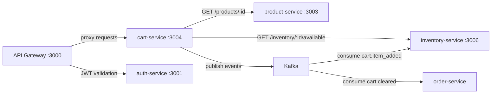

# Cart Service — Internal Architecture

> Part of the **scalable-ecommerce-microservices** platform.  
> Last updated: 2026-03-15 — reflects post-refactoring state.

---

## 1. High-Level Architecture Overview

The cart-service is a standalone NestJS microservice that manages user shopping carts. It follows **Domain-Driven Design (DDD)**, **Clean Architecture**, and **CQRS** (Command Query Responsibility Segregation).



**Key design principles**:

- **Dependency Rule**: dependencies point inward — Infrastructure → Application → Domain. The domain layer has **zero** NestJS imports.
- **Port / Adapter**: application layer defines port interfaces (`ICartRepository`, `ICartCache`, `ICartEventsProducer`); infrastructure provides concrete adapters.
- **CQRS**: write operations use `CommandBus`, read operations use `QueryBus`. No shared service class.

---

## 2. DDD Layers

### Domain Layer — `src/domain/`

| Responsibility | Details |
|----------------|---------|
| Pure business logic | Cart aggregate invariants, entity behaviour, value object validation |
| Framework coupling | **None** — zero NestJS imports |
| Contains | Entities, Value Objects, Domain Events, Domain Exceptions, Repository interfaces |

**Key files**:
- `entities/cart.entity.ts` — Aggregate Root
- `entities/cart-item.entity.ts` — Child Entity
- `value-objects/product-id.vo.ts` — UUID v4 validated wrapper
- `value-objects/quantity.vo.ts` — Integer 1–99 validated wrapper
- `events/` — `ItemAddedEvent`, `ItemRemovedEvent`, `ItemQuantityUpdatedEvent`, `CartClearedEvent`
- `exceptions/` — `CartNotFoundException`, `ItemNotInCartException`, `InvalidQuantityException`, `InvalidProductIdException`, `CartFullException`
- `repositories/cart-repository.interface.ts` — `ICartRepository` contract

### Application Layer — `src/application/`

| Responsibility | Details |
|----------------|---------|
| Use-case orchestration | Load aggregate → invoke domain methods → persist → invalidate cache → publish events |
| Framework coupling | `@nestjs/cqrs` only (handler registration decorators) |
| Contains | Commands, Queries, Handlers, Port interfaces (DI tokens) |

**Key files**:
- `commands/` — `AddItemCommand`, `RemoveItemCommand`, `ClearCartCommand`, `UpdateItemQuantityCommand`
- `queries/` — `GetCartQuery`
- `handlers/` — One handler per command/query
- `ports/` — DI symbols + re-exports: `CART_REPOSITORY`, `CART_CACHE`, `CART_EVENTS_PRODUCER`

### Infrastructure Layer — `src/infrastructure/`

| Responsibility | Details |
|----------------|---------|
| Concrete adapters | Implement port interfaces from domain/application layers |
| Framework coupling | Full NestJS + external SDKs (ioredis, kafkajs, @nestjs/axios) |
| Contains | Repository implementations, Redis cache, Kafka producer, HTTP clients, persistence schemas |

**Key files**:
- `repositories/cart.repository.ts` — `InMemoryCartRepository` (implements `ICartRepository`)
- `redis/cart-cache.repository.ts` — `CartCacheRepository` (implements `ICartCache`, 7-day TTL)
- `kafka/cart-events.producer.ts` — `CartEventsProducer` (implements `ICartEventsProducer`)
- `http/product-service.client.ts` — validates products exist upstream
- `http/inventory-service.client.ts` — checks stock availability upstream
- `persistence/cart.schema.ts` — `CartDocument` / `CartItemDocument` TypeScript interfaces

### Interfaces Layer — `src/interfaces/`

| Responsibility | Details |
|----------------|---------|
| HTTP boundary | Maps HTTP requests to CQRS commands/queries, validates DTOs, maps exceptions to HTTP |
| Framework coupling | Full NestJS HTTP decorators |
| Contains | Controllers, DTOs (class-validator), Exception Filters |

**Key files**:
- `controllers/cart.controller.ts` — thin controller, delegates 100% to `CommandBus` / `QueryBus`
- `dto/add-item.dto.ts` — `@IsUUID`, `@IsInt`, `@Min`, `@Max`, `@IsPositive`
- `dto/update-item-quantity.dto.ts` — `@IsInt`, `@Min(1)`, `@Max(99)`
- `filters/domain-exception.filter.ts` — catches `DomainException` → maps to HTTP status codes

---

## 3. Folder Structure

```
src/
├── domain/                           # Pure business logic — ZERO framework deps
│   ├── entities/
│   │   ├── cart.entity.ts            # Aggregate Root: addItem, removeItem, updateItemQuantity, clear
│   │   └── cart-item.entity.ts       # Child entity: productId, quantity, snapshottedPrice
│   ├── value-objects/
│   │   ├── product-id.vo.ts          # UUID v4 — validated, immutable, equals()
│   │   └── quantity.vo.ts            # Integer 1–99 — validated, immutable, add()
│   ├── events/
│   │   ├── base-domain.event.ts      # Abstract: eventId (UUID), occurredOn, eventType, userId
│   │   ├── item-added.event.ts       # cart.item_added
│   │   ├── item-removed.event.ts     # cart.item_removed
│   │   ├── item-quantity-updated.event.ts  # cart.item_quantity_updated
│   │   └── cart-cleared.event.ts     # cart.cleared
│   ├── exceptions/
│   │   ├── domain-exception.ts       # Abstract base: code discriminator
│   │   ├── cart-not-found.exception.ts
│   │   ├── item-not-in-cart.exception.ts
│   │   ├── invalid-quantity.exception.ts
│   │   ├── invalid-product-id.exception.ts
│   │   ├── cart-full.exception.ts
│   │   └── index.ts                  # Barrel export
│   └── repositories/
│       └── cart-repository.interface.ts   # ICartRepository contract
│
├── application/                      # CQRS use-case orchestration
│   ├── commands/                     # Write-side intent objects
│   ├── queries/                      # Read-side intent objects
│   ├── handlers/                     # Execute commands/queries
│   └── ports/                        # DI tokens + re-exports
│
├── infrastructure/                   # Concrete adapters
│   ├── repositories/                 # InMemoryCartRepository
│   ├── redis/                        # CartCacheRepository (ICartCache)
│   ├── kafka/                        # CartEventsProducer (ICartEventsProducer)
│   ├── http/                         # ProductServiceClient, InventoryServiceClient
│   └── persistence/                  # CartDocument schema
│
├── interfaces/                       # HTTP boundary
│   ├── controllers/                  # CartController
│   ├── dto/                          # AddItemDto, UpdateItemQuantityDto, RemoveItemParamsDto
│   └── filters/                      # DomainExceptionFilter
│
├── cart.module.ts                    # Full DI wiring: ports → adapters, handlers, Redis factory
├── app.module.ts                     # Root module: Logger + CartModule
└── main.ts                          # Bootstrap: ValidationPipe, Logger, shutdownHooks
```

---

## 4. Request Lifecycle

The full lifecycle for a write operation (**POST /cart/:userId/items**):



**Read path** (GET /cart/:userId) adds a cache-first layer:

```
QueryBus → GetCartHandler → Redis.get(userId)
                           ├─ HIT → return cart.toJSON()
                           └─ MISS → Repo.findByUserId → Redis.set → return
```

---

## 5. Cart Aggregate Design



**Aggregate boundaries**:
- The `Cart` is the aggregate root — all mutations go through it
- `CartItem` cannot be loaded or modified independently
- All domain events are accumulated inside the aggregate and pulled after persistence

---

## 6. Business Rules

| Rule | Enforced By | Location |
|------|------------|----------|
| Each cart belongs to exactly one user | `Cart.create(userId)` / `Cart.reconstitute()` | `cart.entity.ts` |
| Quantity must be integer 1–99 | `Quantity.create()` throws `InvalidQuantityException` | `quantity.vo.ts` |
| ProductId must be valid UUID v4 | `ProductId.create()` throws `InvalidProductIdException` | `product-id.vo.ts` |
| Adding a duplicate productId **merges** quantity | `Cart.addItem()` — finds existing item, calls `increaseQuantity()` | `cart.entity.ts` |
| Merged quantity cannot exceed 99 | `Quantity.add()` calls `Quantity.create(sum)` | `quantity.vo.ts` |
| Max 50 distinct items per cart | `Cart.addItem()` checks `items.length >= MAX_CART_ITEMS` | `cart.entity.ts` |
| Removing a non-existent item is an error | `Cart.removeItem()` throws `ItemNotInCartException` | `cart.entity.ts` |
| Updating quantity of non-existent item is an error | `Cart.updateItemQuantity()` throws `ItemNotInCartException` | `cart.entity.ts` |
| Price is snapshotted at add-time | `snapshottedPrice` captured as a raw number | `cart-item.entity.ts` |

---

## 7. Integration with Other Services



| Service | Protocol | Purpose | Fallback |
|---------|----------|---------|----------|
| **product-service** | HTTP REST | Validate product exists before adding to cart | Allows add if unreachable (graceful degradation) |
| **inventory-service** | HTTP REST | Check available stock before adding to cart | Allows add if unreachable |
| **order-service** | Kafka events | Consumes `cart.cleared` to know when a cart becomes an order | N/A |
| **auth-service** | Via API Gateway | JWT validation at gateway level | N/A |
| **analytics** | Kafka events | Consumes all cart events for metrics and reporting | N/A |

---

## 8. Event-Driven Design

### Events produced

| Event | Topic | Trigger | Payload |
|-------|-------|---------|---------|
| `cart.item_added` | `cart.item_added` | `Cart.addItem()` | `{ eventId, cartId, userId, productId, quantity, snapshottedPrice, occurredOn }` |
| `cart.item_removed` | `cart.item_removed` | `Cart.removeItem()` | `{ eventId, cartId, userId, productId, occurredOn }` |
| `cart.item_quantity_updated` | `cart.item_quantity_updated` | `Cart.updateItemQuantity()` | `{ eventId, cartId, userId, productId, oldQuantity, newQuantity, occurredOn }` |
| `cart.cleared` | `cart.cleared` | `Cart.clear()` | `{ eventId, cartId, userId, occurredOn }` |

### Event lifecycle

```
1. Domain method called (e.g., cart.addItem())
     └─ Appends event to cart.props.domainEvents[]

2. Handler persists cart (repo.save() + cache.invalidate())

3. Handler calls cart.pullEvents()
     └─ Returns events and clears internal buffer

4. Handler publishes to Kafka via CartEventsProducer
     └─ Each event → producer.send({ topic: event.eventType, key: userId })
```

### Design decisions
- **Partition key = `userId`**: guarantees ordered delivery per user
- **Non-blocking**: Kafka publish failures are logged but do **not** throw — cart operations succeed even if Kafka is temporarily unavailable
- **Idempotent events**: each event carries a unique `eventId` (UUID) for downstream deduplication
