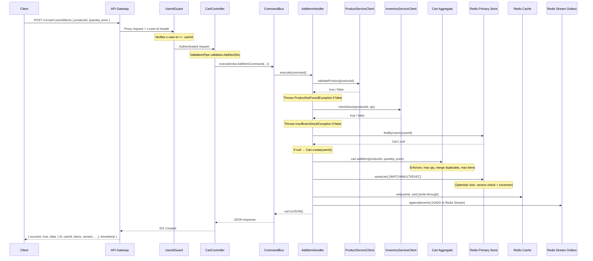
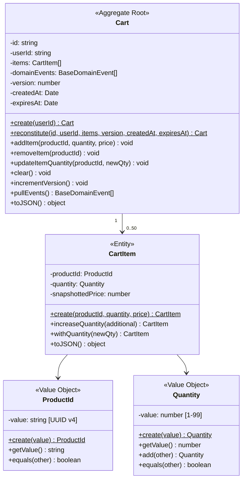
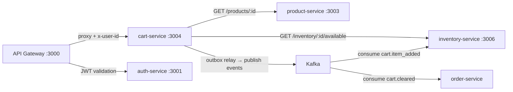

# Cart Service — Internal Architecture

> Part of the **scalable-ecommerce-microservices** platform.  
> Last updated: 2026-03-15 — reflects production-ready state.

---

## 1. High-Level Architecture Overview

The cart-service is a standalone NestJS microservice that manages user shopping carts. It follows **Domain-Driven Design (DDD)**, **Clean Architecture**, and **CQRS** (Command Query Responsibility Segregation).

```mermaid
graph TD
    Client[Client / Browser]
    GW[API Gateway :3000<br>JWT + Rate Limiting]
    GUARD[UserIdGuard<br>x-user-id ownership check]
    CTRL[CartController v1<br>Interfaces Layer]
    INTERCEPT[ResponseInterceptor<br>success/data/timestamp envelope]
    CQRS[CommandBus / QueryBus<br>Application Layer]
    DOM[Cart Aggregate<br>Domain Layer + version + expiry]

    subgraph Infrastructure Layer
        REPO[(Redis Primary Store<br>WATCH/MULTI/EXEC locking)]
        CACHE[(Redis Cache<br>write-through, 1h TTL)]
        OUTBOX[Redis Stream Outbox]
        RELAY[OutboxRelayService]
        KAFKA[Kafka Topics]
        PRODUCT[ProductServiceClient]
        INVENTORY[InventoryServiceClient]
    end

    subgraph Observability
        HEALTH[/health — Terminus + Redis PING]
        METRICS[/metrics — Prometheus]
        TRACING[OpenTelemetry Tracing]
    end

    Client -->|HTTPS| GW
    GW -->|Proxy + x-user-id| GUARD
    GUARD --> CTRL
    CTRL --> INTERCEPT
    INTERCEPT --> CQRS
    CQRS -->|domain methods| DOM
    CQRS -->|optimistic lock save| REPO
    CQRS -->|write-through| CACHE
    CQRS -->|XADD events| OUTBOX
    CQRS -->|validate product| PRODUCT
    CQRS -->|check stock| INVENTORY
    RELAY -->|poll + publish| KAFKA
    RELAY -->|XREADGROUP| OUTBOX
```

**Key design principles**:

- **Dependency Rule**: dependencies point inward — Infrastructure → Application → Domain. The domain layer has **zero** NestJS imports.
- **Port / Adapter**: application layer defines port interfaces (`ICartRepository`, `ICartCache`, `ICartOutbox`); infrastructure provides concrete adapters.
- **CQRS**: write operations use `CommandBus`, read operations use `QueryBus`. No shared service class.

---

## 2. DDD Layers

### Domain Layer — `src/domain/`

| Responsibility | Details |
|----------------|---------|
| Pure business logic | Cart aggregate invariants, entity behaviour, value object validation |
| Framework coupling | **None** — zero NestJS imports |
| Contains | Entities, Value Objects, Domain Events, Domain Exceptions, Repository interfaces |

**Key files**:
- `entities/cart.entity.ts` — Aggregate Root (with `version`, `createdAt`, `expiresAt`)
- `entities/cart-item.entity.ts` — Child Entity
- `value-objects/product-id.vo.ts` — UUID v4 validated wrapper
- `value-objects/quantity.vo.ts` — Integer 1–99 validated wrapper
- `events/` — `ItemAddedEvent`, `ItemRemovedEvent`, `ItemQuantityUpdatedEvent`, `CartClearedEvent`
- `exceptions/` — `CartNotFoundException`, `ItemNotInCartException`, `InvalidQuantityException`, `InvalidProductIdException`, `CartFullException`, `VersionConflictException`, `ProductNotFoundException`, `InsufficientStockException`
- `repositories/cart-repository.interface.ts` — `ICartRepository` contract

### Application Layer — `src/application/`

| Responsibility | Details |
|----------------|---------|
| Use-case orchestration | Load aggregate → validate upstream → invoke domain methods → persist (optimistic lock) → write-through cache → append outbox events |
| Framework coupling | `@nestjs/cqrs` only (handler registration decorators) |
| Contains | Commands, Queries, Handlers, Port interfaces (DI tokens) |

**Key files**:
- `commands/` — `AddItemCommand`, `RemoveItemCommand`, `ClearCartCommand`, `UpdateItemQuantityCommand`
- `queries/` — `GetCartQuery`
- `handlers/` — One handler per command/query
- `ports/` — DI symbols: `CART_REPOSITORY`, `CART_CACHE`, `CART_OUTBOX`

### Infrastructure Layer — `src/infrastructure/`

| Responsibility | Details |
|----------------|---------|
| Concrete adapters | Implement port interfaces from domain/application layers |
| Framework coupling | Full NestJS + external SDKs (ioredis, kafkajs, @nestjs/axios) |
| Contains | Redis repository, Redis cache, Redis outbox, Outbox relay, Kafka producer, HTTP clients, health indicators |

**Key files**:
- `repositories/redis-cart.repository.ts` — `RedisCartRepository` (implements `ICartRepository`, WATCH/MULTI/EXEC optimistic locking, 30-day TTL)
- `redis/cart-cache.repository.ts` — `CartCacheRepository` (implements `ICartCache`, write-through, 1h TTL)
- `redis/redis-outbox.repository.ts` — `RedisOutboxRepository` (implements `ICartOutbox`, Redis Stream XADD)
- `redis/redis-health.indicator.ts` — `RedisHealthIndicator` (Terminus PING check)
- `kafka/outbox-relay.service.ts` — `OutboxRelayService` (polls Redis Stream → publishes to Kafka)
- `kafka/cart-events.producer.ts` — `CartEventsProducer` (used by relay)
- `http/product-service.client.ts` — validates products exist upstream
- `http/inventory-service.client.ts` — checks stock availability upstream
- `persistence/cart.schema.ts` — `CartDocument` / `CartItemDocument` TypeScript interfaces

### Interfaces Layer — `src/interfaces/`

| Responsibility | Details |
|----------------|---------|
| HTTP boundary | Maps HTTP requests to CQRS commands/queries, validates DTOs, enforces auth, maps exceptions to HTTP |
| Framework coupling | Full NestJS HTTP decorators |
| Contains | Controllers, DTOs, Guards, Exception Filters, Interceptors |

**Key files**:
- `controllers/cart.controller.ts` — thin controller (v1 versioned), `@UseGuards(UserIdGuard)`, `ParseUUIDPipe` on all params
- `controllers/health.controller.ts` — Terminus health checks (Redis)
- `dto/add-item.dto.ts` — `@IsUUID`, `@IsInt`, `@Min`, `@Max`, `@IsPositive`, `@Max(999999.99)`
- `dto/update-item-quantity.dto.ts` — `@IsInt`, `@Min(1)`, `@Max(99)`
- `guards/user-id.guard.ts` — `UserIdGuard` (enforces `x-user-id` header matches `:userId` param)
- `filters/domain-exception.filter.ts` — catches `DomainException` → maps to HTTP status codes
- `interceptors/response.interceptor.ts` — `ResponseInterceptor` (wraps in `{ success, data, timestamp }`)

---

## 3. Folder Structure

```
src/
├── domain/                              # Pure business logic — ZERO framework deps
│   ├── entities/
│   │   ├── cart.entity.ts               # Aggregate Root: version, createdAt, expiresAt, addItem, removeItem, updateItemQuantity, clear
│   │   └── cart-item.entity.ts          # Child entity: productId, quantity, snapshottedPrice
│   ├── value-objects/
│   │   ├── product-id.vo.ts             # UUID v4 — validated, immutable, equals()
│   │   └── quantity.vo.ts               # Integer 1–99 — validated, immutable, add()
│   ├── events/
│   │   ├── base-domain.event.ts         # Abstract: eventId (UUID), occurredOn, eventType, userId
│   │   ├── item-added.event.ts          # cart.item_added
│   │   ├── item-removed.event.ts        # cart.item_removed
│   │   ├── item-quantity-updated.event.ts  # cart.item_quantity_updated
│   │   └── cart-cleared.event.ts        # cart.cleared
│   ├── exceptions/
│   │   ├── domain-exception.ts          # Abstract base: code discriminator
│   │   ├── cart-not-found.exception.ts
│   │   ├── item-not-in-cart.exception.ts
│   │   ├── invalid-quantity.exception.ts
│   │   ├── invalid-product-id.exception.ts
│   │   ├── cart-full.exception.ts
│   │   ├── version-conflict.exception.ts
│   │   ├── product-not-found.exception.ts
│   │   ├── insufficient-stock.exception.ts
│   │   └── index.ts                     # Barrel export
│   └── repositories/
│       └── cart-repository.interface.ts  # ICartRepository contract
│
├── application/                          # CQRS use-case orchestration
│   ├── commands/                         # Write-side intent objects
│   ├── queries/                          # Read-side intent objects
│   ├── handlers/                         # Execute commands/queries
│   │   └── __tests__/                    # Unit tests for all handlers
│   └── ports/                            # DI tokens: CART_REPOSITORY, CART_CACHE, CART_OUTBOX
│
├── infrastructure/                       # Concrete adapters
│   ├── repositories/                     # RedisCartRepository (WATCH/MULTI/EXEC)
│   ├── redis/                            # CartCacheRepository, RedisOutboxRepository, RedisHealthIndicator
│   ├── kafka/                            # CartEventsProducer, OutboxRelayService
│   ├── http/                             # ProductServiceClient, InventoryServiceClient
│   └── persistence/                      # CartDocument schema
│
├── interfaces/                           # HTTP boundary
│   ├── controllers/                      # CartController (v1), HealthController
│   ├── dto/                              # AddItemDto, UpdateItemQuantityDto, RemoveItemParamsDto
│   ├── guards/                           # UserIdGuard (x-user-id ownership)
│   ├── filters/                          # DomainExceptionFilter
│   └── interceptors/                     # ResponseInterceptor ({ success, data, timestamp })
│
├── cart.module.ts                        # DI wiring: ports → adapters, handlers, Redis factory, ThrottlerModule
├── app.module.ts                         # Root: LoggerModule, MetricsModule, TerminusModule, CartModule
└── main.ts                              # Bootstrap: versioning, validation, tracing, response interceptor
```

---

## 4. Request Lifecycle

The full lifecycle for a write operation (**POST /v1/cart/:userId/items**):



**Read path** (GET /v1/cart/:userId) uses a cache-first strategy:

```
QueryBus → GetCartHandler → Redis Cache.get(userId)
                           ├─ HIT → return cart.toJSON()
                           └─ MISS → Redis Repo.findByUserId → Cache.set → return
```

---

## 5. Cart Aggregate Design



**Aggregate boundaries**:
- The `Cart` is the aggregate root — all mutations go through it
- `CartItem` cannot be loaded or modified independently
- All domain events are accumulated inside the aggregate and pulled after persistence
- `version` enables optimistic locking; `expiresAt` auto-refreshes on every mutation

---

## 6. Business Rules

| Rule | Enforced By | Location |
|------|------------|----------|
| Each cart belongs to exactly one user | `Cart.create(userId)` / `Cart.reconstitute()` | `cart.entity.ts` |
| Quantity must be integer 1–99 | `Quantity.create()` throws `InvalidQuantityException` | `quantity.vo.ts` |
| ProductId must be valid UUID v4 | `ProductId.create()` throws `InvalidProductIdException` | `product-id.vo.ts` |
| Adding a duplicate productId **merges** quantity | `Cart.addItem()` — finds existing item, calls `increaseQuantity()` | `cart.entity.ts` |
| Merged quantity cannot exceed 99 | `Quantity.add()` calls `Quantity.create(sum)` | `quantity.vo.ts` |
| Max 50 distinct items per cart | `Cart.addItem()` checks `items.length >= MAX_CART_ITEMS` | `cart.entity.ts` |
| Removing a non-existent item is an error | `Cart.removeItem()` throws `ItemNotInCartException` | `cart.entity.ts` |
| Updating quantity of non-existent item is an error | `Cart.updateItemQuantity()` throws `ItemNotInCartException` | `cart.entity.ts` |
| Price is snapshotted at add-time | `snapshottedPrice` captured as a raw number | `cart-item.entity.ts` |
| Price cannot exceed 999,999.99 | `@Max(999999.99)` on `AddItemDto.snapshottedPrice` | `add-item.dto.ts` |
| Product must exist upstream | `ProductServiceClient.validateProduct()` in `AddItemHandler` | `add-item.handler.ts` |
| Stock must be available | `InventoryServiceClient.checkStock()` in `AddItemHandler` | `add-item.handler.ts` |
| Cart expires after 30 days of inactivity | `expiresAt` auto-refreshed on every mutation; Redis TTL enforced | `cart.entity.ts`, `redis-cart.repository.ts` |
| Users can only access their own cart | `UserIdGuard` compares `x-user-id` header to `:userId` param | `user-id.guard.ts` |

---

## 7. Integration with Other Services



| Service | Protocol | Purpose | Fallback |
|---------|----------|---------|----------|
| **product-service** | HTTP REST | Validate product exists before adding to cart | Allows add if unreachable (graceful degradation) |
| **inventory-service** | HTTP REST | Check available stock before adding to cart | Allows add if unreachable |
| **order-service** | Kafka events | Consumes `cart.cleared` to know when a cart becomes an order | N/A |
| **auth-service** | Via API Gateway | JWT validation at gateway level, `x-user-id` forwarded | N/A |
| **analytics** | Kafka events | Consumes all cart events for metrics and reporting | N/A |

---

## 8. Event-Driven Design

### Events produced

| Event | Topic | Trigger | Payload |
|-------|-------|---------|---------| 
| `cart.item_added` | `cart.item_added` | `Cart.addItem()` | `{ eventId, cartId, userId, productId, quantity, snapshottedPrice, occurredOn }` |
| `cart.item_removed` | `cart.item_removed` | `Cart.removeItem()` | `{ eventId, cartId, userId, productId, occurredOn }` |
| `cart.item_quantity_updated` | `cart.item_quantity_updated` | `Cart.updateItemQuantity()` | `{ eventId, cartId, userId, productId, oldQuantity, newQuantity, occurredOn }` |
| `cart.cleared` | `cart.cleared` | `Cart.clear()` | `{ eventId, cartId, userId, occurredOn }` |

### Event lifecycle (Transactional Outbox)

```
1. Domain method called (e.g., cart.addItem())
     └─ Appends event to cart.props.domainEvents[]

2. Handler persists cart (repo.save() with optimistic locking)
     └─ Writes to Redis via WATCH/MULTI/EXEC

3. Handler writes through cache (cache.set())

4. Handler calls cart.pullEvents()
     └─ Returns events and clears internal buffer

5. Handler appends events to Redis Stream outbox (outbox.append())
     └─ XADD cart:outbox:stream * eventType <type> payload <JSON>

6. OutboxRelayService polls Redis Stream (background worker)
     └─ XREADGROUP GROUP cart-relay consumer-1 COUNT 10
     └─ Publishes each event to Kafka (producer.send)
     └─ XACK on success → at-least-once delivery
```

### Design decisions
- **Partition key = `userId`**: guarantees ordered delivery per user
- **At-least-once delivery**: Redis Stream consumer groups with ACK ensure events are not lost
- **Idempotent events**: each event carries a unique `eventId` (UUID) for downstream deduplication

---

## 9. Security & Production Features

| Feature | Implementation |
|---------|---------------|
| **Authentication** | API Gateway validates JWT → forwards `x-user-id` header |
| **Ownership enforcement** | `UserIdGuard` compares `x-user-id` to `:userId` param |
| **Input validation** | `class-validator` DTOs + `ParseUUIDPipe` on URL params |
| **Rate limiting** | `@nestjs/throttler` — 60 req/60s globally |
| **Request rejection** | `forbidNonWhitelisted: true` — rejects unknown properties |
| **API versioning** | URI-based (`/v1/cart/...`) |
| **Response envelope** | `ResponseInterceptor` wraps all responses in `{ success, data, timestamp }` |
| **Health checks** | `@nestjs/terminus` — Redis PING at `/health` |
| **Metrics** | Prometheus at `/metrics` via `@ecommerce/core` |
| **Tracing** | OpenTelemetry auto-instrumentation via `@ecommerce/core` |
| **Structured logging** | Pino (JSON) via `@ecommerce/core` |
| **Graceful shutdown** | `enableShutdownHooks()` — Redis/Kafka cleanup |
| **Container-ready** | Multi-stage Dockerfile |
