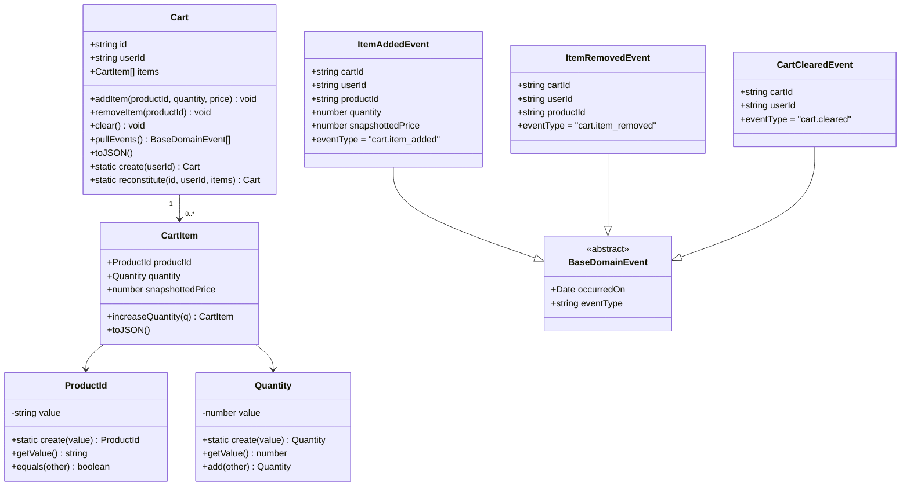
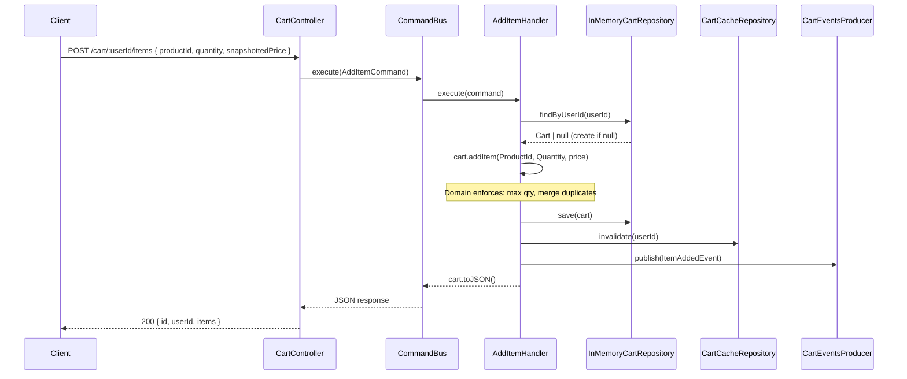
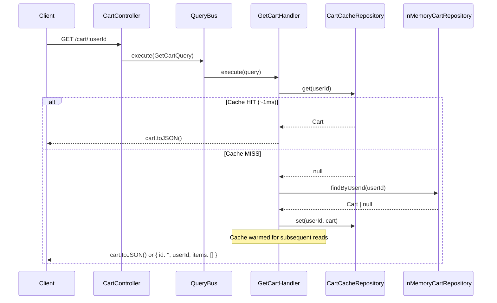

# Cart Service Architecture

> **Phase 10** of the scalable-ecommerce-microservices platform.

## 1. Overview

The `cart-service` is a production-grade microservice that manages user shopping carts. It follows **Domain-Driven Design (DDD)**, **Clean Architecture**, and **CQRS** principles, with Redis caching and Kafka event publishing.

**Role in the platform**: Accepts cart mutations from the API Gateway, maintains cart state, validates items against downstream services, and publishes events consumed by `inventory-service`, `order-service`, and analytics pipelines.

---

## 2. Architecture Layers

| Layer | Path | Responsibility |
|-------|------|----------------|
| **Domain** | `src/domain/` | Pure business logic: Cart aggregate, CartItem entity, value objects, domain events. **Zero import from NestJS or infrastructure.** |
| **Application** | `src/application/` | CQRS commands, queries, handlers, port interfaces. Orchestrates domain objects. Depends only on port abstractions. |
| **Infrastructure** | `src/infrastructure/` | Concrete adapters: Redis cache, Kafka producer, in-memory repository, HTTP clients. Implements port interfaces. |
| **Interfaces** | `src/interfaces/` | HTTP controllers (thin), DTOs with class-validator. No business logic. |

**Dependency Rule**: Dependencies only point inward — Infrastructure → Application → Domain.

---

## 3. Domain Model



---

## 4. Business Rules

- **Quantity range**: Must be an integer between 1 and 99 (enforced by `Quantity` VO)
- **No duplicates**: Adding the same `productId` again merges quantities (idempotent `addItem`)
- **Max quantity per item**: Merged quantity must not exceed 99 (enforced by `Quantity.add()`)
- **Remove guard**: `removeItem()` throws if the product is not in the cart
- **Price snapshot**: `snapshottedPrice` is captured at add-time to prevent price drift

---

## 5. CQRS Command Flow — Add Item



---

## 6. Query Flow — Get Cart (Cache-First)



---

## 7. Redis Cache Strategy

| Setting | Value | Reason |
|---------|-------|--------|
| Key pattern | `cart:{userId}` | User-scoped isolation |
| TTL | 604800 seconds (7 days) | Matches ARCHITECTURE.md specification |
| Invalidation | On every write command | Ensures consistency after mutations |
| Cache warming | On cache miss in GetCartHandler | Keeps subsequent reads fast |
| Serialisation | `cart.toJSON()` → JSON string | Lightweight, easily reconstituted |

**Reconstitution on cache hit**: The handler reads raw JSON from Redis and calls `Cart.reconstitute()` with reconstructed `CartItem` objects (ProductId VO + Quantity VO validated on reconstitution).

---

## 8. Kafka Event Architecture

| Topic | Published By | Payload | Consumers |
|-------|-------------|---------|-----------|
| `cart.item_added` | `AddItemHandler` | `{ cartId, userId, productId, quantity, snapshottedPrice, occurredOn }` | inventory-service, analytics |
| `cart.item_removed` | `RemoveItemHandler` | `{ cartId, userId, productId, occurredOn }` | analytics |
| `cart.cleared` | `ClearCartHandler` | `{ cartId, userId, occurredOn }` | order-service, analytics |

**Partition key**: `userId` — ensures ordered delivery per user.

**Non-blocking**: Producer wraps `send()` in `try/catch` and logs errors without re-throwing. Cart operations succeed even if Kafka is temporarily unavailable.

---

## 9. Integration with Downstream Services

### product-service
- **Endpoint**: `GET {PRODUCT_SERVICE_URL}/products/{productId}`
- **Purpose**: Validates the product exists before adding to cart
- **Fallback**: Returns `true` (allow add) if the service is unreachable
- **Env var**: `PRODUCT_SERVICE_URL` (default: `http://product-service:3003`)

### inventory-service
- **Endpoint**: `GET {INVENTORY_SERVICE_URL}/inventory/{productId}/available?quantity={n}`
- **Purpose**: Checks available stock before adding to cart
- **Fallback**: Returns `true` (allow add) if the service is unreachable
- **Env var**: `INVENTORY_SERVICE_URL` (default: `http://inventory-service:3006`)

> **Design decision**: Graceful fallback for both clients allows the cart-service to develop, test, and run independently without product or inventory services running.

---

## 10. API Endpoints

| Method | Path | CQRS | Description |
|--------|------|------|-------------|
| `GET` | `/cart/:userId` | `GetCartQuery` | Fetch cart (cache-first) |
| `POST` | `/cart/:userId/items` | `AddItemCommand` | Add or merge item |
| `DELETE` | `/cart/:userId/items/:productId` | `RemoveItemCommand` | Remove single item |
| `DELETE` | `/cart/:userId` | `ClearCartCommand` | Clear entire cart |

**Controller is thin**: Each route has exactly 1 line of logic (`bus.execute(new Command(...))`).

---

## 11. Idempotency

The `Cart.addItem()` domain method is the idempotency guard:

```
addItem(productId, qty, price):
  if productId already in items → increaseQuantity(qty)  // merge, not duplicate
  else → push new CartItem
```

Repeated `POST /cart/:userId/items` calls with the same `productId` accumulate quantity rather than creating duplicate line items. This is safe for at-least-once delivery from upstream clients.

---

## 12. File Structure

```
src/
├── domain/
│   ├── entities/
│   │   ├── cart.entity.ts              # Aggregate root
│   │   ├── cart-item.entity.ts         # Line item entity
│   │   └── __tests__/
│   │       └── cart.entity.spec.ts
│   ├── value-objects/
│   │   ├── product-id.vo.ts            # UUID v4 wrapper
│   │   └── quantity.vo.ts              # Integer 1-99 wrapper
│   └── events/
│       ├── base-domain.event.ts
│       ├── item-added.event.ts
│       ├── item-removed.event.ts
│       └── cart-cleared.event.ts
│
├── application/
│   ├── commands/
│   │   ├── add-item.command.ts
│   │   ├── remove-item.command.ts
│   │   └── clear-cart.command.ts
│   ├── queries/
│   │   └── get-cart.query.ts
│   ├── handlers/
│   │   ├── add-item.handler.ts
│   │   ├── remove-item.handler.ts
│   │   ├── clear-cart.handler.ts
│   │   ├── get-cart.handler.ts
│   │   └── __tests__/
│   │       ├── add-item.handler.spec.ts
│   │       └── get-cart.handler.spec.ts
│   └── ports/
│       ├── cart-repository.port.ts     # ICartRepository
│       ├── cart-cache.port.ts          # ICartCache
│       └── cart-events.port.ts         # ICartEventsProducer
│
├── infrastructure/
│   ├── redis/
│   │   └── cart-cache.repository.ts   # Implements ICartCache
│   ├── kafka/
│   │   └── cart-events.producer.ts    # Implements ICartEventsProducer
│   ├── persistence/
│   │   └── cart.schema.ts             # CartDocument shape
│   ├── repositories/
│   │   └── cart.repository.ts         # In-memory ICartRepository (TODO: MongoDB)
│   └── http/
│       ├── product-service.client.ts  # Graceful fallback
│       └── inventory-service.client.ts
│
├── interfaces/
│   ├── controllers/
│   │   └── cart.controller.ts         # Thin — delegates to CQRS buses
│   └── dto/
│       ├── add-item.dto.ts            # class-validator decorators
│       └── remove-item.dto.ts
│
├── cart.module.ts                     # Full DI wiring
├── app.module.ts
└── main.ts                            # ValidationPipe globally applied
```
