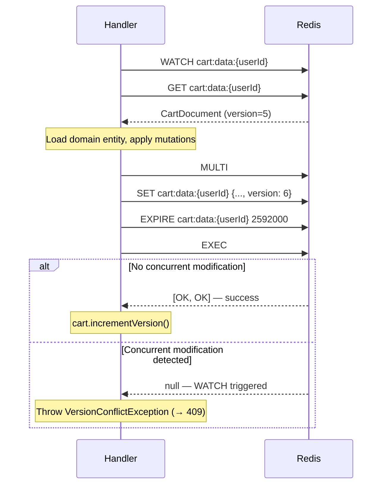
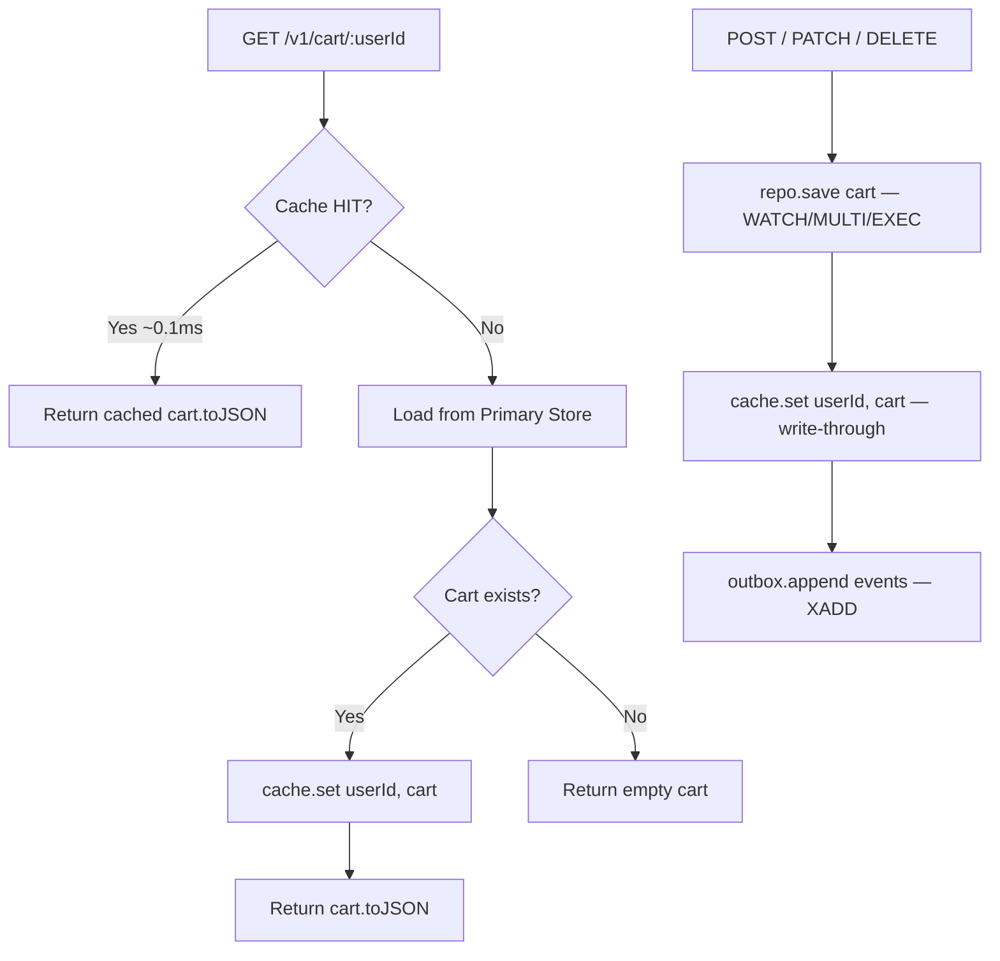
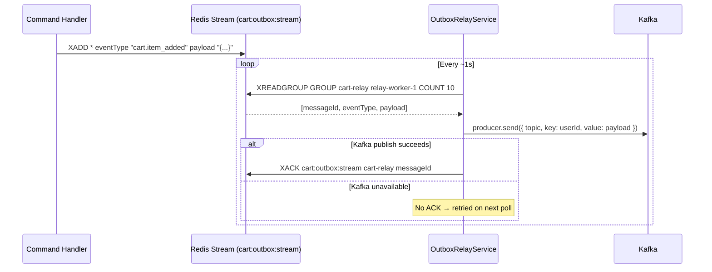
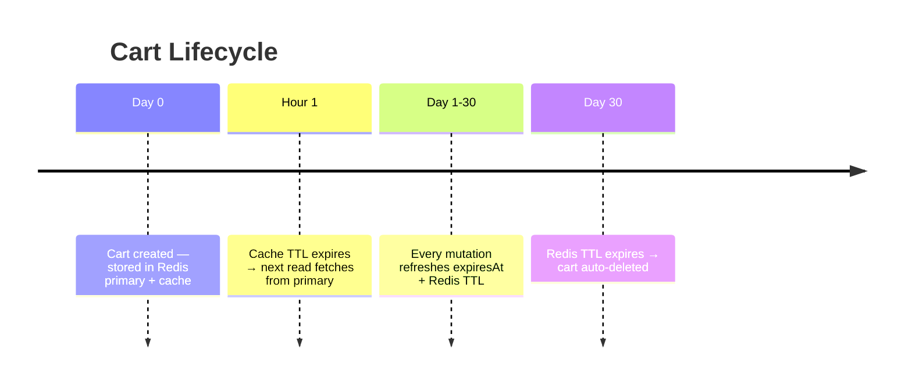

# Cart Service — Data Architecture

> Data layer design for the `cart-service` microservice.  
> Last updated: 2026-03-15 — reflects production-ready state.

---

## 1. Primary Store: Redis

The cart-service uses **Redis as its primary data store**. Carts are stored as JSON strings with a 30-day TTL, keyed by `userId`. Optimistic locking is implemented via `WATCH`/`MULTI`/`EXEC`.

### Key Pattern & Schema

| Key | Format | TTL |
|-----|--------|-----|
| `cart:data:{userId}` | JSON string | 30 days (2,592,000s) |

```typescript
// src/infrastructure/persistence/cart.schema.ts
interface CartDocument {
  id: string;
  userId: string;
  items: CartItemDocument[];
  version: number;            // Optimistic locking counter
  createdAt: string;          // ISO 8601
  expiresAt: string;          // ISO 8601, auto-refreshed on every mutation
}

interface CartItemDocument {
  productId: string;
  quantity: number;
  snapshottedPrice: number;
}
```

### Optimistic Locking Flow



### Why Redis (not MongoDB/PostgreSQL)?

| Criterion | Redis | MongoDB |
|-----------|-------|---------|
| Latency | Sub-millisecond | ~1-5ms |
| Already in infra | ✅ yes (docker-compose) | ❌ not provisioned |
| Cart workload fit | ✅ ephemeral, key-value | ✅ document store |
| TTL native support | ✅ `EXPIRE` command | ✅ TTL index |
| Optimistic locking | ✅ `WATCH/MULTI/EXEC` | ✅ `findOneAndUpdate` |
| Horizontal scaling | Redis Cluster | MongoDB sharding |

---

## 2. Redis Cache Layer

Separate from the primary store, the cache layer provides read optimization.

| Property | Value |
|----------|-------|
| Key pattern | `cart:{userId}` (note: no `data:` prefix) |
| TTL | 3,600 seconds (1 hour) |
| Serialisation | `JSON.stringify(cart.toJSON())` |
| Reconstitution | `Cart.reconstitute()` with validated VOs |
| Write strategy | **Write-through**: every command handler calls `cache.set(userId, cart)` after `repo.save()` |
| Read strategy | **Cache-first**: `GetCartHandler` checks cache first; on miss, reads from primary store and warms cache |

### Cache Flow



---

## 3. Event Outbox: Redis Streams

Events are durably stored in a Redis Stream before being relayed to Kafka — implementing the **Transactional Outbox** pattern.

### Stream Key

| Key | Format |
|-----|--------|
| `cart:outbox:stream` | Redis Stream entries: `eventType` + `payload` fields |

### Consumer Group

| Group | Consumer | Block | Count |
|-------|----------|-------|-------|
| `cart-relay` | `relay-worker-1` | 2000ms | 10 per poll |

### Outbox Flow



### Guarantees

| Property | Guarantee |
|----------|-----------|
| Durability | Events survive process restarts (Redis persistence) |
| Delivery | **At-least-once** (ACK after Kafka publish) |
| Ordering | Per-partition ordering in Kafka (key = `userId`) |
| Deduplication | Each event has a unique `eventId` (UUID) for downstream idempotency |

---

## 4. Cart Expiration Strategy

### TTL Layers

| Layer | TTL | Mechanism |
|-------|-----|-----------|
| **Redis Cache** | 1 hour | `SETEX cart:{userId} 3600 ...` |
| **Redis Primary** | 30 days | `EXPIRE cart:data:{userId} 2592000` — refreshed on every write |
| **Domain Entity** | 30 days | `expiresAt` field auto-refreshed in `Cart.refreshExpiry()` on every mutation |

### Cart Lifecycle



---

## 5. Data Consistency

### Optimistic Locking

**Scenario**: Two concurrent requests add different items to the same user's cart.

| Step | Request A | Request B |
|------|-----------|-----------|
| 1 | WATCH `cart:data:user1` | WATCH `cart:data:user1` |
| 2 | GET → version=5, 2 items | GET → version=5, 2 items |
| 3 | Add item X → MULTI/SET version=6/EXEC | Add item Y → MULTI/SET version=6/EXEC |
| 4 | ✅ EXEC succeeds | ❌ EXEC returns null (WATCH triggered) |
| 5 | — | → `VersionConflictException` → 409 Conflict |

The client can retry Request B, which will read version=6 and succeed.

### Cache Consistency

With **write-through** strategy, cache is always warm after writes:

```
T1: Handler saves cart to Redis primary (WATCH/MULTI/EXEC)
T2: Handler writes cart to cache (SET cart:{userId})
T3: Next read → cache HIT (consistent with primary)
```

No stale-read window exists because the same handler updates both stores sequentially.
