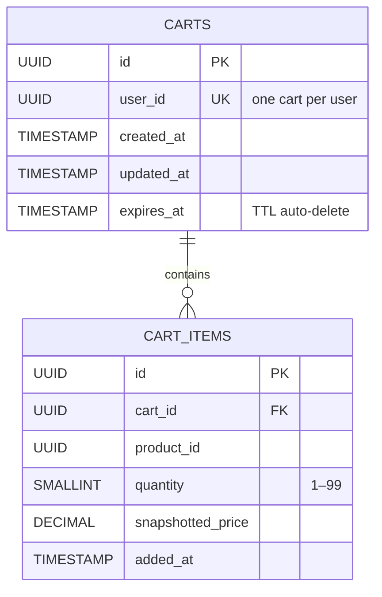
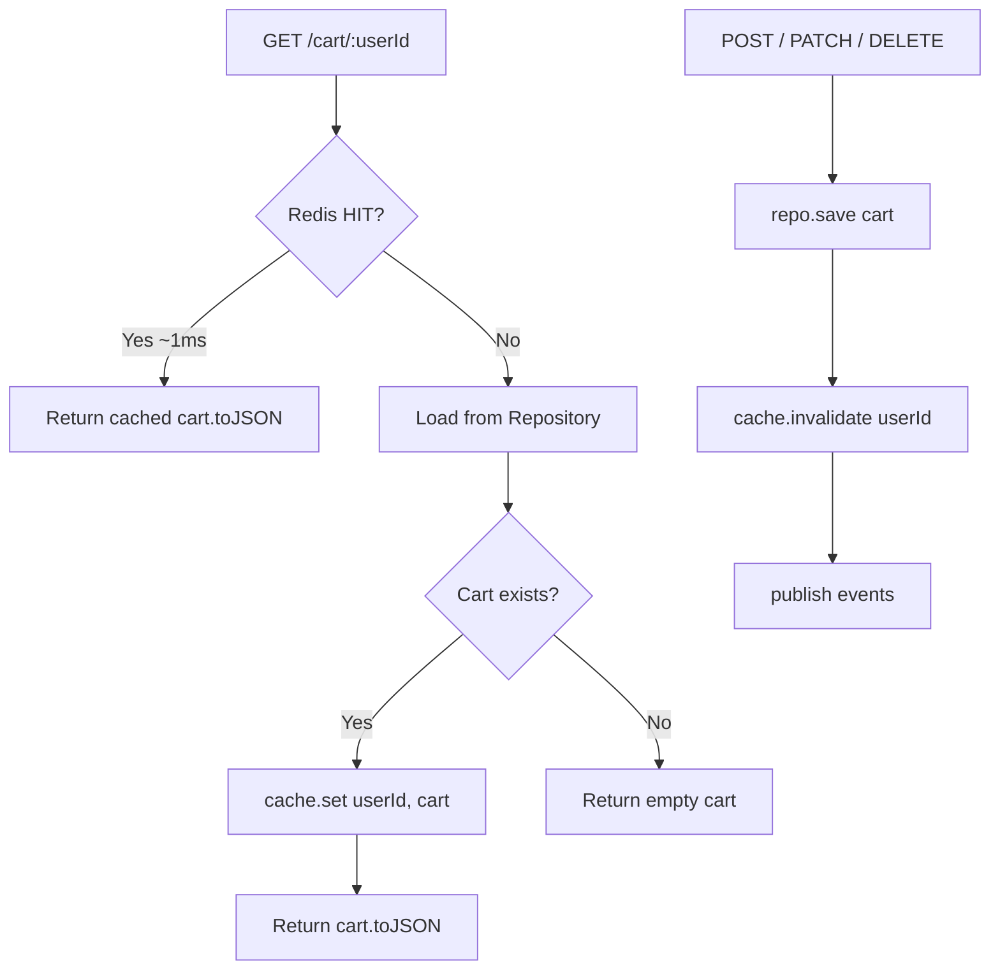
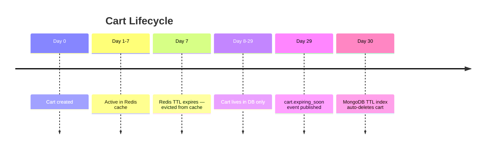

# Cart Service — Data Architecture

> Data layer design for the `cart-service` microservice.  
> Last updated: 2026-03-15.

---

## 1. Database Schema

The cart-service currently uses an **in-memory `Map<string, CartDocument>`** as a development placeholder. The production target is **MongoDB** (document store). Below is the recommended schema for both MongoDB and a relational (PostgreSQL) alternative.

### MongoDB Document Schema

```javascript
// Collection: carts
{
  _id: ObjectId("..."),
  cartId: "uuid-v4-string",           // Application-generated UUID
  userId: "uuid-v4-string",           // Unique — one active cart per user
  items: [
    {
      productId: "uuid-v4-string",
      quantity: 3,                      // Integer 1–99
      snapshottedPrice: NumberDecimal("29.99"),
      addedAt: ISODate("2026-03-15T05:00:00Z")
    }
  ],
  createdAt: ISODate("2026-03-15T04:00:00Z"),
  updatedAt: ISODate("2026-03-15T05:00:00Z"),
  expiresAt: ISODate("2026-04-14T05:00:00Z")  // TTL field
}
```

### PostgreSQL Equivalent

```sql
CREATE TABLE carts (
    id          UUID PRIMARY KEY DEFAULT gen_random_uuid(),
    user_id     UUID NOT NULL UNIQUE,
    created_at  TIMESTAMPTZ NOT NULL DEFAULT now(),
    updated_at  TIMESTAMPTZ NOT NULL DEFAULT now(),
    expires_at  TIMESTAMPTZ NOT NULL DEFAULT now() + INTERVAL '30 days'
);

CREATE TABLE cart_items (
    id                UUID PRIMARY KEY DEFAULT gen_random_uuid(),
    cart_id           UUID NOT NULL REFERENCES carts(id) ON DELETE CASCADE,
    product_id        UUID NOT NULL,
    quantity          SMALLINT NOT NULL CHECK (quantity BETWEEN 1 AND 99),
    snapshotted_price NUMERIC(10, 2) NOT NULL CHECK (snapshotted_price > 0),
    added_at          TIMESTAMPTZ NOT NULL DEFAULT now(),

    UNIQUE (cart_id, product_id)  -- enforces no duplicate items per cart
);
```

### Current In-Memory Schema (TypeScript)

```typescript
// src/infrastructure/persistence/cart.schema.ts
interface CartDocument {
  id: string;
  userId: string;
  items: CartItemDocument[];
  updatedAt: Date;
}

interface CartItemDocument {
  productId: string;
  quantity: number;
  snapshottedPrice: number;
}
```

---

## 2. Relationships



**Key relationships**:
- `carts.user_id` is **unique** — enforces one active cart per user at the database level
- `cart_items.cart_id` → `carts.id` with **CASCADE DELETE** — clearing a cart row removes all items
- `(cart_id, product_id)` is **unique** — prevents duplicate items; the merge logic lives in the domain, but this is a safety net

---

## 3. Index Strategy

### MongoDB Indexes

```javascript
// Collection: carts

// Primary lookup — every request begins with finding the cart by userId
db.carts.createIndex({ userId: 1 }, { unique: true, name: "idx_carts_userId" });

// TTL index — automatically deletes expired/abandoned carts
db.carts.createIndex({ expiresAt: 1 }, { expireAfterSeconds: 0, name: "idx_carts_ttl" });

// Analytics — find carts containing a specific product (recall, price update)
db.carts.createIndex({ "items.productId": 1 }, { name: "idx_carts_items_productId" });

// Stale cart reports
db.carts.createIndex({ updatedAt: 1 }, { name: "idx_carts_updatedAt" });
```

### PostgreSQL Indexes

```sql
-- Already covered by UNIQUE constraint
-- CREATE UNIQUE INDEX idx_carts_user_id ON carts (user_id);

-- Fast item lookup by cart
CREATE INDEX idx_cart_items_cart_id ON cart_items (cart_id);

-- Find all carts containing a specific product
CREATE INDEX idx_cart_items_product_id ON cart_items (product_id);

-- TTL cleanup (for scheduled batch deletes if not using MongoDB TTL)
CREATE INDEX idx_carts_expires_at ON carts (expires_at) WHERE expires_at < now();
```

---

## 4. Redis Caching Strategy

### Current implementation

The cart-service uses Redis as a **read-through cache** via `CartCacheRepository` (implements `ICartCache`).

| Property | Value |
|----------|-------|
| Key pattern | `cart:{userId}` |
| TTL | 604,800 seconds (7 days) |
| Serialisation | `JSON.stringify(cart.toJSON())` |
| Reconstitution | `Cart.reconstitute()` with validated VOs |
| Write strategy | **Invalidate-on-write**: every command handler calls `cache.invalidate(userId)` after `repo.save()` |
| Read strategy | **Cache-first**: `GetCartHandler` checks Redis first; on miss, reads from repo and warms the cache |

### Cache flow diagram



### Recommended improvements

| Improvement | Benefit |
|-------------|---------|
| **Write-through** — call `cache.set()` after `save()` instead of `invalidate()` | Eliminates cache-miss penalty on next read |
| **Redis Sentinel / Cluster** | High availability |
| **`commandTimeout: 2000`** | Prevents handler blocking if Redis hangs |
| **WATCH-based optimistic locking** | Prevents concurrent overwrites |

---

## 5. Cart Expiration Strategy

### TTL layers

| Layer | TTL | Mechanism |
|-------|-----|-----------|
| **Redis cache** | 7 days | `SETEX cart:{userId} 604800 ...` |
| **Database (MongoDB)** | 30 days inactivity | `expiresAt` field + TTL index |
| **Database (PostgreSQL)** | 30 days inactivity | Scheduled cron job: `DELETE FROM carts WHERE expires_at < now()` |

### Expiration flow

```
1. Every write operation (addItem, removeItem, updateQty, clear):
     └─ Set cart.expiresAt = now() + 30 days
     └─ Set cart.updatedAt = now()

2. MongoDB TTL index monitors expiresAt:
     └─ Automatically deletes documents past expiry

3. Optional: 24h before expiry:
     └─ Background job publishes cart.expiring_soon event
     └─ notification-service sends email/push reminder
```

### Abandoned cart lifecycle



---

## 6. Event Storage (Optional)

### Current state

Events are published to Kafka immediately after persistence and are not stored in the cart database. They are "fire-and-forget" (non-blocking, no retry).

### Recommended: Transactional Outbox

For production reliability, consider an **outbox table** to guarantee event delivery:

```sql
CREATE TABLE cart_outbox (
    id          UUID PRIMARY KEY DEFAULT gen_random_uuid(),
    event_id    UUID NOT NULL UNIQUE,       -- deduplication key
    event_type  VARCHAR(50) NOT NULL,
    payload     JSONB NOT NULL,
    created_at  TIMESTAMPTZ NOT NULL DEFAULT now(),
    published   BOOLEAN NOT NULL DEFAULT false
);

CREATE INDEX idx_outbox_unpublished ON cart_outbox (published, created_at)
    WHERE published = false;
```

**Flow**:
1. Handler persists cart + inserts event into `cart_outbox` in the **same transaction**
2. Background relay process polls `cart_outbox WHERE published = false`
3. Publishes to Kafka, marks as `published = true`
4. Cleanup job deletes old published events after 7 days

---

## 7. Data Consistency Considerations

### Race conditions

**Scenario**: Two concurrent requests add different items to the same user's cart.

| Without locking | With optimistic locking |
|-----------------|------------------------|
| Both read cart with 2 items | Both read cart with version=5 |
| Both add 1 item → save with 3 items | Both add 1 item → save with version=6 |
| **Last write wins** — one item lost | Second write fails with `VersionConflictException` → retry |

### Current state

The in-memory `Map` is single-threaded in Node.js, so concurrent writes within a single process are serialised. However, with multiple instances behind a load balancer, this breaks.

### Recommended solutions

| Strategy | Implementation | Tradeoff |
|----------|---------------|----------|
| **Pessimistic locking (Redlock)** | `await redlock.acquire(['lock:cart:' + userId], 5000)` | Simple, higher latency under contention |
| **Optimistic locking (version field)** | Add `version: number` to `CartDocument`, check on save | Low latency, retry on conflict |
| **MongoDB `findOneAndUpdate`** | Atomic update operations | Best for MongoDB, but bypasses aggregate pattern |

### Cache consistency

The current strategy of **invalidate-on-write** is safe but creates a brief window where reads fall through to the repository:

```
T1: Handler saves cart to repo
T2: Handler invalidates cache (DELETE cart:{userId})
T3: Another request reads → cache MISS → reads from repo (consistent)
```

This is acceptable because the cache miss simply triggers a fresh read from the source of truth.
