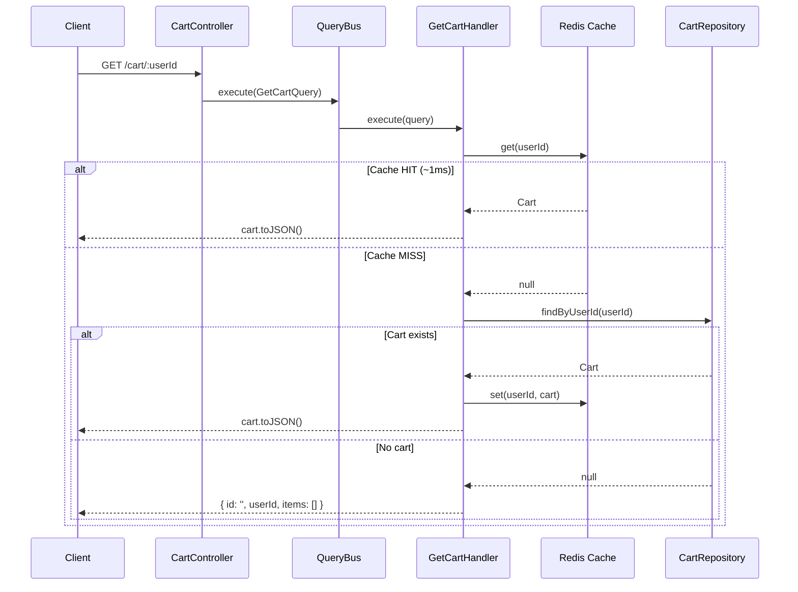
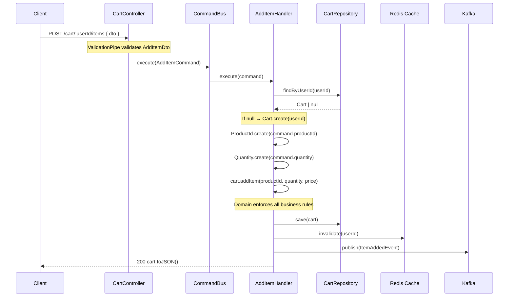
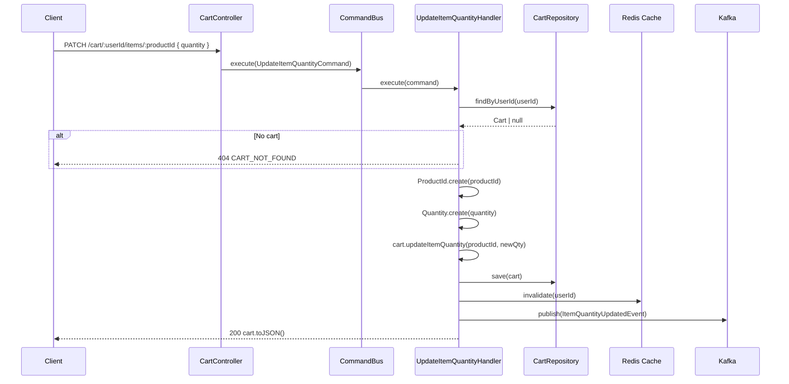
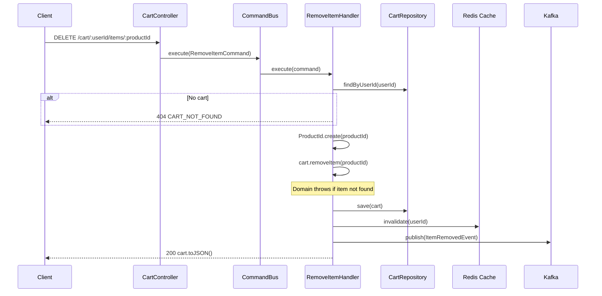
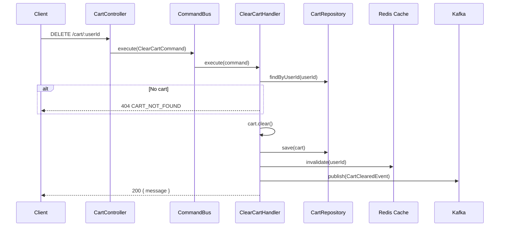

# Cart Service — API Endpoints & Execution Flows

> Complete reference for all cart-service HTTP endpoints.  
> Last updated: 2026-03-15.

---

## Endpoint Summary

| Method | Path | CQRS | Description |
|--------|------|------|-------------|
| `GET` | `/cart/:userId` | `GetCartQuery` | Fetch user's cart (cache-first) |
| `POST` | `/cart/:userId/items` | `AddItemCommand` | Add or merge item |
| `PATCH` | `/cart/:userId/items/:productId` | `UpdateItemQuantityCommand` | Update item quantity |
| `DELETE` | `/cart/:userId/items/:productId` | `RemoveItemCommand` | Remove single item |
| `DELETE` | `/cart/:userId` | `ClearCartCommand` | Clear entire cart |

---

## 1. GET `/cart/:userId` — Fetch Cart

### Description
Returns the user's cart. Uses a **cache-first** strategy: checks Redis before falling back to the repository.

### Request
```
GET /cart/550e8400-e29b-41d4-a716-446655440000
```
No body required.

### Response (200 OK)
```json
{
  "id": "a1b2c3d4-e5f6-4a7b-8c9d-0e1f2a3b4c5d",
  "userId": "550e8400-e29b-41d4-a716-446655440000",
  "items": [
    {
      "productId": "660e8400-e29b-41d4-a716-446655440001",
      "quantity": 2,
      "snapshottedPrice": 29.99
    }
  ]
}
```

If no cart exists, returns an empty representation:
```json
{
  "id": "",
  "userId": "550e8400-e29b-41d4-a716-446655440000",
  "items": []
}
```

### Execution Flow



### Domain Rules
- None triggered — read-only operation.

### Events Emitted
- None.

### Error Scenarios
- None — a missing cart returns an empty representation (not a 404).

---

## 2. POST `/cart/:userId/items` — Add Item

### Description
Adds a new item to the cart, or merges quantity if the product already exists.

### Request
```
POST /cart/550e8400-e29b-41d4-a716-446655440000/items
Content-Type: application/json

{
  "productId": "660e8400-e29b-41d4-a716-446655440001",
  "quantity": 2,
  "snapshottedPrice": 29.99
}
```

### DTO Validation (`AddItemDto`)
| Field | Rules |
|-------|-------|
| `productId` | `@IsUUID('4')` — must be valid UUID v4 |
| `quantity` | `@IsInt`, `@Min(1)`, `@Max(99)` |
| `snapshottedPrice` | `@IsNumber`, `@IsPositive` |

### Response (200 OK)
```json
{
  "id": "a1b2c3d4-e5f6-4a7b-8c9d-0e1f2a3b4c5d",
  "userId": "550e8400-e29b-41d4-a716-446655440000",
  "items": [
    {
      "productId": "660e8400-e29b-41d4-a716-446655440001",
      "quantity": 2,
      "snapshottedPrice": 29.99
    }
  ]
}
```

### Execution Flow



### Domain Rules Triggered
1. `ProductId.create()` — validates UUID v4 format → throws `InvalidProductIdException` (400)
2. `Quantity.create()` — validates integer 1–99 → throws `InvalidQuantityException` (400)
3. `Cart.addItem()`:
   - If product exists → `CartItem.increaseQuantity()` → `Quantity.add()` merges values
   - If product new + cart has ≥ 50 items → throws `CartFullException` (422)
   - If merged quantity > 99 → throws `InvalidQuantityException` (400)

### Events Emitted
- `cart.item_added` → Kafka topic `cart.item_added`, key = `userId`

### Error Scenarios

| Error | HTTP | Code | Condition |
|-------|------|------|-----------|
| Invalid request body | 400 | N/A | DTO validation fails (class-validator) |
| Invalid productId format | 400 | `INVALID_PRODUCT_ID` | Not a valid UUID v4 |
| Invalid quantity | 400 | `INVALID_QUANTITY` | Not integer or outside 1–99 |
| Cart full | 422 | `CART_FULL` | ≥ 50 distinct items |
| Merged quantity exceeds 99 | 400 | `INVALID_QUANTITY` | `existingQty + newQty > 99` |

---

## 3. PATCH `/cart/:userId/items/:productId` — Update Item Quantity

### Description
Sets the quantity of an existing item to a new value (replace, not add).

### Request
```
PATCH /cart/550e8400-e29b-41d4-a716-446655440000/items/660e8400-e29b-41d4-a716-446655440001
Content-Type: application/json

{
  "quantity": 5
}
```

### DTO Validation (`UpdateItemQuantityDto`)
| Field | Rules |
|-------|-------|
| `quantity` | `@IsInt`, `@Min(1)`, `@Max(99)` |

### Response (200 OK)
```json
{
  "id": "a1b2c3d4-e5f6-4a7b-8c9d-0e1f2a3b4c5d",
  "userId": "550e8400-e29b-41d4-a716-446655440000",
  "items": [
    {
      "productId": "660e8400-e29b-41d4-a716-446655440001",
      "quantity": 5,
      "snapshottedPrice": 29.99
    }
  ]
}
```

### Execution Flow



### Domain Rules Triggered
1. `ProductId.create()` — validates UUID v4
2. `Quantity.create()` — validates integer 1–99
3. `Cart.updateItemQuantity()` — throws `ItemNotInCartException` if product not found

### Events Emitted
- `cart.item_quantity_updated` with `{ oldQuantity, newQuantity }`

### Error Scenarios

| Error | HTTP | Code | Condition |
|-------|------|------|-----------|
| Cart not found | 404 | `CART_NOT_FOUND` | No cart for this userId |
| Item not in cart | 404 | `ITEM_NOT_IN_CART` | Product not in cart |
| Invalid productId | 400 | `INVALID_PRODUCT_ID` | URL param not UUID v4 |
| Invalid quantity | 400 | `INVALID_QUANTITY` | Body quantity invalid |

---

## 4. DELETE `/cart/:userId/items/:productId` — Remove Item

### Description
Removes a single item from the cart.

### Request
```
DELETE /cart/550e8400-e29b-41d4-a716-446655440000/items/660e8400-e29b-41d4-a716-446655440001
```
No body.

### Response (200 OK)
```json
{
  "id": "a1b2c3d4-e5f6-4a7b-8c9d-0e1f2a3b4c5d",
  "userId": "550e8400-e29b-41d4-a716-446655440000",
  "items": []
}
```

### Execution Flow



### Domain Rules Triggered
1. `ProductId.create()` — validates UUID v4
2. `Cart.removeItem()` — throws `ItemNotInCartException` if product not in cart

### Events Emitted
- `cart.item_removed`

### Error Scenarios

| Error | HTTP | Code | Condition |
|-------|------|------|-----------|
| Cart not found | 404 | `CART_NOT_FOUND` | No cart for this userId |
| Item not in cart | 404 | `ITEM_NOT_IN_CART` | Product not in cart |
| Invalid productId | 400 | `INVALID_PRODUCT_ID` | URL param not UUID v4 |

---

## 5. DELETE `/cart/:userId` — Clear Cart

### Description
Removes all items from the cart.

### Request
```
DELETE /cart/550e8400-e29b-41d4-a716-446655440000
```
No body.

### Response (200 OK)
```json
{
  "message": "Cart cleared successfully"
}
```

### Execution Flow



### Domain Rules Triggered
1. `Cart.clear()` — empties the items array (no preconditions)

### Events Emitted
- `cart.cleared`

### Error Scenarios

| Error | HTTP | Code | Condition |
|-------|------|------|-----------|
| Cart not found | 404 | `CART_NOT_FOUND` | No cart for this userId |

---

## Domain Exception → HTTP Mapping

All domain exceptions are caught by `DomainExceptionFilter` and translated to structured HTTP responses:

| Domain Exception | Code | HTTP Status |
|-----------------|------|-------------|
| `CartNotFoundException` | `CART_NOT_FOUND` | 404 Not Found |
| `ItemNotInCartException` | `ITEM_NOT_IN_CART` | 404 Not Found |
| `InvalidQuantityException` | `INVALID_QUANTITY` | 400 Bad Request |
| `InvalidProductIdException` | `INVALID_PRODUCT_ID` | 400 Bad Request |
| `CartFullException` | `CART_FULL` | 422 Unprocessable Entity |

### Error response format

```json
{
  "statusCode": 404,
  "error": "CART_NOT_FOUND",
  "message": "Cart not found for user 550e8400-e29b-41d4-a716-446655440000"
}
```
