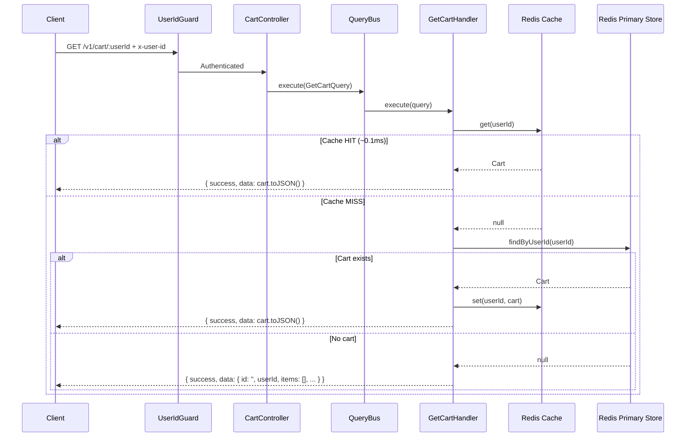
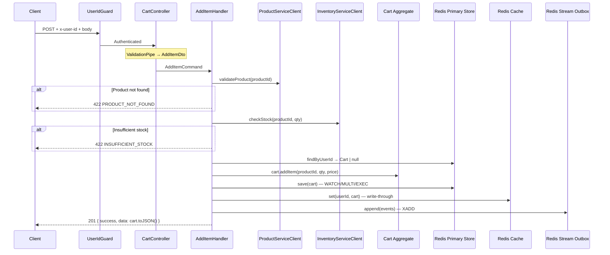

# Cart Service — API Endpoints & Execution Flows

> Complete reference for all cart-service HTTP endpoints.  
> Last updated: 2026-03-15 — reflects production-ready state.

---

## Authentication & Authorization

All cart endpoints require the `x-user-id` header — set by the API Gateway after JWT validation. The `UserIdGuard` enforces:

1. **Presence**: Rejects requests without `x-user-id` → `401 Unauthorized`
2. **Ownership**: Compares `x-user-id` to the `:userId` route param → `403 Forbidden` if mismatched

## API Versioning

All endpoints are under URI version prefix: `/v1/cart/...`

## Response Format

All successful responses are wrapped in a standard envelope by `ResponseInterceptor`:

```json
{
  "success": true,
  "data": { /* endpoint-specific payload */ },
  "timestamp": "2026-03-15T12:00:00.000Z"
}
```

---

## Endpoint Summary

| Method | Path | CQRS | Status | Description |
|--------|------|------|--------|-------------|
| `GET` | `/v1/cart/:userId` | `GetCartQuery` | 200 | Fetch cart (cache-first) |
| `POST` | `/v1/cart/:userId/items` | `AddItemCommand` | 201 | Add or merge item |
| `PATCH` | `/v1/cart/:userId/items/:productId` | `UpdateItemQuantityCommand` | 200 | Update item quantity |
| `DELETE` | `/v1/cart/:userId/items/:productId` | `RemoveItemCommand` | 200 | Remove single item |
| `DELETE` | `/v1/cart/:userId` | `ClearCartCommand` | 200 | Clear entire cart |
| `GET` | `/health` | — | 200/503 | Health check (Redis) |

**Parameter validation**: All `:userId` and `:productId` params are validated with `ParseUUIDPipe({ version: '4' })`.

---

## 1. GET `/v1/cart/:userId` — Fetch Cart

### Request
```
GET /v1/cart/550e8400-e29b-41d4-a716-446655440000
x-user-id: 550e8400-e29b-41d4-a716-446655440000
```

### Response (200 OK)
```json
{
  "success": true,
  "data": {
    "id": "a1b2c3d4-e5f6-4a7b-8c9d-0e1f2a3b4c5d",
    "userId": "550e8400-e29b-41d4-a716-446655440000",
    "items": [
      {
        "productId": "660e8400-e29b-41d4-a716-446655440001",
        "quantity": 2,
        "snapshottedPrice": 29.99
      }
    ],
    "version": 3,
    "createdAt": "2026-03-15T04:00:00.000Z",
    "expiresAt": "2026-04-14T04:00:00.000Z"
  },
  "timestamp": "2026-03-15T12:00:00.000Z"
}
```

If no cart exists, returns an empty representation (not a 404):
```json
{
  "success": true,
  "data": {
    "id": "",
    "userId": "550e8400-e29b-41d4-a716-446655440000",
    "items": [],
    "version": 0,
    "createdAt": "2026-03-15T12:00:00.000Z",
    "expiresAt": "2026-03-15T12:00:00.000Z"
  },
  "timestamp": "2026-03-15T12:00:00.000Z"
}
```

### Execution Flow



---

## 2. POST `/v1/cart/:userId/items` — Add Item

### Request
```
POST /v1/cart/550e8400-e29b-41d4-a716-446655440000/items
x-user-id: 550e8400-e29b-41d4-a716-446655440000
Content-Type: application/json

{
  "productId": "660e8400-e29b-41d4-a716-446655440001",
  "quantity": 2,
  "snapshottedPrice": 29.99
}
```

### DTO Validation (`AddItemDto`)
| Field | Rules |
|-------|-------|
| `productId` | `@IsUUID('4')` |
| `quantity` | `@IsInt`, `@Min(1)`, `@Max(99)` |
| `snapshottedPrice` | `@IsNumber`, `@IsPositive`, `@Max(999999.99)` |

### Response (201 Created)
```json
{
  "success": true,
  "data": {
    "id": "a1b2c3d4-...",
    "userId": "550e8400-...",
    "items": [{ "productId": "660e8400-...", "quantity": 2, "snapshottedPrice": 29.99 }],
    "version": 1,
    "createdAt": "2026-03-15T04:00:00.000Z",
    "expiresAt": "2026-04-14T04:00:00.000Z"
  },
  "timestamp": "2026-03-15T12:00:00.000Z"
}
```

### Execution Flow



### Error Scenarios

| Error | HTTP | Code |
|-------|------|------|
| Invalid request body | 400 | N/A (class-validator) |
| Invalid UUID param | 400 | N/A (ParseUUIDPipe) |
| Product not found upstream | 422 | `PRODUCT_NOT_FOUND` |
| Insufficient stock | 422 | `INSUFFICIENT_STOCK` |
| Cart full (≥ 50 items) | 422 | `CART_FULL` |
| Merged qty > 99 | 400 | `INVALID_QUANTITY` |
| Version conflict | 409 | `VERSION_CONFLICT` |
| Unknown properties | 400 | N/A (forbidNonWhitelisted) |

---

## 3. PATCH `/v1/cart/:userId/items/:productId` — Update Quantity

### Request
```
PATCH /v1/cart/550e8400-.../items/660e8400-...
x-user-id: 550e8400-...
Content-Type: application/json

{ "quantity": 5 }
```

### Response (200 OK)
Returns updated cart wrapped in response envelope.

### Error Scenarios

| Error | HTTP | Code |
|-------|------|------|
| Cart not found | 404 | `CART_NOT_FOUND` |
| Item not in cart | 404 | `ITEM_NOT_IN_CART` |
| Invalid quantity | 400 | `INVALID_QUANTITY` |
| Version conflict | 409 | `VERSION_CONFLICT` |

---

## 4. DELETE `/v1/cart/:userId/items/:productId` — Remove Item

### Request
```
DELETE /v1/cart/550e8400-.../items/660e8400-...
x-user-id: 550e8400-...
```

### Response (200 OK)
Returns updated cart (with item removed) wrapped in response envelope.

### Error Scenarios

| Error | HTTP | Code |
|-------|------|------|
| Cart not found | 404 | `CART_NOT_FOUND` |
| Item not in cart | 404 | `ITEM_NOT_IN_CART` |
| Version conflict | 409 | `VERSION_CONFLICT` |

---

## 5. DELETE `/v1/cart/:userId` — Clear Cart

### Request
```
DELETE /v1/cart/550e8400-...
x-user-id: 550e8400-...
```

### Response (200 OK)
Returns empty cart wrapped in response envelope:
```json
{
  "success": true,
  "data": {
    "id": "a1b2c3d4-...",
    "userId": "550e8400-...",
    "items": [],
    "version": 4,
    "createdAt": "...",
    "expiresAt": "..."
  },
  "timestamp": "..."
}
```

### Error Scenarios

| Error | HTTP | Code |
|-------|------|------|
| Cart not found | 404 | `CART_NOT_FOUND` |
| Version conflict | 409 | `VERSION_CONFLICT` |

---

## 6. GET `/health` — Health Check

### Response (200 OK)
```json
{
  "status": "ok",
  "info": { "redis": { "status": "up" } },
  "details": { "redis": { "status": "up" } }
}
```

### Response (503 Service Unavailable)
```json
{
  "status": "error",
  "error": { "redis": { "status": "down", "message": "..." } },
  "details": { "redis": { "status": "down" } }
}
```

---

## Domain Exception → HTTP Mapping

All domain exceptions are caught by `DomainExceptionFilter` and translated to structured responses:

| Domain Exception | Code | HTTP Status |
|-----------------|------|-------------|
| `CartNotFoundException` | `CART_NOT_FOUND` | 404 Not Found |
| `ItemNotInCartException` | `ITEM_NOT_IN_CART` | 404 Not Found |
| `InvalidQuantityException` | `INVALID_QUANTITY` | 400 Bad Request |
| `InvalidProductIdException` | `INVALID_PRODUCT_ID` | 400 Bad Request |
| `CartFullException` | `CART_FULL` | 422 Unprocessable Entity |
| `VersionConflictException` | `VERSION_CONFLICT` | 409 Conflict |
| `ProductNotFoundException` | `PRODUCT_NOT_FOUND` | 422 Unprocessable Entity |
| `InsufficientStockException` | `INSUFFICIENT_STOCK` | 422 Unprocessable Entity |

### Error response format

```json
{
  "statusCode": 404,
  "error": "CART_NOT_FOUND",
  "message": "Cart not found for user 550e8400-e29b-41d4-a716-446655440000"
}
```
