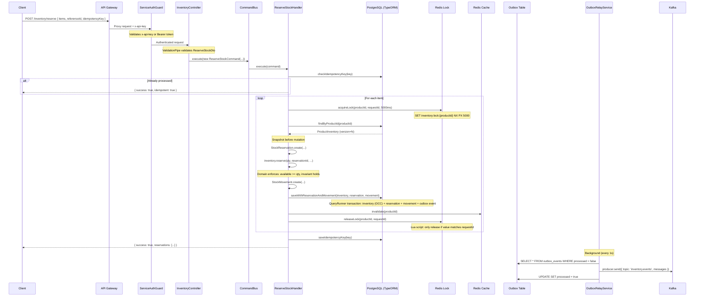
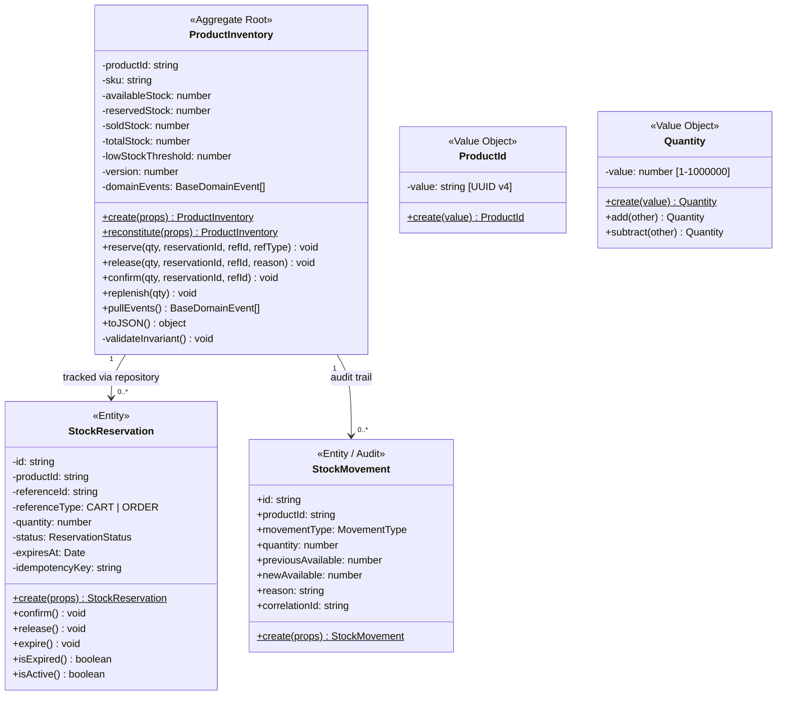
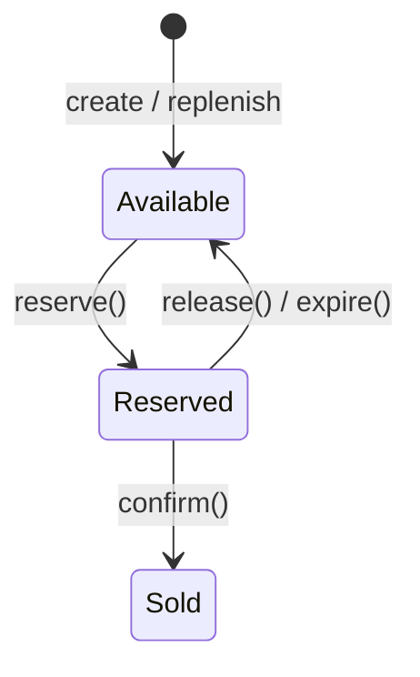
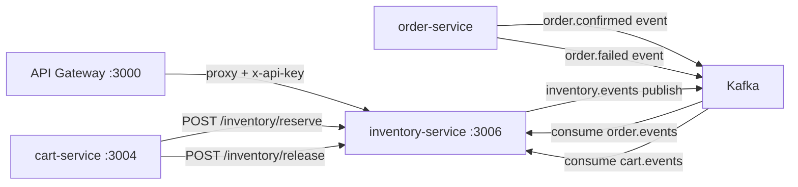

# Inventory Service — Internal Architecture

> Part of the **scalable-ecommerce-microservices** platform.  
> Last updated: 2026-03-15 — reflects production-ready state.

---

## 1. High-Level Architecture Overview

The inventory-service is a standalone NestJS microservice that manages product stock levels, reservations, and order fulfillment. It follows **Domain-Driven Design (DDD)**, **Clean Architecture**, and **CQRS** (Command Query Responsibility Segregation).

```mermaid
graph TD
    Client[Client / Browser]
    GW[API Gateway :3000<br>JWT + Rate Limiting]
    GUARD[ServiceAuthGuard<br>x-api-key / x-service-token]
    CTRL[InventoryController<br>Interfaces Layer]
    CQRS[CommandBus / QueryBus<br>Application Layer]
    DOM[ProductInventory Aggregate<br>Domain Layer + version + invariant]

    subgraph Infrastructure Layer
        REPO[(PostgreSQL Primary Store<br>TypeORM + @VersionColumn OCC)]
        CACHE[(Redis Cache<br>10s TTL, cache-aside)]
        LOCK[Redis Distributed Lock<br>SET NX PX + Lua release]
        OUTBOX[(PostgreSQL Outbox Table)]
        RELAY[OutboxRelayService<br>1s cron]
        KAFKA[Kafka Topics]
        CONSUMER[OrderEventConsumer<br>order.events + cart.events]
        EXPIRY[ReservationExpiryWorker<br>10s cron]
    end

    subgraph Observability
        HEALTH[/health — liveness]
        READY[/health/ready — DB + Redis]
        METRICS[/metrics — Prometheus 9 counters]
    end

    Client -->|HTTPS| GW
    GW -->|Proxy + x-api-key| GUARD
    GUARD --> CTRL
    CTRL --> CQRS
    CQRS -->|domain methods| DOM
    CQRS -->|OCC save + outbox| REPO
    CQRS -->|cache-aside| CACHE
    CQRS -->|distributed lock| LOCK
    RELAY -->|poll outbox_events| OUTBOX
    RELAY -->|publish| KAFKA
    CONSUMER -->|subscribe| KAFKA
    CONSUMER -->|commands| CQRS
    EXPIRY -->|find expired| REPO
    EXPIRY -->|release stock| CQRS
```

**Key design principles**:

- **Dependency Rule**: dependencies point inward — Infrastructure → Application → Domain. The domain layer has **zero** NestJS imports.
- **Port / Adapter**: application layer defines port interfaces (`IInventoryRepository`, `IStockCache`, `IEventPublisher`); infrastructure provides concrete adapters.
- **CQRS**: write operations use `CommandBus`, read operations use `QueryBus`. No shared service class.

---

## 2. DDD Layers

### Domain Layer — `src/domain/`

| Responsibility | Details |
|----------------|---------|
| Pure business logic | ProductInventory aggregate invariants, stock arithmetic, reservation lifecycle |
| Framework coupling | **None** — zero NestJS imports |
| Contains | Entities, Value Objects, Domain Events, Domain Errors, Port interfaces |

**Key files**:
- `entities/product-inventory.ts` — Aggregate Root (with `version`, invariant: `available + reserved + sold = total`)
- `entities/stock-reservation.ts` — State machine entity (ACTIVE → CONFIRMED | RELEASED | EXPIRED)
- `entities/stock-movement.ts` — Immutable audit record
- `value-objects/product-id.vo.ts` — UUID v4 validated wrapper
- `value-objects/quantity.vo.ts` — Integer 1–1,000,000 validated wrapper
- `value-objects/reservation-status.vo.ts` — Enum: ACTIVE, CONFIRMED, RELEASED, EXPIRED
- `events/` — `StockReservedEvent`, `StockReleasedEvent`, `StockConfirmedEvent`, `LowStockDetectedEvent`
- `errors/` — `InsufficientStockError`, `ReservationNotFoundError`, `StockInvariantViolationError`
- `ports/` — `IInventoryRepository` contract, `IStockCache` contract

### Application Layer — `src/application/`

| Responsibility | Details |
|----------------|---------|
| Use-case orchestration | Idempotency check → acquire lock → load aggregate → domain mutation → atomic save (inventory + reservation + movement + outbox) → invalidate cache → publish events |
| Framework coupling | `@nestjs/cqrs` only (handler registration decorators) |
| Contains | Commands, Queries, Handlers, Port interfaces (DI tokens) |

**Key files**:
- `commands/` — `ReserveStockCommand`, `ReleaseStockCommand`, `ConfirmStockCommand`, `ReplenishStockCommand`
- `queries/` — `GetInventoryQuery`
- `handlers/` — 5 handlers (one per command/query)
- `ports/` — DI symbol: `EVENT_PUBLISHER`

### Infrastructure Layer — `src/infrastructure/`

| Responsibility | Details |
|----------------|---------|
| Concrete adapters | Implement port interfaces from domain/application layers |
| Framework coupling | Full NestJS + external SDKs (TypeORM, ioredis, kafkajs) |
| Contains | PostgreSQL repository, Redis cache/lock, Kafka publisher/consumer, background workers, resilience utilities |

**Key files**:
- `persistence/repositories/typeorm-inventory.repository.ts` — `TypeOrmInventoryRepository` (OCC via `@VersionColumn`, `QueryRunner` transactions)
- `persistence/entities/` — 5 ORM entities (ProductInventory, StockReservation, StockMovement, OutboxEvent, ProcessedEvent)
- `persistence/mappers/` — `InventoryMapper`, `ReservationMapper` (Domain ↔ ORM)
- `cache/redis-lock.service.ts` — `RedisLockService` (SET NX PX + Lua release script)
- `cache/redis-stock-cache.adapter.ts` — `RedisStockCacheAdapter` (implements `IStockCache`, fail-safe)
- `messaging/kafka-event-publisher.ts` — `KafkaEventPublisher` (outbox pattern — writes to DB, not Kafka)
- `messaging/outbox-relay.service.ts` — `OutboxRelayService` (1s cron → polls outbox → publishes to Kafka)
- `messaging/order-event-consumer.ts` — `OrderEventConsumer` (subscribes to `order.events` + `cart.events`)
- `jobs/reservation-expiry.worker.ts` — `ReservationExpiryWorker` (10s cron, releases expired ACTIVE reservations)
- `resilience/retry.policy.ts` — Exponential backoff retry
- `resilience/circuit-breaker.ts` — 3-state circuit breaker

### Interfaces Layer — `src/interfaces/`

| Responsibility | Details |
|----------------|---------|
| HTTP boundary | Maps HTTP requests to CQRS commands/queries, validates DTOs, enforces auth, maps exceptions to HTTP |
| Framework coupling | Full NestJS HTTP decorators |
| Contains | Controllers, DTOs, Guards, Exception Filters |

**Key files**:
- `controllers/inventory.controller.ts` — thin controller (5 routes), `@UseGuards(ServiceAuthGuard)`, CQRS delegation only
- `dto/reserve-stock.dto.ts` — `@IsArray`, `@ValidateNested`, `@IsUUID`, `@IsInt`, `@Min(1)`, `@Max(1000000)`
- `dto/release-stock.dto.ts`, `dto/confirm-stock.dto.ts`, `dto/replenish-stock.dto.ts`, `dto/inventory-response.dto.ts`
- `guards/service-auth.guard.ts` — validates `x-api-key`, `x-service-token`, or `Authorization: Bearer`
- `filters/domain-exception.filter.ts` — maps `InsufficientStockError` → 409, `ReservationNotFoundError` → 404, `StockInvariantViolationError` → 500

---

## 3. Folder Structure

```
src/
├── domain/                                # Pure business logic — ZERO framework deps
│   ├── entities/
│   │   ├── product-inventory.ts          # Aggregate Root: reserve, release, confirm, replenish, pullEvents
│   │   ├── stock-reservation.ts          # State machine: ACTIVE → CONFIRMED | RELEASED | EXPIRED
│   │   └── stock-movement.ts             # Immutable audit: movementType, quantity, before/after snapshots
│   ├── value-objects/
│   │   ├── product-id.vo.ts              # UUID v4 — validated, immutable, equals()
│   │   ├── quantity.vo.ts                # Integer 1–1M — validated, arithmetic ops
│   │   └── reservation-status.vo.ts      # Enum: ACTIVE, CONFIRMED, RELEASED, EXPIRED
│   ├── events/
│   │   ├── base-domain.event.ts          # Abstract: occurredOn, eventType
│   │   ├── stock-reserved.event.ts       # inventory.reserved
│   │   ├── stock-released.event.ts       # inventory.released
│   │   ├── stock-confirmed.event.ts      # inventory.confirmed
│   │   └── low-stock-detected.event.ts   # inventory.low_stock
│   ├── errors/
│   │   ├── insufficient-stock.error.ts   # Oversell prevention trigger
│   │   ├── reservation-not-found.error.ts
│   │   └── stock-invariant-violation.error.ts
│   └── ports/
│       ├── inventory-repository.port.ts  # IInventoryRepository + Symbol
│       └── stock-cache.port.ts           # IStockCache + Symbol
│
├── application/                           # CQRS use-case orchestration
│   ├── commands/                          # Write-side intent objects
│   ├── queries/                           # Read-side intent objects
│   ├── handlers/                          # Execute commands/queries
│   │   └── __tests__/                     # Unit tests for domain entities
│   └── ports/                             # DI token: EVENT_PUBLISHER
│
├── infrastructure/                        # Concrete adapters
│   ├── persistence/                       # TypeORM entities, mappers, repository
│   ├── cache/                             # RedisLockService, RedisStockCacheAdapter
│   ├── messaging/                         # KafkaEventPublisher, OutboxRelayService, OrderEventConsumer
│   ├── jobs/                              # ReservationExpiryWorker
│   └── resilience/                        # RetryPolicy, CircuitBreaker
│
├── interfaces/                            # HTTP boundary
│   ├── controllers/                       # InventoryController
│   ├── dto/                               # ReserveStockDto, ReleaseStockDto, ConfirmStockDto, ReplenishStockDto
│   ├── guards/                            # ServiceAuthGuard
│   └── filters/                           # DomainExceptionFilter
│
├── health/                                # HealthController: /health (liveness), /health/ready (DB + Redis)
├── metrics/                               # InventoryMetricsModule: 9 Prometheus counters/histograms
├── config/                                # inventoryConfig, redisConfig, kafkaConfig, databaseConfig
├── inventory.module.ts                    # Feature module: ports → adapters, CQRS handlers, workers
├── app.module.ts                          # Root: ConfigModule, TypeORM.forRootAsync, ScheduleModule, Redis client
└── main.ts                               # Bootstrap: ValidationPipe, DomainExceptionFilter, port config
```

---

## 4. Request Lifecycle

The full lifecycle for a write operation (**POST /inventory/reserve**):



**Read path** (GET /inventory/:productId) uses a cache-first strategy:

```
QueryBus → GetInventoryHandler → Redis Cache.get(productId)
                               ├─ HIT → return inventory.toJSON()
                               └─ MISS → PostgreSQL findByProductId → Cache.set → return
```

---

## 5. ProductInventory Aggregate Design



**Aggregate invariant** (enforced on every mutation):
```
availableStock + reservedStock + soldStock === totalStock
```

**Stock state transitions**:


---

## 6. Business Rules

| Rule | Enforced By | Location |
|------|------------|----------|
| Stock cannot go negative | `reserve()` checks `available >= qty` | `product-inventory.ts` |
| Invariant: available + reserved + sold = total | `validateInvariant()` on every mutation | `product-inventory.ts` |
| Reservations are time-limited | `expiresAt = now + ttlMinutes` | `stock-reservation.ts` |
| Reservation state machine is strict | `assertActive()` before transitions | `stock-reservation.ts` |
| All mutations are idempotent | `checkIdempotencyKey()` in every handler | All handlers |
| Concurrent access is lock-protected | Redis distributed lock per productId | `reserve-stock.handler.ts` |
| All mutations produce audit trail | `StockMovement.create()` in every handler | All handlers |
| Low stock triggers alert | `LowStockDetectedEvent` when available ≤ threshold | `product-inventory.ts` |
| Every item in batch is locked independently | Per-item lock in reserve loop | `reserve-stock.handler.ts` |

---

## 7. Concurrency Control (3-Layer Defense)

| Layer | Mechanism | Purpose | Scope |
|-------|-----------|---------|-------|
| **1. Redis Lock** | `SET inventory:lock:{productId} NX PX 5000` | Prevents parallel handlers for same product | Per-product, 5s TTL |
| **2. PostgreSQL OCC** | `@VersionColumn` auto-increment | Detects stale writes (concurrent transactions) | Per-row, per-save |
| **3. Transaction Isolation** | `READ COMMITTED` | Prevents dirty reads within transaction | Per-transaction |

**Lock acquisition + release safety**:
- Lua script ensures only the lock owner can release (prevents accidental release of another client's lock)
- Lock is released in both success and failure paths (finally-style cleanup)

---

## 8. Integration with Other Services



| Service | Protocol | Purpose | Direction |
|---------|----------|---------|-----------|
| **cart-service** | HTTP REST | Reserve/release stock when cart is modified | Inbound |
| **order-service** | Kafka events | Confirm stock on payment, release on failure | Inbound (consumer) |
| **API Gateway** | HTTP REST | Admin replenish, stock queries | Inbound |
| **analytics** | Kafka events | Consumes `inventory.events` for metrics | Outbound (producer) |

---

## 9. Security & Production Features

| Feature | Implementation |
|---------|---------------|
| **Service-to-service auth** | `ServiceAuthGuard` validates `x-api-key`, `x-service-token`, or `Authorization: Bearer` |
| **Input validation** | `class-validator` DTOs + `ValidationPipe` with `whitelist` + `forbidNonWhitelisted` |
| **Idempotency** | Every mutation endpoint requires `idempotencyKey` — stored in `processed_events` table |
| **Rate limiting** | Handled at API Gateway level |
| **Health checks** | `/health` (liveness — uptime), `/health/ready` (DB + Redis readiness with latency) |
| **Metrics** | 9 Prometheus counters/histograms via `@willsoto/nestjs-prometheus` |
| **Structured logging** | NestJS `Logger` with context tags |
| **Correlation IDs** | `x-correlation-id` header propagated through all handlers and events |
| **Graceful shutdown** | `OnApplicationShutdown` hooks for Kafka producer/consumer |
| **Config safety** | `DB_SYNCHRONIZE` defaults to `false`; config-driven via `@nestjs/config` |
