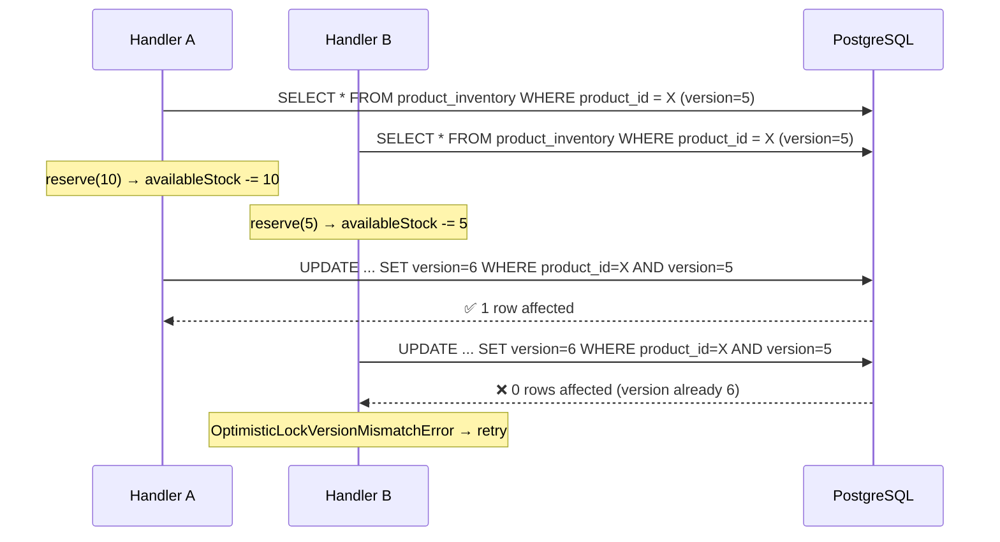
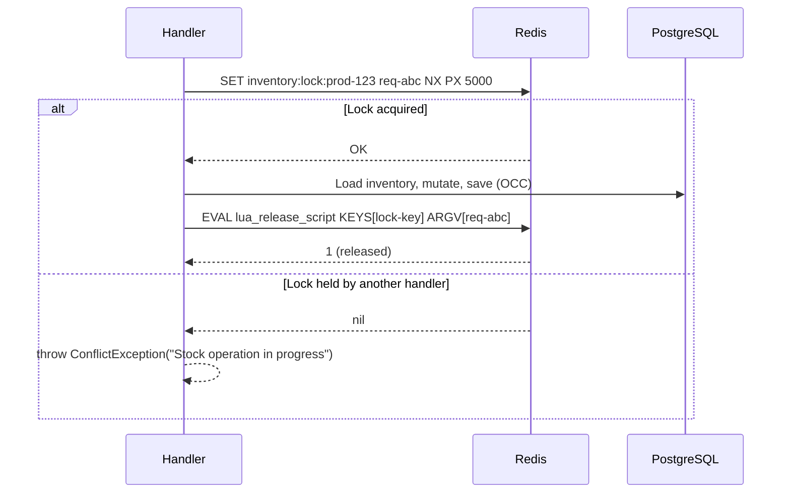
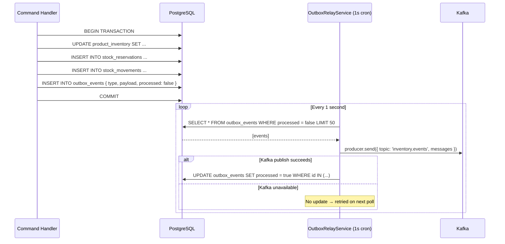
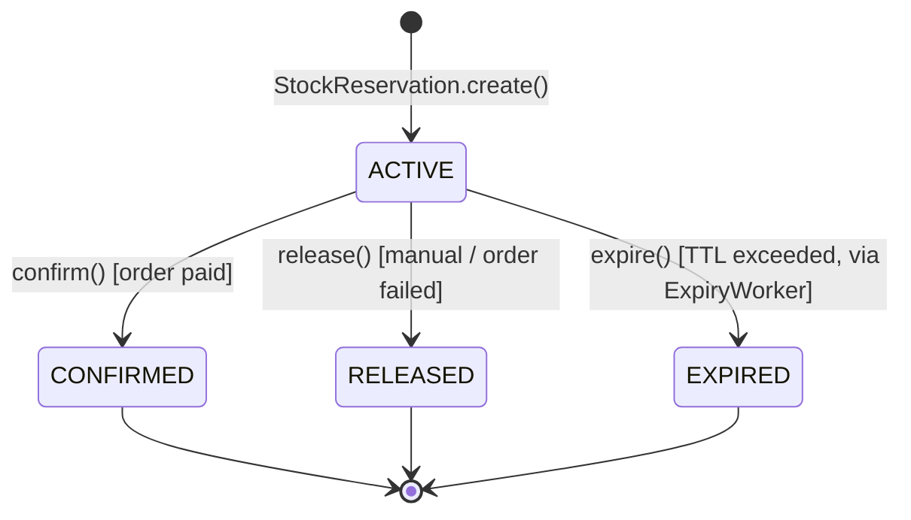
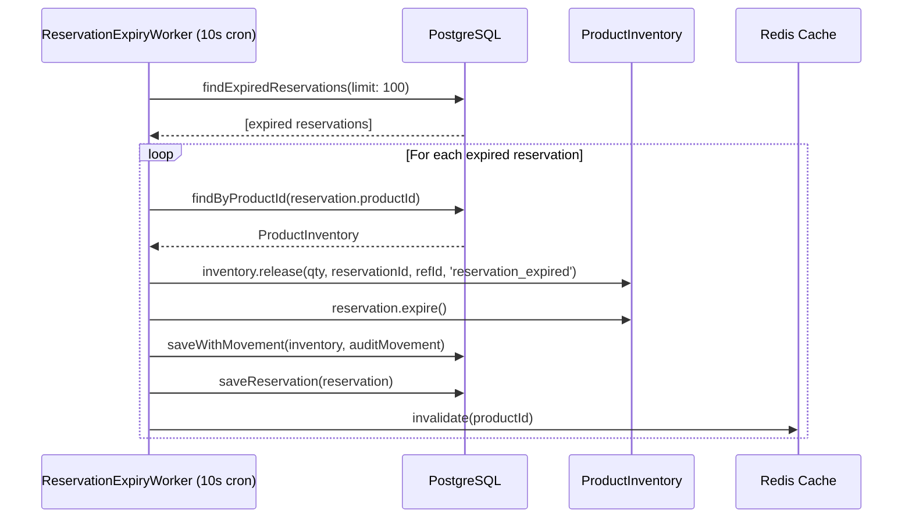

# Inventory Service — Data Architecture

> Data layer design for the `inventory-service` microservice.  
> Last updated: 2026-03-15 — reflects production-ready state.

---

## 1. Primary Store: PostgreSQL

The inventory-service uses **PostgreSQL as its primary data store** for durability, ACID transactions, and optimistic locking. All stock mutations are persisted transactionally with audit trails and outbox events.

### Schema

#### `product_inventory` — Stock Levels

```sql
CREATE TABLE product_inventory (
    product_id    UUID PRIMARY KEY,
    sku           VARCHAR(100) UNIQUE NOT NULL,
    available_stock  INT NOT NULL DEFAULT 0,
    reserved_stock   INT NOT NULL DEFAULT 0,
    sold_stock       INT NOT NULL DEFAULT 0,
    total_stock      INT NOT NULL DEFAULT 0,
    low_stock_threshold INT NOT NULL DEFAULT 100,
    version       INT NOT NULL DEFAULT 1,     -- @VersionColumn for OCC
    created_at    TIMESTAMPTZ NOT NULL DEFAULT NOW(),
    updated_at    TIMESTAMPTZ NOT NULL DEFAULT NOW(),

    CONSTRAINT chk_invariant CHECK (
        available_stock + reserved_stock + sold_stock = total_stock
    ),
    CONSTRAINT chk_non_negative CHECK (
        available_stock >= 0 AND reserved_stock >= 0 AND sold_stock >= 0
    )
);
```

#### `stock_reservations` — Reservation Lifecycle

```sql
CREATE TABLE stock_reservations (
    id              UUID PRIMARY KEY,
    product_id      UUID NOT NULL,
    reference_id    UUID NOT NULL,
    reference_type  VARCHAR(20) NOT NULL,      -- 'CART' or 'ORDER'
    quantity        INT NOT NULL,
    status          VARCHAR(20) NOT NULL DEFAULT 'ACTIVE',
    expires_at      TIMESTAMPTZ,
    idempotency_key VARCHAR(255) UNIQUE NOT NULL,
    created_at      TIMESTAMPTZ NOT NULL DEFAULT NOW(),
    updated_at      TIMESTAMPTZ NOT NULL DEFAULT NOW()
);

CREATE INDEX idx_reservations_reference ON stock_reservations (reference_id, reference_type);
CREATE INDEX idx_reservations_product ON stock_reservations (product_id);
```

#### `stock_movements` — Immutable Audit Log

```sql
CREATE TABLE stock_movements (
    id                UUID PRIMARY KEY,
    product_id        UUID NOT NULL,
    movement_type     VARCHAR(20) NOT NULL,     -- RESERVE, RELEASE, CONFIRM, REPLENISH, EXPIRE
    quantity          INT NOT NULL,
    reference_id      UUID,
    previous_available INT NOT NULL,
    new_available      INT NOT NULL,
    previous_reserved  INT NOT NULL,
    new_reserved       INT NOT NULL,
    reason            VARCHAR(255),
    performed_by      VARCHAR(255),
    correlation_id    VARCHAR(255),
    created_at        TIMESTAMPTZ NOT NULL DEFAULT NOW()
);

CREATE INDEX idx_movements_product ON stock_movements (product_id);
CREATE INDEX idx_movements_created ON stock_movements (created_at);
```

#### `outbox_events` — Transactional Outbox

```sql
CREATE TABLE outbox_events (
    id          UUID PRIMARY KEY,
    type        VARCHAR(100) NOT NULL,
    payload     JSONB NOT NULL,
    processed   BOOLEAN NOT NULL DEFAULT FALSE,
    created_at  TIMESTAMPTZ NOT NULL DEFAULT NOW()
);
```

#### `processed_events` — Idempotency Tracking

```sql
CREATE TABLE processed_events (
    event_id      UUID PRIMARY KEY,
    processed_at  TIMESTAMPTZ NOT NULL DEFAULT NOW()
);
```

---

## 2. Optimistic Concurrency Control (OCC)

TypeORM's `@VersionColumn` decorator automatically increments `version` on every save. If two concurrent transactions try to update the same row, the second one fails with `OptimisticLockVersionMismatchError`.

### OCC Flow



### Why OCC (not Pessimistic Locking)?

| Criterion | OCC | Pessimistic (SELECT FOR UPDATE) |
|-----------|-----|----|
| Lock contention | None — no DB locks held | Blocks concurrent reads |
| Latency | Minimal — retry only on conflict | Higher — waits for lock |
| Scalability | Better for high-read workloads | Poor under high contention |
| Deadlocks | Impossible | Possible with multi-row |
| Combined with Redis lock | Redundant safety layer | Unnecessary |

---

## 3. Redis Cache Layer

Separate from PostgreSQL, the cache layer provides read optimization.

| Property | Value |
|----------|-------|
| Key pattern | `inventory:stock:{productId}` |
| TTL | 10 seconds (configurable via `REDIS_CACHE_TTL_SECONDS`) |
| Serialization | `JSON.stringify(inventory.toJSON())` |
| Reconstitution | `ProductInventory.reconstitute()` |
| Write strategy | **Cache-aside / invalidation**: handlers call `cache.invalidate(productId)` after writes |
| Read strategy | **Cache-first**: `GetInventoryHandler` checks cache first; on miss, reads from PostgreSQL and warms cache |
| Failure mode | **Fail-safe**: all Redis errors are caught and logged, never thrown |

### Cache Flow

```mermaid
flowchart TD
    A[GET /inventory/:productId] --> B{Cache HIT?}
    B -->|Yes ~0.1ms| C[Return cached inventory.toJSON]
    B -->|No| D[Load from PostgreSQL]
    D --> E{Inventory exists?}
    E -->|Yes| F[cache.set productId, inventory]
    F --> G[Return inventory.toJSON]
    E -->|No| H[404 Not Found]

    I[POST reserve / release / confirm] --> J[repo.save — QueryRunner transaction]
    J --> K[cache.invalidate productId]
    Note over K: Next read will miss and reload from DB
```

### Why Cache-Aside (not Write-Through)?

| Strategy | Pros | Cons |
|----------|------|------|
| **Cache-aside** (our choice) | Simple, cache is always consistent after invalidation | Brief cache miss after writes |
| Write-through | Always warm after writes | Risk of cache-DB inconsistency on partial failures |

With 10s TTL and invalidation on every write, stale reads are limited to at most 10 seconds for products that receive no writes.

---

## 4. Redis Distributed Locks

| Property | Value |
|----------|-------|
| Key pattern | `inventory:lock:{productId}` |
| TTL | 5,000ms (configurable via `REDIS_LOCK_TTL_MS`) |
| Acquisition | `SET inventory:lock:{productId} {requestId} NX PX 5000` |
| Release | Lua script: only delete if stored value matches `requestId` |

### Lock Safety

```lua
-- Safe release script (prevents releasing another client's lock)
if redis.call("get", KEYS[1]) == ARGV[1] then
    return redis.call("del", KEYS[1])
else
    return 0
end
```

### Lock Lifecycle



---

## 5. Event Outbox: PostgreSQL Table

Events are stored in the `outbox_events` PostgreSQL table within the same transaction as the business data — implementing the **Transactional Outbox** pattern.

### Outbox Flow



### Guarantees

| Property | Guarantee |
|----------|-----------|
| Atomicity | Events written in same transaction as business data |
| Durability | PostgreSQL WAL ensures events survive crashes |
| Delivery | **At-least-once** (mark processed only after Kafka publish) |
| Ordering | Per-product ordering via Kafka partition key = `productId` |
| Deduplication | Each event has unique `id` (UUID) for downstream idempotency |

### Why Outbox (not direct Kafka publish)?

| Approach | Atomicity | Reliability |
|----------|-----------|-------------|
| **Outbox** (our choice) | ✅ Same transaction | ✅ Retried on failure |
| Direct publish | ❌ Dual-write problem | ❌ Events lost if Kafka down |

---

## 6. Reservation Expiration Strategy

### TTL Layers

| Layer | TTL | Mechanism |
|-------|-----|-----------|
| **StockReservation entity** | 15 min (default) | `expiresAt = now + RESERVATION_TTL_MINUTES` |
| **ReservationExpiryWorker** | Every 10s | Cron polls `stock_reservations WHERE status = 'ACTIVE' AND expires_at < NOW()` |

### Reservation Lifecycle



### Expiry Worker Flow



---

## 7. Data Consistency

### Invariant Enforcement

The core stock invariant is checked on every domain mutation:

```typescript
// product-inventory.ts → validateInvariant()
available + reserved + sold === total
```

If violated, throws `StockInvariantViolationError` (→ 500 Internal Server Error).

### Consistency Guarantees

| Scenario | Guarantee | Mechanism |
|----------|-----------|-----------|
| Concurrent reserves on same product | Only one succeeds | Redis lock + OCC version check |
| Server crash mid-transaction | Rolled back | PostgreSQL transaction |
| Kafka unavailable | Events buffered in outbox | Outbox relay retries every 1s |
| Redis cache unavailable | Falls through to PostgreSQL | Fail-safe cache adapter |
| Expired reservation not processed | Worker catches on next 10s cycle | Cron-based polling |

### Idempotency

All mutation endpoints require an `idempotencyKey`. Before processing:

```
1. Check: SELECT * FROM processed_events WHERE event_id = :key
2. If exists → return early (idempotent response)
3. If not → process command → INSERT INTO processed_events
```

This prevents duplicate reservations from retry storms.
