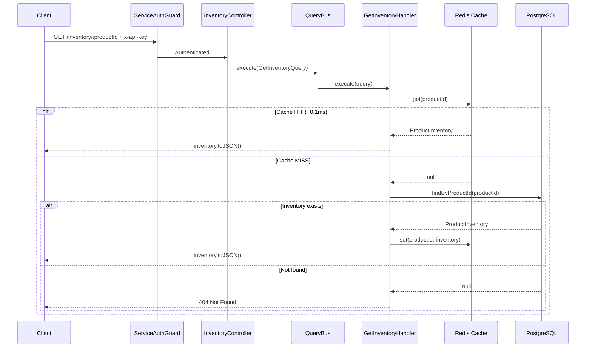
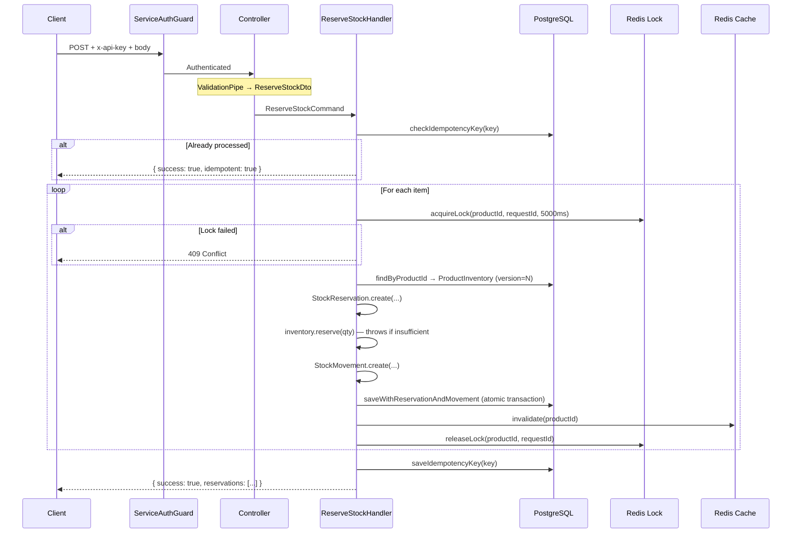

# Inventory Service — API Endpoints & Execution Flows

> Complete reference for all inventory-service HTTP endpoints.  
> Last updated: 2026-03-15 — reflects production-ready state.

---

## Authentication & Authorization

All inventory endpoints are protected by `ServiceAuthGuard`. Authentication is validated via one of:

1. **API key**: `x-api-key` header matches `INTERNAL_API_KEY` env var
2. **Service token**: `x-service-token` header (service-to-service JWT)
3. **Bearer token**: `Authorization: Bearer <token>` (gateway-forwarded JWT)

Requests without valid credentials receive `401 Unauthorized`.

## Idempotency

All mutation endpoints require an `idempotencyKey` field in the request body. If a request with the same key has already been processed, the service returns the cached result with `idempotent: true`.

## Correlation

All endpoints accept an optional `x-correlation-id` header. This ID is propagated through all handlers, events, and audit movements for end-to-end tracing.

---

## Endpoint Summary

| Method | Path | CQRS | Status | Description |
|--------|------|------|--------|-------------|
| `GET` | `/inventory/:productId` | `GetInventoryQuery` | 200 | Get stock levels (cache-first) |
| `POST` | `/inventory/reserve` | `ReserveStockCommand` | 200 | Reserve stock for cart/order |
| `POST` | `/inventory/release` | `ReleaseStockCommand` | 200 | Release reserved stock |
| `POST` | `/inventory/confirm` | `ConfirmStockCommand` | 200 | Confirm reserved → sold |
| `POST` | `/inventory/replenish` | `ReplenishStockCommand` | 200 | Restock inventory |
| `GET` | `/health` | — | 200 | Liveness probe |
| `GET` | `/health/ready` | — | 200/503 | Readiness probe (DB + Redis) |

---

## 1. GET `/inventory/:productId` — Get Inventory

### Request
```
GET /inventory/550e8400-e29b-41d4-a716-446655440000
x-api-key: your-internal-api-key
```

### Response (200 OK)
```json
{
  "productId": "550e8400-e29b-41d4-a716-446655440000",
  "sku": "WIDGET-001",
  "availableStock": 950,
  "reservedStock": 30,
  "soldStock": 20,
  "totalStock": 1000,
  "lowStockThreshold": 100,
  "isLowStock": false,
  "version": 15,
  "createdAt": "2026-03-01T00:00:00.000Z",
  "updatedAt": "2026-03-15T12:00:00.000Z"
}
```

### Execution Flow



### Error Scenarios

| Error | HTTP | Code |
|-------|------|------|
| Product not found | 404 | `Not Found` |
| Invalid UUID param | 400 | Validation error |

---

## 2. POST `/inventory/reserve` — Reserve Stock

### Request
```
POST /inventory/reserve
x-api-key: your-internal-api-key
x-correlation-id: corr-abc-123
Content-Type: application/json

{
  "items": [
    { "productId": "550e8400-e29b-41d4-a716-446655440000", "quantity": 2 },
    { "productId": "660e8400-e29b-41d4-a716-446655440001", "quantity": 1 }
  ],
  "referenceId": "770e8400-e29b-41d4-a716-446655440002",
  "referenceType": "CART",
  "idempotencyKey": "reserve-cart-770e-prod-550e-660e",
  "ttlMinutes": 15
}
```

### DTO Validation (`ReserveStockDto`)

| Field | Rules |
|-------|-------|
| `items` | `@IsArray`, `@ArrayMinSize(1)`, `@ArrayMaxSize(50)`, `@ValidateNested` |
| `items[].productId` | `@IsUUID('4')` |
| `items[].quantity` | `@IsInt`, `@Min(1)`, `@Max(1000000)` |
| `referenceId` | `@IsUUID('4')` |
| `referenceType` | `@IsIn(['CART', 'ORDER'])` |
| `idempotencyKey` | `@IsString` |
| `ttlMinutes` | `@IsOptional`, `@IsInt`, `@Min(1)`, `@Max(1440)` |

### Response (200 OK)
```json
{
  "success": true,
  "reservations": [
    {
      "reservationId": "aaa-bbb-ccc",
      "productId": "550e8400-e29b-41d4-a716-446655440000",
      "quantity": 2,
      "status": "ACTIVE",
      "expiresAt": "2026-03-15T12:15:00.000Z"
    },
    {
      "reservationId": "ddd-eee-fff",
      "productId": "660e8400-e29b-41d4-a716-446655440001",
      "quantity": 1,
      "status": "ACTIVE",
      "expiresAt": "2026-03-15T12:15:00.000Z"
    }
  ]
}
```

### Execution Flow



### Error Scenarios

| Error | HTTP | Code |
|-------|------|------|
| Invalid request body | 400 | Validation error |
| Product not found | 404 | `Not Found` |
| Insufficient stock | 409 | `INSUFFICIENT_STOCK` |
| Lock acquisition failed | 409 | `Conflict` |
| Idempotent duplicate | 200 | `{ idempotent: true }` |

---

## 3. POST `/inventory/release` — Release Stock

### Request
```
POST /inventory/release
x-api-key: your-internal-api-key
Content-Type: application/json

{
  "referenceId": "770e8400-e29b-41d4-a716-446655440002",
  "referenceType": "CART",
  "idempotencyKey": "release-cart-770e",
  "reason": "cart_expired",
  "productIds": ["550e8400-e29b-41d4-a716-446655440000"]
}
```

### Response (200 OK)
```json
{
  "success": true,
  "releasedCount": 1,
  "releasedItems": [
    { "productId": "550e8400-e29b-41d4-a716-446655440000", "quantityReleased": 2 }
  ]
}
```

### DTO Validation (`ReleaseStockDto`)

| Field | Rules |
|-------|-------|
| `referenceId` | `@IsUUID('4')` |
| `referenceType` | `@IsIn(['CART', 'ORDER'])` |
| `idempotencyKey` | `@IsString` |
| `reason` | `@IsOptional`, `@IsString` |
| `productIds` | `@IsOptional`, `@IsArray`, `@IsUUID('4', { each: true })` |

### Error Scenarios

| Error | HTTP | Code |
|-------|------|------|
| Invalid body | 400 | Validation error |
| No reservations found | 200 | `{ releasedCount: 0 }` |

---

## 4. POST `/inventory/confirm` — Confirm Stock (Order Paid)

### Request
```
POST /inventory/confirm
x-api-key: your-internal-api-key
Content-Type: application/json

{
  "referenceId": "770e8400-e29b-41d4-a716-446655440002",
  "idempotencyKey": "confirm-order-770e"
}
```

### Response (200 OK)
```json
{
  "success": true,
  "confirmedItems": [
    { "productId": "550e8400-...", "quantity": 2, "status": "CONFIRMED" },
    { "productId": "660e8400-...", "quantity": 1, "status": "CONFIRMED" }
  ]
}
```

### Error Scenarios

| Error | HTTP | Code |
|-------|------|------|
| No reservations found | 404 | `RESERVATION_NOT_FOUND` |
| Invalid body | 400 | Validation error |

---

## 5. POST `/inventory/replenish` — Restock Inventory

### Request
```
POST /inventory/replenish
x-api-key: your-internal-api-key
Content-Type: application/json

{
  "items": [
    { "productId": "550e8400-...", "quantity": 500, "reason": "warehouse_restock" }
  ],
  "performedBy": "warehouse-system",
  "idempotencyKey": "restock-2026-03-15-batch-1"
}
```

### Response (200 OK)
```json
{
  "success": true,
  "replenished": [
    { "productId": "550e8400-...", "previousAvailable": 450, "newAvailable": 950 }
  ]
}
```

### Notes
- If a product does not exist yet, the handler creates a new `ProductInventory` with `initialStock: 0` and then replenishes.
- This is the only endpoint that **creates** inventory records.

---

## 6. GET `/health` — Liveness Probe

### Response (200 OK)
```json
{
  "status": "up",
  "uptime": 3600.123
}
```

---

## 7. GET `/health/ready` — Readiness Probe

### Response (200 OK)
```json
{
  "status": "ready",
  "checks": {
    "database": { "status": "up", "latency_ms": 2 },
    "redis": { "status": "up", "latency_ms": 1 }
  }
}
```

### Response (503 — Degraded)
```json
{
  "status": "degraded",
  "checks": {
    "database": { "status": "up", "latency_ms": 3 },
    "redis": { "status": "down" }
  }
}
```

---

## Domain Exception → HTTP Mapping

All domain exceptions are caught by `DomainExceptionFilter` and translated to structured responses:

| Domain Exception | Error Code | HTTP Status |
|-----------------|------------|-------------|
| `InsufficientStockError` | `INSUFFICIENT_STOCK` | 409 Conflict |
| `ReservationNotFoundError` | `RESERVATION_NOT_FOUND` | 404 Not Found |
| `StockInvariantViolationError` | `STOCK_INVARIANT_VIOLATION` | 500 Internal Server Error |
| NestJS `NotFoundException` | N/A | 404 Not Found |
| NestJS `ConflictException` | N/A | 409 Conflict |
| Validation errors | N/A | 400 Bad Request |

### Error Response Format

```json
{
  "statusCode": 409,
  "error": "INSUFFICIENT_STOCK",
  "message": "Insufficient stock for product 550e8400-...: requested 10, available 5",
  "productId": "550e8400-...",
  "requested": 10,
  "available": 5
}
```

---

## Kafka Event-Driven Flows

In addition to the HTTP API, the inventory-service reacts to events from other services:

### Events Consumed

| Event | Source Topic | Action |
|-------|-------------|--------|
| `order.confirmed` | `order.events` | Execute `ConfirmStockCommand` — reserved → sold |
| `order.failed` / `order.cancelled` | `order.events` | Execute `ReleaseStockCommand` — reserved → available |
| `cart.expired` | `cart.events` | Execute `ReleaseStockCommand` — reserved → available |

### Events Produced

| Event | Topic | Trigger |
|-------|-------|---------|
| `inventory.reserved` | `inventory.events` | Stock reserved for cart/order |
| `inventory.released` | `inventory.events` | Reserved stock released back |
| `inventory.confirmed` | `inventory.events` | Reserved stock confirmed as sold |
| `inventory.low_stock` | `inventory.events` | Available stock dropped below threshold |
