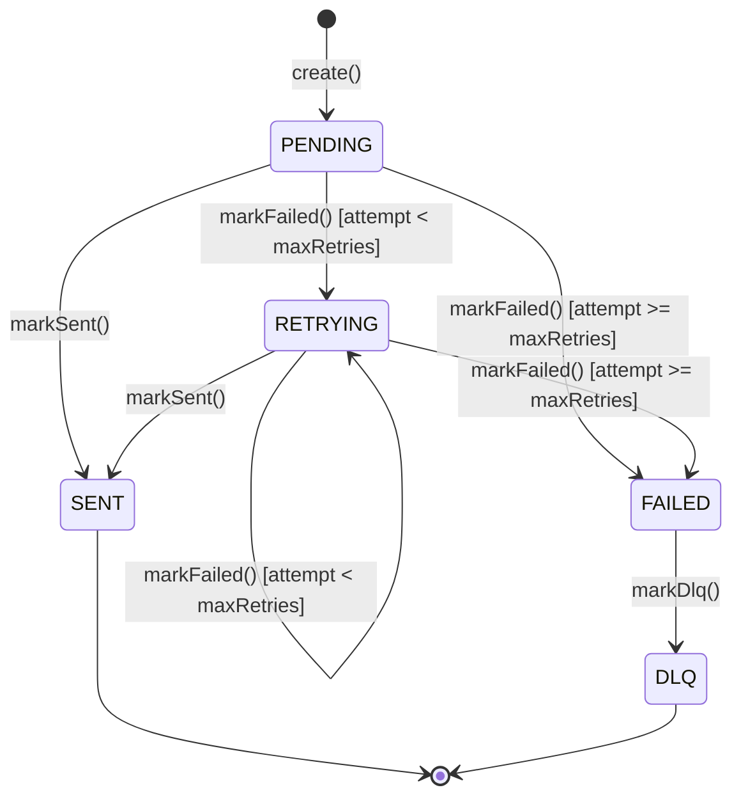

# Notification Data Model

## Notification Entity (Aggregate Root)

The `Notification` class is the core aggregate root. It encapsulates all business logic for delivery, failure handling, retries, and DLQ routing.

### Properties

| Property | Type | Description |
|---|---|---|
| `id` | `string` (UUID) | Unique notification identifier |
| `recipientId` | `string` | Target user ID |
| `recipientEmail` | `string?` | Email address (for EMAIL channel) |
| `recipientPhone` | `string?` | Phone number (for SMS channel) |
| `channel` | `NotificationChannel` | Delivery channel |
| `templateSlug` | `string` | Template identifier used for rendering |
| `subject` | `string` | Rendered subject line |
| `body` | `string` | Rendered body content |
| `status` | `NotificationStatus` | Current lifecycle status |
| `priority` | `NotificationPriority` | Delivery priority |
| `attempt` | `number` | Current delivery attempt count |
| `maxRetries` | `number` | Maximum allowed retries (default: 3) |
| `metadata` | `Record<string, unknown>` | Arbitrary metadata from the source event |
| `errorMessage` | `string?` | Last error message on failure |
| `sentAt` | `Date?` | Timestamp of successful delivery |
| `nextRetryAt` | `Date?` | Scheduled time for next retry |
| `correlationId` | `string` | Tracing correlation ID |
| `createdAt` | `Date` | Creation timestamp |
| `updatedAt` | `Date` | Last modification timestamp |

---

## Status Lifecycle



### Status Values

| Status | Description |
|---|---|
| `PENDING` | Notification created, not yet sent |
| `SENT` | Successfully delivered via channel provider |
| `RETRYING` | Delivery failed, retry scheduled with exponential backoff |
| `FAILED` | All retries exhausted |
| `DLQ` | Moved to Dead Letter Queue |

### Transitions

| From | To | Trigger | Condition |
|---|---|---|---|
| `PENDING` | `SENT` | `markSent()` | Provider returns success |
| `PENDING` | `RETRYING` | `markFailed()` | `attempt < maxRetries` |
| `PENDING` | `FAILED` | `markFailed()` | `attempt >= maxRetries` |
| `RETRYING` | `SENT` | `markSent()` | Retry succeeds |
| `RETRYING` | `RETRYING` | `markFailed()` | `attempt < maxRetries` |
| `RETRYING` | `FAILED` | `markFailed()` | `attempt >= maxRetries` |
| `FAILED` | `DLQ` | `markDlq()` | Manual or DLQ processor |

---

## Exponential Backoff

When a notification fails and retries remain, the `nextRetryAt` is calculated as:

```
nextRetryAt = now + min(2^attempt × 1000ms, 30000ms)
```

| Attempt | Backoff Delay | Cumulative Wait |
|---|---|---|
| 1 | 2s | 2s |
| 2 | 4s | 6s |
| 3 | 8s | 14s |
| 4+ | 16s (capped at 30s) | — |

The maximum backoff is capped at **30 seconds** (`MAX_BACKOFF_MS`).

---

## Notification Channels

```typescript
enum NotificationChannel {
  EMAIL   = 'EMAIL',
  SMS     = 'SMS',
  PUSH    = 'PUSH',
  IN_APP  = 'IN_APP',
}
```

Each channel maps to a concrete provider via the `ChannelProviderFactory`.

---

## Notification Priority

```typescript
enum NotificationPriority {
  LOW      = 'LOW',
  NORMAL   = 'NORMAL',
  HIGH     = 'HIGH',
  CRITICAL = 'CRITICAL',
}
```

Priority is assigned when the notification command is created (based on source event type).

---

## NotificationTemplate Entity

Templates define how notifications are rendered for a specific slug and channel.

### Properties

| Property | Type | Description |
|---|---|---|
| `slug` | `string` | Unique template identifier (e.g. `order-confirmation`) |
| `name` | `string` | Human-readable name |
| `channel` | `NotificationChannel` | Target channel |
| `subjectTemplate` | `string` | Subject with `{{variable}}` placeholders |
| `bodyTemplate` | `string` | Body with `{{variable}}` placeholders |
| `requiredVariables` | `string[]` | Variables that must be provided |
| `isActive` | `boolean` | Whether the template is active |

### Template Rendering

Variables are interpolated using `{{variableName}}` syntax:

```
Subject: "Order {{orderId}} Confirmed"
Body:    "Hi {{userName}}, your order {{orderId}} totaling ${{totalAmount}} is confirmed."
```

If any required variable is missing, a validation error is thrown before delivery.

---

## Idempotency Handling

- Each notification is assigned a unique `id` (UUID v4) on creation
- The `correlationId` links the notification back to the source event, enabling deduplication
- Kafka event publishing uses the `eventId` as the message key for at-least-once delivery
- Future: a `processed_events` table can deduplicate consumed Kafka events

---

## Domain Events

The `Notification` aggregate emits domain events on state changes:

| Event | Emitted When | Payload |
|---|---|---|
| `NotificationSentEvent` | `markSent()` | `id`, `channel`, `recipientId`, `templateSlug`, `sentAt` |
| `NotificationFailedEvent` | `markFailed()` (max retries) | `id`, `channel`, `recipientId`, `reason`, `attempt`, `maxRetries` |
| `NotificationRetryScheduledEvent` | `markFailed()` (retries remain) | `id`, `channel`, `recipientId`, `attempt`, `nextRetryAt` |

Events are collected via `pullEvents()` and published through `IEventPublisher` to the `notification.events` Kafka topic.
