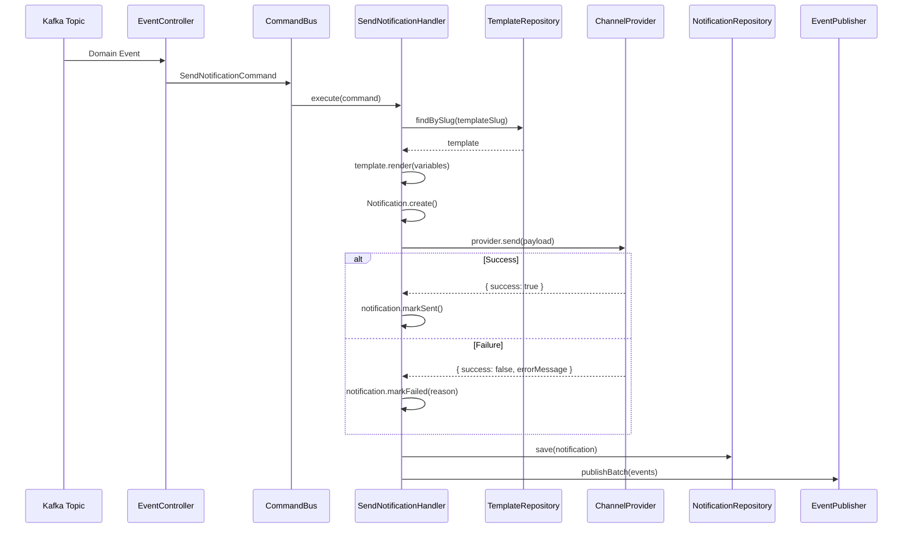
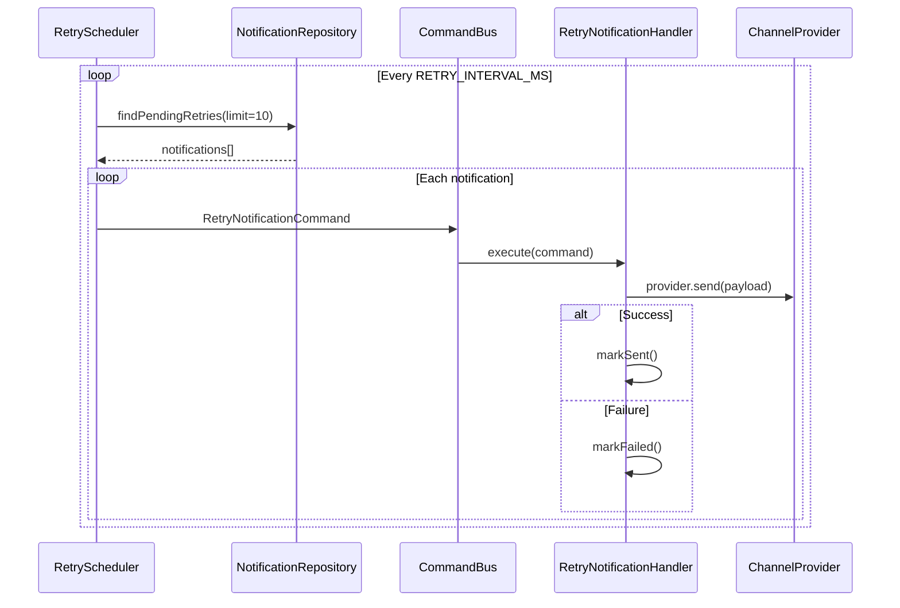

# Notification Event Flow

## Overview

The notification-service is **event-driven first**. The primary entry point is not the REST API — it is the Kafka consumer that reacts to domain events published by other microservices.

---

## Events Consumed

The service consumes events from three Kafka topics:

```
┌──────────────────┐
│   user.events    │──▶ user.registered
├──────────────────┤
│   order.events   │──▶ order.created, order.paid, order.shipped
├──────────────────┤
│   cart.events    │──▶ cart.abandoned
└──────────────────┘
```

### Event-to-Notification Mapping

| Event | Topic | Template Slug | Channel | Priority | Key Variables |
|---|---|---|---|---|---|
| `user.registered` | `user.events` | `user-registration` | EMAIL | HIGH | `userName`, `email` |
| `order.created` | `order.events` | `order-confirmation` | EMAIL | HIGH | `orderId`, `totalAmount` |
| `order.paid` | `order.events` | `payment-receipt` | EMAIL | NORMAL | `orderId`, `amount` |
| `order.shipped` | `order.events` | `shipping-update` | EMAIL | NORMAL | `orderId`, `trackingNumber` |
| `cart.abandoned` | `cart.events` | `abandoned-cart` | EMAIL | LOW | `cartId` |

### Consumer Groups

Each topic uses a dedicated consumer group to ensure independent processing:

| Topic | Consumer Group |
|---|---|
| `user.events` | `notification-service-user-events` |
| `order.events` | `notification-service-order-events` |
| `cart.events` | `notification-service-cart-events` |

---

## How Notifications Are Created

### Step 1: Event Received

`NotificationEventController` uses `@EventPattern()` decorators to receive Kafka messages:

```typescript
@EventPattern('user.registered')
async handleUserRegistered(@Payload() message: any) {
  await this.commandBus.execute(
    new SendNotificationCommand(
      message.userId,
      NotificationChannel.EMAIL,
      'user-registration',
      { userName: message.name || 'User' },
      correlationId,
      NotificationPriority.HIGH,
      message.email,
    ),
  );
}
```

### Step 2: Command Dispatched

The controller dispatches a `SendNotificationCommand` via the NestJS `CommandBus` (CQRS pattern).

### Step 3: Handler Processes

`SendNotificationHandler` executes the command:

1. **Resolve template** — Look up `NotificationTemplate` by `templateSlug`
2. **Render content** — Interpolate `{{variables}}` into subject and body
3. **Create aggregate** — `Notification.create()` with `PENDING` status
4. **Select provider** — `ChannelProviderFactory.getProvider(channel)`
5. **Deliver** — `provider.send(payload)`
6. **Handle result** — `markSent()` or `markFailed(reason)`
7. **Persist** — `notificationRepo.save(notification)`
8. **Publish events** — `eventPublisher.publishBatch(notification.pullEvents())`

---

## Processing Pipeline



---

## Retry Handling

### Exponential Backoff

When delivery fails and retries remain (`attempt < maxRetries`):

1. `Notification.markFailed()` sets `status = RETRYING`
2. Computes `nextRetryAt = now + min(2^attempt × 1000ms, 30s)`
3. Emits `NotificationRetryScheduledEvent`

### Retry Scheduler

`RetrySchedulerService` runs on a polling interval (`RETRY_INTERVAL_MS`, default 10s):



### Retry Flow Example

```
Attempt 0: Initial send → FAILED
  → status: RETRYING, nextRetryAt: +2s

Attempt 1: Retry → FAILED
  → status: RETRYING, nextRetryAt: +4s

Attempt 2: Retry → FAILED
  → status: FAILED (maxRetries=3 exhausted)
  → DLQ processor picks up
```

---

## Dead Letter Queue (DLQ)

### DLQ Processor

`DlqProcessorService` runs on a polling interval (`DLQ_INTERVAL_MS`, default 30s):

1. Queries `findFailedForDlq(limit=10)` for notifications with `status = FAILED`
2. Dispatches `MoveToDlqCommand` for each

### DLQ Handler

`MoveToDlqHandler`:

1. Calls `notification.markDlq()` → sets `status = DLQ`
2. Saves to repository
3. **Publishes** the full notification JSON to the `notification.dlq` Kafka topic
4. Logs the DLQ routing

### DLQ Kafka Topic

The `notification.dlq` topic receives the full notification payload for manual inspection, alerting, or reprocessing:

```json
{
  "id": "abc-123",
  "recipientId": "user-456",
  "channel": "EMAIL",
  "templateSlug": "order-confirmation",
  "status": "DLQ",
  "attempt": 3,
  "maxRetries": 3,
  "errorMessage": "SMTP connection refused",
  "correlationId": "corr-789"
}
```

---

## Published Events

The service publishes domain events to the `notification.events` Kafka topic:

| Event Type | When | Purpose |
|---|---|---|
| `notification.sent` | Delivery succeeded | Audit, downstream analytics |
| `notification.failed` | All retries exhausted | Alerting, monitoring |
| `notification.retry_scheduled` | Retry queued | Tracing, debugging |

---

## End-to-End Flow Diagram

```
┌─────────────┐   user.registered   ┌─────────────────────┐
│ user-service│─────────────────────▶│  NotificationEvent  │
└─────────────┘                      │  Controller         │
                                     └────────┬────────────┘
┌──────────────┐  order.created/     ┌────────▼────────────┐
│ order-service│  paid/shipped       │    CommandBus        │
└──────────────┘─────────────────────▶────────┬────────────┘
                                     ┌────────▼────────────┐
┌─────────────┐   cart.abandoned     │ SendNotification    │
│ cart-service│──────────────────────▶│ Handler             │
└─────────────┘                      └──┬────────────┬─────┘
                                        │            │
                                   success        failure
                                        │            │
                                   ┌────▼──┐    ┌────▼──────┐
                                   │ SENT  │    │ RETRYING  │
                                   └───────┘    └────┬──────┘
                                                     │
                                              RetryScheduler
                                                     │
                                              ┌──────▼──────┐
                                              │   FAILED    │
                                              └──────┬──────┘
                                                     │
                                              DlqProcessor
                                                     │
                                              ┌──────▼──────┐
                                              │    DLQ      │
                                              │ (Kafka dlq) │
                                              └─────────────┘
```
