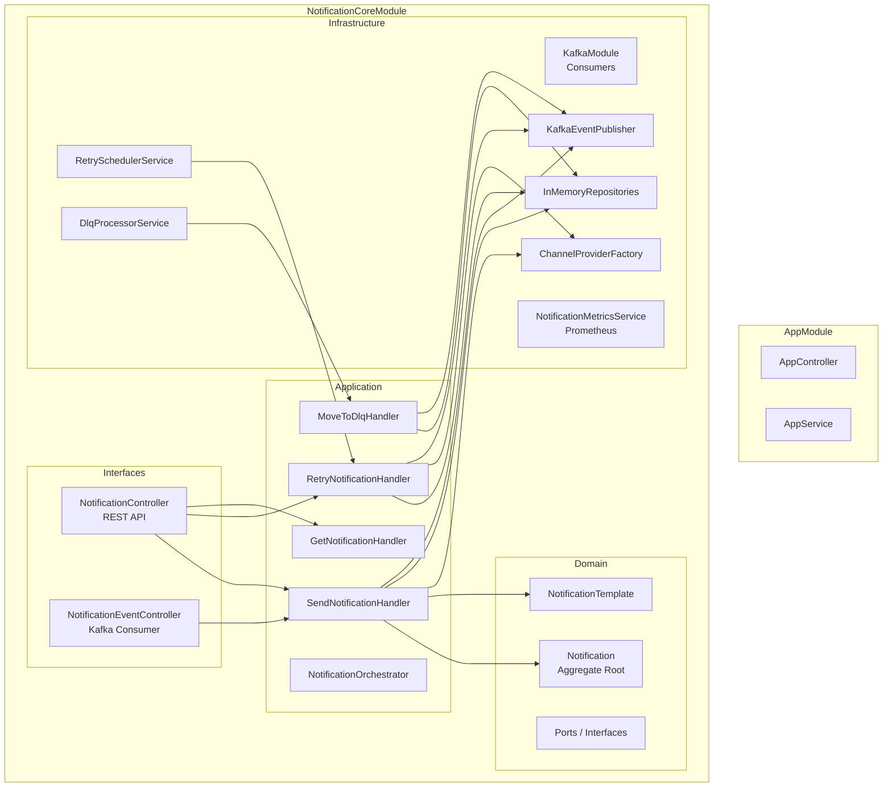

# Notification Service Architecture

## Service Responsibilities

The notification-service is the platform's central notification hub. It:

1. **Consumes domain events** from Kafka topics (`user.events`, `order.events`, `cart.events`)
2. **Resolves templates** and interpolates variables
3. **Delivers notifications** via channel providers (Email, SMS, Push, In-App)
4. **Manages failure recovery** with exponential backoff retries and a Dead Letter Queue
5. **Exposes Prometheus metrics** for observability

---

## Module Architecture



---

## Clean Architecture Layers

### Domain Layer (`src/domain/`)

Pure business logic with **zero framework dependencies**. Contains:

- **Entities**: `Notification` (aggregate root), `NotificationTemplate`
- **Enums**: `NotificationChannel`, `NotificationStatus`, `NotificationPriority`
- **Domain Events**: `NotificationSentEvent`, `NotificationFailedEvent`, `NotificationRetryScheduledEvent`
- **Ports**: `INotificationRepository`, `ITemplateRepository`, `IChannelProviderFactory`, `IEventPublisher`
- **Errors**: `InvalidChannelError`, `TemplateNotFoundError`, `NotificationDeliveryFailedError`

### Application Layer (`src/application/`)

Orchestrates domain operations via CQRS:

| Handler | Command/Query | Purpose |
|---|---|---|
| `SendNotificationHandler` | `SendNotificationCommand` | Resolve template → create notification → deliver → persist |
| `RetryNotificationHandler` | `RetryNotificationCommand` | Re-attempt delivery for RETRYING notifications |
| `MoveToDlqHandler` | `MoveToDlqCommand` | Move FAILED notifications to DLQ Kafka topic |
| `GetNotificationHandler` | `GetNotificationQuery` | Look up notification status by ID |

### Infrastructure Layer (`src/infrastructure/`)

Concrete implementations plugged into domain ports:

| Component | Port | Implementation |
|---|---|---|
| `InMemoryNotificationRepository` | `INotificationRepository` | In-memory Map storage |
| `InMemoryTemplateRepository` | `ITemplateRepository` | Pre-seeded templates |
| `ChannelProviderFactory` | `IChannelProviderFactory` | Routes to email/SMS/push/in-app providers |
| `KafkaEventPublisher` | `IEventPublisher` | Publishes domain events to `notification.events` |

### Interface Layer (`src/interfaces/`)

Entry points into the service:

- **REST API**: `NotificationController` — manual send, health, status, resend
- **Kafka Consumer**: `NotificationEventController` — `@EventPattern` handlers for 5 event types
- **DTOs**: `SendNotificationDto` — validated request body

---

## Event-Driven Flow

```
┌──────────────┐     Kafka      ┌──────────────────────────┐
│ user-service │────────────────▶│                          │
│ order-service│────────────────▶│  NotificationEventCtrl   │
│ cart-service │────────────────▶│  (@EventPattern)         │
└──────────────┘                └────────────┬─────────────┘
                                             │
                                             ▼
                                       CommandBus
                                             │
                                             ▼
                                  SendNotificationHandler
                                    │              │
                                    ▼              ▼
                            TemplateRepo    ChannelProvider
                            (resolve)       (deliver)
                                    │              │
                                    ▼              ▼
                              Notification    markSent() /
                              .create()       markFailed()
                                    │
                                    ▼
                            NotificationRepo.save()
                                    │
                                    ▼
                          KafkaEventPublisher.publish()
                           (notification.events topic)
```

---

## Queue Processing

### Retry Scheduler

`RetrySchedulerService` runs on a configurable interval (`RETRY_INTERVAL_MS`, default 10s):

1. Polls `INotificationRepository.findPendingRetries()` for notifications with `status = RETRYING` and `nextRetryAt <= now`
2. Dispatches `RetryNotificationCommand` for each
3. Increments `notification_retry_total` metric

### DLQ Processor

`DlqProcessorService` runs on a configurable interval (`DLQ_INTERVAL_MS`, default 30s):

1. Polls `INotificationRepository.findFailedForDlq()` for notifications with `status = FAILED`
2. Dispatches `MoveToDlqCommand` for each
3. The handler marks the notification as `DLQ` and publishes to the `notification.dlq` Kafka topic

---

## Delivery Pipeline

```
  ChannelProviderFactory
         │
    ┌────┴────┬──────────┬───────────┐
    ▼         ▼          ▼           ▼
  SendGrid  Twilio   Firebase    InApp
  (EMAIL)   (SMS)    (PUSH)     (IN_APP)
```

Each provider implements the `IChannelProvider` interface:

```typescript
interface IChannelProvider {
  readonly channel: NotificationChannel;
  send(payload: ChannelPayload): Promise<ChannelResult>;
}
```

The `ChannelProviderFactory` selects the correct provider based on the `NotificationChannel` enum value.
