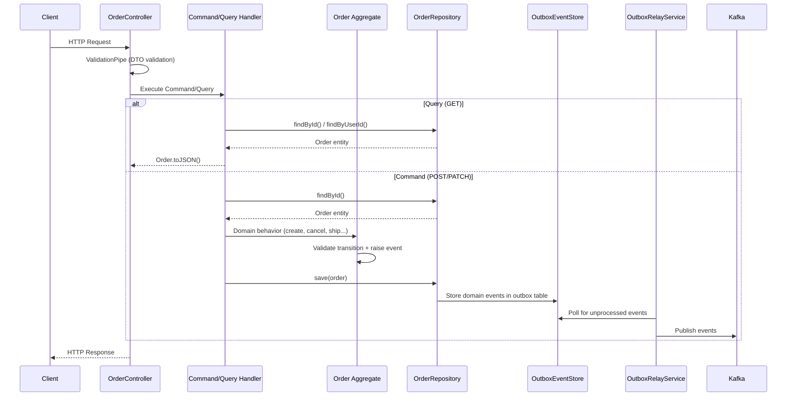

# Order API Flow

## Overview

The order-service exposes a RESTful API through `OrderController`. The controller is a **thin layer** that delegates all business logic to application-layer handlers following Clean Architecture principles.

**Request flow:**

```
HTTP Request → Controller → Command/Query → Handler → Domain Entity → Repository → Outbox → Kafka
```

All endpoints use:
- **ValidationPipe** with `whitelist: true` and `transform: true` (strips unknown fields, auto-transforms types)
- **DomainExceptionFilter** to convert domain errors into appropriate HTTP responses

---

## Request Flow Diagram



---

## Endpoints

### `POST /orders` — Create Order

Creates a new order from a list of items.

**Request Body:**

```json
{
  "userId": "user-123",
  "items": [
    {
      "productId": "prod-456",
      "productName": "Wireless Headphones",
      "quantity": 2,
      "unitPrice": 49.99,
      "currency": "USD"
    },
    {
      "productId": "prod-789",
      "productName": "USB-C Cable",
      "quantity": 1,
      "unitPrice": 12.99
    }
  ]
}
```

**Response (201 Created):**

```json
{
  "orderId": "a1b2c3d4-e5f6-7890-abcd-ef1234567890",
  "message": "Order created successfully"
}
```

**Flow:**
1. `CreateOrderDto` validated (userId required, items array with nested validation)
2. `CreateOrderHandler` calls `Order.create(props)`
3. Domain validates at least one item exists
4. Total price computed from items using integer-cents `Money`
5. `OrderCreatedEvent` raised
6. Order saved to DB, events stored in outbox
7. `order.created` eventually published to Kafka

**Errors:**
- `400` — Validation failure (missing fields, invalid types)
- `400` — Empty items array

---

### `GET /orders/:id` — Get Order by ID

Retrieves a single order by its UUID.

**Response (200 OK):**

```json
{
  "id": "a1b2c3d4-e5f6-7890-abcd-ef1234567890",
  "userId": "user-123",
  "items": [
    {
      "productId": "prod-456",
      "productName": "Wireless Headphones",
      "quantity": 2,
      "unitPrice": 49.99,
      "currency": "USD"
    }
  ],
  "status": "CREATED",
  "totalPrice": 99.98,
  "currency": "USD",
  "version": 1,
  "createdAt": "2026-03-16T07:00:00.000Z",
  "updatedAt": "2026-03-16T07:00:00.000Z"
}
```

**Flow:**
1. `GetOrderByIdHandler` calls `orderRepository.findById(id)`
2. Repository maps ORM entity → domain `Order`
3. Controller calls `order.toJSON()`

**Errors:**
- `404` — Order not found

---

### `GET /orders/user/:userId` — Get Orders by User

Retrieves all orders for a given user.

**Response (200 OK):**

```json
[
  {
    "id": "a1b2c3d4-...",
    "userId": "user-123",
    "status": "DELIVERED",
    "totalPrice": 99.98,
    "currency": "USD",
    "items": [...],
    "version": 5,
    "createdAt": "...",
    "updatedAt": "..."
  }
]
```

**Flow:**
1. `GetOrdersByUserHandler` calls `orderRepository.findByUserId(userId)`
2. Returns array of `order.toJSON()` responses

---

### `PATCH /orders/:id/ship` — Ship Order

Marks an order as shipped with a tracking number.

**Request Body:**

```json
{
  "trackingNumber": "TRK-2026-001234"
}
```

**Response (200 OK):**

```json
{
  "message": "Order a1b2c3d4-... shipped"
}
```

**Flow:**
1. `ShipOrderHandler` loads order from repository
2. Calls `order.ship(trackingNumber)` → validates transition from `CONFIRMED`
3. `OrderShippedEvent` raised with tracking number
4. Order saved, event published

**Errors:**
- `409` — Invalid status transition (e.g., shipping a `CREATED` order)
- `404` — Order not found

---

### `PATCH /orders/:id/deliver` — Deliver Order

Marks a shipped order as delivered.

**Response (200 OK):**

```json
{
  "message": "Order a1b2c3d4-... delivered"
}
```

**Flow:**
1. `DeliverOrderHandler` loads order from repository
2. Calls `order.deliver()` → validates transition from `SHIPPED`
3. `OrderCompletedEvent` raised
4. Order saved, event published

**Errors:**
- `409` — Invalid status transition (e.g., delivering a `PAID` order)

---

### `PATCH /orders/:id/cancel` — Cancel Order

Cancels an order with an optional reason.

**Request Body:**

```json
{
  "reason": "Customer requested cancellation"
}
```

**Response (200 OK):**

```json
{
  "message": "Order a1b2c3d4-... cancelled"
}
```

**Flow:**
1. `CancelOrderHandler` loads order from repository
2. Calls `order.cancel(reason)` → validates transition (allowed from `CREATED`, `PENDING_PAYMENT`, `CONFIRMED`)
3. `OrderCancelledEvent` raised with reason
4. Order saved, event published → downstream compensation triggered

**Errors:**
- `409` — Invalid status transition (e.g., cancelling a `DELIVERED` order)

---

### `PATCH /orders/:id/refund` — Refund Order

Refunds a paid or delivered order.

**Request Body:**

```json
{
  "reason": "Defective product"
}
```

**Response (200 OK):**

```json
{
  "message": "Order a1b2c3d4-... refunded"
}
```

**Flow:**
1. `RefundOrderHandler` loads order from repository
2. Calls `order.refund(reason)` → validates transition (allowed from `PAID`, `DELIVERED`)
3. `OrderRefundedEvent` raised with `refundAmountInCents`, `currency`, and `reason`
4. Order saved, event published

**Errors:**
- `409` — Invalid status transition (e.g., refunding a `CREATED` order)

---

## Validation

### DTO Validation (class-validator)

All request bodies are validated using `class-validator` decorators:

| DTO | Fields | Rules |
|-----|--------|-------|
| `CreateOrderDto` | `userId`, `items[]` | `@IsString()`, `@IsArray()`, `@ValidateNested()` |
| `CreateOrderItemDto` | `productId`, `productName`, `quantity`, `unitPrice`, `currency?` | `@IsString()`, `@IsNumber()`, `@Min(1)`, `@Min(0.01)`, `@IsOptional()` |
| `ShipOrderDto` | `trackingNumber` | `@IsString()` |
| `CancelOrderDto` | `reason?` | `@IsString()`, `@IsOptional()` |
| `RefundOrderDto` | `reason?` | `@IsString()`, `@IsOptional()` |

### Pipeline Configuration

```typescript
@UsePipes(new ValidationPipe({ whitelist: true, transform: true }))
```

- **whitelist** — Strips any properties not defined in the DTO
- **transform** — Auto-transforms plain objects to DTO class instances

---

## Error Handling

The `DomainExceptionFilter` catches domain-layer errors and converts them to HTTP responses:

| Domain Error | HTTP Status | Description |
|-------------|-------------|-------------|
| `InvalidOrderStatusTransitionError` | `409 Conflict` | Attempted an invalid state transition |
| `InvalidOrderOperationError` | `422 Unprocessable Entity` | Invalid operation (e.g., adding items to a non-CREATED order) |
| `DomainException` | `400 Bad Request` | Generic domain validation failure |

### Example Error Response

```json
{
  "statusCode": 409,
  "error": "InvalidOrderStatusTransitionError",
  "message": "Invalid order status transition: SHIPPED → CREATED",
  "timestamp": "2026-03-16T07:00:00.000Z"
```

---

## Additional Endpoints

| Method | Endpoint | Controller | Description |
|--------|----------|-----------|-------------|
| `GET` | `/health` | `HealthController` | Returns service health status |
| `GET` | `/metrics` | `MetricsController` | Prometheus metrics in text format |
