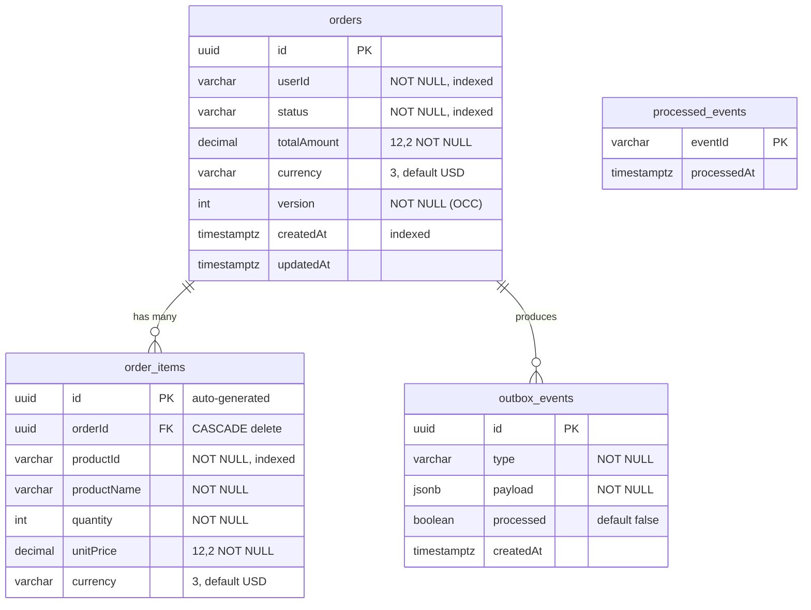
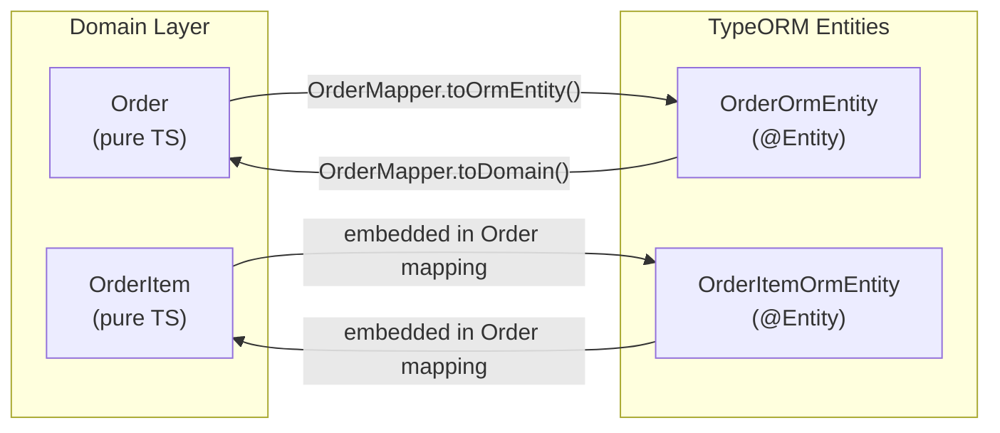
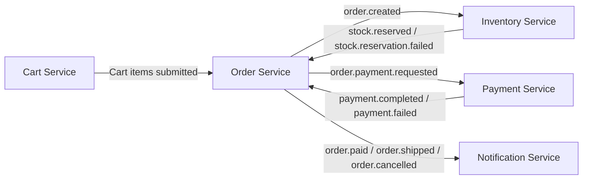

# Order Data Model

## Overview

The order-service data model follows **Domain-Driven Design** with a clear separation between the domain model (pure TypeScript) and the persistence model (TypeORM ORM entities). A mapper layer handles bidirectional conversion.

---

## Domain Model

### Order (Aggregate Root)

The `Order` class is the aggregate root that encapsulates all order business logic.

| Property | Type | Description |
|----------|------|-------------|
| `_id` | `OrderId` | Unique identifier (UUID) |
| `_userId` | `UserId` | Customer who placed the order |
| `_items` | `OrderItem[]` | Line items in the order |
| `_status` | `OrderStatus` | Current lifecycle state |
| `_totalPrice` | `Money` | Computed total (integer cents internally) |
| `_version` | `number` | Optimistic concurrency version |
| `_createdAt` | `Date` | Creation timestamp |
| `_updatedAt` | `Date` | Last modification timestamp |
| `_domainEvents` | `BaseDomainEvent[]` | Uncommitted domain events |

**Factory Methods:**
- `Order.create(props)` — Creates a new order with items, computes total, raises `OrderCreatedEvent`
- `Order.reconstitute(props)` — Rebuilds from persistence (no events raised)

**Domain Behaviors:**
- `requestPayment()` → `PENDING_PAYMENT` + `OrderPaymentRequestedEvent`
- `confirmPayment(paymentId)` → `PAID` + `OrderPaidEvent`
- `confirm()` → `CONFIRMED` + `OrderConfirmedEvent`
- `cancel(reason)` → `CANCELLED` + `OrderCancelledEvent`
- `ship(trackingNumber)` → `SHIPPED` + `OrderShippedEvent`
- `deliver()` → `DELIVERED` + `OrderCompletedEvent`
- `refund(reason)` → `REFUNDED` + `OrderRefundedEvent`
- `addItem(item)` / `removeItem(productId)` — Modify items (only in `CREATED` status)

### OrderItem (Entity)

| Property | Type | Description |
|----------|------|-------------|
| `_id` | `string` | UUID (auto-generated) |
| `_productId` | `string` | Product reference |
| `_productName` | `string` | Product display name |
| `_quantity` | `number` | Quantity ordered (≥ 1) |
| `_unitPrice` | `Money` | Price per unit |

**Computed:** `totalPrice` = `unitPrice × quantity`

### Value Objects

| Value Object | Internal Type | Description |
|-------------|---------------|-------------|
| `OrderId` | `string` (UUID) | Wraps order identifier with validation |
| `UserId` | `string` | Wraps user identifier |
| `Money` | `{ amountInCents: number, currency: string }` | Integer-cents representation to avoid floating-point issues. Factory: `Money.fromDecimal(49.99, 'USD')` → stores as `4999` cents |
| `OrderStatus` | `OrderStatusEnum` | Enforces state machine transitions via `VALID_TRANSITIONS` map |

---

## Entity Relationship Diagram

---

## Database Schema

### `orders` Table

| Column | Type | Constraint | Index |
|--------|------|-----------|-------|
| `id` | `uuid` | PK | ✅ |
| `userId` | `varchar(255)` | NOT NULL | ✅ |
| `status` | `varchar(50)` | NOT NULL | ✅ |
| `totalAmount` | `decimal(12,2)` | NOT NULL | |
| `currency` | `varchar(3)` | DEFAULT `'USD'` | |
| `version` | `integer` | NOT NULL | |
| `createdAt` | `timestamptz` | AUTO | ✅ |
| `updatedAt` | `timestamptz` | AUTO | |

**Composite Index:** `(userId, status)` — optimizes "get orders by user filtered by status"

### `order_items` Table

| Column | Type | Constraint | Index |
|--------|------|-----------|-------|
| `id` | `uuid` | PK (auto) | ✅ |
| `orderId` | `uuid` | FK → orders.id | ✅ |
| `productId` | `varchar(255)` | NOT NULL | ✅ |
| `productName` | `varchar(255)` | NOT NULL | |
| `quantity` | `integer` | NOT NULL | |
| `unitPrice` | `decimal(12,2)` | NOT NULL | |
| `currency` | `varchar(3)` | DEFAULT `'USD'` | |

**ON DELETE CASCADE:** Deleting an order cascades to its items.

### `outbox_events` Table

| Column | Type | Constraint |
|--------|------|-----------|
| `id` | `uuid` | PK |
| `type` | `varchar(100)` | NOT NULL |
| `payload` | `jsonb` | NOT NULL |
| `processed` | `boolean` | DEFAULT `false` |
| `createdAt` | `timestamptz` | AUTO |

### `processed_events` Table

| Column | Type | Constraint |
|--------|------|-----------|
| `eventId` | `varchar` | PK |
| `processedAt` | `timestamptz` | AUTO |

---

## Domain ↔ ORM Mapping

The mapper layer converts between the domain model and TypeORM entities:

**Key mapping details:**
- `Money.amountInCents` (domain) ↔ `decimal(12,2)` (DB) — mapper converts cents to decimal and back
- `OrderId.value` (domain) ↔ `uuid` (DB)
- `OrderStatus.value` (enum string) ↔ `varchar(50)` (DB)

---

## Order Statuses

| Status | Description | Can Transition To |
|--------|-------------|------------------|
| `CREATED` | Initial state after order placement | `PENDING_PAYMENT`, `CANCELLED` |
| `PENDING_PAYMENT` | Inventory reserved, awaiting payment | `PAID`, `CANCELLED` |
| `PAID` | Payment confirmed | `CONFIRMED`, `REFUNDED` |
| `CONFIRMED` | Ready for fulfillment | `SHIPPED`, `CANCELLED` |
| `SHIPPED` | Dispatched to customer | `DELIVERED` |
| `DELIVERED` | Received by customer | `REFUNDED` |
| `CANCELLED` | Terminal — order cancelled | _(none)_ |
| `REFUNDED` | Terminal — full refund | _(none)_ |

---

## Optimistic Concurrency Control

The `orders.version` column uses TypeORM's `@VersionColumn()`:

1. Every UPDATE includes `WHERE version = current_version`
2. Version auto-increments on each update
3. Throws `OptimisticLockVersionMismatchError` if another transaction modified the row

---

## Relationships with Other Services

The order-service does **not** share databases with other services. All cross-service communication is via Kafka events:

| Service | Relationship | Communication |
|---------|-------------|---------------|
| **Cart Service** | Cart items become order items at checkout | API call or event |
| **Inventory Service** | Reserves stock on order creation, releases on cancellation | Kafka events (bidirectional) |
| **Payment Service** | Processes payment after inventory reservation | Kafka events (bidirectional) |
| **Notification Service** | Sends notifications on order status changes | Kafka events (order → notification) |
