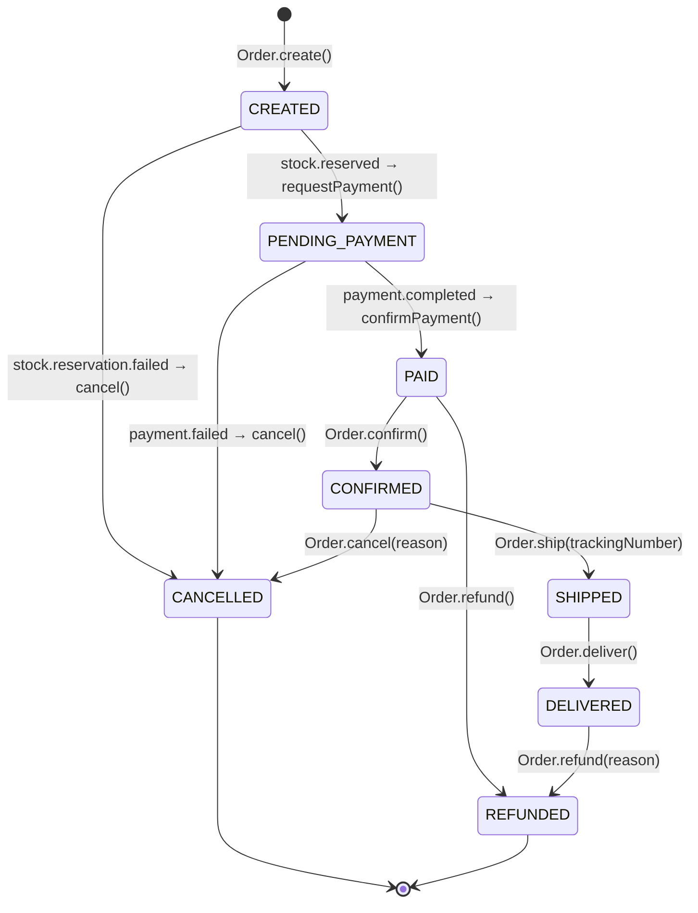
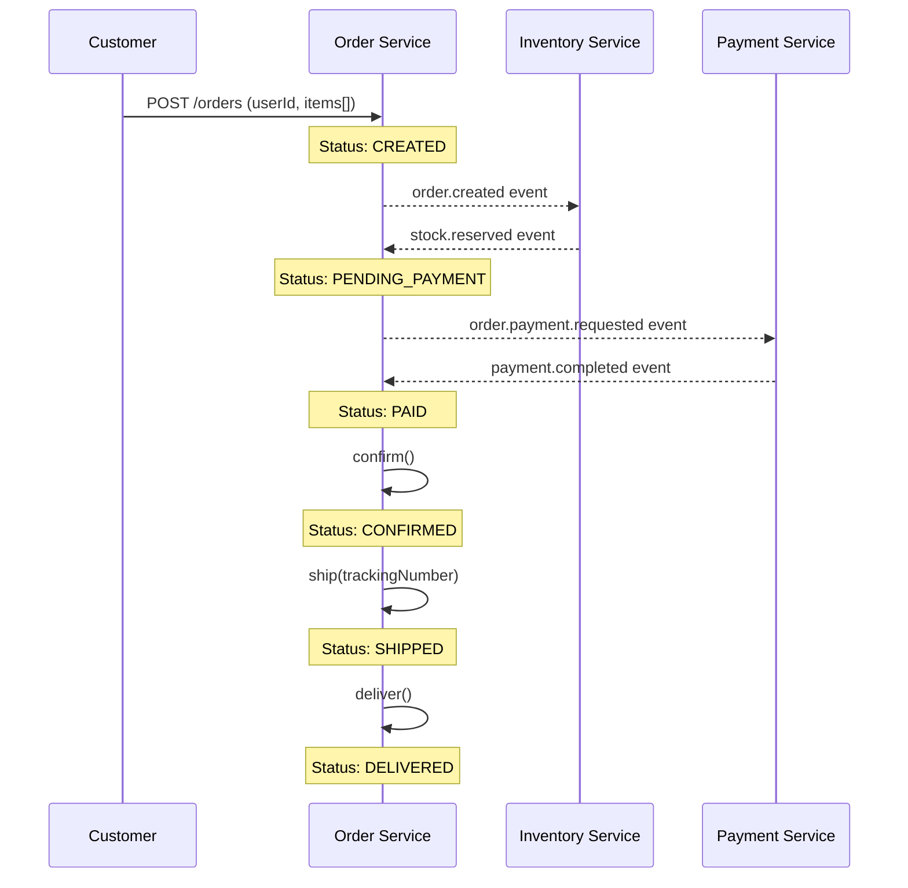

# Order Lifecycle

## Overview

The order-service manages the complete lifecycle of an order through a strict state machine. The `OrderStatus` value object enforces valid transitions — any invalid transition throws an `InvalidOrderStatusTransitionError`.

---

## Order Statuses

| Status | Description | Terminal |
|--------|-------------|---------|
| `CREATED` | Order placed by customer, awaiting inventory reservation | No |
| `PENDING_PAYMENT` | Inventory successfully reserved, payment request sent | No |
| `PAID` | Payment confirmed by payment-service | No |
| `CONFIRMED` | Order confirmed and ready for fulfillment | No |
| `SHIPPED` | Order dispatched with a tracking number | No |
| `DELIVERED` | Order received by customer | No |
| `CANCELLED` | Order cancelled — compensation flows triggered | Yes |
| `REFUNDED` | Full refund issued to customer | Yes |

---

## State Transition Diagram



---

## Valid Transitions Map

This table mirrors the `VALID_TRANSITIONS` map defined in `order-status.vo.ts`:

| From Status | Allowed Transitions |
|-------------|-------------------|
| `CREATED` | `PENDING_PAYMENT`, `CANCELLED` |
| `PENDING_PAYMENT` | `PAID`, `CANCELLED` |
| `PAID` | `CONFIRMED`, `REFUNDED` |
| `CONFIRMED` | `SHIPPED`, `CANCELLED` |
| `SHIPPED` | `DELIVERED` |
| `DELIVERED` | `REFUNDED` |
| `CANCELLED` | _(terminal — no transitions)_ |
| `REFUNDED` | _(terminal — no transitions)_ |

---

## Transition Rules

1. **Enforcement** — `OrderStatus.canTransitionTo(target)` checks the `VALID_TRANSITIONS` map before any status change
2. **Immutability** — `transitionTo()` returns a **new** `OrderStatus` instance (value object pattern)
3. **Error on invalid** — Invalid transitions throw `InvalidOrderStatusTransitionError` with a message like `Invalid order status transition: SHIPPED → CREATED`
4. **Terminal detection** — `isTerminal()` returns `true` for `CANCELLED` and `REFUNDED`

---

## Happy Path Flow

The ideal order lifecycle from creation to delivery:



**Step-by-step:**

1. **Customer creates order** → `Order.create()` produces `OrderCreatedEvent`, status = `CREATED`
2. **Inventory service reserves stock** → `stock.reserved` consumed → `Order.requestPayment()`, status = `PENDING_PAYMENT`
3. **Payment service processes payment** → `payment.completed` consumed → `Order.confirmPayment(paymentId)`, status = `PAID`
4. **Admin/system confirms order** → `Order.confirm()`, status = `CONFIRMED`
5. **Warehouse ships order** → `Order.ship(trackingNumber)`, status = `SHIPPED`
6. **Customer receives order** → `Order.deliver()`, status = `DELIVERED`

---

## Failure & Compensation Paths

### Inventory Reservation Failure

```
CREATED → CANCELLED
```

- **Trigger:** `stock.reservation.failed` event consumed by `InventoryEventConsumer`
- **Action:** `CancelOrderHandler` calls `Order.cancel()` with reason
- **Result:** `OrderCancelledEvent` published — no compensation needed (nothing to undo)

### Payment Failure

```
PENDING_PAYMENT → CANCELLED
```

- **Trigger:** `payment.failed` event consumed by `PaymentEventConsumer`
- **Action:** `CancelOrderHandler` calls `Order.cancel()` with reason
- **Result:** `OrderCancelledEvent` published → Inventory service listens and releases reserved stock

### Manual Cancellation

```
CREATED → CANCELLED
PENDING_PAYMENT → CANCELLED
CONFIRMED → CANCELLED
```

- **Trigger:** `PATCH /orders/:id/cancel` API call
- **Action:** `CancelOrderHandler` calls `Order.cancel(reason)`
- **Result:** `OrderCancelledEvent` published → downstream services compensate

### Refund

```
PAID → REFUNDED
DELIVERED → REFUNDED
```

- **Trigger:** `PATCH /orders/:id/refund` API call
- **Action:** `RefundOrderHandler` calls `Order.refund(reason)`
- **Result:** `OrderRefundedEvent` published with `refundAmountInCents` and `currency`

---

## Domain Events per Transition

| Transition | Domain Event | Key Payload |
|-----------|-------------|-------------|
| → `CREATED` | `OrderCreatedEvent` | orderId, userId, items[], totalPrice, currency |
| → `PENDING_PAYMENT` | `OrderPaymentRequestedEvent` | orderId, totalPrice, currency, userId |
| → `PAID` | `OrderPaidEvent` | orderId, paymentId |
| → `CONFIRMED` | `OrderConfirmedEvent` | orderId |
| → `SHIPPED` | `OrderShippedEvent` | orderId, trackingNumber |
| → `DELIVERED` | `OrderCompletedEvent` | orderId |
| → `CANCELLED` | `OrderCancelledEvent` | orderId, reason |
| → `REFUNDED` | `OrderRefundedEvent` | orderId, refundAmountInCents, currency, reason |
