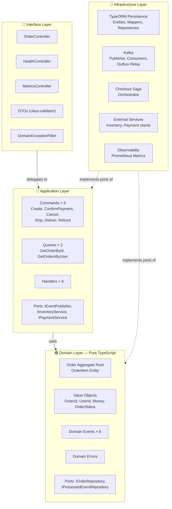
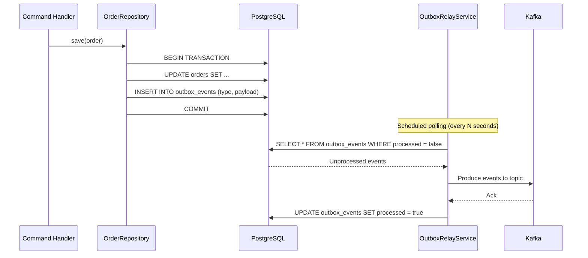

# Order Service Architecture

## Overview

The Order Service is a production-grade NestJS microservice built with **DDD + Clean Architecture**, **CQRS**, **Event-Driven Architecture**, and the **Saga pattern**. It manages the complete order lifecycle in a distributed ecommerce system.

## Layer Architecture



### Dependency Rule
- **Domain** → (no imports from other layers — zero `@nestjs` dependencies)
- **Application** → Domain only
- **Infrastructure** → Domain + Application (implements port interfaces)
- **Interface** → Application only

### Zero Framework Coupling in Domain
The `domain/` layer has **zero `@nestjs` imports**. It is pure TypeScript, fully testable without any framework bootstrap.

## Component Architecture

```mermaid
graph TB
    subgraph OrderModule["OrderModule (DI Container)"]
        direction TB

        subgraph Controllers["Controllers"]
            OrdCtrl["OrderController<br/>7 REST endpoints"]
            HlthCtrl["HealthController<br/>GET /health"]
            MetCtrl["MetricsController<br/>GET /metrics"]
        end

        subgraph Handlers["CQRS Handlers"]
            CreateH["CreateOrderHandler"]
            ConfirmH["ConfirmPaymentHandler"]
            CancelH["CancelOrderHandler"]
            ShipH["ShipOrderHandler"]
            DeliverH["DeliverOrderHandler"]
            RefundH["RefundOrderHandler"]
            GetByIdH["GetOrderByIdHandler"]
            GetByUserH["GetOrdersByUserHandler"]
        end

        subgraph Infra["Infrastructure Services"]
            TypeORMRepo["TypeOrmOrderRepository"]
            ProcEvtRepo["TypeOrmProcessedEventRepository"]
            KafkaPub["KafkaEventPublisher"]
            OutboxRelay["OutboxRelayService<br/>(scheduled)"]
            PayConsum["PaymentEventConsumer"]
            InvConsum["InventoryEventConsumer"]
            SagaOrch["CheckoutSagaOrchestrator"]
            KafkaInv["KafkaInventoryService"]
            KafkaPay["KafkaPaymentService"]
            Metrics["OrderMetricsService"]
        end
    end

    OrdCtrl --> CreateH & ConfirmH & CancelH & ShipH & DeliverH & RefundH & GetByIdH & GetByUserH
    CreateH & CancelH & ShipH --> TypeORMRepo
    CreateH & CancelH --> KafkaPub
    SagaOrch --> KafkaInv & KafkaPay
```



## Directory Structure

```
src/
├── domain/                          # Pure business logic
│   ├── entities/                    # Order (aggregate root), OrderItem
│   ├── value-objects/               # OrderId, UserId, Money, OrderStatus
│   ├── events/                      # 8 domain events + base class
│   ├── errors/                      # DomainException hierarchy
│   └── ports/                       # IOrderRepository, IProcessedEventRepository
├── application/                     # Use case orchestration
│   ├── commands/                    # 6 command DTOs
│   ├── queries/                     # 2 query DTOs
│   ├── handlers/                    # 8 handlers (6 command + 2 query)
│   └── ports/                       # IEventPublisher, IInventoryService, IPaymentService
├── infrastructure/                  # Technical implementations
│   ├── persistence/
│   │   ├── entities/                # TypeORM ORM entities
│   │   ├── mappers/                 # Domain ↔ ORM mappers
│   │   └── repositories/           # Port implementations
│   ├── kafka/
│   │   ├── consumers/               # Payment & Inventory event consumers
│   │   ├── saga/                    # CheckoutSagaOrchestrator
│   │   ├── kafka-event-publisher.ts # Outbox-based event publishing
│   │   └── outbox-relay.service.ts  # Polls outbox → Kafka
│   ├── external-services/           # Kafka command publishers
│   └── observability/               # Prometheus metrics
└── interfaces/                      # HTTP interface
    ├── controllers/                 # OrderController, HealthController
    ├── dto/                         # Request validation DTOs
    ├── filters/                     # DomainExceptionFilter
    └── order.module.ts              # Module wiring
```

## Event Publishing (Transactional Outbox)

Events are published using the **transactional outbox pattern** for exactly-once delivery:



**Why outbox?** The domain event and the order mutation are part of the same database transaction. If the transaction rolls back, no event is published. The `OutboxRelayService` later polls and publishes, ensuring no events are lost.

## Key Design Decisions

| Decision | Choice | Rationale |
|----------|--------|-----------|
| Aggregate pattern | Private fields + static factories | Explicit control, matches inventory-service |
| Injection tokens | `Symbol()` | Collision-free, matches established convention |
| Money representation | Integer cents (domain) ↔ decimal (DB) | Avoids floating-point precision issues |
| Event publishing | Transactional outbox | Exactly-once semantics |
| Idempotency | `processed_events` table | Proven pattern from inventory-service |
| Saga state | Implicit via Order status | Simpler than external saga state table |
| CQRS dispatch | Direct handler injection | Less NestJS coupling than CommandBus |
