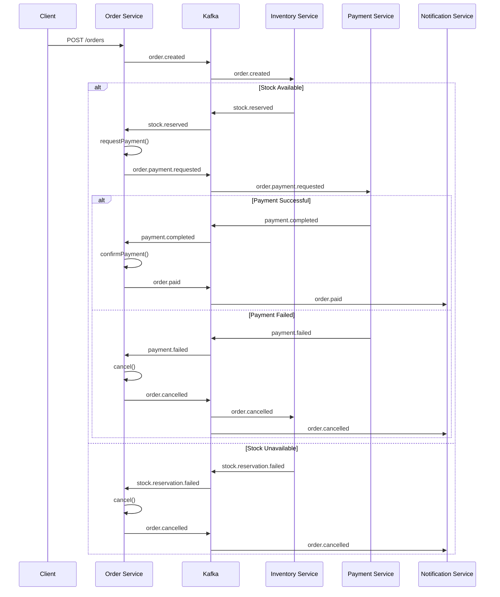

# Order Service Events

## Overview

All domain events extend `BaseDomainEvent` and are published via the **transactional outbox pattern** to the `order.events` Kafka topic. Consumed events from other services arrive on `payment.events` and `inventory.events` topics.

---

## Domain Events Published

| Event | Trigger | Kafka Topic |
|-------|---------|-------------|
| `order.created` | `Order.create()` | `order.events` |
| `order.payment.requested` | `Order.requestPayment()` | `order.events` |
| `order.paid` | `Order.confirmPayment()` | `order.events` |
| `order.confirmed` | `Order.confirm()` | `order.events` |
| `order.cancelled` | `Order.cancel()` | `order.events` |
| `order.shipped` | `Order.ship()` | `order.events` |
| `order.completed` | `Order.deliver()` | `order.events` |
| `order.refunded` | `Order.refund()` | `order.events` |

---

## Event Payload Structures

### `order.created`

```json
{
  "eventId": "uuid",
  "eventType": "order.created",
  "occurredAt": "2026-03-16T07:00:00.000Z",
  "orderId": "a1b2c3d4-e5f6-7890-abcd-ef1234567890",
  "userId": "user-123",
  "items": [
    {
      "productId": "prod-456",
      "productName": "Wireless Headphones",
      "quantity": 2,
      "unitPrice": 49.99
    }
  ],
  "totalPrice": 99.98,
  "currency": "USD"
}
```

### `order.payment.requested`

```json
{
  "eventId": "uuid",
  "eventType": "order.payment.requested",
  "occurredAt": "...",
  "orderId": "a1b2c3d4-...",
  "totalPrice": 99.98,
  "currency": "USD",
  "userId": "user-123"
}
```

### `order.paid`

```json
{
  "eventId": "uuid",
  "eventType": "order.paid",
  "occurredAt": "...",
  "orderId": "a1b2c3d4-...",
  "paymentId": "pay-789"
}
```

### `order.confirmed`

```json
{
  "eventId": "uuid",
  "eventType": "order.confirmed",
  "occurredAt": "...",
  "orderId": "a1b2c3d4-..."
}
```

### `order.cancelled`

```json
{
  "eventId": "uuid",
  "eventType": "order.cancelled",
  "occurredAt": "...",
  "orderId": "a1b2c3d4-...",
  "reason": "Payment failed"
}
```

### `order.shipped`

```json
{
  "eventId": "uuid",
  "eventType": "order.shipped",
  "occurredAt": "...",
  "orderId": "a1b2c3d4-...",
  "trackingNumber": "TRK-2026-001234"
}
```

### `order.completed`

```json
{
  "eventId": "uuid",
  "eventType": "order.completed",
  "occurredAt": "...",
  "orderId": "a1b2c3d4-..."
}
```

### `order.refunded`

```json
{
  "eventId": "uuid",
  "eventType": "order.refunded",
  "occurredAt": "...",
  "orderId": "a1b2c3d4-...",
  "refundAmountInCents": 9998,
  "currency": "USD",
  "reason": "Defective product"
}
```

---

## Events Consumed

| Topic | Event Type | Consumer | Action |
|-------|-----------|----------|--------|
| `payment.events` | `payment.completed` | `PaymentEventConsumer` | `ConfirmPaymentHandler` → `Order.confirmPayment()` |
| `payment.events` | `payment.failed` | `PaymentEventConsumer` | `CancelOrderHandler` → `Order.cancel()` |
| `inventory.events` | `stock.reserved` | `InventoryEventConsumer` | `SagaOrchestrator` → `Order.requestPayment()` |
| `inventory.events` | `stock.reservation.failed` | `InventoryEventConsumer` | `CancelOrderHandler` → `Order.cancel()` |

All consumed events are processed **idempotently** using the `processed_events` table.

---

## Event Flow Diagram



---

## Consumer Services

| Event | Consumed By | Purpose |
|-------|-----------|---------|
| `order.created` | **Inventory Service** | Reserve stock for the order items |
| `order.payment.requested` | **Payment Service** | Initiate payment processing |
| `order.paid` | **Notification Service** | Send payment confirmation notification |
| `order.confirmed` | **Notification Service** | Send order confirmation notification |
| `order.shipped` | **Notification Service** | Send shipping notification with tracking |
| `order.cancelled` | **Inventory Service**, **Notification Service** | Release reserved stock, send cancellation notification |
| `order.completed` | **Notification Service** | Send delivery confirmation notification |
| `order.refunded` | **Payment Service**, **Notification Service** | Process refund, send refund notification |
