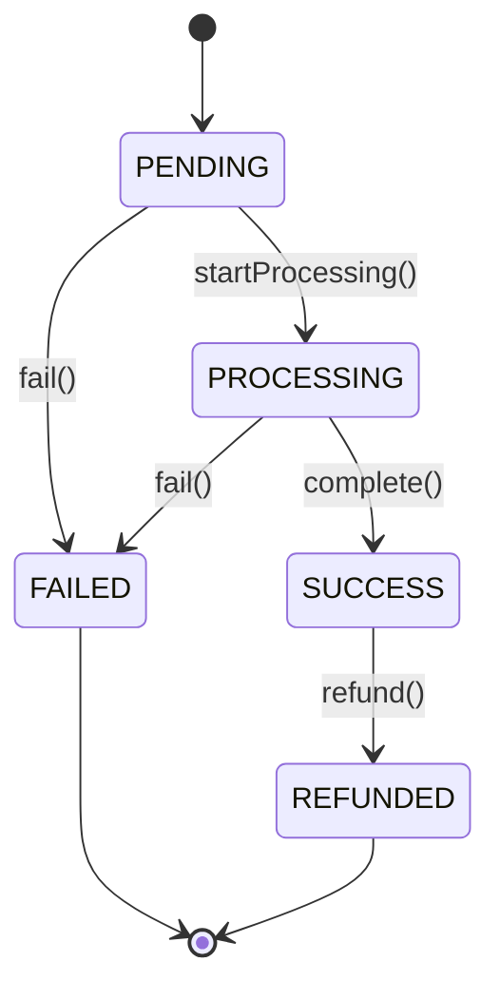

# Payment Lifecycle

The `payment-service` is responsible for tracking the exact state of a given payment request over its lifetime. It achieves this utilizing the `PaymentStatus` domain value object which behaves identically to a Finite State Machine (FSM).

## States

Payments exist in one of the following states:

1. **PENDING**: The initial state when a payment request is registered via CQRS (e.g., `ProcessPaymentCommand`).
2. **PROCESSING**: The state active while an asynchronous or synchronous check is being made against the external `PaymentProvider`.
3. **SUCCESS**: A terminal (successful) state acquired after the Gateway responds with a positive result (e.g., successful API payload or valid transaction id).
4. **FAILED**: A terminal (unsuccessful) state. This state is triggered when there are network timeouts with the Gateway, validation errors, or outright Gateway rejections (e.g., NSF).
5. **REFUNDED**: A terminal state arrived at exclusively from the `SUCCESS` state, when an external caller has successfully reversed the payment.

## Lifecycle Transition Rules

## Internal Invariants
Attempting an invalid transition (such as moving backwards from `FAILED` to `PROCESSING`, or from `SUCCESS` to `PENDING`) will immediately throw an `InvalidPaymentStatusTransitionError`. All downstream components can assume if a payment is marked `SUCCESS`, it actually transitioned there securely.
