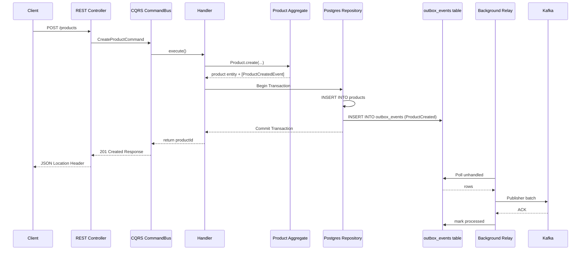

# Product API Request Flow

## The Journey of a Request

The system uses Command Query Responsibility Segregation (CQRS) and an event-driven architecture to keep APIs scalable and robust.

### 1. Read Operations (Queries)

Read requests, like getting a specific product or listing products, execute with a heavy reliance on caching to minimize database hits.

**Flow (e.g. `GET /products/:id`):**
1. **Controller**: The `ProductController` receives the HTTP GET request.
2. **DTO / Validation**: Path parameters are validated (UUID checking).
3. **Query Handler**: The request is mapped into a `GetProductByIdQuery` class and dispatched.
4. **Cache Lookup (Cache-Aside Strategy)**:
    - Attempt a fast cache hit in **Redis**.
    - If hit: Return JSON directly.
    - If miss: Retrieve full `Product` aggregate from `TypeORM Repository` (PostgreSQL), populate Redis with a 1-hour TTL, and return.

---

### 2. Write Operations (Commands)

Write requests, like creating or updating products, must validate rules carefully, commit securely, and broadcast their effects asynchronously.

**Flow (e.g. `POST /products`):**
1. **Controller**: The `ProductController` accepts the payload.
2. **Validation Pipe**: NestJS `ValidationPipe` strictly checks the `CreateProductDto` (ensuring strings, integers for price, whitelist, etc.).
3. **Command Execution**: The DTO maps to a `CreateProductCommand`, executing the `CreateProductHandler`.
4. **Domain Instantiation**: The `Product.create()` factory method runs, asserting all invariants (e.g., price >= 0) and setting up `ProductCreatedEvent`.
5. **Infrastructure Transaction**:
    - The repository uses a database transaction.
    - The `ProductOrmEntity` is written to `products`.
    - Simultaneously, the extracted domain events are serialized and written into the `outbox_events` table within the same transaction unit of work.
    - Redis caches for lists or updated products are invalidated.
6. **Background Publishing**: The `OutboxRelayService` polls every second, picking up un-published rows and robustly pushing them to Apache Kafka without HTTP bottlenecks.

---

