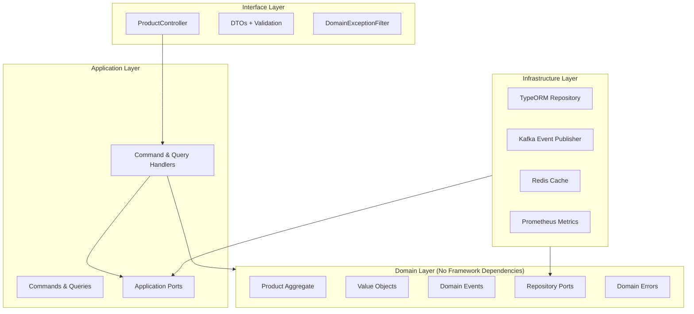
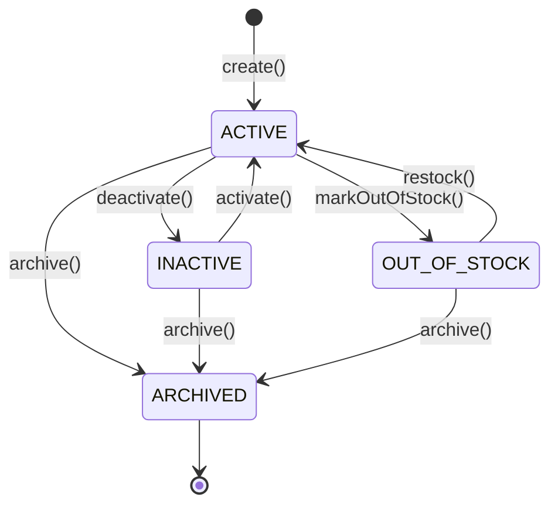

# Product Service Architecture

## Overview
The product-service manages the product catalog for the ecommerce platform. It handles product creation, updates, status management, deletion, and provides paginated queries with filtering and sorting.

## Layered Architecture (DDD + Clean Architecture)

## Domain Model

### Product Aggregate
- **ProductId** — UUID value object
- **Money** — Amount in cents + currency (avoids floating-point issues)
- **ProductStatus** — State machine with valid transitions

### Status State Machine

## Caching Strategy
- **Pattern**: Cache-aside (lazy loading)
- **Scope**: Individual product lookups only (NOT paginated queries)
- **TTL**: 1 hour (3600 seconds)
- **Degradation**: Graceful — Redis failures never fail requests, falls through to PostgreSQL
- **Invalidation**: On every write operation (update, delete, status change)

## Technology Stack
| Component | Technology |
|-----------|-----------|
| Framework | NestJS |
| Language | TypeScript |
| Database | PostgreSQL |
| Cache | Redis (ioredis) |
| Messaging | Apache Kafka (kafkajs) |
| ORM | TypeORM |
| Metrics | Prometheus (prom-client) |
