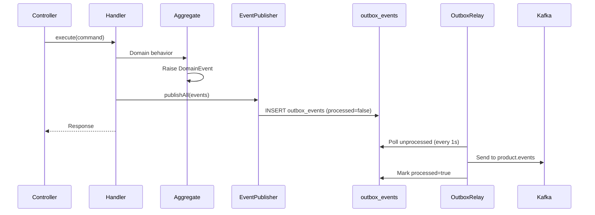

# Product Service Events

## Published Events

All product events are published to the `product.events` Kafka topic.

| Event Type | Trigger | Key Fields |
|---|---|---|
| `product.created` | Product created | productId, name, price, currency, categoryId, status |
| `product.updated` | Product details or status changed | productId, name, price, currency, categoryId, status |
| `product.deleted` | Product deleted | productId |
| `product.stock.updated` | Stock status changed (markOutOfStock/restock) | productId, status |

## Event Publishing Mechanism

## Transactional Outbox Pattern
Events are NOT published directly to Kafka. Instead:
1. Domain events are written to the `outbox_events` table in the same DB transaction as the domain state change
2. A cron-based relay service polls the outbox every second
3. Unprocessed events are batch-published to Kafka (up to 50 per poll)
4. Events are marked as processed after successful publish
5. Failed publishes are retried on the next poll

## Consumers
| Service | Events Consumed | Purpose |
|---|---|---|
| search-service | product.created, product.updated, product.deleted | Update search index |
