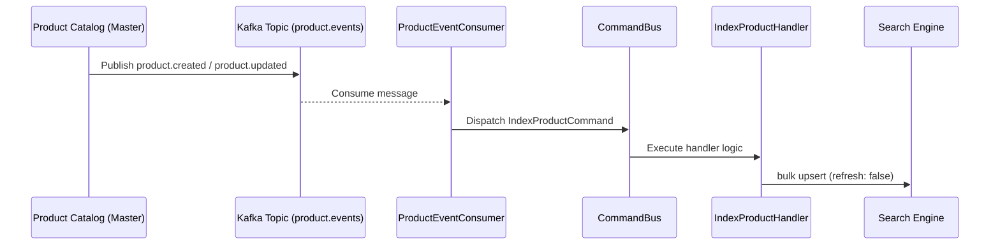

# Search Indexing Flow

## Event-Based Indexing Strategy
The search service relies on an asynchronous, event-driven architecture to keep its index synchronized with the master product catalog.

Instead of the product service invoking an HTTP endpoint on the search service (which creates tight coupling and potential bottlenecks), the product service publishes domain events to an event broker (Kafka). The search service subscribes to these events and updates its local search-optimized read model independently.

## Data Flow

1. **Publication**: The source of truth (e.g., product service) emits lifecycle events such as `product.created`, `product.updated`, or `product.deleted`.
2. **Consumption**: The `ProductEventConsumer` inside the search service's infrastructure layer actively listens to the `product.events` topic.
3. **Dispatch**: The consumer maps the raw Kafka event payload into a formally defined CQRS command (e.g., `IndexProductCommand` or `RemoveProductCommand`) and dispatches it.
4. **Execution**: The command handler converts the payload into the `SearchDocument` domain entity and instructs the `ISearchIndexPort` to persist the changes.
5. **Persistence**: The adapter implements the port, converting exactly to the search engine DSL and performing the write. Writes generally use `refresh: false` to favor bulk ingestion performance over immediate consistency.

## Zero-Downtime Reindexing
Occasionally, changes in mappings require a full reindex. This is handled using the **Alias Rotation** pattern:
1. A new versioned index (e.g., `products_v2`) is created alongside the active index (`products_v1`).
2. Documents are bulk-inserted into the new versioned index.
3. Once complete, the search alias (`products`) is atomically swapped to point to the new index.
4. The old index is deleted.

Search requests only ever target the `products` alias, remaining utterly unaware of the underlying rotation.
