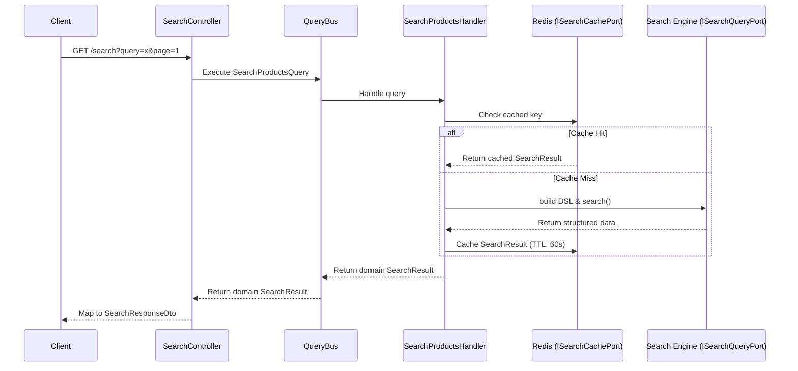

# Search Query Flow

## Overview
How search requests are processed from user input to returned search results.

## Data Flow

## Step-by-step Processing
1. **Request Validation**: The client sends an HTTP GET request to `/search` with parameters (search terms, filters, pagination). The `SearchController` utilizes `class-validator` DTOs to validate the payload instantly.
2. **Query Dispatch**: The controller constructs a `SearchProductsQuery` application request, mapping raw fields into domain primitives, and fires it down the `QueryBus`.
3. **Cache-First Check**: The handler receives the query. It injects an `ISearchCachePort` to generate a deterministic cache key (using the `djb2` hash of the normalized query constraints). It queries Redis for an existing result snippet.
   - *Cache Hit*: It skips the expensive search engine transaction entirely and returns immediately.
4. **Engine Query**: If absent in cache, the handler asks the `ISearchQueryPort` to fetch data. The port adapter uses the `QueryBuilder` helper.
5. **DSL Translation**: The `QueryBuilder` parses domain intent:
    - Adds `multi_match` clauses targeting explicit document fields and shingle sub-fields for partial matches.
    - Appends `bool.filter` segments for strict faceting requirements without altering match scoring.
    - Determines if it should use `from/size` standard pagination or specialized `search_after` cursors for deep pages.
6. **Execution & Mapping**: The search engine responds with matching hits. The adapter maps the raw proprietary hits back into standard `SearchDocument` entities and wraps them in a `SearchResult`.
7. **Cache Populate & Return**: The handler stores the `SearchResult` into Redis with a defined TTL (typically 60s for standard requests, 300s for autocomplete suggestions). The result bubbles back through the controller to the client.
