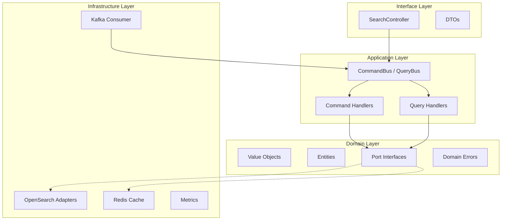

# Search Service Architecture

## Overview

The search service is a **read-side** microservice in a CQRS-based e-commerce platform. It maintains a searchable projection of product data by consuming events from the `product-service` via Kafka and indexing them into OpenSearch.

## Technology Stack

| Component | Technology | Purpose |
|-----------|-----------|---------|
| Runtime | NestJS 11 | Framework |
| Search Engine | OpenSearch 2.x | Full-text search, suggestions |
| Message Broker | Kafka (KafkaJS) | Event consumption |
| Cache | Redis (ioredis) | Query result caching |
| CQRS | @nestjs/cqrs | Command/Query separation |
| Metrics | prom-client | Prometheus observability |

## 4-Layer Architecture

### Domain Layer (`src/domain/`)
- **Framework-free** — zero `@nestjs` imports
- Value Objects: `SearchQuery`, `SearchFilter`, `SearchSort`, `Pagination`
- Entities: `SearchDocument` (read model), `SearchResult` (paginated response)
- Ports: `ISearchIndexPort`, `ISearchQueryPort`, `ISearchCachePort` (Symbol-based DI tokens)
- Errors: `SearchException`, `InvalidSearchQueryError`, `IndexNotFoundError`

### Application Layer (`src/application/`)
- Commands: `IndexProductCommand`, `RemoveProductCommand`, `RebuildIndexCommand`
- Queries: `SearchProductsQuery`, `GetSuggestionsQuery`, `GetProductByIdQuery`
- Handlers inject ports only — never infrastructure directly

### Infrastructure Layer (`src/infrastructure/`)
- **OpenSearch**: Index adapter (bulk write, refresh:false), query adapter (multi_match, suggest), index management (alias rotation)
- **Kafka**: Product event consumer dispatching CQRS commands
- **Cache**: Redis adapter with graceful degradation
- **Metrics**: Prometheus counters and histograms

### Interface Layer (`src/interfaces/`)
- Thin controller delegating to CommandBus/QueryBus
- DTOs with class-validator decorators

## Caching Strategy

| Endpoint | TTL | Key Strategy |
|----------|-----|-------------|
| Search queries | 60s | djb2 hash of normalized query params |
| Suggestions | 300s | `suggest:{prefix}:{limit}` |

Redis is optional — if unavailable, the service degrades gracefully (cache miss behavior).

## Performance Targets

| Metric | Target |
|--------|--------|
| Search latency (p95) | < 100ms |
| Suggestion latency (p95) | < 50ms |
| Index throughput (bulk) | 1000 docs/batch |
