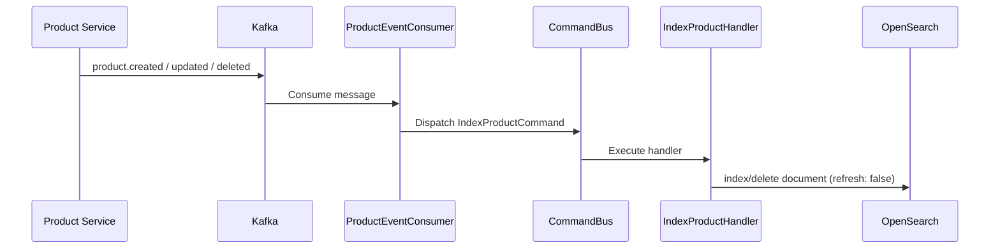

# Search Service — Indexing Pipeline

## Event-Driven Indexing Flow



## Consumed Events

| Event Type | Kafka Topic | Action |
|-----------|-------------|--------|
| `product.created` / `ProductCreated` | `product.events` | Index document |
| `product.updated` / `ProductUpdated` | `product.events` | Upsert document |
| `product.deleted` / `ProductDeleted` | `product.events` | Remove document |

Both legacy (`ProductCreated`) and new (`product.created`) event type formats are supported.

## Index Mapping

```json
{
  "id":          { "type": "keyword" },
  "name":        { "type": "search_as_you_type", "max_shingle_size": 3 },
  "name_suggest":{ "type": "completion" },
  "description": { "type": "text", "analyzer": "standard" },
  "price":       { "type": "float" },
  "status":      { "type": "keyword" },
  "categoryId":  { "type": "keyword" },
  "attributes":  { "type": "object", "enabled": true },
  "indexedAt":   { "type": "date" }
}
```

## Zero-Downtime Reindexing

Uses the **alias rotation pattern**:

1. Create new versioned index: `products_v2`
2. Bulk index all documents into `products_v2`
3. Atomically swap alias: `products` → `products_v2` (remove `products_v1`)
4. Delete old index `products_v1`

All search queries target the `products` alias — never a versioned index directly.

## Error Handling

- Per-message error catching — a bad message never crashes the consumer
- Retry tracking: after 3 failures, message is logged for DLQ
- Consumer reconnects on Kafka connection loss
