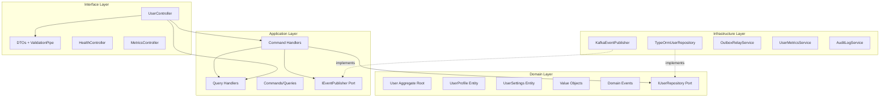
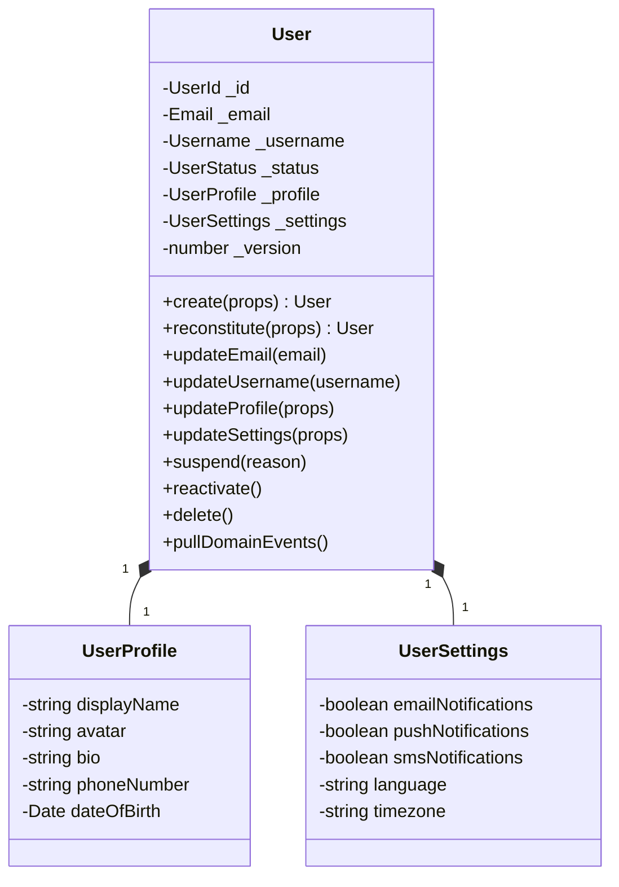
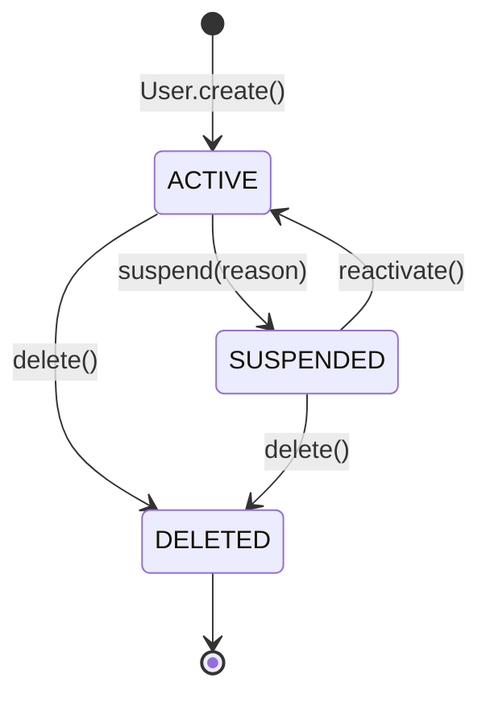

# User Service Architecture

## Overview

The user-service manages user accounts, profiles, and settings within the e-commerce platform. It is distinct from the auth-service which handles authentication credentials (passwords, OAuth, tokens, roles).

**Bounded Context**: User account lifecycle, profile management, notification preferences.

## Layered Architecture



## Domain Model



## User Status Lifecycle



## Directory Structure

```
src/
├── domain/
│   ├── entities/         # User, UserProfile, UserSettings
│   ├── value-objects/    # UserId, Email, Username, UserStatus
│   ├── events/           # UserCreated, UserUpdated, etc.
│   ├── errors/           # DomainException, InvalidStatusTransition
│   └── ports/            # IUserRepository
├── application/
│   ├── commands/         # CreateUser, UpdateUser, etc.
│   ├── queries/          # GetUserById, GetUsers, etc.
│   ├── handlers/         # 7 command + 4 query handlers
│   └── ports/            # IEventPublisher
├── infrastructure/
│   ├── persistence/      # ORM entities, mapper, repository
│   ├── kafka/            # Event publisher (outbox), relay, client
│   ├── config/           # Database config
│   └── observability/    # Metrics, audit log
└── interfaces/
    ├── controllers/      # UserController, HealthController
    ├── dto/              # 6 validated DTOs
    └── user.module.ts    # NestJS module wiring
```

## API Endpoints

| Method | Path | Description |
|--------|------|-------------|
| POST | `/api/users` | Create user |
| GET | `/api/users` | List users (paginated) |
| GET | `/api/users/:id` | Get user by ID |
| PATCH | `/api/users/:id` | Update user email/username |
| DELETE | `/api/users/:id` | Soft-delete user |
| PATCH | `/api/users/:id/profile` | Update user profile |
| PATCH | `/api/users/:id/settings` | Update user settings |
| POST | `/api/users/:id/suspend` | Suspend user |
| POST | `/api/users/:id/reactivate` | Reactivate user |
| GET | `/api/health` | Health check |
| GET | `/api/metrics` | Prometheus metrics |

## Key Patterns

- **DDD Aggregate Root**: User entity encapsulates all business rules and status transitions
- **Transactional Outbox**: Domain events saved to outbox table then relayed to Kafka (not direct publishing)
- **Repository Pattern**: `IUserRepository` port with TypeORM implementation, Symbol-based DI
- **CQRS**: Separate command and query handlers with dedicated data classes
- **Audit Logging**: Structured JSON logs for security-critical operations
