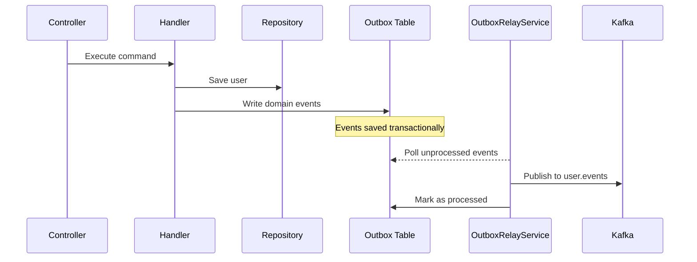

# User Service Events

## Event Flow



## Published Events

All events are published to the `user.events` Kafka topic.

| Event Type | Trigger | Key Fields |
|-----------|---------|------------|
| `user.created` | New user registration | userId, email, username |
| `user.updated` | Email, username, profile, or settings change | userId, changedFields[] |
| `user.suspended` | Admin suspends user | userId, reason |
| `user.reactivated` | Admin reactivates suspended user | userId |
| `user.deleted` | User soft-deletion | userId |

## Event Schemas

### user.created
```json
{
  "eventType": "user.created",
  "occurredOn": "2026-03-16T08:00:00.000Z",
  "data": {
    "userId": "uuid",
    "email": "user@example.com",
    "username": "johndoe"
  }
}
```

### user.updated
```json
{
  "eventType": "user.updated",
  "occurredOn": "2026-03-16T08:00:00.000Z",
  "data": {
    "userId": "uuid",
    "changedFields": ["email", "profile"]
  }
}
```

### user.suspended
```json
{
  "eventType": "user.suspended",
  "occurredOn": "2026-03-16T08:00:00.000Z",
  "data": {
    "userId": "uuid",
    "reason": "Policy violation"
  }
}
```

### user.reactivated
```json
{
  "eventType": "user.reactivated",
  "occurredOn": "2026-03-16T08:00:00.000Z",
  "data": {
    "userId": "uuid"
  }
}
```

### user.deleted
```json
{
  "eventType": "user.deleted",
  "occurredOn": "2026-03-16T08:00:00.000Z",
  "data": {
    "userId": "uuid"
  }
}
```

## Consumed Events (Future)

| Event Type | Source | Purpose |
|-----------|--------|---------|
| `user.registered` | auth-service | Create user account on registration |

## Delivery Guarantees

- **At-least-once**: Events may be delivered more than once in failure scenarios
- **Ordering**: Events for a single user are ordered by `occurredOn` timestamp
- **Outbox Relay**: Polls every 5 seconds, processes up to 100 events per batch
