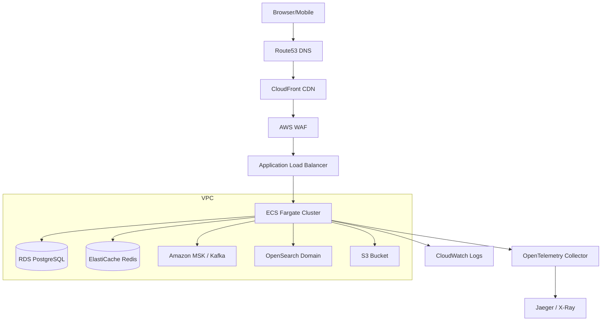

# System Architecture Overview

> **Audience**: Senior engineers onboarding to the platform team.
> **Last Updated**: 2026-03-22

---

## 1. High-Level Architecture

```
┌─────────────┐
│   Browser    │  React / Next.js SPA
│   (Client)   │
└──────┬──────┘
       │ HTTPS
       ▼
┌─────────────┐
│   Route53    │  DNS resolution → CloudFront distribution
└──────┬──────┘
       ▼
┌─────────────┐
│  CloudFront  │  CDN — caches static assets, forwards API to origin
└──────┬──────┘
       ▼
┌─────────────┐
│     WAF      │  AWS WAF — rate limiting, IP blocklist, SQL injection, XSS
└──────┬──────┘
       ▼
┌─────────────┐
│     ALB      │  Application Load Balancer — TLS termination, health checks
└──────┬──────┘
       ▼
┌──────────────────────────────────────────────────────────────────────────┐
│                         API Gateway (NestJS)                            │
│  ┌──────────┐ ┌──────────────┐ ┌──────────┐ ┌──────────────────────┐   │
│  │ Helmet   │ │ RequestIdMW  │ │ Throttler│ │ JwtAuthGuard         │   │
│  │ (security│ │ (x-request-id│ │ (Redis)  │ │ (Passport + JWT)     │   │
│  │ headers) │ │  propagation)│ │ 100/min  │ │ Public routes exempt  │   │
│  └──────────┘ └──────────────┘ └──────────┘ └──────────────────────┘   │
│  ┌──────────────────────┐ ┌──────────────────────────────────────────┐ │
│  │ TimeoutInterceptor   │ │ HttpLoggingInterceptor + MetricsIntercep│ │
│  │ (5s default)         │ │ (structured JSON logs + Prometheus)     │ │
│  └──────────────────────┘ └──────────────────────────────────────────┘ │
│                                                                        │
│  Routes:                                                               │
│   /auth/*     → Auth Service (🔓 Public)                              │
│   /products/* → Product Service (🔓 Public)                           │
│   /search/*   → Search Service (🔓 Public)                            │
│   /users/*    → User Service (🔒 Protected)                           │
│   /cart/*     → Cart Service (🔒 Protected)                           │
│   /orders/*   → Order Service (🔒 Protected)                          │
│   /payments/* → Payment Service (🔒 Protected)                        │
│   /inventory/*→ Inventory Service (🔒 Protected)                      │
│   /notifications/* → Notification Service (🔒 Protected)              │
│                                                                        │
│  BFF Aggregation:                                                      │
│   GET /product-page/:id  → Product + Inventory + Reviews (🔓 Public)  │
│   GET /cart-summary      → Cart + Product details (🔒 Protected)      │
│   GET /order-details/:id → Order + Products + Payment (🔒 Protected)  │
└──────────────────────────────────────────────────────────────────────────┘
       │ HTTP forward (BaseHttpClient)
       ▼
┌──────────────────────────────────────────────────────────────────────────┐
│                    ECS Services (Fargate)                                │
│                                                                          │
│  ┌──────────┐ ┌──────────┐ ┌──────────┐ ┌──────────┐ ┌──────────────┐  │
│  │  Auth    │ │  User    │ │ Product  │ │  Cart    │ │   Order      │  │
│  │ Service  │ │ Service  │ │ Service  │ │ Service  │ │  Service     │  │
│  └────┬─────┘ └────┬─────┘ └────┬─────┘ └────┬─────┘ └────┬────────┘  │
│       │            │            │            │            │             │
│  ┌────┴─────┐ ┌────┴─────┐ ┌────┴─────┐ ┌────┴─────┐ ┌────┴────────┐  │
│  │PostgreSQL│ │PostgreSQL│ │PostgreSQL│ │PostgreSQL│ │ PostgreSQL  │  │
│  │ auth_db  │ │ user_db  │ │product_db│ │ cart_db  │ │  order_db   │  │
│  └──────────┘ └──────────┘ └──────────┘ └──────────┘ └─────────────┘  │
│                                                                          │
│  ┌──────────┐ ┌──────────┐ ┌──────────────┐ ┌────────────────────────┐  │
│  │ Payment  │ │Inventory │ │ Notification │ │    Search Service     │  │
│  │ Service  │ │ Service  │ │   Service    │ │ (OpenSearch backend)  │  │
│  └────┬─────┘ └────┬─────┘ └──────┬───────┘ └────┬──────────────────┘  │
│       │            │              │              │                      │
│  ┌────┴─────┐ ┌────┴─────┐  ┌────┴──────┐  ┌────┴──────────────────┐  │
│  │PostgreSQL│ │PostgreSQL│  │PostgreSQL │  │PostgreSQL + OpenSearch│  │
│  │payment_db│ │invent_db │  │notif_db   │  │ search_db + OS index │  │
│  └──────────┘ └──────────┘  └───────────┘  └───────────────────────┘  │
└──────────────────────────────────────────────────────────────────────────┘
       │                              │
       ▼                              ▼
┌──────────────┐              ┌──────────────┐
│    Redis     │              │    Kafka      │
│  - Sessions  │              │  - Events     │
│  - Rate limit│              │  - Commands   │
│  - Token     │              │  - DLQ topics  │
│    blocklist │              │               │
│  - Cache     │              │               │
└──────────────┘              └──────────────┘
```

---

## 2. Technology Stack

| Layer | Technology | Purpose |
|---|---|---|
| **Runtime** | Node.js 20 (NestJS 10) | All microservices |
| **Language** | TypeScript 5.x (strict mode) | Type safety across all services |
| **Architecture** | DDD + CQRS + Event-Driven | Domain isolation, read/write separation |
| **API Gateway** | NestJS + Passport + Throttler | JWT auth, rate limiting, request routing |
| **Database** | PostgreSQL 15 (per-service) | ACID transactions, JSONB for events |
| **ORM** | TypeORM | Entity mapping, migrations |
| **Cache** | Redis 7 | Sessions, rate limiting, token store |
| **Search** | OpenSearch 2.x | Full-text search, product indexing |
| **Message Broker** | Apache Kafka (KafkaJS) | Async event bus, command bus |
| **Object Storage** | AWS S3 | Product images, assets |
| **Observability** | OpenTelemetry + Pino + Prometheus | Distributed tracing, structured logs, metrics |
| **Containerization** | Docker + ECS Fargate | Container orchestration |
| **Infrastructure** | Terraform | Infrastructure as Code |
| **Security** | Argon2 + JWT + Helmet + AWS WAF | Password hashing, token auth, HTTP security |
| **Validation** | Zod (events) + class-validator (DTOs) | Runtime schema validation |

---

## 3. Service Catalog

| Service | Responsibility | Database | Kafka Topics (Produce) | Kafka Topics (Consume) |
|---|---|---|---|---|
| **API Gateway** | Routing, auth, rate limiting, BFF | — (stateless) | — | — |
| **Auth Service** | Register, login, logout, token refresh | `auth_db` | `user.registered`, `user.logged_in`, `user.login_failed` | — |
| **User Service** | Profile management | `user_db` | `user.events` | `user.registered` |
| **Product Service** | Product CRUD, catalog | `product_db` | `product.events` | — |
| **Cart Service** | Shopping cart management | `cart_db` | `cart.events` | — |
| **Order Service** | Order lifecycle, saga orchestration | `order_db` | `order.events`, `payment.commands` | `payment.events`, `inventory.events` |
| **Payment Service** | Payment processing | `payment_db` | `payment.events` | `payment.commands` |
| **Inventory Service** | Stock management, reservations | `inventory_db` | `inventory.events` | `order.events`, `cart.events` |
| **Search Service** | Product search (OpenSearch) | `search_db` + OpenSearch | — | `product.events` |
| **Notification Service** | Email, push, in-app notifications | `notification_db` | — | `user.events`, `order.events`, `cart.events` |

---

## 4. Key Architectural Patterns

### 4.1 Domain-Driven Design (DDD)

Every service follows a layered structure:

```
service/src/
├── domain/              # Pure domain logic — no framework imports
│   ├── entities/        # Aggregates & entities (e.g., Order, Product)
│   ├── value-objects/   # Immutable VOs (e.g., Email, Money, OrderStatus)
│   ├── ports/           # Repository interfaces (driven ports)
│   └── events/          # Domain events
├── application/         # Use cases — orchestrates domain
│   ├── commands/        # Command objects (write intent)
│   ├── queries/         # Query objects (read intent)
│   ├── handlers/        # CQRS command/query handlers
│   ├── ports/           # Driven port interfaces
│   └── services/        # Application services
├── infrastructure/      # Adapters — implements ports
│   ├── database/        # TypeORM repositories, entities, migrations
│   ├── kafka/           # Producers, consumers, saga
│   ├── redis/           # Cache, token store
│   └── observability/   # Metrics, health checks
└── interfaces/          # Driving adapters
    ├── controllers/     # HTTP controllers (thin, no business logic)
    ├── dto/             # Request/response DTOs with class-validator
    ├── filters/         # Exception filters (domain → HTTP mapping)
    └── guards/          # Auth guards
```

### 4.2 CQRS (Command Query Responsibility Segregation)

- **Commands** mutate state → `CommandBus.execute(new CreateOrderCommand(...))`
- **Queries** read state → `QueryBus.execute(new GetProductsQuery(...))`
- Handlers are registered via NestJS `@CommandHandler()` / `@QueryHandler()` decorators
- Controllers contain **zero business logic** — they only map HTTP → Commands/Queries

### 4.3 Transactional Outbox Pattern

Events are persisted atomically with domain state changes:

```sql
-- Within the same DB transaction:
INSERT INTO orders (id, status, ...) VALUES (...);
INSERT INTO outbox_events (id, type, payload, processed) VALUES (...);
COMMIT;
```

**OutboxProcessor** polls for `processed = false` and publishes to Kafka:

```
┌──────────┐    poll     ┌───────────────┐   publish   ┌─────────┐
│ Cron Job │───────────→ │ outbox_events │───────────→ │  Kafka  │
│ (5s)     │             │ processed=false│             │  topic  │
└──────────┘             └───────────────┘             └─────────┘
                               │ mark processed=true
                               ▼
```

**OutboxEventEntity schema:**

| Column | Type | Description |
|---|---|---|
| `id` | UUID (PK) | Event identifier |
| `type` | VARCHAR(100) | Event type (e.g., `order.created`) |
| `payload` | JSONB | Serialized event data |
| `processed` | BOOLEAN | `false` = pending, `true` = published |
| `createdAt` | TIMESTAMPTZ | Creation timestamp |

### 4.4 Transactional Inbox Pattern

All Kafka consumers use the Inbox Pattern for **exactly-once processing**:

```
┌─────────┐   consume   ┌──────────────┐   INSERT ON CONFLICT   ┌──────────────┐
│  Kafka  │───────────→ │ InboxService │──────────────────────→ │ inbox_events │
│  topic  │             │ handleIncoming│                        │   (UNIQUE    │
└─────────┘             └──────┬───────┘                        │   eventId)   │
                               │                                └──────────────┘
                               │ CAS: RECEIVED → PROCESSING
                               │
                               ▼
                        ┌──────────────┐
                        │   Handler    │  Execute in DB transaction
                        │  (domain fn) │
                        └──────┬───────┘
                               │
                  ┌────────────┼────────────┐
                  ▼            ▼            ▼
            PROCESSED      FAILED      DEAD_LETTER
                        (retry w/     (after maxRetries
                         backoff)      → DLQ topic)
```

**InboxEventEntity schema:**

| Column | Type | Description |
|---|---|---|
| `id` | UUID (PK) | Internal row ID |
| `eventId` | VARCHAR(255) UNIQUE | Producer event ID (dedup key) |
| `eventType` | VARCHAR(100) | Event type |
| `aggregateId` | VARCHAR(255) | Related aggregate (e.g., orderId) |
| `source` | VARCHAR(100) | Source service name |
| `payload` | JSONB | Full event data |
| `status` | VARCHAR(20) | `RECEIVED → PROCESSING → PROCESSED / FAILED / DEAD_LETTER` |
| `retryCount` | INT | Current retry attempt |
| `maxRetries` | INT | Max allowed retries (default: 5) |
| `errorMessage` | TEXT | Last error details |
| `correlationId` | VARCHAR(255) | Distributed tracing ID |
| `nextRetryAt` | TIMESTAMPTZ | Exponential backoff: `backoffMs × 2^retryCount` |
| `processedAt` | TIMESTAMPTZ | When successfully processed |
| `createdAt` | TIMESTAMPTZ | When received |
| `updatedAt` | TIMESTAMPTZ | Last status change |

### 4.5 Event Envelope Standard

All domain events follow a standard envelope:

```json
{
  "type": "ProductCreated",
  "schemaVersion": 1,
  "source": "product-service",
  "correlationId": "550e8400-e29b-41d4-a716-446655440000",
  "timestamp": "2026-03-22T10:00:00.000Z",
  "payload": { ... }
}
```

Validated at consumer boundaries using **Zod schemas**:

```typescript
export const EventEnvelopeSchema = z.object({
  type: z.string(),
  schemaVersion: z.number().int().positive(),
  source: z.string(),
  correlationId: z.string().uuid().optional(),
  timestamp: z.string().datetime(),
  payload: z.record(z.unknown()),
});
```

### 4.6 Resilience — `safeExecute()`

All external calls use a unified resilience wrapper with composable strategies:

```
Circuit Breaker → Retry (exp. backoff) → Timeout → fn()
```

| Strategy | Behavior | Example Use |
|---|---|---|
| `FAIL_CLOSE` | Retry → throw on final failure | Database queries |
| `FAIL_OPEN` | Return fallback value on failure | Redis cache reads |
| `NON_BLOCKING` | Log error, return `undefined` | Kafka publishes, audit logs |

Each call automatically emits:
- **Prometheus metrics**: `resilience_exec_total`, `resilience_exec_duration_seconds`, `resilience_retry_total`
- **OpenTelemetry span**: `safeExecute:<label>` with retry events and circuit state changes

### 4.7 API Gateway — Proxy + BFF

The API Gateway serves two purposes:

**1. Reverse Proxy** — forwards requests via `BaseHttpClient.forwardRequest()`:
```
Browser → API GW /orders/123 → forward → Order Service /orders/123
```

**2. BFF Aggregation** — combines data from multiple services:
```
Browser → API GW /product-page/:id
  → parallel: Product Service + Inventory Service + Reviews
  → aggregate and return single response
```

---

## 5. Infrastructure (AWS)



### Terraform Modules

| Module | Resources |
|---|---|
| `modules/vpc` | VPC, subnets, NAT, security groups |
| `modules/ecs` | ECS cluster, task definitions, services |
| `modules/rds` | PostgreSQL instances per service |
| `modules/elasticache` | Redis cluster |
| `modules/msk` | Kafka cluster, topics |
| `modules/opensearch` | OpenSearch domain |
| `modules/s3` | Asset buckets |
| `modules/alb` | Load balancer, target groups |
| `modules/cloudfront` | CDN distribution |
| `modules/waf` | WAF rules, IP sets |

---

## 6. Request Flow Summary

Every request follows this path:

```
1. Browser          → HTTPS request
2. Route53          → DNS resolution (api.example.com → CloudFront)
3. CloudFront       → CDN check (cache HIT for static, MISS for API → origin)
4. WAF              → Security rules (rate limit, IP block, SQL injection)
5. ALB              → TLS termination, health-check routing to ECS
6. API Gateway      → RequestIdMiddleware → ThrottlerGuard → JwtAuthGuard → TimeoutInterceptor
7. Service          → Controller → CommandBus/QueryBus → Handler → Domain → Repository → DB
8. Response         → Same path in reverse, with structured logging at each layer
```

For event-driven flows:
```
9.  Outbox           → Domain saves event atomically with state change
10. OutboxProcessor  → Polls unprocessed events, publishes to Kafka
11. Kafka            → Message delivered to consumer group
12. InboxService     → Dedup, CAS lock, execute handler in transaction
13. Handler          → Updates read model / triggers next saga step
14. DLQ              → If maxRetries exhausted → dead letter queue topic
```
