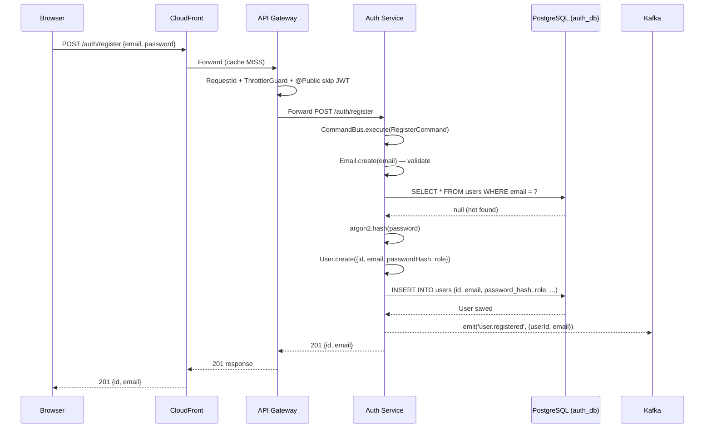
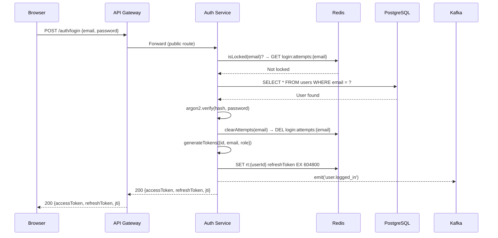
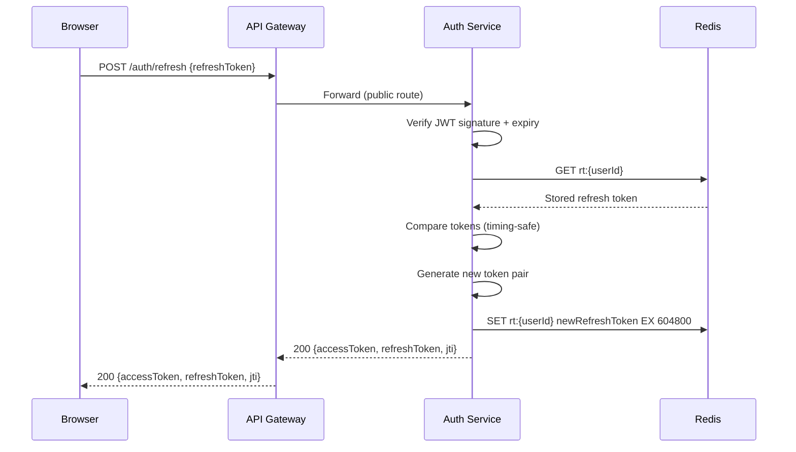
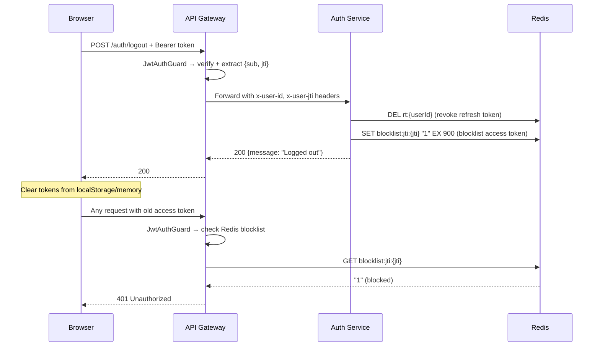

# Authentication Flows

> Covers: **User Register**, **User Login**, **Refresh Token**, **Logout**
> Service: `auth-service` | Database: `auth_db` | Cache: Redis

---

## FLOW 1: User Registration

### Step-by-Step Flow

```
Step 1:  Browser → POST /auth/register { email, password }
Step 2:  Route53 → Resolves api.example.com → CloudFront distribution
Step 3:  CloudFront → Cache MISS (POST requests are never cached) → forward to origin
Step 4:  WAF → Validates: rate limit (100 req/min per IP), no SQL injection, valid Content-Type
Step 5:  ALB → TLS termination → forwards to API Gateway ECS task (health-checked)
Step 6:  API Gateway → RequestIdMiddleware injects x-request-id header
Step 7:  API Gateway → ThrottlerGuard checks Redis: auth endpoint 100/min per IP
Step 8:  API Gateway → JwtAuthGuard → route /auth/* is @Public() → SKIP authentication
Step 9:  API Gateway → GatewayController.routeAuth() → BaseHttpClient.forwardRequest()
Step 10: Auth Service → AuthController.register() → CommandBus.execute(RegisterCommand)
Step 11: RegisterHandler → Email.create(email) validates email format (domain VO)
Step 12: RegisterHandler → userRepository.findByEmail(email) → PostgreSQL query
Step 13: RegisterHandler → If exists → throw ConflictException(409)
Step 14: RegisterHandler → argon2.hash(password) → Argon2id with default parameters
Step 15: RegisterHandler → User.create({ id: uuid, email, password, role: CUSTOMER })
Step 16: RegisterHandler → userRepository.save(user) → INSERT INTO users
Step 17: RegisterHandler → kafkaClient.emit('user.registered', { userId, email, timestamp })
Step 18: RegisterHandler → Return { id, email } to controller
Step 19: Auth Service → Response 201 Created → back through ALB → CloudFront → Client
Step 20: Logs + Metrics + Traces emitted at each layer
```

### Sequence Diagram



### Error Scenarios

| Error | Cause | HTTP Status | Handling |
|---|---|---|---|
| Email already exists | `findByEmail` returns existing user | 409 Conflict | `ConflictException` |
| Invalid email format | `Email.create()` validation fails | 400 Bad Request | Domain exception → filter |
| Weak password | `Password.create()` validation fails | 400 Bad Request | Domain exception → filter |
| Rate limited | ThrottlerGuard exceeds 100/min | 429 Too Many Requests | Redis-backed throttler |
| DB connection failure | PostgreSQL unreachable | 500 Internal Server Error | GlobalExceptionFilter |
| Kafka publish failure | Broker unreachable | N/A (non-blocking) | Logged, does not affect response |

### Security Concerns

- Password hashed with **Argon2id** (memory-hard, timing-safe)
- Email validated via domain value object (prevents injection)
- Rate limiting prevents brute-force registration
- No password returned in response
- WAF blocks SQL injection attempts

### Example API Request/Response

**Request:**
```http
POST /auth/register HTTP/1.1
Host: api.example.com
Content-Type: application/json
X-Request-Id: req-550e8400-e29b-41d4-a716-446655440000

{
  "email": "john@example.com",
  "password": "SecureP@ssw0rd!"
}
```

**Response (201):**
```json
{
  "id": "usr-123e4567-e89b-12d3-a456-426614174000",
  "email": "john@example.com"
}
```

### Example Kafka Event

**Topic:** `user.registered`
```json
{
  "userId": "usr-123e4567-e89b-12d3-a456-426614174000",
  "email": "john@example.com",
  "timestamp": "2026-03-22T10:00:00.000Z"
}
```

### Example Database Record

**`users` table:**
```
id:                usr-123e4567-e89b-12d3-a456-426614174000
email:             john@example.com
password_hash:     $argon2id$v=19$m=65536,t=3,p=4$...
role:              CUSTOMER
is_email_verified: false
is_active:         true
tenant_id:         null
org_id:            null
created_at:        2026-03-22T10:00:00.000Z
updated_at:        2026-03-22T10:00:00.000Z
```

### Example Logs

```json
{
  "level": "info",
  "context": "RegisterHandler",
  "message": "User registered",
  "userId": "usr-123e4567-e89b-12d3-a456-426614174000",
  "email": "john@example.com",
  "requestId": "req-550e8400-e29b-41d4-a716-446655440000",
  "traceId": "abc123def456",
  "spanId": "span-789",
  "timestamp": "2026-03-22T10:00:00.123Z",
  "service": "auth-service"
}
```

### Example Trace Spans

```
[api-gateway] POST /auth/register (12ms)
  ├─ [auth-service] RegisterHandler.execute (10ms)
  │  ├─ [postgres] SELECT users WHERE email (2ms)
  │  ├─ [crypto] argon2.hash (5ms)
  │  ├─ [postgres] INSERT users (2ms)
  │  └─ [kafka] emit user.registered (1ms)
```

---

## FLOW 2: User Login

### Step-by-Step Flow

```
Step 1:  Browser → POST /auth/login { email, password }
Step 2:  Route53 → DNS resolution
Step 3:  CloudFront → Cache MISS (POST) → origin
Step 4:  WAF → Rate limit, security rules
Step 5:  ALB → Forward to API Gateway
Step 6:  API Gateway → RequestId → ThrottlerGuard → @Public skip JWT
Step 7:  API Gateway → Forward to Auth Service
Step 8:  Auth Service → AuthController.login() → QueryBus.execute(LoginQuery)
Step 9:  LoginHandler → loginAttemptService.isLocked(email) → Redis check
Step 10: LoginHandler → If locked → throw 429 TOO_MANY_REQUESTS
Step 11: LoginHandler → userRepository.findByEmail(email) → PostgreSQL
Step 12: LoginHandler → If !user || !isActive → recordFailedAttempt → emit login_failed → throw 401
Step 13: LoginHandler → argon2.verify(storedHash, inputPassword) → timing-safe comparison
Step 14: LoginHandler → If !valid → recordFailedAttempt → emit login_failed → throw 401
Step 15: LoginHandler → loginAttemptService.clearAttempts(email) → Reset Redis counter
Step 16: LoginHandler → jwtAdapterService.generateTokens({ id, email, role, tenantId, orgId })
Step 17: LoginHandler → accessToken (short-lived, 15min), refreshToken (long-lived, 7d), jti (unique ID)
Step 18: LoginHandler → tokenStoreService.storeRefreshToken(userId, refreshToken) → Redis SET
Step 19: LoginHandler → kafkaClient.emit('user.logged_in', { userId, email, timestamp })
Step 20: LoginHandler → Return { accessToken, refreshToken, jti }
Step 21: Response → 200 OK back to browser
```

### Sequence Diagram



### Error Scenarios

| Error | Cause | HTTP Status | Handling |
|---|---|---|---|
| Account locked | 5+ failed attempts in 15min window | 429 | Redis-based lockout, auto-expires |
| Invalid credentials (no user) | Email not found | 401 | Generic message, records failed attempt |
| Invalid credentials (wrong pwd) | argon2.verify fails | 401 | Generic message, records failed attempt |
| OAuth-only account | No password hash stored | 401 | Cannot password login |
| DB failure | PostgreSQL down | 500 | GlobalExceptionFilter |

### Retry Strategy

- **Login attempts**: Not retried automatically (user-facing)
- **Redis operations**: `safeExecute` with `FAIL_OPEN` — if Redis is down, lockout check is skipped (fail-open for availability)
- **Kafka emit**: `NON_BLOCKING` — logged, does not block login response

### Example Redis Keys

```
login:attempts:john@example.com     → "3"     (TTL: 900s = 15min)
rt:usr-123e4567                     → "<refresh_token_value>"  (TTL: 604800s = 7d)
blocklist:jti:abc123                → "1"     (TTL: matches access token expiry)
```

### Example API Request/Response

**Request:**
```http
POST /auth/login HTTP/1.1
Content-Type: application/json

{
  "email": "john@example.com",
  "password": "SecureP@ssw0rd!"
}
```

**Response (200):**
```json
{
  "accessToken": "eyJhbGciOiJIUzI1NiIs...",
  "refreshToken": "dGhpcyBpcyBhIHJlZnJ...",
  "jti": "jti-550e8400-e29b-41d4"
}
```

### JWT Payload Structure

```json
{
  "sub": "usr-123e4567-e89b-12d3-a456-426614174000",
  "email": "john@example.com",
  "role": "CUSTOMER",
  "tenantId": "tenant-001",
  "orgId": "org-001",
  "jti": "jti-550e8400-e29b-41d4",
  "iat": 1711090800,
  "exp": 1711091700
}
```

### Performance Considerations

- Argon2 hashing is CPU-intensive (~50ms) — rate limiting prevents abuse
- Redis lockout check happens **before** DB query (fail-fast on locked accounts)
- JWT generation is synchronous and fast (~1ms)
- Access token TTL: 15 min (reduces database lookups for revocation)
- Refresh token TTL: 7 days (stored in Redis for fast revocation)

---

## FLOW 3: Refresh Token

### Step-by-Step Flow

```
Step 1:  Browser → POST /auth/refresh { refreshToken }
Step 2:  Route53 → CloudFront → WAF → ALB → API Gateway
Step 3:  API Gateway → @Public route → Forward to Auth Service
Step 4:  Auth Service → AuthController.refresh() → CommandBus.execute(RefreshTokenCommand)
Step 5:  RefreshTokenHandler → Verify refresh token signature + expiry
Step 6:  RefreshTokenHandler → tokenStoreService.getRefreshToken(userId) → Redis GET
Step 7:  RefreshTokenHandler → Compare stored token with provided token
Step 8:  RefreshTokenHandler → If mismatch → throw 401 (token reuse detection)
Step 9:  RefreshTokenHandler → Generate new token pair (accessToken + refreshToken)
Step 10: RefreshTokenHandler → tokenStoreService.storeRefreshToken(userId, newRefreshToken) → Redis SET
Step 11: RefreshTokenHandler → Old refresh token is implicitly revoked (overwritten in Redis)
Step 12: RefreshTokenHandler → Return { accessToken, refreshToken, jti }
Step 13: Response → 200 OK back to browser
```

### Sequence Diagram



### Security: Token Rotation

```
Token Rotation Flow:
RT-1 issued at login → stored in Redis
RT-1 used for refresh → RT-2 issued → RT-1 overwritten in Redis
RT-1 reused again → Redis has RT-2 → MISMATCH → Potential token theft detected
→ Revoke all tokens for this user (security escalation)
```

### Error Scenarios

| Error | Cause | HTTP Status | Handling |
|---|---|---|---|
| Expired refresh token | JWT past `exp` | 401 | Client must re-login |
| Invalid signature | Token tampered | 401 | Reject immediately |
| Token reuse detected | Old token replayed | 401 | Revoke all user tokens |
| Redis failure | Cannot verify stored token | 500 / fail-open | Depends on strategy |

---

## FLOW 4: Logout

### Step-by-Step Flow

```
Step 1:  Browser → POST /auth/logout { refreshToken } + Authorization: Bearer <accessToken>
Step 2:  Route53 → CloudFront → WAF → ALB → API Gateway
Step 3:  API Gateway → JwtAuthGuard verifies access token → extracts { sub, jti }
Step 4:  API Gateway → Forward to Auth Service with user context in headers
Step 5:  Auth Service → AuthController.logout() → extracts userId + jti from request
Step 6:  Auth Service → CommandBus.execute(LogoutCommand(refreshToken, userId, jti))
Step 7:  LogoutHandler → tokenStoreService.deleteRefreshToken(userId) → Redis DEL
Step 8:  LogoutHandler → tokenStoreService.blocklistJti(jti, accessTokenTTL) → Redis SET with TTL
Step 9:  LogoutHandler → Return success
Step 10: Response → 200 OK back to browser
Step 11: Browser → Clear stored tokens from memory/storage
```

### Sequence Diagram



### Example Redis Keys After Logout

```
rt:usr-123e4567               → (DELETED)
blocklist:jti:jti-550e8400    → "1"     (TTL: 900s = remaining access token life)
```

### Security Concerns

- **JTI blocklist** ensures revoked access tokens cannot be reused
- Blocklist TTL matches access token remaining lifetime (no indefinite growth)
- Refresh token deletion prevents future token refresh
- **Race condition**: If access token is used between logout and Redis propagation, it will still work for up to ~1ms (acceptable tradeoff)
