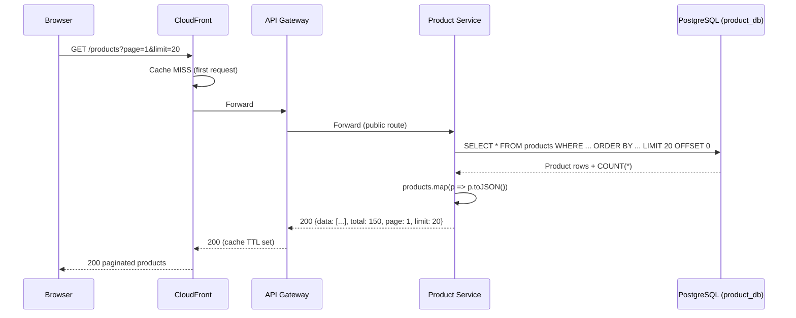
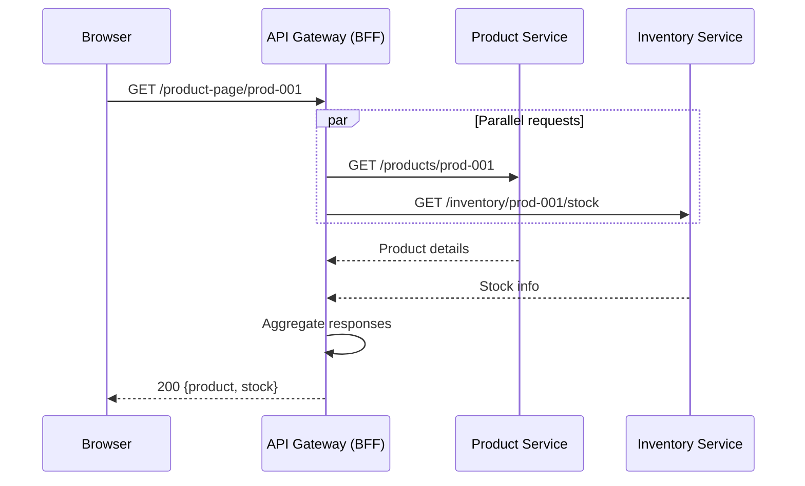
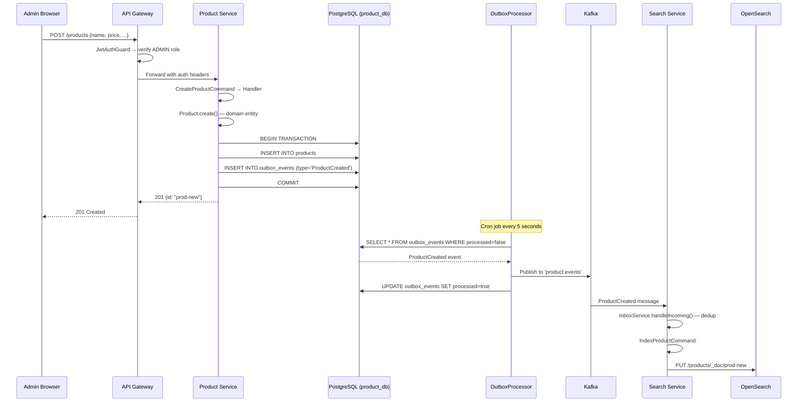
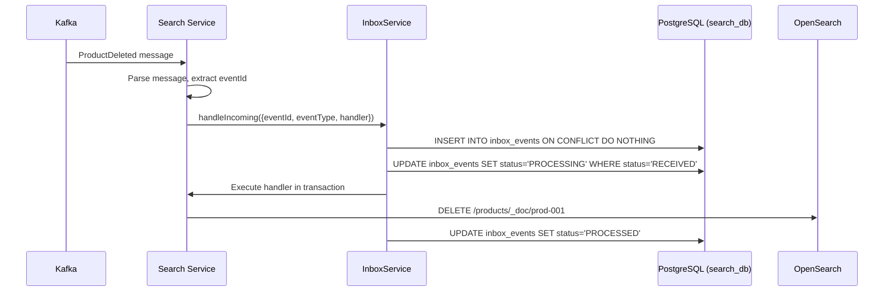

# Product Flows

> Covers: **Get Product List**, **View Product Detail**, **Admin Create Product**, **Admin Update Product**, **Admin Delete Product**, **Upload Product Image (S3)**
> Service: `product-service` | Database: `product_db` | Events: `product.events`

---

## FLOW 5: Get Product List

### Step-by-Step Flow

```
Step 1:  Browser → GET /products?page=1&limit=20&sortBy=price&sortOrder=ASC&categoryId=cat-001
Step 2:  Route53 → CloudFront → Cache check (query string included in cache key)
Step 3:  CloudFront → Cache MISS → WAF → ALB → API Gateway
Step 4:  API Gateway → @Public route → no JWT required → ThrottlerGuard passes
Step 5:  API Gateway → GatewayController.routeProducts() → forward to Product Service
Step 6:  Product Service → ProductController.findAll() → GetProductsHandler.execute()
Step 7:  GetProductsHandler → GetProductsQuery(page, limit, sortBy, sortOrder, status, categoryId, minPrice, maxPrice, search)
Step 8:  GetProductsHandler → productRepository.findAll(query) → PostgreSQL with pagination
Step 9:  PostgreSQL → SELECT * FROM products WHERE status='ACTIVE' AND category_id=? ORDER BY price ASC LIMIT 20 OFFSET 0
Step 10: GetProductsHandler → Return { data: products.map(p => p.toJSON()), total, page, limit }
Step 11: Response → 200 OK with paginated product list
```

### Sequence Diagram



### Example API Request/Response

**Request:**
```http
GET /products?page=1&limit=20&sortBy=price&sortOrder=ASC&status=ACTIVE&categoryId=cat-electronics HTTP/1.1
Host: api.example.com
```

**Response (200):**
```json
{
  "data": [
    {
      "id": "prod-001",
      "name": "Wireless Headphones",
      "description": "Premium noise-cancelling headphones",
      "price": 9999,
      "currency": "USD",
      "status": "ACTIVE",
      "categoryId": "cat-electronics",
      "imageUrl": "https://cdn.example.com/products/prod-001.webp",
      "createdAt": "2026-03-01T00:00:00.000Z",
      "updatedAt": "2026-03-20T15:30:00.000Z"
    }
  ],
  "total": 150,
  "page": 1,
  "limit": 20
}
```

### Performance Considerations

- Pagination via `LIMIT/OFFSET` — keyset pagination recommended for large datasets
- CloudFront can cache GET responses (TTL based on `Cache-Control` headers)
- Database indexes on `status`, `category_id`, `price` for fast filtering
- No N+1 queries — single SQL with `COUNT(*)` for total

---

## FLOW 6: View Product Detail

### Step-by-Step Flow

```
Step 1:  Browser → GET /products/prod-001
Step 2:  Route53 → CloudFront → Cache check (path-based cache key)
Step 3:  CloudFront → Cache MISS → WAF → ALB → API Gateway
Step 4:  API Gateway → @Public → forward to Product Service
Step 5:  ProductController.findOne() → GetProductByIdHandler.execute(GetProductByIdQuery(id))
Step 6:  Handler → productRepository.findById(id) → PostgreSQL
Step 7:  If not found → throw NotFoundException(404)
Step 8:  Handler → Return product.toJSON()
Step 9:  Response → 200 OK with full product details
```

### BFF Aggregation Alternative: Product Page

```
Browser → GET /product-page/prod-001 (BFF endpoint on API Gateway)

API Gateway → ProductPageService.getPage(id) →
  ├── parallel: Product Service → GET /products/prod-001
  ├── parallel: Inventory Service → GET /inventory/prod-001/stock
  └── parallel: (future) Review Service → GET /reviews?productId=prod-001

Response: aggregated { product, stock, reviews }
```



---

## FLOW 7: Admin Create Product

### Step-by-Step Flow

```
Step 1:  Admin → POST /products { name, description, price, currency, categoryId }
Step 2:  Route53 → CloudFront → WAF → ALB → API Gateway
Step 3:  API Gateway → JwtAuthGuard → verify JWT → extract { sub, role: ADMIN }
Step 4:  API Gateway → ThrottlerGuard → pass
Step 5:  API Gateway → Forward to Product Service with x-user-id, x-user-role headers
Step 6:  Product Service → ServiceAuthGuard → verify INTERNAL_AUTH_SECRET header
Step 7:  ProductController.create() → CreateProductHandler.execute(CreateProductCommand)
Step 8:  CreateProductHandler → Validate name (non-empty), price (positive)
Step 9:  CreateProductHandler → Product.create({ id: uuid, name, description, price: Money.create(price, currency) })
Step 10: CreateProductHandler → Domain events: product.addDomainEvent(new ProductCreatedEvent)
Step 11: CreateProductHandler → Within DB transaction:
         - INSERT INTO products (id, name, description, price, currency, status, category_id)
         - INSERT INTO outbox_events (id, type='ProductCreated', payload={...}, processed=false)
         - COMMIT
Step 12: CreateProductHandler → Return product.id
Step 13: Response → 201 Created { id: "prod-new" }
Step 14: OutboxProcessor (cron, every 5s) → polls outbox_events WHERE processed=false
Step 15: OutboxProcessor → publishes to Kafka topic 'product.events' with headers:
         - x-event-type: ProductCreated
         - x-event-id: <outbox_event_id>
Step 16: OutboxProcessor → marks event as processed=true
Step 17: Search Service consumer → receives ProductCreated event
Step 18: Search Service → InboxService.handleIncoming() → dedup → IndexProductCommand
Step 19: Search Service → Index product in OpenSearch
```

### Sequence Diagram



### Example Outbox Event Record

```
outbox_events table:
  id:        evt-001-uuid
  type:      ProductCreated
  payload:   {
    "id": "prod-new",
    "name": "Wireless Headphones",
    "description": "Premium noise-cancelling",
    "price": 9999,
    "currency": "USD",
    "status": "ACTIVE",
    "categoryId": "cat-electronics"
  }
  processed: false → true (after OutboxProcessor publishes)
  createdAt: 2026-03-22T10:00:00.000Z
```

### Example Kafka Message (product.events)

```json
{
  "key": "evt-001-uuid",
  "value": {
    "id": "prod-new",
    "name": "Wireless Headphones",
    "description": "Premium noise-cancelling",
    "price": 9999,
    "currency": "USD",
    "status": "ACTIVE",
    "categoryId": "cat-electronics"
  },
  "headers": {
    "x-event-type": "ProductCreated",
    "x-event-id": "evt-001-uuid"
  }
}
```

---

## FLOW 8: Admin Update Product

### Step-by-Step Flow

```
Step 1:  Admin → PATCH /products/prod-001 { name, description, price, currency, categoryId }
Step 2:  Same infrastructure path as create (Route53 → CloudFront → WAF → ALB → GW)
Step 3:  API Gateway → JwtAuthGuard → verify ADMIN → Forward to Product Service
Step 4:  Product Service → ServiceAuthGuard → verify internal auth secret
Step 5:  ProductController.update() → UpdateProductHandler.execute(UpdateProductCommand)
Step 6:  Handler → productRepository.findById(id) → load existing product
Step 7:  If not found → throw NotFoundException(404)
Step 8:  Handler → product.update({ name, description, price, currency, categoryId })
Step 9:  Handler → Domain validates: price must be positive, name non-empty
Step 10: Handler → product.addDomainEvent(new ProductUpdatedEvent)
Step 11: Handler → Within DB transaction:
         - UPDATE products SET name=?, description=?, price=?, ... WHERE id=?
         - INSERT INTO outbox_events (type='ProductUpdated', payload={...})
         - COMMIT
Step 12: Response → 200 { message: "Product updated" }
Step 13: OutboxProcessor → publishes ProductUpdated to Kafka
Step 14: Search Service → receives event → re-indexes product in OpenSearch
Step 15: Redis cache → invalidated if product was cached (cache-aside pattern)
```

---

## FLOW 9: Admin Delete Product

### Step-by-Step Flow

```
Step 1:  Admin → DELETE /products/prod-001
Step 2:  Infrastructure path → API Gateway → JwtAuthGuard (ADMIN) → Product Service
Step 3:  ProductController.remove() → DeleteProductHandler.execute(DeleteProductCommand)
Step 4:  Handler → productRepository.findById(id) → load product
Step 5:  If not found → throw NotFoundException(404)
Step 6:  Handler → product.markDeleted() → soft delete or status change
Step 7:  Handler → Within DB transaction:
         - UPDATE products SET status='DELETED' WHERE id=?  (or DELETE)
         - INSERT INTO outbox_events (type='ProductDeleted', payload={id})
         - COMMIT
Step 8:  Response → 204 No Content
Step 9:  OutboxProcessor → publishes ProductDeleted to Kafka
Step 10: Search Service → receives event → RemoveProductCommand → DELETE /products/_doc/prod-001
```

### Search Service Consumer Processing



---

## FLOW 10: Upload Product Image (S3)

### Step-by-Step Flow

```
Step 1:  Admin → POST /products/prod-001/image (multipart/form-data with image file)
Step 2:  Route53 → CloudFront → WAF (file size limit check) → ALB → API Gateway
Step 3:  API Gateway → JwtAuthGuard (ADMIN) → Express limit: 1mb → Forward to Product Service
Step 4:  Product Service → Parse multipart form data
Step 5:  Product Service → Validate file: type (image/jpeg, image/png, image/webp), size (<5MB)
Step 6:  Product Service → Generate S3 key: products/{productId}/{timestamp}-{hash}.webp
Step 7:  Product Service → Upload to S3:
         - PutObjectCommand({ Bucket, Key, Body: buffer, ContentType, ACL: 'public-read' })
Step 8:  Product Service → Construct CDN URL: https://cdn.example.com/products/{productId}/{filename}
Step 9:  Product Service → Update product record: UPDATE products SET image_url = ? WHERE id = ?
Step 10: Product Service → Within DB transaction:
         - UPDATE products SET image_url = cdnUrl
         - INSERT INTO outbox_events (type='ProductUpdated', payload with new imageUrl)
         - COMMIT
Step 11: Response → 200 { imageUrl: "https://cdn.example.com/products/prod-001/..." }
Step 12: OutboxProcessor → ProductUpdated event → Kafka → Search Service re-indexes
```

### S3 Architecture

```
┌─────────┐   PutObject   ┌─────────┐   CloudFront   ┌──────────┐
│ Product  │─────────────→ │   S3    │◄──────────────│  Browser  │
│ Service  │               │ Bucket  │   GET image    │  (CDN)   │
└─────────┘               └─────────┘               └──────────┘
                            │
                            │ Bucket: ecommerce-assets-prod
                            │ Key: products/prod-001/20260322-abc123.webp
                            │ ACL: public-read
                            │ Cache-Control: max-age=31536000 (1 year)
```

### Error Scenarios

| Error | Cause | HTTP Status | Handling |
|---|---|---|---|
| File too large | Exceeds 5MB limit | 413 Payload Too Large | Validated before S3 upload |
| Invalid file type | Not image/jpeg,png,webp | 400 Bad Request | MIME type validation |
| S3 upload failure | AWS SDK error | 500 Internal Server Error | Retry with safeExecute |
| Product not found | Invalid product ID | 404 Not Found | NotFoundException |
