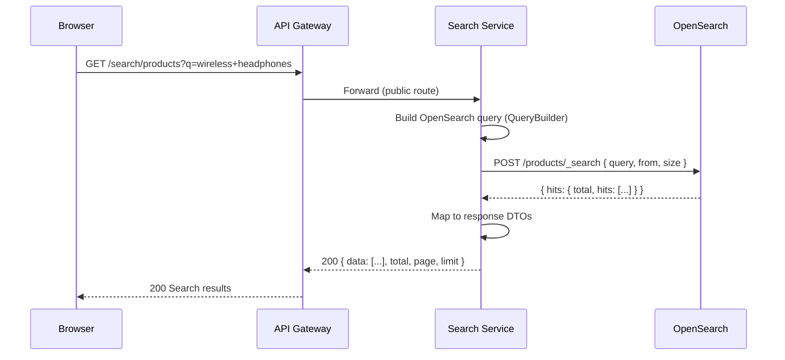

# Search & Read Model Flows

> Covers: **Search Product (OpenSearch)**, **Read Model Projection Flow**
> Service: `search-service` | Backend: OpenSearch + PostgreSQL (`search_db`) | Events: `product.events`

---

## FLOW 11: Search Product (OpenSearch)

### Step-by-Step Flow

```
Step 1:  Browser → GET /search/products?q=wireless+headphones&page=1&limit=20&category=electronics&minPrice=50&maxPrice=200
Step 2:  Route53 → CloudFront → Cache check (query string in cache key)
Step 3:  CloudFront → Cache MISS → WAF → ALB → API Gateway
Step 4:  API Gateway → @Public route → no JWT → ThrottlerGuard → Forward to Search Service
Step 5:  Search Service → SearchController.search() → QueryBus.execute(SearchProductsQuery)
Step 6:  SearchProductsHandler → Build OpenSearch query using QueryBuilder:
         - Multi-match on name + description (with fuzziness)
         - Filter by category, price range, status=ACTIVE
         - Pagination: from = (page-1) * limit, size = limit
         - Sort by relevance (_score) or specified field
Step 7:  SearchProductsHandler → Execute OpenSearch query
Step 8:  OpenSearch → Returns matching documents with highlights and scores
Step 9:  Handler → Map results to response DTOs
Step 10: Response → 200 OK with search results, facets, total count
```

### Sequence Diagram



### OpenSearch Query Example

```json
{
  "query": {
    "bool": {
      "must": [
        {
          "multi_match": {
            "query": "wireless headphones",
            "fields": ["name^3", "description"],
            "type": "best_fields",
            "fuzziness": "AUTO"
          }
        }
      ],
      "filter": [
        { "term": { "status": "ACTIVE" } },
        { "term": { "categoryId": "cat-electronics" } },
        { "range": { "price": { "gte": 5000, "lte": 20000 } } }
      ]
    }
  },
  "from": 0,
  "size": 20,
  "highlight": {
    "fields": {
      "name": {},
      "description": {}
    }
  },
  "sort": [
    { "_score": "desc" },
    { "createdAt": "desc" }
  ]
}
```

### Example Response

```json
{
  "data": [
    {
      "id": "prod-001",
      "name": "Wireless Headphones",
      "description": "Premium noise-cancelling headphones with 30h battery",
      "price": 9999,
      "status": "ACTIVE",
      "categoryId": "cat-electronics",
      "score": 12.5,
      "highlights": {
        "name": ["<em>Wireless</em> <em>Headphones</em>"],
        "description": ["Premium noise-cancelling <em>headphones</em>"]
      }
    }
  ],
  "total": 45,
  "page": 1,
  "limit": 20
}
```

### Performance Considerations

- OpenSearch is optimized for full-text search (inverted index)
- `name^3` boosts name matches 3x over description
- Fuzziness `AUTO` handles typos (1 edit for 3-5 chars, 2 edits for 6+)
- Filters use term queries (exact match, cached by OpenSearch)
- Pagination via `from/size` — deep pagination should use `search_after`

### Error Scenarios

| Error | Cause | HTTP Status | Handling |
|---|---|---|---|
| OpenSearch unavailable | Cluster down | 503 Service Unavailable | Circuit breaker → fallback to DB |
| Invalid query params | Bad price range | 400 Bad Request | DTO validation |
| Timeout | Complex query | 504 Gateway Timeout | TimeoutInterceptor (5s) |

---

## FLOW 12: Read Model Projection Flow

### How Product Data Reaches OpenSearch

This is the **event-driven projection** that keeps the OpenSearch index synchronized with the Product Service's PostgreSQL database.

```
┌───────────────┐                    ┌─────────────┐
│ Product       │   DB Transaction   │   outbox_   │
│ Service       │──────────────────→│   events    │
│ (PostgreSQL)  │   INSERT product   │ (PostgreSQL) │
│               │   + outbox event   │             │
└───────────────┘                    └──────┬──────┘
                                           │
                                    ┌──────▼──────┐
                                    │   Outbox    │  Cron poll
                                    │  Processor  │  every 5s
                                    └──────┬──────┘
                                           │
                                    ┌──────▼──────┐
                                    │   Kafka     │  topic: product.events
                                    │   Broker    │
                                    └──────┬──────┘
                                           │
                                    ┌──────▼──────┐
                                    │ Search Svc  │  ProductEventConsumer
                                    │ (Consumer)  │  group: search-service
                                    └──────┬──────┘
                                           │
                                    ┌──────▼──────┐
                                    │ InboxService│  Dedup + CAS lock
                                    │ (inbox_     │  + transaction
                                    │  events)    │
                                    └──────┬──────┘
                                           │
                              ┌────────────┼────────────┐
                              ▼            ▼            ▼
                      ProductCreated  ProductUpdated  ProductDeleted
                              │            │            │
                              ▼            ▼            ▼
                     IndexProduct    IndexProduct    RemoveProduct
                     Command         Command         Command
                              │            │            │
                              ▼            ▼            ▼
                     ┌──────────────────────────────────┐
                     │         OpenSearch Index          │
                     │     PUT /products/_doc/:id        │
                     │     DELETE /products/_doc/:id     │
                     └──────────────────────────────────┘
```

### Step-by-Step Projection Flow

```
Step 1:  Product Service → Admin creates/updates/deletes product
Step 2:  Within DB transaction:
         - Mutate products table
         - INSERT INTO outbox_events (type='ProductCreated|Updated|Deleted', payload={...})
Step 3:  OutboxProcessor → polls outbox_events WHERE processed=false (every 5s)
Step 4:  OutboxProcessor → Publish to Kafka 'product.events' with:
         - key: outbox event ID
         - value: serialized payload
         - headers: x-event-type, x-event-id
Step 5:  OutboxProcessor → Mark outbox event as processed=true
Step 6:  Search Service ProductEventConsumer → Kafka delivers message
Step 7:  Consumer → Parse message, extract eventId from headers or payload
Step 8:  Consumer → inboxService.handleIncoming({
           eventId, eventType, aggregateId: product.id,
           payload, topic: 'product.events',
           headers, source: 'product-service',
           handler: processEvent
         })
Step 9:  InboxService → INSERT INTO inbox_events ON CONFLICT DO NOTHING (dedup)
Step 10: InboxService → CAS: SET status='PROCESSING' WHERE status='RECEIVED' (lock)
Step 11: InboxService → Execute handler within DB transaction
Step 12: Handler → switch(eventType):
         - 'ProductCreated' | 'ProductUpdated' → IndexProductCommand
         - 'ProductDeleted' → RemoveProductCommand
Step 13: IndexProductCommand → PUT /products/_doc/:id with full product data
Step 14: RemoveProductCommand → DELETE /products/_doc/:id
Step 15: InboxService → Mark inbox event as PROCESSED
```

### Eventual Consistency

```
Timeline:
  T+0ms    Admin creates product → DB write committed
  T+5s     OutboxProcessor polls → publishes to Kafka
  T+5.1s   Kafka delivers to search-service consumer
  T+5.2s   InboxService dedup + processes → OpenSearch indexed
  
  Total delay: ~5-6 seconds (outbox poll interval + Kafka delivery + indexing)
```

> [!NOTE]
> The product is searchable via OpenSearch ~5-6 seconds after creation.
> Direct PostgreSQL queries via `/products` endpoints reflect changes immediately.

### Example OpenSearch Document

```json
{
  "_index": "products",
  "_id": "prod-001",
  "_source": {
    "id": "prod-001",
    "name": "Wireless Headphones",
    "description": "Premium noise-cancelling headphones with 30h battery",
    "price": 9999,
    "status": "ACTIVE",
    "categoryId": "cat-electronics",
    "attributes": {
      "brand": "AudioPro",
      "color": "Black",
      "connectivity": "Bluetooth 5.3"
    }
  }
}
```

### Example Inbox Event Record

```
inbox_events table (search_db):
  id:             inbox-uuid-001
  eventId:        evt-001-uuid (from x-event-id header — dedup key)
  eventType:      ProductCreated
  aggregateId:    prod-001
  source:         product-service
  payload:        { full event JSON }
  status:         PROCESSED
  retryCount:     0
  maxRetries:     5
  correlationId:  corr-uuid-001
  processedAt:    2026-03-22T10:00:05.200Z
  createdAt:      2026-03-22T10:00:05.100Z
```

### Failure Scenarios in Projection

| Failure Point | Behavior | Recovery |
|---|---|---|
| OutboxProcessor fails to publish | Event stays `processed=false` | Next poll retry (5s) |
| Kafka broker down | publishWithResilience (NON_BLOCKING) logs error | Next poll retry |
| Consumer crashes mid-processing | Kafka redelivers (at-least-once) | Inbox dedup prevents double processing |
| OpenSearch indexing fails | InboxService marks FAILED, schedules retry | Exponential backoff, max 5 retries → DLQ |
| Inbox maxRetries exceeded | Event status → DEAD_LETTER | Sent to `product.events.dlq` topic for manual review |
