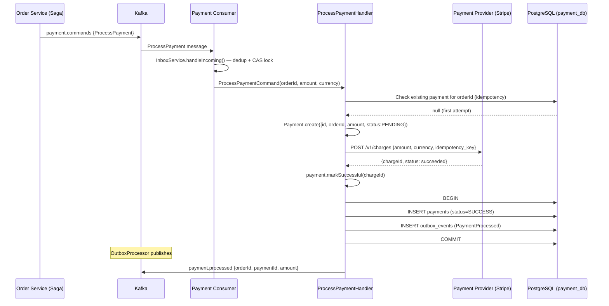
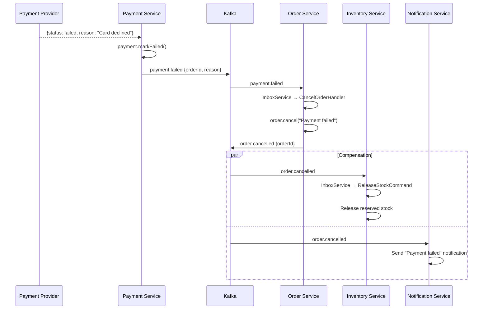

# Payment Flows

> Covers: **Payment**, **Payment Failed**, **Payment Success**
> Service: `payment-service` | Database: `payment_db` | Events: `payment.events`

---

## FLOW 17: Payment Processing

### Step-by-Step Flow

```
Step 1:  Order Service → CheckoutSagaOrchestrator.onInventoryReserved()
Step 2:  Saga → paymentService.requestPayment(orderId, amountInCents, currency, userId)
Step 3:  Payment Service adapter → publishes ProcessPayment command to Kafka 'payment.commands'
Step 4:  Payment Service PaymentCommandConsumer → receives ProcessPayment command
Step 5:  Consumer → InboxService.handleIncoming():
         - eventId extracted from headers or generated from orderId
         - Dedup check: INSERT INTO inbox_events ON CONFLICT DO NOTHING
         - CAS lock: RECEIVED → PROCESSING
Step 6:  Consumer → ProcessPaymentHandler.execute(ProcessPaymentCommand):
         - orderId, userId, amountInCents, currency, provider (default), idempotencyKey (orderId)
Step 7:  Handler → Check idempotency: find existing payment for orderId
Step 8:  If already processed → return existing result (idempotent)
Step 9:  Handler → Create Payment aggregate:
         - Payment.create({ id: uuid, orderId, userId, amount: Money, status: PENDING })
Step 10: Handler → Call payment provider API (Stripe/PayPal simulation):
         - POST /v1/charges { amount, currency, idempotency_key }
Step 11: Provider → Returns { chargeId, status: succeeded/failed }
Step 12: Handler → Update payment status based on provider response:
         - Success: payment.markSuccessful(chargeId)
         - Failure: payment.markFailed(reason)
Step 13: Handler → Within DB transaction:
         - INSERT/UPDATE payments table
         - INSERT INTO outbox_events (type='PaymentProcessed' or 'PaymentFailed')
         - COMMIT
Step 14: OutboxProcessor → publishes to Kafka 'payment.events'
Step 15: Order Service PaymentEventConsumer → receives event
Step 16: If PaymentProcessed → ConfirmPaymentHandler → order.confirmPayment()
Step 17: If PaymentFailed → CancelOrderHandler → order.cancel("Payment failed")
```

### Sequence Diagram



---

## FLOW 18: Payment Success

### What Happens After Payment Succeeds

```
Step 1:  Payment Service → outbox publishes 'payment.processed' to Kafka
Step 2:  Order Service PaymentEventConsumer → receives message
Step 3:  InboxService.handleIncoming():
         - Dedup by eventId
         - CAS lock: RECEIVED → PROCESSING
Step 4:  processEvent() → switch(meta.eventType):
         - 'PaymentProcessed' → ConfirmPaymentHandler.execute()
Step 5:  ConfirmPaymentHandler:
         - orderRepository.findById(orderId)
         - order.confirmPayment(paymentId)
         - Validates: current status must be PENDING_PAYMENT
         - Transitions to PAYMENT_CONFIRMED
Step 6:  Within DB transaction:
         - UPDATE orders SET status='PAYMENT_CONFIRMED', payment_id=?
         - INSERT INTO outbox_events (order.updated, status=PAYMENT_CONFIRMED)
         - COMMIT
Step 7:  OutboxProcessor → publishes order.updated to Kafka
Step 8:  Notification Service → sends "Payment confirmed" email
Step 9:  InboxService → marks inbox event as PROCESSED
```

### Example Payment Success Event

```json
{
  "type": "PaymentProcessed",
  "schemaVersion": 1,
  "source": "payment-service",
  "correlationId": "corr-uuid-001",
  "timestamp": "2026-03-22T10:00:03.000Z",
  "payload": {
    "orderId": "ord-789e0123",
    "paymentId": "pay-uuid-001",
    "amount": 24997,
    "status": "SUCCESS"
  }
}
```

### Example Database Record

**`payments` table (payment_db):**
```
id:               pay-uuid-001
order_id:         ord-789e0123
user_id:          usr-123e4567
amount_in_cents:  24997
currency:         USD
status:           SUCCESS
provider:         stripe
charge_id:        ch_1234567890
idempotency_key:  ord-789e0123
created_at:       2026-03-22T10:00:02.000Z
updated_at:       2026-03-22T10:00:03.000Z
```

---

## FLOW 19: Payment Failed

### What Happens After Payment Fails

```
Step 1:  Payment Provider → Returns failure (insufficient funds, card declined, etc.)
Step 2:  ProcessPaymentHandler → payment.markFailed("Card declined")
Step 3:  Within DB transaction:
         - INSERT/UPDATE payments (status=FAILED, reason="Card declined")
         - INSERT INTO outbox_events (type='PaymentFailed')
         - COMMIT
Step 4:  OutboxProcessor → publishes 'payment.failed' to Kafka
Step 5:  Order Service PaymentEventConsumer → receives 'PaymentFailed'
Step 6:  InboxService → dedup + CAS lock
Step 7:  processEvent() → switch:
         - 'PaymentFailed' → CancelOrderHandler.execute()
Step 8:  CancelOrderHandler:
         - orderRepository.findById(orderId)
         - order.cancel("Payment failed")
         - Transitions to CANCELLED
Step 9:  Within DB transaction:
         - UPDATE orders SET status='CANCELLED', cancel_reason='Payment failed'
         - INSERT INTO outbox_events (type='order.cancelled')
         - COMMIT
Step 10: OutboxProcessor → publishes order.cancelled to Kafka
Step 11: Inventory Service → consumes order.cancelled → ReleaseStockCommand
Step 12: Inventory releases reserved quantities
Step 13: Notification Service → sends "Payment failed" notification
```

### Sequence Diagram — Payment Failure Compensation



### Example Payment Failed Event

```json
{
  "type": "PaymentFailed",
  "schemaVersion": 1,
  "source": "payment-service",
  "correlationId": "corr-uuid-001",
  "timestamp": "2026-03-22T10:00:03.000Z",
  "payload": {
    "orderId": "ord-789e0123",
    "amount": 24997,
    "reason": "Card declined — insufficient funds",
    "status": "FAILED"
  }
}
```

### Idempotency in Payment Processing

```
Problem: What if ProcessPayment command is delivered twice from Kafka?

Solution:
1. Inbox Pattern — InboxService deduplicates by eventId
   INSERT INTO inbox_events (event_id) ON CONFLICT DO NOTHING
   
2. Payment-level idempotency — idempotencyKey = orderId
   Before processing, check: SELECT * FROM payments WHERE order_id = ? AND status != FAILED
   If exists and SUCCESSFUL → skip (already processed)
   
3. Provider-level idempotency — Stripe idempotency_key
   POST /v1/charges with Idempotency-Key header
   Stripe returns cached result on duplicate requests

Triple-layer protection:
  Inbox (Kafka dedup) → Payment DB (order-level dedup) → Stripe API (provider dedup)
```

### Error Scenarios

| Error | Cause | HTTP Status | Handling |
|---|---|---|---|
| Card declined | Insufficient funds | N/A (event) | PaymentFailed → cancel order |
| Provider timeout | Stripe API slow | N/A | safeExecute with timeout + retry |
| Provider down | Stripe outage | N/A | Circuit breaker → retry later |
| Duplicate payment | Same orderId | N/A | Idempotency: skip if already paid |
| Saga compensation fails | Cancel handler throws | N/A | Logged as CRITICAL, manual intervention |
