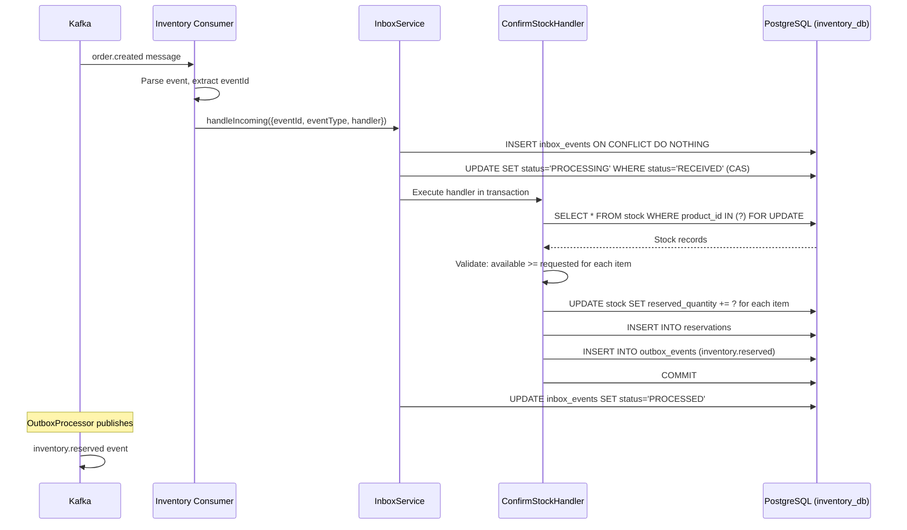
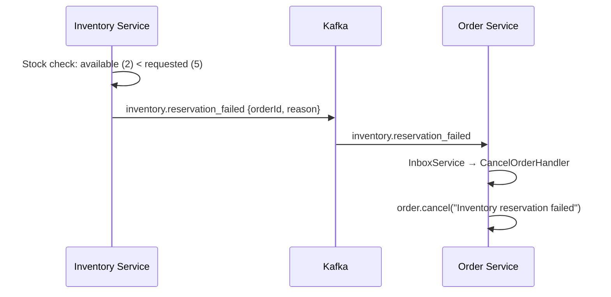

# Inventory Flows

> Covers: **Inventory Reserve**, **Inventory Release**
> Service: `inventory-service` | Database: `inventory_db` | Events: `inventory.events`

---

## FLOW 20: Inventory Reserve

### Step-by-Step Flow

```
Step 1:  Kafka → order.created event published by Order Service OutboxProcessor
Step 2:  Inventory Service OrderEventConsumer → receives message from 'order.events' topic
         Consumer group: inventory-service-orders
Step 3:  Consumer → Parse message, extract eventId from x-event-id header
Step 4:  Consumer → InboxService.handleIncoming():
         - eventId: from header
         - eventType: 'OrderConfirmed' or 'order.confirmed'
         - aggregateId: orderId
         - payload: full event
         - source: 'order-service'
Step 5:  InboxService → INSERT INTO inbox_events ON CONFLICT DO NOTHING (dedup)
Step 6:  InboxService → CAS: SET status='PROCESSING' WHERE status='RECEIVED'
Step 7:  InboxService → Execute handler within DB transaction
Step 8:  processEvent() → switch(eventType):
         - 'OrderConfirmed' → ConfirmStockCommand(orderId, 'ORDER', idempotencyKey, correlationId)
Step 9:  ConfirmStockHandler → commandBus.execute(ConfirmStockCommand)
Step 10: Handler → For each item in order:
         - Find stock record: SELECT * FROM stock WHERE product_id = ?
         - Validate: available_quantity >= requested_quantity
         - If insufficient → throw InsufficientStockException
Step 11: Handler → Reserve stock:
         - UPDATE stock SET reserved_quantity = reserved_quantity + ? WHERE product_id = ?
         - Use optimistic locking (version column) or SELECT FOR UPDATE
Step 12: Handler → stock.addDomainEvent(new InventoryReservedEvent)
Step 13: Handler → DB transaction:
         - UPDATE stock (reserve quantities)
         - INSERT INTO reservations (order_id, product_id, quantity, status='RESERVED')
         - INSERT INTO outbox_events (type='inventory.reserved')
         - COMMIT
Step 14: InboxService → marks inbox event as PROCESSED
Step 15: OutboxProcessor → publishes inventory.reserved to Kafka
Step 16: Order Service → receives inventory.reserved → saga continues with payment
```

### Sequence Diagram



### Stock Table Schema

```
stock table (inventory_db):
  product_id:         prod-001 (PK)
  total_quantity:     1000           — total in warehouse
  reserved_quantity:  200            — reserved for orders/carts
  available_quantity: COMPUTED (total - reserved)
  version:           5              — optimistic locking
  updated_at:        2026-03-22T10:00:01.000Z
```

### Reservation Table

```
reservations table:
  id:           res-uuid-001
  order_id:     ord-789e0123
  product_id:   prod-001
  quantity:     2
  type:         ORDER             — or CART
  status:       RESERVED          — RESERVED | CONFIRMED | RELEASED
  created_at:   2026-03-22T10:00:01.000Z
```

### Error Scenario: Insufficient Stock

```
Step 1: ConfirmStockHandler checks: available = total - reserved = 1000 - 998 = 2
Step 2: Requested: 5 units
Step 3: 2 < 5 → InsufficientStockException
Step 4: Handler throws → InboxService.handleFailure()
Step 5: InboxService → marks inbox event as FAILED (retry won't help — business error)
Step 6: Alternative: publish inventory.reservation_failed to Kafka
Step 7: Order Service → receives inventory.reservation_failed
Step 8: CancelOrderHandler → order.cancel("Inventory reservation failed")
```



---

## FLOW 21: Inventory Release

### Step-by-Step Flow

```
Step 1:  Kafka → order.cancelled event published by Order Service
Step 2:  Inventory Service OrderEventConsumer → receives from 'order.events'
Step 3:  InboxService.handleIncoming() → dedup + CAS lock
Step 4:  processEvent() → switch(eventType):
         - 'OrderCancelled' | 'order.cancelled' → ReleaseStockCommand
Step 5:  ReleaseStockHandler → commandBus.execute(ReleaseStockCommand):
         - orderId, referenceType='ORDER', idempotencyKey, reason='order_failed'
Step 6:  Handler → Find reservations: SELECT * FROM reservations WHERE order_id = ? AND status = 'RESERVED'
Step 7:  Handler → For each reservation:
         - UPDATE stock SET reserved_quantity = reserved_quantity - ? WHERE product_id = ?
         - UPDATE reservations SET status = 'RELEASED' WHERE id = ?
Step 8:  Handler → stock.addDomainEvent(new InventoryReleasedEvent)
Step 9:  Handler → DB transaction:
         - UPDATE stock (decrease reserved quantities)
         - UPDATE reservations (status='RELEASED')
         - INSERT INTO outbox_events (type='inventory.released')
         - COMMIT
Step 10: InboxService → marks inbox event as PROCESSED
Step 11: OutboxProcessor → publishes inventory.released to Kafka
```

### Triggers for Inventory Release

| Trigger Event | Source | Action |
|---|---|---|
| `order.cancelled` | Order Service | Release all reserved items for order |
| `order.failed` | Order Service | Release all reserved items for order |
| `cart.expired` | Cart Service | Release cart-reserved items |
| `payment.failed` (via order.cancelled) | Payment → Order | Cascaded release |

### Example Kafka Event: Inventory Released

```json
{
  "type": "inventory.released",
  "schemaVersion": 1,
  "source": "inventory-service",
  "correlationId": "corr-uuid-001",
  "timestamp": "2026-03-22T10:00:05.000Z",
  "payload": {
    "orderId": "ord-789e0123",
    "items": [
      { "productId": "prod-001", "quantity": 2 },
      { "productId": "prod-002", "quantity": 1 }
    ],
    "reason": "order_failed"
  }
}
```

### Concurrency Control

```
Problem: Two orders simultaneously reserving stock for the same product

Solution: Optimistic Locking with version column

  Thread A: UPDATE stock SET reserved_quantity = 202, version = 6 
            WHERE product_id = 'prod-001' AND version = 5
  Thread B: UPDATE stock SET reserved_quantity = 205, version = 6 
            WHERE product_id = 'prod-001' AND version = 5

  Thread A: affected_rows = 1 → SUCCESS
  Thread B: affected_rows = 0 → CONFLICT → retry with fresh data

Alternative: SELECT FOR UPDATE (pessimistic locking)
  SELECT * FROM stock WHERE product_id = 'prod-001' FOR UPDATE
  → Row-level lock until transaction commits → serialized access
```
