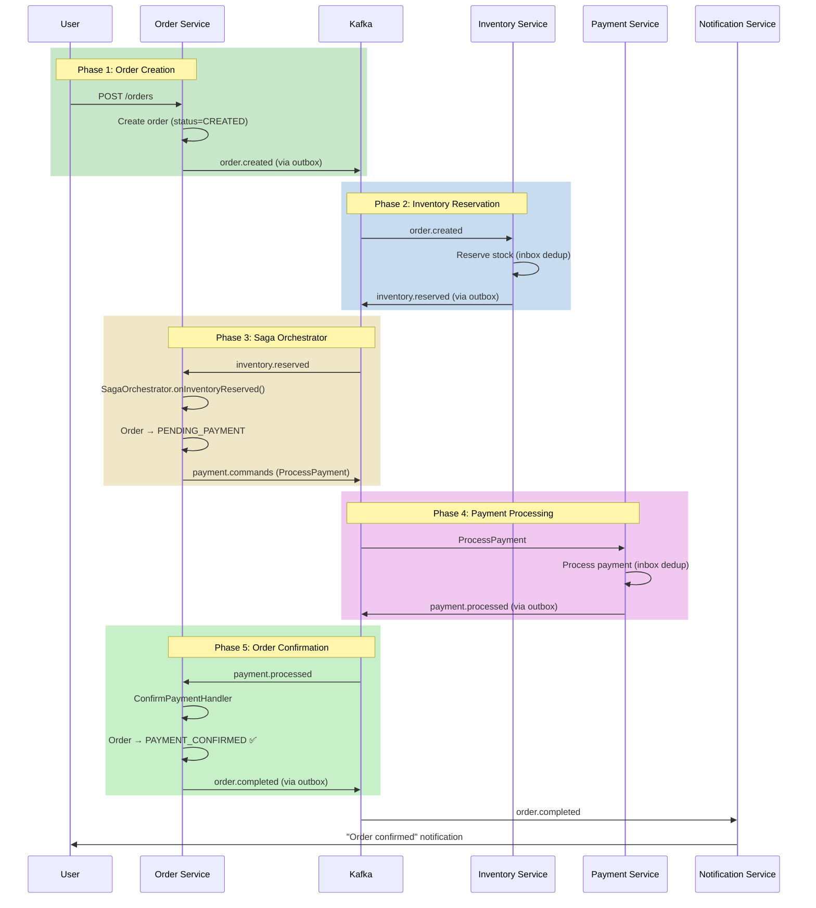
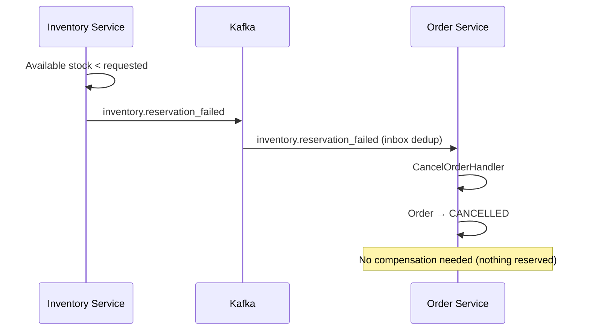
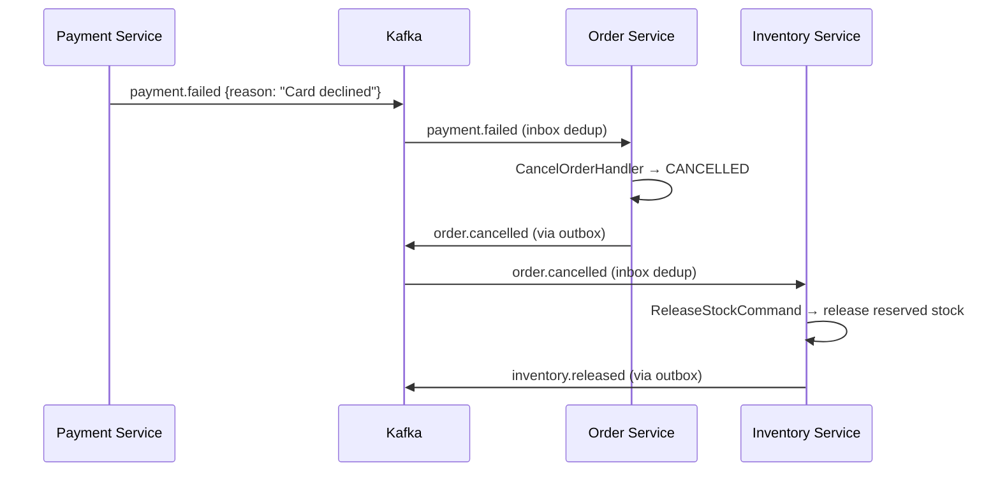

# Saga Flow: Order + Payment + Inventory

> Covers: **Complete Saga Lifecycle**, **Compensation**, **Failure Recovery**
> Orchestrator: `CheckoutSagaOrchestrator` in `order-service`

---

## FLOW 22: Checkout Saga — End-to-End

### Saga Overview

The checkout saga is an **orchestration-based saga** managed by the Order Service's `CheckoutSagaOrchestrator`. State is tracked implicitly through Order status transitions.

```
┌─────────────────────────────────────────────────────────────────────────┐
│                    CHECKOUT SAGA STATE MACHINE                          │
│                                                                         │
│  ┌─────────┐  order.created   ┌──────────────┐  inventory.reserved     │
│  │         │ ──────────────→ │              │ ──────────────────────→  │
│  │  START  │                 │   RESERVE    │                          │
│  │         │                 │  INVENTORY   │                          │
│  └─────────┘                 └──────┬───────┘                          │
│                                     │                                   │
│                         ┌───────────┼────────────┐                     │
│                         │           │            │                     │
│                    ✅ Success    ❌ Failed                              │
│                         │           │                                   │
│                         ▼           ▼                                   │
│               ┌──────────────┐  ┌─────────┐                           │
│               │  REQUEST     │  │ CANCEL  │  ← Compensation           │
│               │  PAYMENT     │  │ ORDER   │                           │
│               └──────┬───────┘  └─────────┘                           │
│                      │                                                  │
│          ┌───────────┼────────────┐                                    │
│          │           │            │                                    │
│     ✅ Success    ❌ Failed    ❌ Request Failed                       │
│          │           │            │                                    │
│          ▼           ▼            ▼                                    │
│  ┌──────────────┐ ┌─────────┐ ┌─────────┐                            │
│  │  CONFIRM     │ │ CANCEL  │ │ CANCEL  │  ← Compensation            │
│  │  ORDER       │ │ ORDER   │ │ ORDER   │    (release inventory)     │
│  │ (COMPLETED)  │ │ +RELEASE│ │ +RELEASE│                            │
│  └──────────────┘ └─────────┘ └─────────┘                            │
└─────────────────────────────────────────────────────────────────────────┘
```

### Step-by-Step: Happy Path

```
Phase 1: Order Creation
  Step 1:  User submits order → CreateOrderHandler
  Step 2:  Order created with status=CREATED
  Step 3:  outbox_events: order.created

Phase 2: Inventory Reservation
  Step 4:  OutboxProcessor → Kafka 'order.events'
  Step 5:  Inventory Service consumer → InboxService (dedup)
  Step 6:  ConfirmStockCommand → reserve stock
  Step 7:  outbox_events: inventory.reserved

Phase 3: Payment Request (Saga Orchestrator)
  Step 8:  OutboxProcessor → Kafka 'inventory.events'
  Step 9:  Order Service InventoryEventConsumer → InboxService (dedup)
  Step 10: CheckoutSagaOrchestrator.onInventoryReserved(orderId)
  Step 11: Order status: CREATED → PENDING_PAYMENT
  Step 12: paymentService.requestPayment() → Kafka 'payment.commands'

Phase 4: Payment Processing
  Step 13: Payment Service consumer → InboxService (dedup)
  Step 14: ProcessPaymentHandler → call payment provider
  Step 15: Provider returns SUCCESS
  Step 16: outbox_events: payment.processed

Phase 5: Order Confirmation
  Step 17: OutboxProcessor → Kafka 'payment.events'
  Step 18: Order Service PaymentEventConsumer → InboxService (dedup)
  Step 19: ConfirmPaymentHandler → order.confirmPayment(paymentId)
  Step 20: Order status: PENDING_PAYMENT → PAYMENT_CONFIRMED
  Step 21: SAGA COMPLETE ✅
```

### Complete Sequence Diagram



---

### Compensation Flows

#### Compensation 1: Inventory Reservation Failed

```
Step 1:  Inventory Service → stock check fails (insufficient quantity)
Step 2:  Publishes inventory.reservation_failed to Kafka
Step 3:  Order Service InventoryEventConsumer → InboxService (dedup)
Step 4:  CancelOrderHandler → order.cancel("Inventory reservation failed")
Step 5:  Order status: CREATED → CANCELLED
Step 6:  No stock was reserved → no release needed
```



#### Compensation 2: Payment Failed

```
Step 1:  Payment Provider → returns FAILED
Step 2:  Payment Service → publishes payment.failed to Kafka
Step 3:  Order Service PaymentEventConsumer → CancelOrderHandler
Step 4:  Order status: PENDING_PAYMENT → CANCELLED
Step 5:  Order Service → publishes order.cancelled to Kafka
Step 6:  Inventory Service → consumes order.cancelled → releases reserved stock
```



#### Compensation 3: Payment Request Failed (Network Error)

```
Step 1:  CheckoutSagaOrchestrator.onInventoryReserved()
Step 2:  paymentService.requestPayment() throws (Kafka publish failed)
Step 3:  Saga catches error
Step 4:  Saga → cancelOrderHandler.execute(CancelOrderCommand) → compensation
Step 5:  Order status: PENDING_PAYMENT → CANCELLED
Step 6:  order.cancelled → Inventory Service → release stock
```

```typescript
// From CheckoutSagaOrchestrator — actual compensation code:
try {
  await this.paymentService.requestPayment(orderId, amount, currency, userId);
} catch (error) {
  this.logger.error(`Saga: Payment request failed. Compensating...`);
  try {
    await this.cancelOrderHandler.execute(
      new CancelOrderCommand(orderId, 'Payment request failed — saga compensation'),
    );
  } catch (compensationError) {
    this.logger.error(
      `Saga: CRITICAL — Compensation failed for order ${orderId}. Manual intervention required.`,
    );
  }
}
```

---

### Saga Failure Recovery

| Failure Scenario | State Before | Recovery | State After |
|---|---|---|---|
| Inventory consumer crashes | CREATED | Kafka redelivers, inbox dedup | CREATED → resumes |
| Inventory reservation fails (out of stock) | CREATED | Cancel order | CANCELLED |
| Saga orchestrator crashes mid-processing | PENDING_PAYMENT | Kafka redelivers to inbox | Resume from last step |
| Payment request network error | PENDING_PAYMENT | Cancel order → release inventory | CANCELLED |
| Payment provider fails (card declined) | PENDING_PAYMENT | Cancel order → release inventory | CANCELLED |
| Payment consumer crashes | Payment SUCCESS in DB | Kafka redelivers, inbox dedup | PAYMENT_CONFIRMED |
| Order confirmation crashes | Payment confirmed | Kafka redelivers, inbox dedup | PAYMENT_CONFIRMED |

### Critical Safety Net

```
⚠️ CRITICAL scenario: Compensation itself fails

If cancelOrderHandler throws during compensation:
1. Logger.error("CRITICAL — Compensation failed for order ${orderId}")
2. Order is stuck in PENDING_PAYMENT
3. Requires MANUAL INTERVENTION:
   - Ops team receives alert via CloudWatch alarm
   - Manual DB UPDATE to cancel order
   - Manual inventory release via admin API
   - Post-mortem investigation

Prevention:
- CancelOrderHandler uses safeExecute with retries
- Outbox pattern ensures events are eventually published
- Inbox pattern ensures events are eventually processed
```

---

### Distributed Transaction Guarantees

| Property | Guarantee | Mechanism |
|---|---|---|
| **Atomicity** | Per-service (local ACID) | PostgreSQL transactions |
| **Consistency** | Eventual (cross-service) | Saga orchestration + compensation |
| **Isolation** | None (cross-service) | Saga state machine prevents invalid transitions |
| **Durability** | Yes (per-service) | PostgreSQL WAL + Kafka replication |
| **Idempotency** | Yes (all consumers) | Inbox pattern with UNIQUE eventId |
| **At-least-once delivery** | Yes | Kafka consumer groups + offset management |
| **Exactly-once processing** | Yes | Inbox dedup + CAS locking |

---

### Saga Timeline (Typical Happy Path)

```
T+0.0s    User submits order → DB write (order created)
T+0.0s    Outbox event written atomically
T+5.0s    OutboxProcessor polls → publishes to Kafka
T+5.1s    Inventory consumer receives → inbox dedup → reserve stock
T+5.2s    Inventory outbox event written
T+10.2s   OutboxProcessor publishes inventory.reserved
T+10.3s   Order consumer receives → saga orchestrator
T+10.4s   Order updates to PENDING_PAYMENT → payment request published
T+15.4s   OutboxProcessor publishes ProcessPayment
T+15.5s   Payment consumer receives → process payment
T+16.0s   Payment provider API call (~500ms)
T+16.5s   Payment outbox event written
T+21.5s   OutboxProcessor publishes payment.processed
T+21.6s   Order consumer receives → confirm payment
T+21.7s   Order status → PAYMENT_CONFIRMED ✅

Total: ~22 seconds (with 5s outbox poll intervals)
In production with 1s poll intervals: ~5-6 seconds
```
