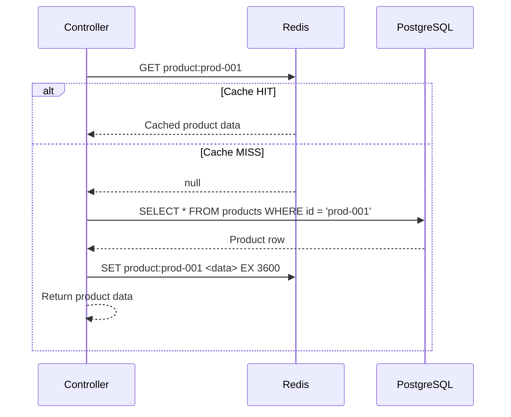
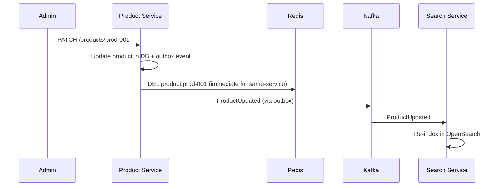
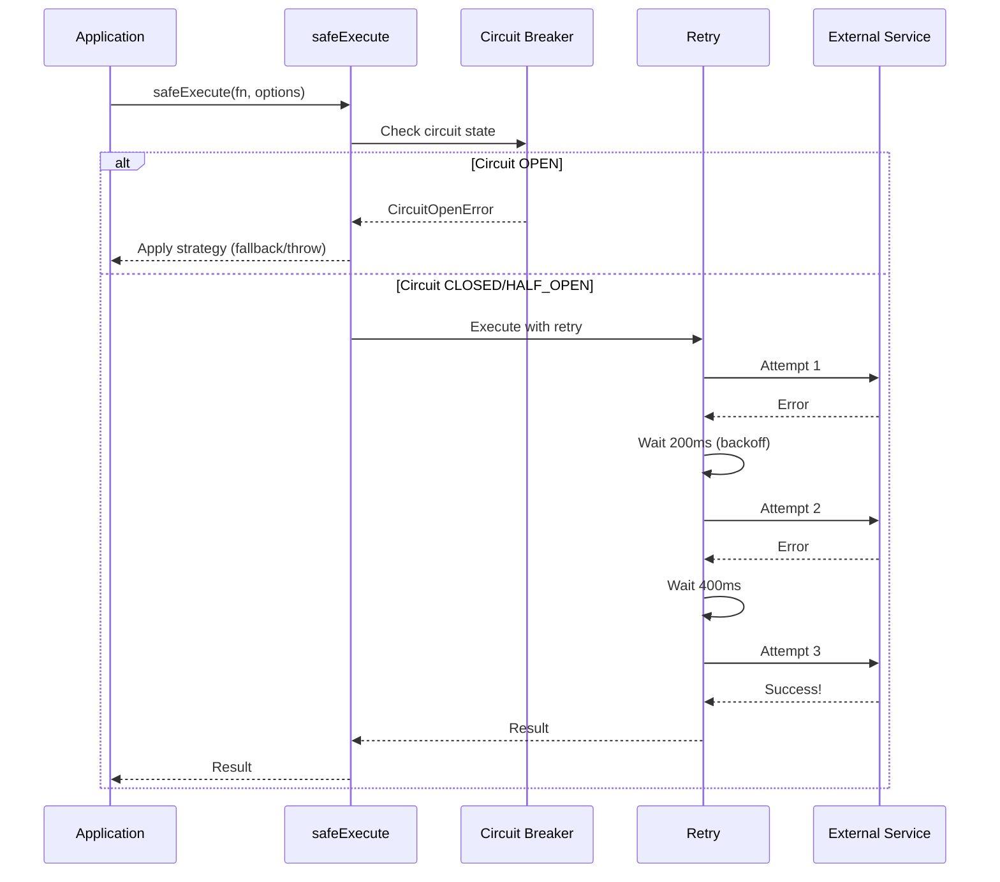
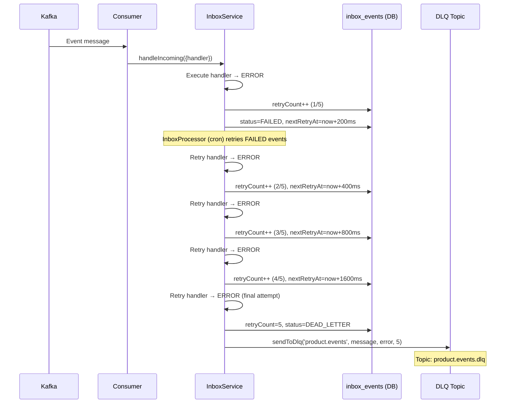

# Event Infrastructure Flows

> Covers: **Kafka Event Flow Between Services**, **Cache Read Flow**, **Cache Invalidation Flow**, **Retry Flow when Service Down**, **Dead Letter Queue Flow**, **Circuit Breaker**

---

## FLOW 23: Kafka Event Flow Between Services

### Complete Event Topology

```
┌──────────────────────────────────────────────────────────────────────────────┐
│                        KAFKA TOPIC TOPOLOGY                                  │
├──────────────────┬───────────────────┬───────────────────────────────────────┤
│ Topic            │ Producer          │ Consumers                             │
├──────────────────┼───────────────────┼───────────────────────────────────────┤
│ user.registered  │ Auth Service      │ User Service, Notification Service    │
│ user.logged_in   │ Auth Service      │ Notification Service (audit)          │
│ user.login_failed│ Auth Service      │ Notification Service (security)       │
│ product.events   │ Product Service   │ Search Service                        │
│ order.events     │ Order Service     │ Inventory Service, Notification Svc   │
│ cart.events      │ Cart Service      │ Inventory Service, Notification Svc   │
│ inventory.events │ Inventory Service │ Order Service                         │
│ payment.commands │ Order Service     │ Payment Service                       │
│ payment.events   │ Payment Service   │ Order Service                         │
├──────────────────┼───────────────────┼───────────────────────────────────────┤
│ DLQ Topics       │                   │                                       │
├──────────────────┼───────────────────┼───────────────────────────────────────┤
│ order.events.dlq │ InboxService      │ Manual review / ops tooling           │
│ payment.events.dlq│ InboxService     │ Manual review / ops tooling           │
│ product.events.dlq│ InboxService     │ Manual review / ops tooling           │
│ inventory.events.dlq│InboxService    │ Manual review / ops tooling           │
│ payment.commands.dlq│InboxService    │ Manual review / ops tooling           │
└──────────────────┴───────────────────┴───────────────────────────────────────┘
```

### Consumer Group Assignments

```
┌──────────────────────────────────┬──────────────────────┐
│ Consumer Group ID                │ Service              │
├──────────────────────────────────┼──────────────────────┤
│ inventory-service-orders         │ Inventory Service    │
│ order-service-payment            │ Order Service        │
│ order-service-inventory          │ Order Service        │
│ payment-service-commands         │ Payment Service      │
│ search-service-products          │ Search Service       │
│ notification-service-events      │ Notification Service │
└──────────────────────────────────┴──────────────────────┘
```

### Event Publishing Pipeline

```
Producer Service                         Consumer Service
┌─────────────────┐                     ┌─────────────────┐
│ 1. Domain logic  │                     │ 7. KafkaJS      │
│ 2. DB Transaction│                     │    consumer.run()│
│    - State change│                     │ 8. Parse message │
│    - Outbox event│                     │ 9. InboxService  │
│ 3. COMMIT        │                     │    handleIncoming│
│                  │                     │ 10. Dedup check  │
│ 4. OutboxProc    │                     │ 11. CAS lock     │
│    polls (5s)    │     Kafka           │ 12. Handler()    │
│ 5. Publish to    │─────────────────────│ 13. Mark         │
│    Kafka topic   │   (at-least-once)   │     PROCESSED    │
│ 6. Mark processed│                     │                  │
└─────────────────┘                     └─────────────────┘
```

### Message Headers Standard

Every Kafka message carries these headers:

| Header | Description | Example |
|---|---|---|
| `x-event-type` | Event type name | `ProductCreated` |
| `x-event-id` | Unique event ID (outbox ID) | `evt-uuid-001` |
| `x-correlation-id` | Distributed tracing correlation | `corr-uuid-001` |
| `x-dlq-reason` | (DLQ only) Error message | `OpenSearch indexing timeout` |
| `x-dlq-timestamp` | (DLQ only) When DLQ'd | `2026-03-22T10:00:00Z` |
| `x-dlq-original-topic` | (DLQ only) Source topic | `product.events` |
| `x-dlq-service` | (DLQ only) Failing service | `search-service` |
| `x-retry-count` | (DLQ only) Retry attempts | `5` |

---

## FLOW 24: Cache Read Flow

### Redis Cache-Aside Pattern

```
Step 1:  Service receives read request
Step 2:  Check Redis cache: GET <cache-key>
Step 3:  If HIT → return cached data directly (skip DB)
Step 4:  If MISS → query PostgreSQL
Step 5:  Store result in Redis: SET <cache-key> <data> EX <ttl>
Step 6:  Return data to caller
```



### Redis Key Naming Convention

```
Pattern: {domain}:{entity}:{id}[:{sub-resource}]

Examples:
  product:prod-001                    → Full product details (TTL: 1h)
  product:list:cat-electronics:p1     → Product list page 1 (TTL: 5min)
  cart:usr-123e4567                   → Cart data (TTL: 24h)
  stock:prod-001                      → Stock availability (TTL: 30s)
  session:usr-123e4567                → User session (TTL: 15min)
  rt:usr-123e4567                     → Refresh token (TTL: 7d)
  login:attempts:john@example.com     → Login attempt counter (TTL: 15min)
  blocklist:jti:abc123                → JTI blocklist (TTL: access token life)
  throttle:{ip}:{route}               → Rate limit counter (TTL: 60s)
```

### Resilience: Cache Read with safeExecute

```typescript
const product = await safeExecute(
  () => redis.get(`product:${productId}`),
  {
    strategy: StrategyType.FAIL_OPEN,      // Cache miss is acceptable
    timeout: 1000,                          // 1s timeout
    fallback: () => null,                   // Return null on failure
    circuitBreakerKey: 'redis',             // Shared circuit breaker
    label: 'cache:getProduct',
  },
);

if (product) return JSON.parse(product);    // Cache HIT
// Else: fall through to database query
```

---

## FLOW 25: Cache Invalidation Flow

### Event-Driven Cache Invalidation

```
Step 1:  Product Service → Admin updates product
Step 2:  DB transaction: UPDATE products + INSERT outbox_events
Step 3:  OutboxProcessor → publishes ProductUpdated to Kafka
Step 4:  Consumer (same or different service) → invalidates cache
Step 5:  Redis → DEL product:prod-001
Step 6:  Next read request → cache MISS → fresh data from DB → re-cached
```

### Invalidation Strategies

| Strategy | When Used | Example |
|---|---|---|
| **Write-through** | Immediate consistency needed | Update cache on write |
| **Cache-aside (lazy)** | Eventually consistent OK | Delete cache, next read refreshes |
| **Event-driven** | Cross-service invalidation | Kafka event triggers DEL |
| **TTL-based** | Low-priority data | Auto-expires (product list: 5min) |

### Example: Product Update Invalidation



---

## FLOW 26: Retry Flow When Service Down

### safeExecute Retry Pipeline

```
Step 1:  fn() called → fails with error
Step 2:  Retry check: attempt < maxAttempts?
Step 3:  Calculate delay: backoffMs × 2^attempt + jitter
Step 4:  Wait for delay
Step 5:  Retry fn() → if succeeds → return result
Step 6:  If fails again → repeat steps 2-5
Step 7:  After maxAttempts exhausted → apply strategy:
         - FAIL_CLOSE → throw error
         - FAIL_OPEN → return fallback value
         - NON_BLOCKING → log error, return undefined
```



### Retry Configuration Examples

```typescript
// Database — strict consistency, 3 retries
await safeExecute(() => db.query(sql), {
  strategy: StrategyType.FAIL_CLOSE,
  retry: { attempts: 3, backoffMs: 200 },
  circuitBreakerKey: 'db-primary',
  label: 'db:findUsers',
});

// Redis — graceful degradation
await safeExecute(() => redis.get(key), {
  strategy: StrategyType.FAIL_OPEN,
  timeout: 1000,
  fallback: () => cachedValue,
  circuitBreakerKey: 'redis',
  label: 'redis:getSession',
});

// Kafka — fire-and-forget
await safeExecute(() => producer.send(record), {
  strategy: StrategyType.NON_BLOCKING,
  label: 'kafka:publishAuditLog',
});
```

### Exponential Backoff with Jitter

```
Attempt 1: wait 200ms + random(0-50ms)
Attempt 2: wait 400ms + random(0-100ms)
Attempt 3: wait 800ms + random(0-200ms)
Attempt 4: wait 1600ms + random(0-400ms)

Formula: delay = backoffMs × 2^attempt + random(0, backoffMs × 2^(attempt-1) / 2)
```

---

## FLOW 27: Circuit Breaker

### Circuit Breaker State Machine

```
                ┌──────────────────────────────┐
                │                              │
                │         ┌─────────┐          │
                │    ┌───→│  CLOSED │←────┐    │
                │    │    └────┬────┘     │    │
                │    │         │          │    │
                │    │  failures ≥        │    │
                │    │  threshold         │    │
                │    │         │      success   │
                │    │         ▼      in probe  │
                │    │    ┌────────┐      │    │
                │    │    │  OPEN  │──────┘    │
                │    │    └────┬───┘           │
                │    │         │               │
                │    │  cooldown               │
                │    │  timer expires          │
                │    │         │               │
                │    │         ▼               │
                │    │   ┌──────────┐          │
                │    └───│HALF_OPEN │──────────┘
                │        │(1 probe  │  probe fails
                │        │ request) │  → back to OPEN
                │        └──────────┘
                │                              │
                └──────────────────────────────┘

Default settings:
  failureThreshold: 5     (5 failures → OPEN)
  cooldownMs: 30000        (30s before HALF_OPEN)
  halfOpenMax: 1           (1 probe request)
```

### Per-Key Circuit Breakers

```
Circuit breakers are keyed — each external dependency has its own breaker:

  'redis'        → Circuit for Redis connections
  'db-primary'   → Circuit for primary PostgreSQL
  'stripe'       → Circuit for Stripe payment API
  'opensearch'   → Circuit for OpenSearch cluster

Each key tracks its own failure count and state independently.
```

### Example Prometheus Metrics

```
# Circuit breaker state changes
resilience_exec_total{strategy="FAIL_OPEN", status="success", label="redis:getSession"}  150
resilience_exec_total{strategy="FAIL_OPEN", status="failure", label="redis:getSession"}  3
resilience_exec_duration_seconds_bucket{strategy="FAIL_OPEN", label="redis:getSession", le="0.01"}  145
resilience_retry_total{label="db:findUsers"}  7
```

---

## FLOW 28: Dead Letter Queue Flow

### DLQ Processing Pipeline

```
Step 1:  Consumer → InboxService.handleIncoming() → handler fails
Step 2:  InboxService.handleFailure():
         - Increment retryCount
         - If retryCount < maxRetries (5):
           → Mark inbox event as FAILED
           → Calculate nextRetryAt = now + backoffMs × 2^retryCount
         - If retryCount >= maxRetries:
           → Mark inbox event as DEAD_LETTER
           → Call KafkaDlqProducer.sendToDlq()
Step 3:  KafkaDlqProducer:
         - Target topic: <original-topic>.dlq
         - Add DLQ headers: reason, timestamp, original-topic, service, retry-count, correlation-id
Step 4:  DLQ message published to Kafka
Step 5:  Manual review by ops team (or automated DLQ processor)
```



### Example DLQ Message

**Topic:** `product.events.dlq`
```json
{
  "key": "evt-001-uuid",
  "value": "{\"id\":\"prod-001\",\"name\":\"Headphones\",\"price\":9999}",
  "headers": {
    "x-event-type": "ProductCreated",
    "x-event-id": "evt-001-uuid",
    "x-dlq-reason": "OpenSearch cluster unavailable: connect ECONNREFUSED",
    "x-dlq-timestamp": "2026-03-22T10:00:30.000Z",
    "x-dlq-original-topic": "product.events",
    "x-dlq-service": "search-service",
    "x-correlation-id": "corr-uuid-001",
    "x-retry-count": "5"
  }
}
```

### DLQ Recovery Process

```
1. Monitor: CloudWatch alarm on DLQ topic message count > 0
2. Investigate: Read DLQ messages, check x-dlq-reason
3. Fix: Resolve root cause (restore OpenSearch, fix schema, etc.)
4. Replay: Consume from DLQ topic, re-publish to original topic
5. Verify: Confirm events are processed successfully
6. Cleanup: Purge DLQ topic after successful replay

   OR

   Manual reprocessing via admin API:
   POST /admin/inbox/retry/{eventId}
   → Reset inbox event status to RECEIVED, clear retryCount
```

### Inbox Event Status Lifecycle

```
 RECEIVED ──→ PROCESSING ──→ PROCESSED ✅
                  │
                  ▼
               FAILED ──→ (retry cron) ──→ PROCESSING ──→ PROCESSED ✅
                  │
                  ▼ (maxRetries exceeded)
             DEAD_LETTER ──→ DLQ topic ──→ Manual review
```

### InboxProcessor (Background Retry Cron)

```
Schedule: Every 30 seconds
Query: SELECT * FROM inbox_events 
       WHERE status = 'FAILED' 
       AND next_retry_at <= NOW()
       ORDER BY created_at ASC
       LIMIT 20

For each event:
  1. CAS: FAILED → PROCESSING
  2. Lookup registered handler by eventType
  3. Execute handler
  4. If success → PROCESSED
  5. If error → handleFailure() again (increment retryCount)
```

### InboxCleanupService

```
Schedule: Every 24 hours
Query: DELETE FROM inbox_events 
       WHERE status = 'PROCESSED' 
       AND processed_at < NOW() - INTERVAL '7 days'

Purpose: Prevent inbox_events table from growing indefinitely
Retention: 7 days for processed events (for audit/debugging)
DEAD_LETTER events are never cleaned (require manual resolution)
```
