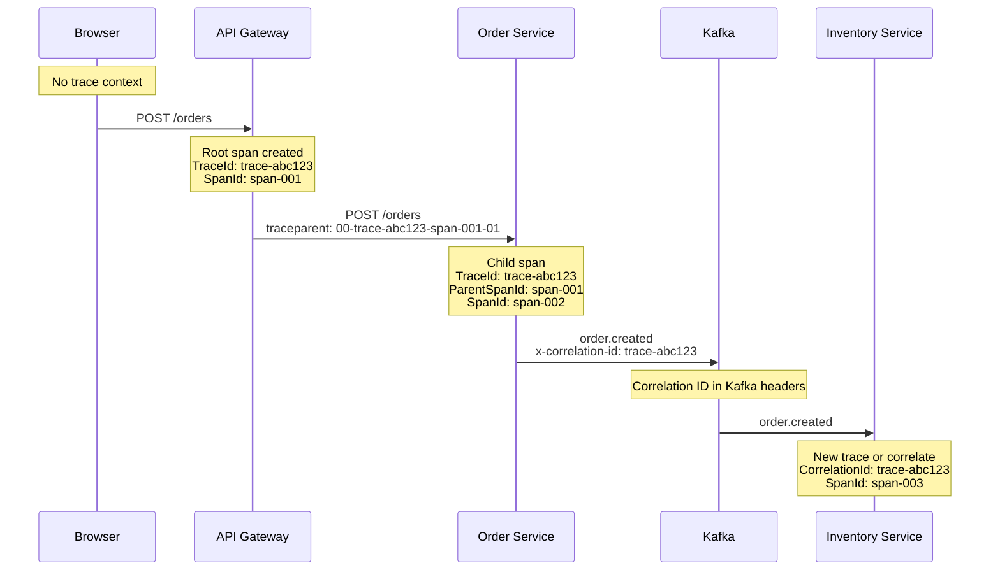
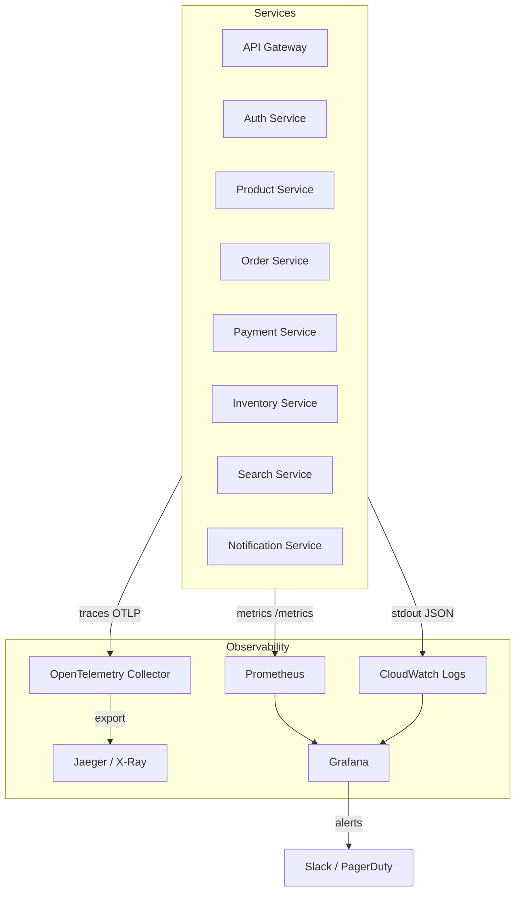

# Observability Flows

> Covers: **Distributed Tracing Flow**, **Logging Flow**, **Metrics Flow**
> Stack: OpenTelemetry + Pino + Prometheus + Jaeger

---

## FLOW 29: Distributed Tracing Flow

### How Tracing Works End-to-End

```
Step 1:  Browser sends request with no trace context
Step 2:  API Gateway → initTracing('api-gateway') initializes OpenTelemetry SDK
Step 3:  Auto-instrumentation creates root span:
         - SpanId: span-001
         - TraceId: trace-abc123 (generated, propagated to all downstream)
         - Name: "POST /orders"
Step 4:  API Gateway → RequestIdMiddleware adds x-request-id header
Step 5:  API Gateway → HttpLoggingInterceptor logs { traceId, spanId, method, url }
Step 6:  API Gateway → BaseHttpClient.forwardRequest() → creates child span
         - Propagates trace context via W3C traceparent header
Step 7:  Order Service → initTracing('order-service')
         - Auto-instrumentation picks up traceparent → continues trace
         - Creates service-level span: "order-service:CreateOrderHandler"
Step 8:  Order Service → TypeORM auto-instrumented:
         - Span: "pg:query INSERT INTO orders"
         - Span: "pg:query INSERT INTO outbox_events"
Step 9:  safeExecute → creates span: "safeExecute:kafka:publishOrder"
         - Records retry events, circuit breaker state changes
Step 10: All spans collected by OpenTelemetry Collector
Step 11: Exported to Jaeger/X-Ray via OTLP HTTP:
         - Endpoint: OTEL_EXPORTER_OTLP_ENDPOINT (default: http://localhost:4318/v1/traces)
Step 12: Jaeger UI → Full trace visualization across services
```

### Trace Propagation Across Services



### Example Trace (Jaeger View)

```
Trace: trace-abc123 (22 spans, 4 services, 850ms total)
├── [api-gateway] POST /orders (850ms)
│   ├── [api-gateway] ThrottlerGuard.check (2ms)
│   ├── [api-gateway] JwtAuthGuard.validate (3ms)
│   ├── [api-gateway] BaseHttpClient.forward (840ms) ← largest span
│   │   └── [order-service] POST /orders (830ms)
│   │       ├── [order-service] CreateOrderHandler.execute (820ms)
│   │       │   ├── [order-service] safeExecute:db:beginTxn (5ms)
│   │       │   ├── [postgres] INSERT INTO orders (8ms)
│   │       │   ├── [postgres] INSERT INTO order_items ×2 (12ms)
│   │       │   ├── [postgres] INSERT INTO outbox_events (3ms)
│   │       │   ├── [order-service] safeExecute:db:commit (4ms)
│   │       │   └── [order-service] safeExecute:kafka:publish (2ms) NON_BLOCKING
│   │       └── [order-service] Response serialization (10ms)
│   └── [api-gateway] HttpLoggingInterceptor (1ms)
│
│ ── Async (via Kafka) ──
├── [inventory-service] OrderEventConsumer (120ms)
│   ├── [inventory-service] InboxService.handleIncoming (5ms)
│   ├── [inventory-service] ConfirmStockHandler (100ms)
│   │   ├── [postgres] SELECT stock FOR UPDATE (15ms)
│   │   ├── [postgres] UPDATE stock SET reserved += (10ms)
│   │   ├── [postgres] INSERT reservations (8ms)
│   │   └── [postgres] INSERT outbox_events (3ms)
│   └── [inventory-service] InboxService.markProcessed (5ms)
│
├── [payment-service] PaymentCommandConsumer (520ms)
│   ├── [payment-service] InboxService.handleIncoming (5ms)
│   ├── [payment-service] ProcessPaymentHandler (500ms)
│   │   ├── [postgres] SELECT payments WHERE order_id (5ms)
│   │   ├── [http] POST stripe.com/v1/charges (450ms) ← external API
│   │   ├── [postgres] INSERT payments (8ms)
│   │   └── [postgres] INSERT outbox_events (3ms)
│   └── [payment-service] InboxService.markProcessed (5ms)
│
└── [order-service] PaymentEventConsumer (15ms)
    ├── [order-service] InboxService.handleIncoming (3ms)
    ├── [order-service] ConfirmPaymentHandler (8ms)
    │   ├── [postgres] SELECT orders WHERE id (3ms)
    │   └── [postgres] UPDATE orders SET status (3ms)
    └── [order-service] InboxService.markProcessed (4ms)
```

### Correlation ID Through Kafka

```
Problem: OpenTelemetry trace context is lost when events cross Kafka boundaries
         (Kafka is async — no HTTP context propagation)

Solution: x-correlation-id header in Kafka messages

Producer:
  outbox_events.payload contains header.correlationId
  OutboxProcessor adds: headers['x-event-id'] = eventId

Consumer:
  getCorrelationId(headers) extracts x-correlation-id
  InboxService stores correlationId in inbox_events table
  Logs and child spans tagged with correlationId

This allows tracing a single user action across:
  Browser → API Gateway → Order Service → Kafka → Inventory Service → Kafka → ...
```

### OpenTelemetry Configuration

```typescript
// From @ecommerce/core observability/tracing.ts
export const initTracing = (serviceName: string) => {
  const sdk = new NodeSDK({
    traceExporter: new OTLPTraceExporter({
      url: process.env.OTEL_EXPORTER_OTLP_ENDPOINT || 'http://localhost:4318/v1/traces',
    }),
    instrumentations: [getNodeAutoInstrumentations()],
    serviceName,
  });
  sdk.start();
};

// Auto-instrumentations include:
// - HTTP (express) → auto-creates spans for incoming/outgoing HTTP
// - PostgreSQL (pg) → auto-creates spans for queries
// - DNS → auto-creates spans for DNS lookups
// - Redis (ioredis) → auto-creates spans for Redis ops
```

---

## FLOW 30: Logging Flow

### Structured Logging with Pino

Every service uses `nestjs-pino` for structured JSON logging.

```
Step 1:  Request arrives at service
Step 2:  Auto-request context binds: { requestId, traceId, userId }
Step 3:  HttpLoggingInterceptor logs: { method, url, statusCode, duration }
Step 4:  Business logic logs via this.logger.log() / .warn() / .error()
Step 5:  Pino serializes to JSON with context fields
Step 6:  Output to stdout (container logs)
Step 7:  CloudWatch Logs agent → pushes to CloudWatch Log Group
Step 8:  CloudWatch Insights → query and search across services
```

### Log Format

```json
{
  "level": 30,
  "time": 1711090800123,
  "pid": 1,
  "hostname": "order-service-abc123",
  "context": "CreateOrderHandler",
  "msg": "Order created successfully",
  "requestId": "req-550e8400",
  "traceId": "trace-abc123",
  "spanId": "span-002",
  "userId": "usr-123e4567",
  "orderId": "ord-789e0123",
  "totalAmount": 24997,
  "service": "order-service",
  "env": "production"
}
```

### Log Levels

| Level | Pino Value | Usage |
|---|---|---|
| `fatal` | 60 | Process about to crash |
| `error` | 50 | Operation failed, needs attention |
| `warn` | 40 | Degraded behavior (retries, circuit open) |
| `info` | 30 | Business events (order created, payment processed) |
| `debug` | 20 | Technical details (inbox dedup, cache hits) |
| `trace` | 10 | Very verbose (SQL queries, Redis ops) |

### Example Logs for Order Checkout Flow

```json
// 1. API Gateway receives request
{"level":30,"context":"HttpLoggingInterceptor","msg":"→ POST /orders","requestId":"req-001","traceId":"trace-abc","service":"api-gateway"}

// 2. Order Service creates order
{"level":30,"context":"CreateOrderHandler","msg":"Order created","orderId":"ord-789","userId":"usr-123","service":"order-service"}

// 3. Outbox processor publishes event
{"level":20,"context":"OutboxProcessor","msg":"Outbox processed: 1/1 events published","service":"order-service"}

// 4. Inventory consumer receives event
{"level":20,"context":"InboxService","msg":"Inbox: processed event eventId=evt-001 type=order.created","service":"inventory-service"}

// 5. Stock reserved
{"level":30,"context":"ConfirmStockHandler","msg":"Stock reserved for order ord-789","items":[{"productId":"prod-001","qty":2}],"service":"inventory-service"}

// 6. Saga orchestrator triggers payment
{"level":30,"context":"CheckoutSagaOrchestrator","msg":"Saga: Order ord-789 → PENDING_PAYMENT. Payment requested.","service":"order-service"}

// 7. Payment processed
{"level":30,"context":"ProcessPaymentHandler","msg":"Payment processed","paymentId":"pay-001","orderId":"ord-789","service":"payment-service"}

// 8. Order confirmed
{"level":30,"context":"ConfirmPaymentHandler","msg":"Order ord-789 payment confirmed","service":"order-service"}

// Error example
{"level":50,"context":"CheckoutSagaOrchestrator","msg":"Saga: Payment request failed for order ord-789: ECONNREFUSED. Compensating by cancelling order.","service":"order-service"}

// Critical example
{"level":50,"context":"CheckoutSagaOrchestrator","msg":"Saga: CRITICAL — Compensation failed for order ord-789. Manual intervention required.","service":"order-service"}
```

---

## Metrics Flow

### Prometheus Metrics Architecture

```
┌────────────┐   /metrics    ┌────────────┐   scrape    ┌────────────┐
│  Service   │──────────────→│ MetricsCtrl │←───────────│ Prometheus │
│  (handler) │               │  (endpoint) │             │   Server   │
└────────────┘               └────────────┘             └─────┬──────┘
                                                              │
                                                              ▼
                                                        ┌────────────┐
                                                        │  Grafana   │
                                                        │ Dashboards │
                                                        └────────────┘
```

### Key Metrics

| Metric | Type | Labels | Description |
|---|---|---|---|
| `http_requests_total` | Counter | method, route, status | Total HTTP requests |
| `http_request_duration_seconds` | Histogram | method, route | Request latency |
| `resilience_exec_total` | Counter | strategy, status, label | safeExecute calls |
| `resilience_exec_duration_seconds` | Histogram | strategy, label | safeExecute latency |
| `resilience_retry_total` | Counter | label | Total retry attempts |
| `kafka_messages_consumed_total` | Counter | topic, group | Kafka consumption |
| `inbox_events_total` | Counter | status, eventType | Inbox processing |
| `outbox_events_pending` | Gauge | service | Unprocessed outbox events |
| `circuit_breaker_state` | Gauge | key, state | Current CB state |

### Example Grafana Dashboard Queries

```promql
# Request rate (per second)
rate(http_requests_total{service="order-service"}[5m])

# P99 latency
histogram_quantile(0.99, rate(http_request_duration_seconds_bucket{service="api-gateway"}[5m]))

# Error rate (4xx + 5xx)
sum(rate(http_requests_total{status=~"4..|5.."}[5m])) / sum(rate(http_requests_total[5m]))

# Circuit breaker open alerts
circuit_breaker_state{state="OPEN"} > 0

# Outbox backlog (events stuck unprocessed)
outbox_events_pending > 100

# Inbox DLQ events (needs attention)
inbox_events_total{status="DEAD_LETTER"} > 0

# Kafka consumer lag
kafka_consumer_group_lag{group="order-service-payment"} > 1000
```

### Health Check Endpoints

Every service exposes health endpoints via `@nestjs/terminus`:

```
GET /health          → { status: "ok", info: { database, redis, kafka } }
GET /health/liveness → { status: "ok" }  (is the process alive?)
GET /health/readiness→ { status: "ok" }  (can it serve traffic?)
```

```json
{
  "status": "ok",
  "info": {
    "database": { "status": "up", "responseTime": 5 },
    "redis": { "status": "up", "responseTime": 2 },
    "kafka": { "status": "up" }
  },
  "details": {
    "database": { "status": "up" },
    "redis": { "status": "up" },
    "kafka": { "status": "up" }
  }
}
```

### ALB Health Check Configuration

```
ALB → Target Group:
  Health check path: /health/liveness
  Interval: 30s
  Timeout: 5s
  Healthy threshold: 2
  Unhealthy threshold: 3

ECS auto-scaling:
  If unhealthy → ECS replaces task
  Scale out: CPU > 70% for 3min
  Scale in: CPU < 30% for 10min
```

---

## Complete Observability Stack


