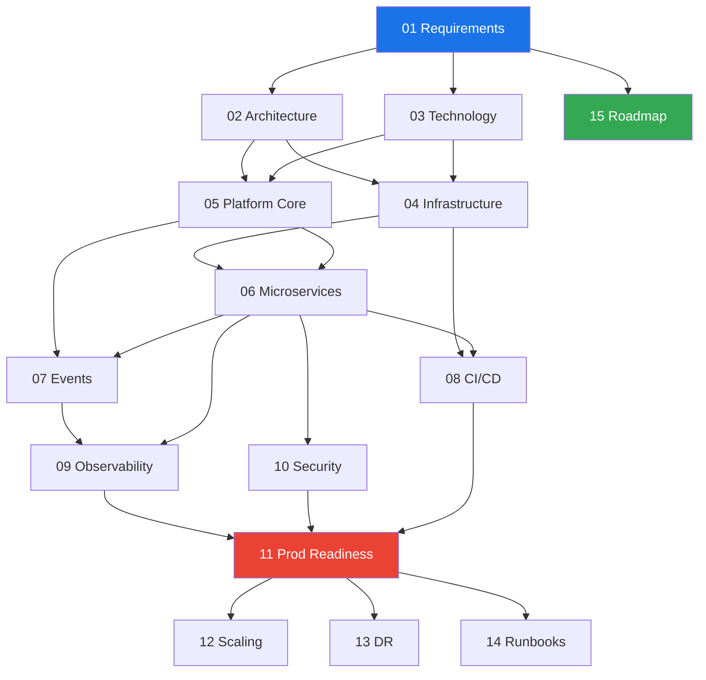

# Engineering Handbook — E-Commerce Microservices Platform

> **Version:** 1.0 | **Last Updated:** March 2026 | **Status:** Living Document
>
> This handbook is the single source of truth for designing, building, deploying, and operating
> the E-Commerce Microservices platform. Every engineer on the team should read the System Overview
> and their relevant phase documents before writing any code.

---

## How to Read This Handbook

```
New engineer?        → Start with global/system-overview.md
Planning a service?  → Read global/service-catalog.md + Phase 06
Writing events?      → Read global/event-catalog.md + Phase 07
Deploying?           → Read global/deployment-flow.md + Phase 08
On-call?             → Read global/runbooks.md + Phase 14
```

---

## Global Documents

Cross-cutting references that span all phases. Read these first.

| Document | Purpose |
|----------|---------|
| [System Overview](./global/system-overview.md) | What we're building, why, and how it all fits together |
| [Architecture Diagrams](./global/architecture-diagrams.md) | Visual reference: system, network, deployment, data flow |
| [Request Flows](./global/request-flows.md) | Every HTTP request path: FE → Gateway → Service → DB |
| [Event Flows](./global/event-flows.md) | Every async event path: Service → Outbox → Kafka → Consumer |
| [Service Catalog](./global/service-catalog.md) | All 10 services: ownership, ports, APIs, databases |
| [Event Catalog](./global/event-catalog.md) | All domain events: schemas, topics, publishers, consumers |
| [Infrastructure Modules](./global/infrastructure-modules.md) | All Terraform modules: inputs, outputs, dependencies |
| [Deployment Flow](./global/deployment-flow.md) | git push → CI → staging → approval → production |
| [CI/CD Pipeline](./global/ci-cd-pipeline.md) | GitHub Actions workflow architecture and configuration |
| [Observability Strategy](./global/observability-strategy.md) | Logging, metrics, tracing, dashboards, alerts |
| [Security Architecture](./global/security-architecture.md) | Auth, encryption, WAF, secrets, compliance |
| [Scaling Strategy](./global/scaling-strategy.md) | How each component scales: ECS, RDS, Kafka, Redis |
| [Disaster Recovery](./global/disaster-recovery.md) | RTO/RPO targets, backup procedures, failover plans |
| [Runbooks](./global/runbooks.md) | Operational procedures for every P1/P2 alert |
| [Production Checklist](./global/production-checklist.md) | Go/no-go gate: every item must pass before launch |

---

## Phases

Build the platform in this order. Each phase has a standardized structure with 14 sections.

| Phase | Document | What It Covers | Timeline |
|-------|----------|---------------|----------|
| 01 | [Requirements](./phases/01-requirements.md) | Functional + non-functional requirements, user stories, SLOs | Week 1-2 |
| 02 | [High-Level Architecture](./phases/02-high-level-architecture.md) | System design, bounded contexts, service boundaries, patterns | Week 1-2 |
| 03 | [Technology Selection](./phases/03-technology-selection.md) | Every tool/framework choice with rationale and alternatives | Week 2 |
| 04 | [Infrastructure (IaC)](./phases/04-infrastructure.md) | Terraform modules, VPC, ECS, RDS, Kafka, Redis, OpenSearch | Week 3-6 |
| 05 | [Platform Core](./phases/05-platform-core.md) | Shared libraries: logging, outbox/inbox, auth, resilience | Week 5-8 |
| 06 | [Microservices Design](./phases/06-microservices-design.md) | All 10 services: APIs, data models, saga, CQRS | Week 7-14 |
| 07 | [Event-Driven Architecture](./phases/07-event-driven-architecture.md) | Kafka topics, event schemas, outbox/inbox, DLQ, replay | Week 11-14 |
| 08 | [CI/CD & Deployment](./phases/08-cicd-deployment.md) | Docker, GitHub Actions, blue/green, migrations | Week 9-10 |
| 09 | [Observability](./phases/09-observability.md) | Logs, metrics, traces, dashboards, alerts, SLOs | Week 13-16 |
| 10 | [Security](./phases/10-security.md) | Auth, encryption, WAF, input validation, secrets | Week 12-15 |
| 11 | [Production Readiness](./phases/11-production-readiness.md) | Load testing, chaos testing, go/no-go checklist | Week 15-18 |
| 12 | [Scaling Strategy](./phases/12-scaling-strategy.md) | Auto-scaling, read replicas, caching, partitioning | Week 16-18 |
| 13 | [Disaster Recovery](./phases/13-disaster-recovery.md) | Backups, failover, multi-region, DR drills | Week 16-18 |
| 14 | [Runbooks & Operations](./phases/14-runbooks-operations.md) | On-call, incident response, runbook templates | Week 17-18 |
| 15 | [Implementation Roadmap](./phases/15-implementation-roadmap.md) | Master timeline, team allocation, milestones | Week 1 (maintained throughout) |

---

## Phase Dependencies



---

## Standardized Phase Structure

Every phase document follows this 14-section template:

```markdown
# Phase XX — Name

## 1. Overview
## 2. Goals
## 3. Architecture Design
## 4. Technology Choices
## 5. Key Design Decisions
## 6. Data Flow / Request Flow
## 7. Components Involved
## 8. Implementation Plan
## 9. Tasks Checklist
## 10. Deliverables
## 11. Dependencies
## 12. Risks
## 13. Common Mistakes
## 14. Best Practices
```

---

## Quick Reference

| Need | Document |
|------|----------|
| "What services exist?" | [Service Catalog](./global/service-catalog.md) |
| "What events exist?" | [Event Catalog](./global/event-catalog.md) |
| "How does checkout work?" | [Request Flows](./global/request-flows.md) |
| "How do I deploy?" | [Deployment Flow](./global/deployment-flow.md) |
| "Service is down, what do I do?" | [Runbooks](./global/runbooks.md) |
| "Is the system ready for production?" | [Production Checklist](./global/production-checklist.md) |
| "How does auth work?" | [Security Architecture](./global/security-architecture.md) |
| "How does auto-scaling work?" | [Scaling Strategy](./global/scaling-strategy.md) |

---

> **Existing reference docs:** The original phase design and implementation documents remain at
> `docs/app-build-core/` for detailed reference. This handbook consolidates and extends that material.
