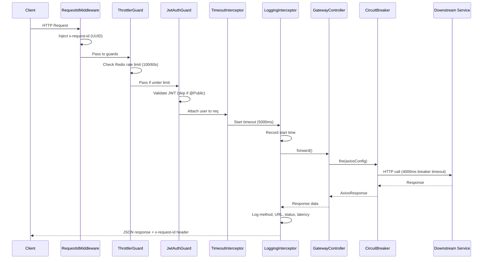
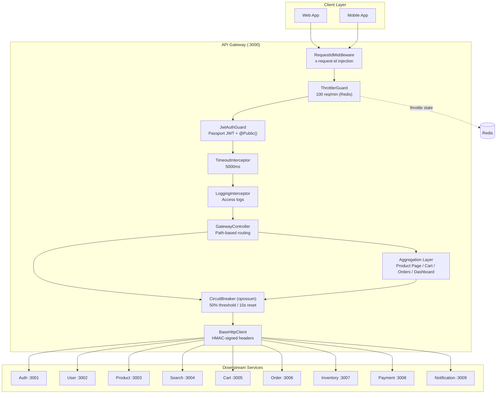

# API Gateway — Cross-Cutting Concerns Analysis

> **Scope**: Infrastructure and cross-cutting concerns only — zero business logic.
> **Codebase**: [apps/api-gateway/](file:///c:/source/apps/api-gateway) (NestJS 11, TypeScript)
> **Downstream services**: auth, user, product, search, cart, order, inventory, payment, notification

---

## 1. Role of the API Gateway

### Why This System Needs a Gateway

The platform has **9 microservices**, each on its own port (3001–3009). Without a gateway:

- Clients must know every service URL → tight coupling
- Auth logic duplicated in every service → inconsistent enforcement
- No single place for rate limiting, timeouts, tracing → each service re-invents cross-cutting concerns
- CORS, TLS, and API versioning become N-way configuration problems

The gateway provides a **single ingress point** that decouples clients from the topology.

### What It SHOULD Do (and does)

| Responsibility | Implementation |
|---|---|
| Reverse-proxy routing | ✅ Path-based `@All()` routes in [gateway.controller.ts](file:///c:/source/apps/api-gateway/src/controllers/gateway.controller.ts) |
| Authentication | ✅ JWT validation via Passport ([jwt.strategy.ts](file:///c:/source/apps/api-gateway/src/common/guards/jwt.strategy.ts)) |
| Rate limiting | ✅ Redis-backed throttler ([app.module.ts#L29-L41](file:///c:/source/apps/api-gateway/src/app.module.ts#L29-L41)) |
| Timeout enforcement | ✅ Global `TimeoutInterceptor` ([timeout.interceptor.ts](file:///c:/source/apps/api-gateway/src/common/interceptors/timeout.interceptor.ts)) |
| Circuit breaking | ✅ `opossum` in [http-client.ts](file:///c:/source/apps/api-gateway/src/common/http-client.ts) |
| Request correlation | ✅ `x-request-id` + `x-correlation-id` injection |
| Identity propagation | ✅ HMAC-signed headers via [internal-auth.ts](file:///c:/source/packages/core/src/security/internal-auth.ts) |
| Health checks | ✅ Liveness + Redis readiness in [health.controller.ts](file:///c:/source/apps/api-gateway/src/controllers/health.controller.ts) |
| Response aggregation (BFF) | ✅ 4 aggregation endpoints |

### What It MUST NOT Do (Anti-Patterns to Avoid)

| Anti-Pattern | Status |
|---|---|
| Contain business logic (pricing rules, inventory checks) | ✅ Clean — aggregation only composes responses |
| Own a database | ✅ Clean — only connects to Redis for throttling + health |
| Transform data semantics (e.g. currency conversion) | ✅ Clean — passes data through unchanged |
| Be a single point of failure with no fallback | ⚠️ Partially addressed — circuit breaker exists, but no gateway-level redundancy defined in infra |
| Tightly couple to downstream schemas | ✅ Clean — proxies opaque payloads, no DTO transformation |

---

## 2. Routing & Request Flow

### How Requests Are Routed

The gateway uses **path-based routing** with NestJS `@All()` wildcard handlers. Each prefix maps 1:1 to a downstream service:

```
Client → Gateway (:3000)
  /auth/*     → auth-service (:3001)
  /users/*    → user-service (:3002)
  /products/* → product-service (:3003)
  /search/*   → search-service (:3004)
  /cart/*     → cart-service (:3005)
  /orders/*   → order-service (:3006)
  /inventory/* → inventory-service (:3007)
  /payments/* → payment-service (:3008)
  /notifications/* → notification-service (:3009)
```

**Source**: [gateway.controller.ts#L94-L237](file:///c:/source/apps/api-gateway/src/controllers/gateway.controller.ts#L94-L237) — each route calls `this.forward()`, which constructs the target URL by concatenating the service base URL + the original request URL.

### Request Flow Pipeline



### Versioning Strategy

> [!WARNING]
> **No explicit API versioning exists.** There is no URL prefix (`/v1/`, `/v2/`) or header-based version routing. All routes serve a single implicit version.

---

## 3. Authentication & Authorization

### JWT / OAuth Handling

| Aspect | Detail | Source |
|---|---|---|
| Token format | JWT Bearer token in `Authorization` header | [jwt.strategy.ts#L28](file:///c:/source/apps/api-gateway/src/common/guards/jwt.strategy.ts#L28) |
| Extraction | `ExtractJwt.fromAuthHeaderAsBearerToken()` | Same file |
| Signing algorithm | Default (HS256) — symmetric secret from `JWT_SECRET` env var | [jwt.strategy.ts#L21](file:///c:/source/apps/api-gateway/src/common/guards/jwt.strategy.ts#L21) |
| Expiration | `ignoreExpiration: false` — tokens are validated for expiry | [jwt.strategy.ts#L29](file:///c:/source/apps/api-gateway/src/common/guards/jwt.strategy.ts#L29) |
| Payload shape | `{ sub, email, roles }` → mapped to `{ userId, email, roles }` | [jwt.strategy.ts#L6-L16](file:///c:/source/apps/api-gateway/src/common/guards/jwt.strategy.ts#L6-L16) |

### Where Token Is Validated

**At the gateway only.** The `JwtAuthGuard` is registered as a **global `APP_GUARD`** in [app.module.ts#L54-L57](file:///c:/source/apps/api-gateway/src/app.module.ts#L54-L57). Every route goes through JWT validation unless explicitly marked `@Public()`:

```typescript
// Routes that skip JWT — gateway.controller.ts
@Public() @All('auth/*path')       // login, register, refresh
@Public() @All('products/*path')   // product catalog browsing
@Public() @All('search/*path')     // full-text search
@Public() @Get('product-page/:id') // BFF aggregation (public)
```

### How User Context Is Propagated Downstream

Two modes, controlled by `INTERNAL_AUTH_SECRET` env var:

**Production (HMAC-signed headers)**:
```
x-user-id: <userId>
x-user-roles: admin,user
x-internal-timestamp: 1710700000000
x-internal-signature: <HMAC-SHA256(userId:timestamp, secret)>
```
- Downstream services verify via `verifyInternalHeaders()` with **timing-safe comparison** and **5-minute replay protection** window
- Source: [internal-auth.ts](file:///c:/source/packages/core/src/security/internal-auth.ts)

**Dev mode (unsigned)**:
```
x-user-id: <userId>
x-user-roles: admin,user
```
- No HMAC — just raw headers (when `INTERNAL_AUTH_SECRET` is unset)
- Source: [http-client.ts#L88-L92](file:///c:/source/apps/api-gateway/src/common/http-client.ts#L88-L92)

> [!CAUTION]
> **Risk**: If `INTERNAL_AUTH_SECRET` is unset in production, any network-adjacent attacker can forge identity headers. The env var should be validated at startup, similar to `JWT_SECRET`.

---

## 4. Rate Limiting & Throttling

### Strategy

| Parameter | Value | Source |
|---|---|---|
| Algorithm | Fixed window (NestJS throttler default) | `@nestjs/throttler` v6 |
| Window | 60,000ms (1 minute) | [app.module.ts#L33](file:///c:/source/apps/api-gateway/src/app.module.ts#L33) |
| Limit | 100 requests per window | Same line |
| Key | IP-based (default ThrottlerGuard behavior) | Implicit |
| Storage backend | Redis via `ThrottlerStorageRedisService` | [app.module.ts#L34-L39](file:///c:/source/apps/api-gateway/src/app.module.ts#L34-L39) |
| Bypass | `@SkipThrottle()` on health endpoints | [health.controller.ts#L20](file:///c:/source/apps/api-gateway/src/controllers/health.controller.ts#L20) |

### What's Missing

| Gap | Impact |
|---|---|
| No per-user rate limiting | Authenticated users share the same IP pool; one user behind a NAT can starve others |
| No per-route differentiation | Write endpoints (POST /orders) get the same 100/min as read endpoints (GET /products) |
| No burst allowance | Token bucket or sliding window log would allow short bursts without penalizing normal traffic |
| No `Retry-After` header | Clients don't know when to retry after a 429 |

---

## 5. Request/Response Transformation

### Header Enrichment

The gateway enriches **every proxied request** with:

| Header | Source | Purpose |
|---|---|---|
| `x-request-id` | [request-id.middleware.ts](file:///c:/source/apps/api-gateway/src/middleware/request-id.middleware.ts) | Distributed tracing correlation |
| `x-correlation-id` | [http-client.ts#L62-L66](file:///c:/source/apps/api-gateway/src/common/http-client.ts#L62-L66) | Falls back to `x-request-id` or generates new UUID |
| `x-user-id` | [http-client.ts#L74-L92](file:///c:/source/apps/api-gateway/src/common/http-client.ts#L74-L92) | Decoded from JWT, signed with HMAC |
| `x-user-roles` | Same as above | Comma-separated role list |
| `x-internal-timestamp` | [internal-auth.ts#L19](file:///c:/source/packages/core/src/security/internal-auth.ts#L19) | Replay protection timestamp |
| `x-internal-signature` | [internal-auth.ts#L21](file:///c:/source/packages/core/src/security/internal-auth.ts#L21) | HMAC-SHA256 signature |
| `authorization` | [http-client.ts#L69-L71](file:///c:/source/apps/api-gateway/src/common/http-client.ts#L69-L71) | Original Bearer token passed through |

### Request Shaping

- Body is forwarded **as-is** for non-GET requests (`req.body`)
- Query parameters are forwarded via `req.query`
- No request body transformation or schema validation at gateway level

### Response Aggregation (BFF Layer)

Four dedicated aggregation endpoints compose multiple downstream calls:

| Endpoint | Services Called | Pattern | Source |
|---|---|---|---|
| `GET /product-page/:id` | product, inventory, reviews | `Promise.all` with `.catch(() => [])` fallback on reviews | [product-page.service.ts](file:///c:/source/apps/api-gateway/src/modules/aggregation/product-page.service.ts) |
| `GET /cart-summary` | cart, product, inventory | Sequential (cart first) → parallel enrichment with graceful degradation | [cart-summary.service.ts](file:///c:/source/apps/api-gateway/src/modules/aggregation/cart-summary.service.ts) |
| `GET /order-details/:id` | order, payment | Sequential (order first) → payment with fallback | [order-details.service.ts](file:///c:/source/apps/api-gateway/src/modules/aggregation/order-details.service.ts) |
| `GET /user-dashboard` | user, order, notification | `Promise.allSettled` with per-service error reporting | [dashboard.service.ts](file:///c:/source/apps/api-gateway/src/modules/aggregation/dashboard.service.ts) |

> [!TIP]
> `dashboard.service.ts` uses `Promise.allSettled` — the most resilient pattern here. It returns partial data + per-service error details instead of failing entirely. The other services should adopt this pattern.

---

## 6. Resilience

### Timeout Strategy

**Two-layer timeout enforcement:**

| Layer | Timeout | Source |
|---|---|---|
| **Application layer** (NestJS interceptor) | 5000ms (configurable via `REQUEST_TIMEOUT` env) | [timeout.interceptor.ts](file:///c:/source/apps/api-gateway/src/common/interceptors/timeout.interceptor.ts) |
| **HTTP client layer** (Axios) | 5000ms (same config) | [http-client.module.ts#L12](file:///c:/source/apps/api-gateway/src/common/http-client.module.ts#L12) |
| **Circuit breaker layer** (opossum) | 4000ms | [http-client.ts#L16](file:///c:/source/apps/api-gateway/src/common/http-client.ts#L16) |

The layering is intentional: breaker timeout (4s) < interceptor timeout (5s), ensuring the circuit breaker fires first and properly tracks failures before the application-level timeout kills the request.

### Circuit Breaker

Implemented via the `opossum` library in [http-client.ts#L15-L26](file:///c:/source/apps/api-gateway/src/common/http-client.ts#L15-L26):

| Parameter | Value | Meaning |
|---|---|---|
| `timeout` | 4000ms | Per-request timeout within the breaker |
| `errorThresholdPercentage` | 50% | Open the breaker when half the requests fail |
| `resetTimeout` | 10000ms | Try half-open after 10 seconds |

### Fallback Behavior

```typescript
this.breaker.fallback(() => Promise.reject(new Error('Breaker is open')));
```

When the breaker is **open**, the gateway returns `503 Service Temporarily Unavailable (Fast Fallback)` immediately without attempting the downstream call. This protects against cascading failures.

### Retry Policy

> [!WARNING]
> **No retry policy is configured.** The gateway does not retry failed requests. For idempotent reads (GET), at least 1 retry with exponential backoff would significantly improve reliability.

---

## 7. Load Balancing

### Current Strategy

**None at the application level.** The gateway uses static URLs from environment variables:

```typescript
// gateway.config.ts
auth: process.env.AUTH_SERVICE_URL || 'http://localhost:3001',
user: process.env.USER_SERVICE_URL || 'http://localhost:3002',
// ... etc
```

Each service maps to exactly one URL. There is no:
- Round-robin across multiple instances
- Least-connections routing
- Health-check-aware instance selection

### Service Discovery Integration

**None.** Services are discovered via static env vars, not via a registry (Consul, Eureka) or DNS-based discovery (Kubernetes service DNS).

> [!NOTE]
> In a Kubernetes deployment, the service URLs would point to Kubernetes Service objects (e.g., `http://auth-service:3001`), which provide built-in round-robin load balancing via kube-proxy. This architecture is **correct for K8s** — the missing client-side load balancing is deliberately offloaded to the platform.

---

## 8. Observability

### Centralized Logging

| Component | Detail | Source |
|---|---|---|
| Logger | NestJS Logger (via `@ecommerce/core` `getLoggerModule()`) | [main.ts#L29](file:///c:/source/apps/api-gateway/src/main.ts#L29) |
| Access log | `LoggingInterceptor` logs every request: method, URL, status, content-length, user-agent, IP, latency | [logging.interceptor.ts](file:///c:/source/apps/api-gateway/src/common/interceptors/logging.interceptor.ts) |
| Error log | `AllExceptionsFilter` logs 5xx with stack trace, 4xx as warnings | [all-exceptions.filter.ts](file:///c:/source/apps/api-gateway/src/common/filters/all-exceptions.filter.ts) |

### Distributed Tracing

| Component | Detail | Source |
|---|---|---|
| SDK | OpenTelemetry `NodeSDK` | [tracing.ts](file:///c:/source/packages/core/src/observability/tracing.ts) |
| Exporter | OTLP HTTP exporter → `OTEL_EXPORTER_OTLP_ENDPOINT` (default: `http://localhost:4318/v1/traces`) | Same file |
| Auto-instrumentation | `@opentelemetry/auto-instrumentations-node` — HTTP, Express, and more | Same file |
| Service name | `api-gateway` | [main.ts#L21](file:///c:/source/apps/api-gateway/src/main.ts#L21) |
| Correlation ID propagation | `x-request-id` and `x-correlation-id` headers forwarded to all downstream calls | [http-client.ts#L57-L66](file:///c:/source/apps/api-gateway/src/common/http-client.ts#L57-L66) |

### Metrics

> [!WARNING]
> **No metrics instrumentation exists.** There are no Prometheus counters, histograms, or gauges. Key metrics that should be tracked:
> - Request rate (by route, status code)
> - Latency percentiles (p50, p95, p99)
> - Circuit breaker state transitions
> - Throttler rejection rate
> - Active connections / request queue depth

---

## 9. Security

### TLS Termination

**Not handled at gateway level.** The NestJS app listens on plain HTTP (`app.listen(port)`). TLS is expected to be terminated by an upstream reverse proxy (nginx, ALB, Cloudflare) or Kubernetes Ingress.

### CORS Handling

Configured in [main.ts#L31-L35](file:///c:/source/apps/api-gateway/src/main.ts#L31-L35):

```typescript
app.enableCors({
  origin: configService.get<string>('gateway.corsOrigin', '*'),
  methods: ['GET', 'POST', 'PUT', 'PATCH', 'DELETE', 'OPTIONS'],
  credentials: true,
});
```

- **Default**: `*` (allow all origins) — acceptable for dev, **dangerous in production**
- Enforced at startup: `if (NODE_ENV === 'production' && !CORS_ORIGIN) throw Error(...)` — ensures explicit origin in prod
- `credentials: true` enables cookies and auth headers cross-origin

### Protection Against Common Attacks

| Attack | Protection | Status |
|---|---|---|
| **Brute force** | Rate limiting (100/min) | ✅ Present |
| **JWT forgery** | HMAC-SHA256 validation with shared secret | ✅ Present |
| **Header injection (internal)** | HMAC-signed identity headers with replay protection | ✅ Present |
| **Replay attacks** | 5-minute timestamp tolerance on internal signatures | ✅ Present |
| **DDoS** | Rate limiting + circuit breaker | ⚠️ Basic |
| **SQL injection / XSS** | Not applicable at gateway layer (no DB, no rendering) | N/A |
| **Request smuggling** | No explicit protection (depends on upstream proxy) | ❌ Missing |
| **Helmet headers** (CSP, X-Frame-Options, etc.) | ❌ Not configured | ❌ Missing |
| **Request body size limit** | ❌ Not configured — Express default is ~100KB | ⚠️ Implicit |

### Startup Validation

```typescript
// main.ts — fail-fast on missing secrets
const requiredEnvVars = ['JWT_SECRET'];
if (NODE_ENV === 'production' && !CORS_ORIGIN) throw Error(...)
```

> [!CAUTION]
> `INTERNAL_AUTH_SECRET` is **not** in the required env vars list, meaning the gateway can silently start in production without HMAC signing enabled.

---

## 10. Scalability

### Stateless Design

The gateway is **fully stateless**:

- No in-memory session store
- No local database
- Redis is external (throttle state only — losing it causes brief over-serving, not data loss)
- JWT validation is cryptographic (no session lookup)

This means any instance can handle any request.

### Horizontal Scaling

The gateway is containerized with a production-ready Dockerfile:

```dockerfile
# Multi-stage build → ~50MB final image
FROM node:24-alpine AS production
RUN addgroup -g 1001 -S nodejs && adduser -S nestjs -u 1001
USER nestjs  # non-root execution
EXPOSE 3000
CMD ["node", "dist/main.js"]
```

- **Non-root user** for security
- **Alpine base** for minimal attack surface
- Horizontally scalable behind a load balancer

### Potential Bottlenecks

| Bottleneck | Risk Level | Mitigation |
|---|---|---|
| **Single circuit breaker instance** — all 9 services share one `opossum` instance | 🔴 HIGH | One slow service trips the breaker for ALL services. Need **per-service breakers**. |
| **Redis single point of failure** — throttler stops working if Redis goes down | 🟡 MEDIUM | Need Redis Sentinel/Cluster + graceful degradation |
| **Aggregation fan-out** — `cart-summary` makes N+1 downstream calls (1 per cart item) | 🟡 MEDIUM | Batch product lookups or cap parallel requests |
| **No connection pooling config** — Axios defaults may exhaust sockets under load | 🟡 MEDIUM | Configure `maxSockets`, `keepAlive`, and connection pool size |

---

## 11. Failure Scenarios

### Downstream Service Unavailable

**Flow**:
1. `BaseHttpClient` sends request through circuit breaker
2. Request times out at 4000ms (breaker) or fails with connection error
3. `AxiosError` is caught → error response propagated with original status code
4. If error rate hits 50%, breaker **opens** for 10 seconds
5. During open state: all requests to **any service** (same breaker!) get instant `503 Fast Fallback`

**Problem**: The single shared breaker means a failing payment-service will block product browsing.

### Partial Failures (Aggregation)

Each aggregation endpoint handles partial failure differently:

| Endpoint | Strategy |
|---|---|
| `product-page` | Reviews fail → return `[]` (empty). Product or inventory fail → `500` |
| `cart-summary` | Individual item enrichment fails → return `{ error: "Enrichment failed" }` per item |
| `order-details` | Payment fetch fails → return `{ status: "payment tracking unavailable" }` |
| `user-dashboard` | `Promise.allSettled` — each section independently returns data or `null` + error message |

### Gateway Overload

**Current protections**:
- Rate limiting caps inbound traffic at 100 req/min per IP
- Timeout interceptor kills slow requests after 5s
- Circuit breaker prevents hang-wait on dead services

**Missing protections**:
- No request queue / backpressure mechanism
- No graceful degradation under load (e.g., shedding aggregation endpoints first)
- No connection limit or max concurrent request setting
- No readiness probe integration with load shedding (mark unhealthy when overloaded)

---

## 12. Improvements — Making It Production-Grade

### 🔴 Critical (Must Fix)

| # | Improvement | Rationale |
|---|---|---|
| 1 | **Per-service circuit breakers** | ✅ Completed. Currently one `opossum` instance is shared across all 9 services. A single failing service trips the breaker for everything. Create a `Map<string, CircuitBreaker>` keyed by service name. |
| 2 | **Validate `INTERNAL_AUTH_SECRET` at startup** | ✅ Completed. Add to the `requiredEnvVars` array in `main.ts`. Without it, identity headers are sent unsigned in production. |
| 3 | **Add Helmet middleware** | ✅ Completed. Install `helmet` for security headers (CSP, HSTS, X-Content-Type-Options, X-Frame-Options). One-liner: `app.use(helmet())`. |
| 4 | **Request body size limit** | ✅ Completed. Explicitly set `express.json({ limit: '1mb' })` to prevent memory-based DoS. |

### 🟡 High Priority

| # | Improvement | Rationale |
|---|---|---|
| 5 | **Per-user rate limiting** | Extend ThrottlerGuard to extract `userId` from JWT for authenticated routes. Prevents single-user abuse. |
| 6 | **Per-route rate limit tiers** | Write endpoints (POST, PUT, DELETE) should have lower limits than reads. Use `@Throttle()` decorator per route group. |
| 7 | **Retry policy for idempotent requests** | Add 1-retry with exponential backoff for GET requests. Use axios-retry or opossum's built-in retry. |
| 8 | **Prometheus metrics endpoint** | Add `prom-client` with histograms for latency, counters for status codes, and gauges for circuit breaker state. Expose at `/metrics`. |
| 9 | **API versioning** | Introduce URL prefix versioning (`/v1/products/...`) to enable breaking changes without client disruption. |

### 🟢 Nice to Have

| # | Improvement | Rationale |
|---|---|---|
| 10 | **Response caching** | Cache GET responses for public endpoints (products, search) with Redis + `Cache-Control` headers. |
| 11 | **Request validation** | Add lightweight schema validation (e.g., path param format) at gateway level to reject malformed requests early. |
| 12 | **Graceful shutdown** | `app.enableShutdownHooks()` is called, but add drain logic: stop accepting new connections, wait for in-flight requests, then close. |
| 13 | **Structured JSON logging** | Replace text-format access logs with structured JSON for easier parsing by log aggregators (ELK, Datadog). |
| 14 | **WebSocket / SSE support** | For real-time notifications or order status updates, add protocol upgrade handling. |
| 15 | **Connection pool tuning** | Configure Axios `httpAgent` with `keepAlive: true`, `maxSockets: 128`, `maxFreeSockets: 32` for high throughput. |

---

## Architecture Summary


