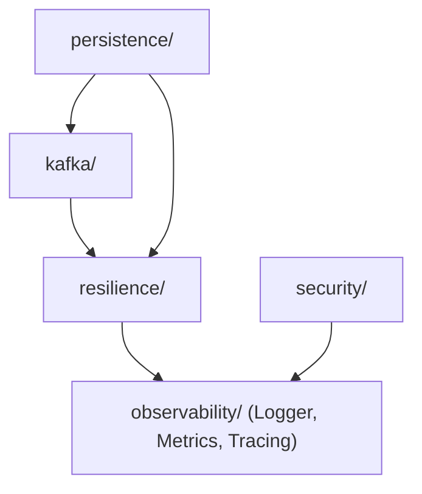
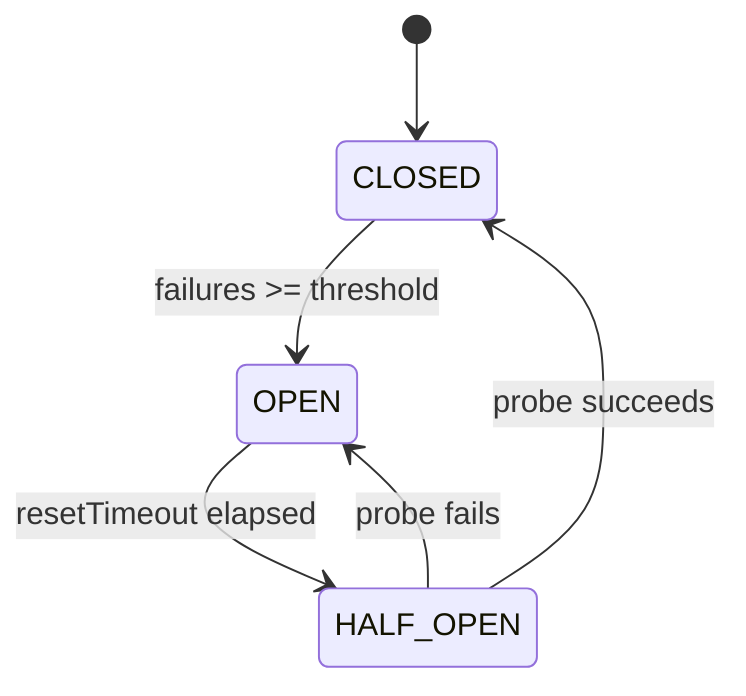
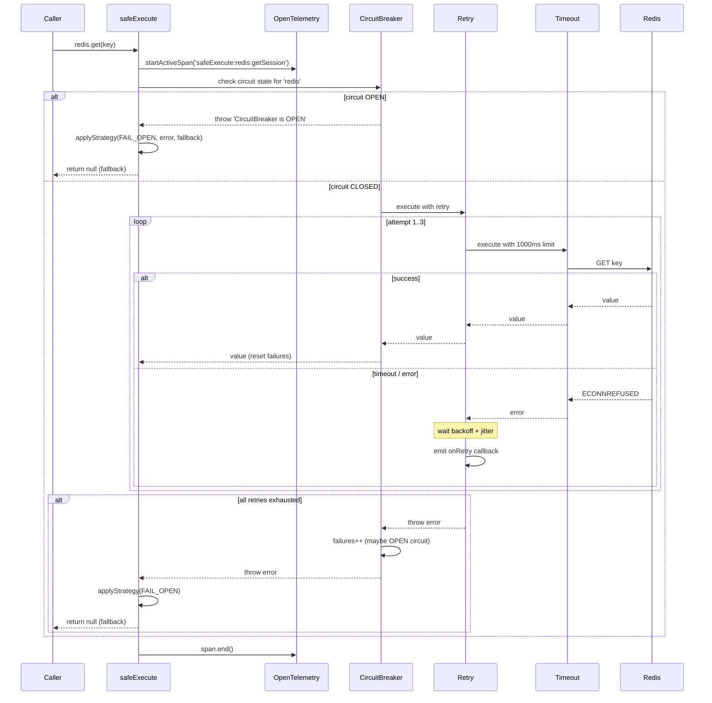
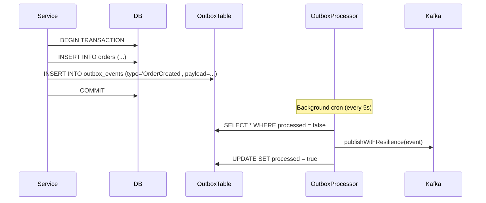
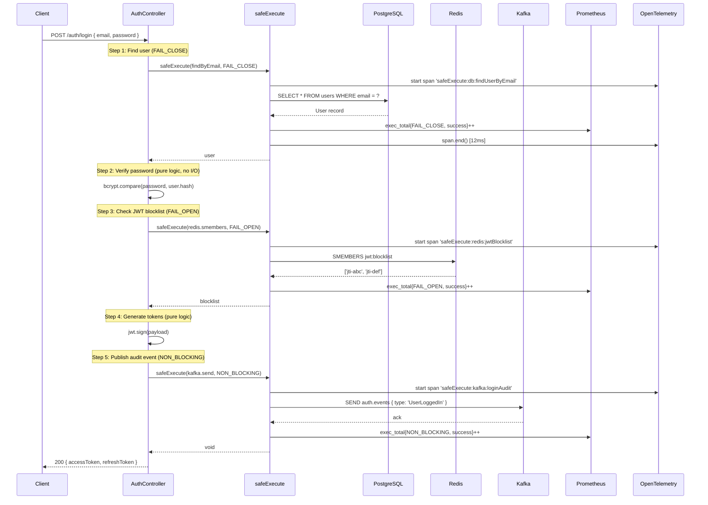

# @ecommerce/core — Production Deep Dive

> A complete guide to the shared infrastructure that powers every microservice in the platform.

---

## Table of Contents

1. [Architecture Overview](#1-architecture-overview)
2. [Resilience — Deep Dive](#2-resilience--deep-dive)
3. [Observability](#3-observability)
4. [Kafka + Outbox Pattern](#4-kafka--outbox-pattern)
5. [Persistence — Unit of Work](#5-persistence--unit-of-work)
6. [Security — Internal Auth](#6-security--internal-auth)
7. [End-to-End Flow: User Login](#7-end-to-end-flow-user-login)
8. [Production Insights](#8-production-insights)

---

## 1. Architecture Overview

### Why a Shared Core Package?

When you have multiple microservices (auth, order, payment), every one of them needs to:

- Talk to databases, caches, and message brokers
- Handle failures gracefully
- Log, trace, and emit metrics
- Authenticate internal requests

Without a shared core, each team writes their own retry logic, their own logger setup, their own circuit breaker. The result? **Inconsistency**, **hidden bugs**, and **impossible debugging at 3am**.

`@ecommerce/core` solves this by providing **one battle-tested implementation** that everyone imports.

### Module Map

```
@ecommerce/core
├── resilience/        ← The brain: safeExecute, retry, timeout, circuit breaker
├── observability/     ← The eyes: logging, metrics, tracing
├── kafka/             ← The mouth: DLQ producer, resilient publishing
├── persistence/       ← The hands: unit of work, outbox pattern
└── security/          ← The shield: internal HMAC auth
```

### Dependency Flow Between Modules



> [!IMPORTANT]
> The `resilience` module is the **foundation**. Every other module that talks to external systems uses `safeExecute` internally. This is the single most important thing to understand.

---

## 2. Resilience — Deep Dive

### 2.1 Why Resilience Matters

In a distributed system, **failures are not exceptions — they are the norm.**

| What can fail | How often | Impact if unhandled |
|---|---|---|
| Redis timeout | Multiple times/day | Login grinds to a halt |
| DB connection pool exhausted | During traffic spikes | 500 errors for everyone |
| Kafka broker unreachable | Network partitions | Events silently lost |
| Downstream service slow | Cascading failures | Thread pool starvation |

Without resilience patterns, a single Redis blip can cascade into a full platform outage. The three strategies (`FAIL_OPEN`, `FAIL_CLOSE`, `NON_BLOCKING`) define the contract for how your system behaves when things go wrong.

### 2.2 The Three Strategies — When and Why

#### FAIL_OPEN — "Work anyway"

```
Operation fails → return fallback value → continue
```

**Use when:** The operation is an optimization, not a requirement.

**Real example:** During login, you check Redis for a "blocked JWT" list. If Redis is down, it's better to let the user in (and risk a revoked token being used briefly) than to block **all logins**.

```typescript
const blocklist = await safeExecute(
  () => redis.smembers('jwt:blocklist'),
  {
    strategy: StrategyType.FAIL_OPEN,
    fallback: () => [],    // ← assume empty blocklist
    timeout: 500,
    circuitBreakerKey: 'redis',
    label: 'redis:jwtBlocklist',
  },
);
```

**Mental model:** "I'll try, but I have a Plan B."

---

#### FAIL_CLOSE — "Don't compromise"

```
Operation fails → throw error → halt the flow
```

**Use when:** The operation is critical for correctness. Proceeding without it would violate business rules.

**Real example:** Looking up the user by email during login. If the DB is down, you **cannot** authenticate — there's no safe fallback. You must throw.

```typescript
const user = await safeExecute(
  () => userRepo.findByEmail(email),
  {
    strategy: StrategyType.FAIL_CLOSE,
    retry: { attempts: 3, backoffMs: 200 },
    circuitBreakerKey: 'db-primary',
    label: 'db:findUserByEmail',
  },
);
```

**Mental model:** "I need this. If I can't get it, I stop."

---

#### NON_BLOCKING — "Fire and forget"

```
Operation fails → log the error → continue as if nothing happened
```

**Use when:** The operation is important but shouldn't block the user. If it fails, you'll deal with it later (via DLQ, retry queues, manual reconciliation).

**Real example:** After a successful login, you publish an audit event to Kafka. If Kafka is down, the user shouldn't know or care. The event will be retried via the outbox processor.

```typescript
await safeExecute(
  () => producer.send({ topic: 'auth.events', messages: [loginEvent] }),
  {
    strategy: StrategyType.NON_BLOCKING,
    label: 'kafka:loginAudit',
  },
);
```

**Mental model:** "I'll try, but I won't wait around."

---

### 2.3 Strategy Decision Matrix

| Scenario | Strategy | Fallback | Why |
|---|---|---|---|
| Read from cache | FAIL_OPEN | Empty/stale value | Cache is optional |
| Read from DB | FAIL_CLOSE | None | Data integrity |
| Write to DB | FAIL_CLOSE | None | Must persist |
| Publish Kafka event | NON_BLOCKING | Log + outbox | Async by nature |
| Send notification | NON_BLOCKING | Log | Not user-blocking |
| Check rate limit (Redis) | FAIL_OPEN | Allow through | Better to over-allow |
| Fetch config from remote | FAIL_OPEN | Use last known | Config is semi-static |

> [!WARNING]
> **FAIL_OPEN without a fallback will throw.** If you declare FAIL_OPEN, you must always provide a `fallback` function. The code enforces this: if no fallback is provided, the error propagates.

---

### 2.4 Retry with Exponential Backoff

#### Why Not Fixed Delays?

If 100 requests all fail at the same time and retry after exactly 1 second, they'll **all hit the server again at the same time** — creating a "thundering herd." Exponential backoff spaces them out.

#### How Our Retry Works

From [retry.ts](file:///c:/sources/personal-source/scalable-ecommerce-microservices/packages/core/src/resilience/retry.ts):

```typescript
// Delay formula with jitter
const delay = jitter(backoffMs * Math.pow(2, attempt - 1));

// jitter adds ±25% randomness
function jitter(delay: number): number {
  const factor = 0.75 + Math.random() * 0.5;
  return Math.round(delay * factor);
}
```

#### Retry Timeline (backoffMs: 200)

| Attempt | Base Delay | With Jitter (range) |
|---|---|---|
| 1st retry | 200ms | 150–250ms |
| 2nd retry | 400ms | 300–500ms |
| 3rd retry | 800ms | 600–1000ms |
| 4th retry | 1600ms | 1200–2000ms |

#### The `onRetry` Callback

Instead of hardcoding a logger, the retry function accepts a callback. This lets `safeExecute` hook into every retry to:
1. Increment the `resilience_retry_total` Prometheus counter
2. Log the attempt with the label
3. Add a trace event to the OTel span

```typescript
withRetry(baseFn, retry, (attempt, delay, err) => {
  retryCount = attempt;
  metrics.retryCounter?.inc({ label });
  logger.warn(`[${label}] Retry ${attempt}/${retry.attempts} in ${delay}ms`);
  span.addEvent('retry', { attempt, delay, error: err.message });
});
```

> [!TIP]
> **Never retry non-idempotent operations.** If `createOrder()` might have succeeded but the response was lost, retrying could create duplicate orders. Use retry only for reads or idempotent writes.

---

### 2.5 Timeout Handling

#### Why Timeouts?

Without timeouts, a slow dependency (e.g., Redis with network issues) can hold your thread **indefinitely**. In a Node.js server, this doesn't block the event loop, but it does:
- Consume memory (the pending promise stays in heap)
- Hold database connections from the pool
- Make the user wait forever

#### How It Works

From [timeout.ts](file:///c:/sources/personal-source/scalable-ecommerce-microservices/packages/core/src/resilience/timeout.ts):

```typescript
export async function withTimeout<T>(fn: () => Promise<T>, timeoutMs: number): Promise<T> {
  return new Promise<T>((resolve, reject) => {
    const timer = setTimeout(() => {
      reject(new Error(`Operation timed out after ${timeoutMs}ms`));
    }, timeoutMs);

    fn()
      .then((result) => { clearTimeout(timer); resolve(result); })
      .catch((error) => { clearTimeout(timer); reject(error); });
  });
}
```

#### Timeout Positioning in the Pipeline

```
safeExecute pipeline:    Circuit Breaker → Retry → Timeout → fn()
```

The timeout wraps `fn()` directly. This means **each individual attempt** is time-limited, not the total retry duration. This is intentional:

- If `timeout = 1000ms` and `retry.attempts = 3`:
  - Attempt 1: up to 1000ms
  - Wait 200ms (backoff)
  - Attempt 2: up to 1000ms
  - Wait 400ms (backoff)
  - Attempt 3: up to 1000ms
  - **Total worst case: ~3600ms**, not 1000ms.

> [!CAUTION]
> Setting `timeout` too low (e.g., 50ms for a DB query) will cause constant artificial failures. **Measure your P99 latency first**, then set timeout to ~2–3× that value.

---

### 2.6 Circuit Breaker — Deep Dive

#### The Problem It Solves

Without a circuit breaker, if Redis is down, every single request will:
1. Try to connect to Redis
2. Wait for the connection timeout (e.g., 1000ms)
3. Fail
4. Retry 3 times (wasting 3 more seconds)
5. Finally fall back

That's **4 seconds of wasted time per request**, multiplied by thousands of requests. The circuit breaker short-circuits this: after N consecutive failures, it **stops trying entirely** and fails fast.

#### The Three States



| State | Behavior | Duration |
|---|---|---|
| **CLOSED** | Normal operation. Failures are counted. | Until `failures >= failureThreshold` |
| **OPEN** | All calls rejected immediately (`CircuitBreaker 'redis' is OPEN`). | `resetTimeoutMs` (default 10s) |
| **HALF_OPEN** | One "probe" call is allowed through. | One call only |

#### Per-Key Registration

Circuits are tracked per key in an in-memory `Map`:

```typescript
const registry = new Map<string, CircuitData>();
```

This means `circuitBreakerKey: 'redis'` and `circuitBreakerKey: 'db-primary'` are **independent**. Redis being down doesn't affect DB queries.

#### Code Walkthrough

From [circuit-breaker.ts](file:///c:/sources/personal-source/scalable-ecommerce-microservices/packages/core/src/resilience/circuit-breaker.ts):

```typescript
// 1. Check if we should transition OPEN → HALF_OPEN
if (circuit.state === CircuitState.OPEN) {
  const elapsed = Date.now() - (circuit.lastFailureTime ?? 0);
  if (elapsed > resetTimeout) {
    circuit.state = CircuitState.HALF_OPEN;      // Let one probe through
    onStateChange?.(key, prev, CircuitState.HALF_OPEN);
  } else {
    throw new Error(`CircuitBreaker '${key}' is OPEN`); // Fail fast!
  }
}

// 2. Execute the function
const result = await fn();

// 3. Success: if we were probing (HALF_OPEN), restore to CLOSED
if (circuit.state === CircuitState.HALF_OPEN) {
  circuit.state = CircuitState.CLOSED;
  circuit.failures = 0;
  onStateChange?.(key, prev, CircuitState.CLOSED);
}
```

#### Real-World Scenario: Redis Goes Down

```
t=0ms     Request 1: redis.get() → ECONNREFUSED (failure 1)
t=50ms    Request 2: redis.get() → ECONNREFUSED (failure 2)
t=100ms   Request 3: redis.get() → ECONNREFUSED (failure 3)
t=150ms   Request 4: redis.get() → ECONNREFUSED (failure 4)
t=200ms   Request 5: redis.get() → ECONNREFUSED (failure 5 = threshold!)
          ⚡ Circuit OPENED for 'redis'

t=250ms   Request 6: CircuitBreaker 'redis' is OPEN → instant reject (0ms!)
t=300ms   Request 7: CircuitBreaker 'redis' is OPEN → instant reject (0ms!)
          ... thousands of requests saved from waiting 1s each ...

t=10200ms ⏰ resetTimeout (10s) elapsed
          Request 8: HALF_OPEN → one probe allowed
          redis.get() → SUCCESS!
          ⚡ Circuit CLOSED for 'redis'
          
t=10250ms Request 9: normal operation resumes
```

**Without circuit breaker:** 1000 requests × 1s timeout = **1000 seconds of wasted waiting**.
**With circuit breaker:** 5 failures + instant rejects = **~5 seconds** of wasted waiting.

---

### 2.7 safeExecute — The Full Pipeline

This is where everything comes together. Let's trace through a real call step by step.

#### The API

```typescript
await safeExecute(() => redis.get(key), {
  strategy: StrategyType.FAIL_OPEN,
  retry: { attempts: 3, backoffMs: 200 },
  timeout: 1000,
  circuitBreakerKey: 'redis',
  fallback: () => null,
  label: 'redis:getSession',
});
```

#### Pipeline Construction

`safeExecute` builds a **function pipeline** from innermost to outermost. Here's the actual code from [safe-execute.ts](file:///c:/sources/personal-source/scalable-ecommerce-microservices/packages/core/src/resilience/safe-execute.ts):

```typescript
// Start with the original function
let pipeline = fn;    // () => redis.get(key)

// 1. Wrap with timeout (innermost — each attempt is bounded)
pipeline = () => withTimeout(pipeline, 1000);

// 2. Wrap with retry (retries the timeout-bounded function)
pipeline = () => withRetry(pipeline, { attempts: 3, backoffMs: 200 }, onRetry);

// 3. Wrap with circuit breaker (outermost — can short-circuit everything)
pipeline = () => withCircuitBreaker('redis', pipeline, options, onStateChange);
```

#### Execution Flow Diagram



#### What Gets Automatically Recorded

For **every** call to `safeExecute`, you get:

| Type | What | Where |
|---|---|---|
| **Log** (success) | `[redis:getSession] OK in 42ms (retries: 0)` | Pino/structured logs |
| **Log** (failure) | `[redis:getSession] Failed after 3612ms (retries: 3): ECONNREFUSED` | Pino/structured logs |
| **Log** (retry) | `[redis:getSession] Retry 1/3 in 183ms — ECONNREFUSED` | Pino/structured logs |
| **Metric** | `resilience_exec_total{strategy="FAIL_OPEN",status="success",label="redis:getSession"}` | Prometheus |
| **Metric** | `resilience_exec_duration_seconds{strategy="FAIL_OPEN",label="redis:getSession"}` | Prometheus (histogram) |
| **Metric** | `resilience_retry_total{label="redis:getSession"}` | Prometheus |
| **Trace** | Span `safeExecute:redis:getSession` with events for retries and circuit state changes | Jaeger/Tempo |

---

## 3. Observability

### 3.1 The Three Pillars

| Pillar | Answers | Tool |
|---|---|---|
| **Logging** | What happened? | Pino via `nestjs-pino` |
| **Metrics** | How much? How often? | Prometheus via `prom-client` |
| **Tracing** | Where did time go? | OpenTelemetry → Jaeger/Tempo |

### 3.2 How Modules Use Observability

Every module consistently uses `Logger` from `@nestjs/common`:

```typescript
// In every module:
private readonly logger = new Logger(ClassName.name);
```

The `safeExecute` function is the **observability hub** — it auto-instruments every resilient call with all three pillars.

### 3.3 Example: Login Request Observability

#### Structured Log Output (Pino)

```json
{"level":"debug","message":"[db:findUserByEmail] OK in 12ms (retries: 0)","context":"Resilience"}
{"level":"warn","message":"[redis:jwtBlocklist] Retry 1/2 in 183ms — ECONNREFUSED","context":"Resilience"}
{"level":"debug","message":"[redis:jwtBlocklist] OK in 396ms (retries: 1)","context":"Resilience"}
{"level":"debug","message":"[kafka:loginAudit] OK in 8ms (retries: 0)","context":"Resilience"}
```

#### Prometheus Metrics

```
# HELP resilience_exec_total Total safeExecute calls
resilience_exec_total{strategy="FAIL_CLOSE",status="success",label="db:findUserByEmail"} 1423
resilience_exec_total{strategy="FAIL_OPEN",status="success",label="redis:jwtBlocklist"} 1420
resilience_exec_total{strategy="FAIL_OPEN",status="failure",label="redis:jwtBlocklist"} 3
resilience_exec_total{strategy="NON_BLOCKING",status="success",label="kafka:loginAudit"} 1418

# HELP resilience_exec_duration_seconds safeExecute execution duration
resilience_exec_duration_seconds_bucket{strategy="FAIL_CLOSE",label="db:findUserByEmail",le="0.01"} 1200
resilience_exec_duration_seconds_bucket{strategy="FAIL_CLOSE",label="db:findUserByEmail",le="0.05"} 1410

# HELP resilience_retry_total Total retry attempts  
resilience_retry_total{label="redis:jwtBlocklist"} 5
```

#### OpenTelemetry Trace (Jaeger View)

```
Trace: POST /auth/login (420ms)
├── safeExecute:db:findUserByEmail ────────── 12ms  [OK]
│   └── attributes: strategy=FAIL_CLOSE, circuitBreakerKey=db-primary
├── safeExecute:redis:jwtBlocklist ────────── 396ms [OK]
│   ├── event: retry { attempt: 1, delay: 183, error: "ECONNREFUSED" }
│   └── attributes: strategy=FAIL_OPEN, circuitBreakerKey=redis
└── safeExecute:kafka:loginAudit ──────────── 8ms   [OK]
    └── attributes: strategy=NON_BLOCKING
```

### 3.4 Setting Up in a Service

```typescript
// main.ts (before NestJS bootstrap)
import { initTracing } from '@ecommerce/core';
initTracing('auth-service');

// app.module.ts
import { getLoggerModule, MetricsModule } from '@ecommerce/core';

@Module({
  imports: [
    getLoggerModule(),     // Pino structured logging
    MetricsModule,         // Prometheus /metrics endpoint
  ],
})
export class AppModule {}
```

---

## 4. Kafka + Outbox Pattern

### 4.1 The Dual-Write Problem

Consider this naive code:

```typescript
// ❌ DANGEROUS: dual-write problem
await db.save(order);                    // Step 1: write to DB
await kafka.send('order.created', order); // Step 2: publish event
```

**What can go wrong?**

| Failure | Result |
|---|---|
| Step 1 fails | No problem — nothing was written |
| Step 2 fails | **Order exists in DB but no event was published!** |
| Process crashes between Step 1 and Step 2 | **Same — lost event** |

Other services (inventory, notification) will never know the order was created. **Data inconsistency across services.**

### 4.2 The Outbox Pattern — Our Solution

Instead of writing to DB and Kafka separately, we write to DB and an **outbox table** in the **same transaction**:



#### Step 1: Atomic Write (UnitOfWork)

From [unit-of-work.ts](file:///c:/sources/personal-source/scalable-ecommerce-microservices/packages/core/src/persistence/unit-of-work.ts):

```typescript
await unitOfWork.execute(
  (manager) => manager.save(OrderEntity, order),   // business write
  order.pullDomainEvents(),                         // outbox events
);
// ↑ Both writes happen in ONE transaction. Either both commit or both rollback.
```

#### Step 2: Background Publishing (OutboxProcessor)

From [outbox-processor.ts](file:///c:/sources/personal-source/scalable-ecommerce-microservices/packages/core/src/persistence/outbox-processor.ts):

```typescript
// Polls unprocessed events and publishes with resilience
for (const event of events) {
  await publishWithResilience(producer, {
    topic: outboxTopic,
    messages: [{ key: event.id, value: JSON.stringify(event.payload) }],
  });
  event.processed = true;
  await repo.save(event);
}
```

The `publishWithResilience` helper uses `safeExecute` with:
- `strategy: NON_BLOCKING` — if Kafka is down, skip and retry next cycle
- `retry: { attempts: 2 }` — try twice before giving up
- `circuitBreakerKey: 'kafka'` — fast-fail if broker is persistently down

### 4.3 What Happens When Kafka Is Down?

```
t=0s    OutboxProcessor polls: 10 events pending.
        publishWithResilience → Kafka down → NON_BLOCKING → logged + skipped
        events remain processed=false

t=5s    Next poll: same 10 events + 3 new ones.
        publishWithResilience → Kafka still down → skipped again
        Circuit breaker opens for 'kafka'

t=10s   Next poll: circuit breaker OPEN → instant reject → doesn't even try
        (saves resources, avoids hammering dead broker)

t=15s   Next poll: circuit breaker HALF_OPEN → one probe attempt
        Kafka is back! → probe succeeds → circuit CLOSED
        All 13 events published successfully ✓
```

> [!IMPORTANT]
> The outbox ensures **at-least-once delivery**. Consumers must be **idempotent** — they should handle receiving the same event twice (e.g., use event IDs for deduplication).

### 4.4 Dead Letter Queue (DLQ)

When a Kafka consumer fails to process a message even after retries, the `KafkaDlqProducer` moves it to a DLQ topic:

```typescript
const dlqProducer = new KafkaDlqProducer(kafkaProducer, 'order-service');

// In your consumer error handler:
await dlqProducer.sendToDlq('order.events', message, error, retryCount);
```

The DLQ message includes enriched headers:

```
x-dlq-reason: "Invalid order payload: missing userId"
x-dlq-original-topic: "order.events"
x-dlq-service: "order-service"
x-dlq-timestamp: "2026-03-19T09:30:00.000Z"
x-correlation-id: "abc-123-def"
x-retry-count: "3"
```

The DLQ write itself uses `safeExecute(NON_BLOCKING)` — because if even the DLQ send fails, you don't want to crash the consumer.

---

## 5. Persistence — Unit of Work

### 5.1 Why Unit of Work?

The Unit of Work pattern guarantees **atomicity across multiple operations**. Without it:

```typescript
// ❌ Two separate operations — not atomic
await orderRepo.save(order);
await outboxRepo.save(outboxEvent);
// What if the process crashes here? Order saved, event lost.
```

With UnitOfWork:

```typescript
// ✅ Single transaction — atomic
await unitOfWork.execute(
  (manager) => manager.save(OrderEntity, order),
  [{ eventId: 'e1', eventType: 'OrderCreated', occurredOn: new Date() }],
);
// Both succeed or both rollback. No partial state.
```

### 5.2 How It Works Internally

```typescript
async execute<T>(work, events) {
  return this.dataSource.transaction(async (manager) => {
    // 1. Your business logic (using the transactional manager)
    const result = await work(manager);

    // 2. Outbox events (same transaction!)
    if (events.length > 0) {
      const entries = events.map(e => /* ... OutboxEventEntity ... */);
      await manager.save(OutboxEventEntity, entries);
    }

    return result;
  });
  // Transaction auto-commits here.
  // If anything throws, transaction auto-rollbacks.
}
```

> [!TIP]
> Always use the `manager` provided by the callback, **not** your regular repositories. Using regular repositories bypasses the transaction boundary.

---

## 6. Security — Internal Auth

### 6.1 The Problem

In a microservices architecture, services talk to each other via HTTP. How does `order-service` know that the request from `auth-service` is legitimate and not forged?

### 6.2 HMAC-Based Authentication

Our approach: **shared-secret HMAC signing**.

#### Signing (API Gateway / Caller)

```typescript
import { signInternalHeaders } from '@ecommerce/core';

const headers = signInternalHeaders(userId, roles, process.env.INTERNAL_AUTH_SECRET);
// Result:
// {
//   'x-user-id': 'user-123',
//   'x-user-roles': 'admin,user',
//   'x-internal-timestamp': '1710849000000',
//   'x-internal-signature': 'a1b2c3d4...' (HMAC-SHA256)
// }
```

#### Verification (Downstream Service)

The `InternalAuthGuard` automatically verifies every incoming request:

```typescript
// 1. Extract headers
const { 'x-user-id': userId, 'x-internal-timestamp': ts, 'x-internal-signature': sig } = headers;

// 2. Check timestamp freshness (±5 minutes — replay protection)
if (Math.abs(Date.now() - parseInt(ts)) > 5 * 60 * 1000) return false;

// 3. Recompute HMAC and compare (timing-safe)
const expected = createHmac('sha256', secret).update(`${userId}:${ts}`).digest('hex');
return timingSafeEqual(Buffer.from(sig, 'hex'), Buffer.from(expected, 'hex'));
```

> [!CAUTION]
> The `timingSafeEqual` comparison is critical. Regular `===` comparison leaks timing information that could be used for a side-channel attack to guess the signature byte-by-byte.

---

## 7. End-to-End Flow: User Login

Let's trace a complete `POST /auth/login` request through every module:



### What If Redis Is Down During This Flow?

```
Step 3 changes:
  safeExecute → CircuitBreaker('redis'): CLOSED → try
    → Retry 1: ECONNREFUSED → wait 183ms
    → Retry 2: ECONNREFUSED → exhausted
  → CircuitBreaker: failures++ (maybe OPEN now)
  → FAIL_OPEN: return fallback → []  (empty blocklist)

Result: User logs in successfully.
         Login takes ~400ms longer.
         Metric: resilience_exec_total{FAIL_OPEN, failure} incremented.
         Log: "[redis:jwtBlocklist] Failed after 396ms (retries: 2): ECONNREFUSED"
         Next requests: CircuitBreaker OPEN → instant fallback (0ms overhead)
```

### What If DB Is Down?

```
Step 1 changes:
  safeExecute → CircuitBreaker('db-primary'): CLOSED → try
    → Retry 1: ECONNREFUSED → wait 200ms
    → Retry 2: ECONNREFUSED → wait 400ms
    → Retry 3: ECONNREFUSED → exhausted
  → CircuitBreaker: failures++ → OPEN
  → FAIL_CLOSE: throw error

Result: Client receives 500 Internal Server Error.
         No further steps execute.
         This is correct — we can't authenticate without the database.
```

---

## 8. Production Insights

### 8.1 Common Mistakes

| Mistake | Impact | Fix |
|---|---|---|
| Using `FAIL_OPEN` for writes | Silent data loss | Use `FAIL_CLOSE` for any mutation |
| No timeout on DB queries | Thread pool starved during slow queries | Always set timeout (P99 × 3) |
| Retrying non-idempotent operations | Duplicate orders/payments | Only retry reads or idempotent writes |
| Same circuit breaker key for read/write | Read failures open circuit for writes too | Use specific keys: `db-read`, `db-write` |
| Ignoring circuit breaker in tests | Tests don't catch state leakage | Reset registry between tests |
| Setting `failureThreshold: 1` | Circuit opens on first transient error | Use 3–5 for production |

### 8.2 Edge Cases

1. **Circuit Breaker + Fresh Deploy**: After a restart, all circuit states are lost (in-memory). The first N requests to a down dependency will wait for timeouts again. Solution: accept this trade-off or use a distributed circuit breaker (Redis-backed).

2. **Retry Storm**: If all pods retry simultaneously, the dependency receives `pods × retry.attempts` requests when it recovers. Jitter helps, but for critical systems, consider a retry budget (max X retries per second globally).

3. **Outbox Growing Unbounded**: If Kafka is down for hours, the outbox table grows. Add a cleanup job that archives events older than 7 days where `processed = true`. Monitor `SELECT COUNT(*) FROM outbox_events WHERE processed = false`.

4. **HMAC Clock Skew**: The 5-minute timestamp tolerance protects against replay attacks, but if server clocks drift more than 5 minutes, auth will fail. Use NTP sync on all machines.

### 8.3 Recommended Defaults

| Parameter | Recommended | Why |
|---|---|---|
| `timeout` (Redis) | 500ms | Redis should respond in <1ms normally |
| `timeout` (DB) | 5000ms | Complex queries can take longer |
| `timeout` (HTTP call) | 3000ms | Balance between responsiveness and reliability |
| `retry.attempts` (cache) | 2 | Cache misses are OK |
| `retry.attempts` (DB write) | 3 | Transient connection errors |
| `failureThreshold` | 5 | Avoid tripping on single blips |
| `resetTimeoutMs` | 10000–30000ms | Give the dependency time to recover |

### 8.4 Scaling Concerns

- **Prometheus cardinality**: The `label` metric label can cause "cardinality explosion" if you use dynamic values. Always use static, predefined labels like `redis:getSession`, never `redis:getSession:user-123`.

- **Circuit breaker in multi-pod**: Each pod has its own in-memory circuit state. Pod A might have the circuit open while Pod B is still closed. This is usually fine — they'll converge within `failureThreshold` requests.

- **OutboxProcessor concurrency**: If multiple pods run the processor, they could publish the same event twice. Options: (a) use a `FOR UPDATE SKIP LOCKED` query, (b) assign processing to one pod via leader election, (c) accept duplicates and make consumers idempotent.

### 8.5 Performance Bottlenecks

| Bottleneck | Symptom | Action |
|---|---|---|
| `safeExecute` overhead | Latency on hot paths | The overhead is <0.1ms (function wrapping + Date.now). Negligible for network calls. |
| Prometheus histogram | High GC pressure | Reduce bucket count if you have millions of unique label combinations |
| OTel span creation | Memory growth | Use sampling (e.g., 10% of traces) in production |
| Outbox polling | DB load | Batch fetch (our default: 50), use indexed `WHERE processed = false` |
