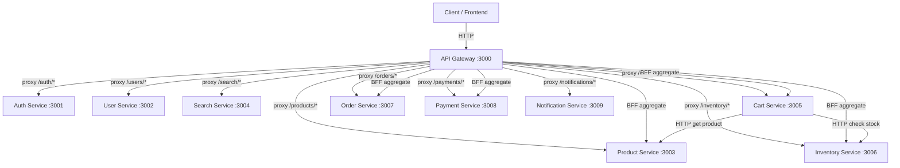
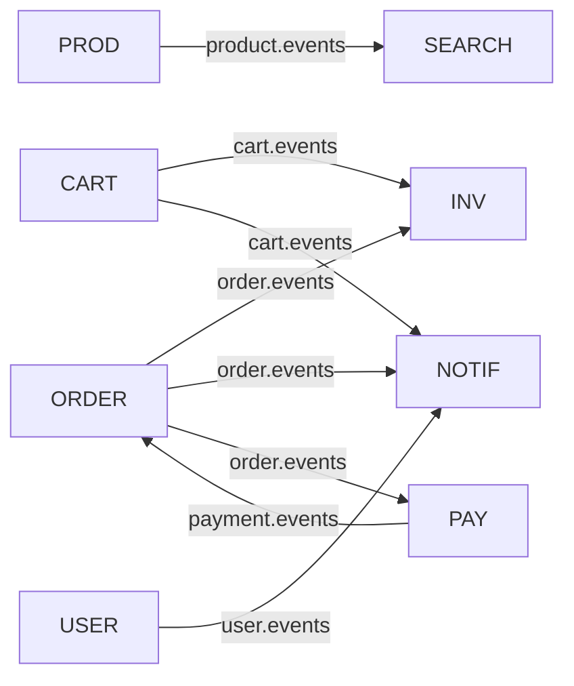
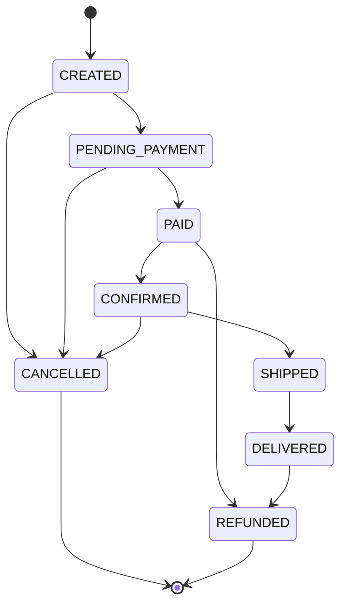
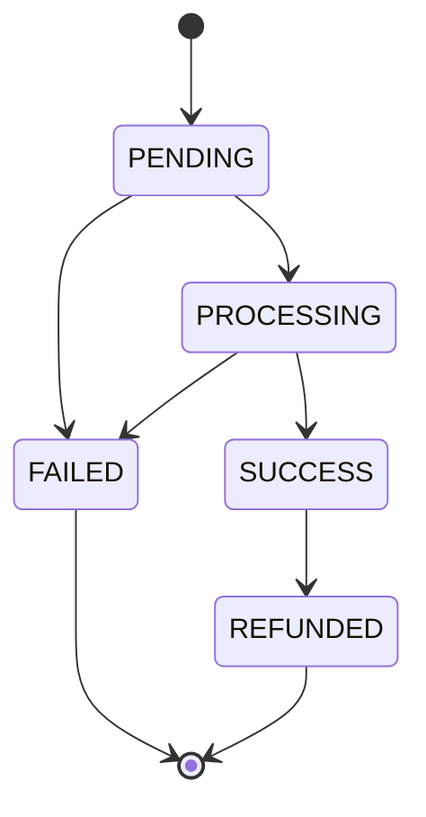

# Deep System Analysis — Scalable E-Commerce Microservices Platform

> **Audience**: Staff+/Principal Engineers, new Senior Engineers joining the team  
> **Scope**: Complete mental model of the distributed system — architecture through failure modes  
> **Source of truth**: Reverse-engineered from the actual codebase, not documentation

---

## SECTION 1 — System Mental Model

### Core Domains

The system decomposes e-commerce into **7 bounded contexts**:

| Domain | Service | Source of Truth | Storage |
|--------|---------|-----------------|---------|
| **Identity & Access** | auth-service | User credentials, JWT tokens | PostgreSQL + Redis |
| **User Management** | user-service | User profiles, settings, status | PostgreSQL |
| **Product Catalog** | product-service | Product data, pricing, status | PostgreSQL |
| **Search & Discovery** | search-service | Searchable product index | OpenSearch + Redis |
| **Shopping Cart** | cart-service | Active carts, line items | Redis (primary) |
| **Inventory** | inventory-service | Stock levels, reservations | PostgreSQL + Redis |
| **Order Lifecycle** | order-service | Orders, line items, status | PostgreSQL |
| **Payments** | payment-service | Payment records, transactions | PostgreSQL |
| **Notifications** | notification-service | Notification delivery status | In-memory (no persistent DB) |

The **API Gateway** is not a domain — it's an infrastructure concern that provides:
- Reverse-proxy routing to all services
- JWT authentication enforcement
- Rate limiting (Redis-backed throttling)
- BFF (Backend-for-Frontend) aggregation endpoints
- HMAC-signed service-to-service identity propagation

### Mental Model — How to Think About This System

Think of this system as having **three distinct planes**:

```
┌─────────────────────────────────────────────┐
│  SYNCHRONOUS PLANE (HTTP request/response)  │
│  Client → Gateway → Service → DB → Response │
└─────────────────────┬───────────────────────┘
                      │ Transactional Outbox
┌─────────────────────▼───────────────────────┐
│  ASYNCHRONOUS PLANE (Kafka event streams)   │
│  Outbox → Relay → Kafka → Consumer → Action │
└─────────────────────┬───────────────────────┘
                      │ Cache writes
┌─────────────────────▼───────────────────────┐
│  MATERIALIZED VIEW PLANE (Read replicas)    │
│  Redis caches, OpenSearch indexes           │
└─────────────────────────────────────────────┘
```

**Key insight**: Every write goes through the synchronous plane, gets committed atomically with outbox entries, then propagates asynchronously. Read paths can go through any plane depending on freshness requirements.

### Data Flow of the Platform

```
User action → API Gateway (auth + rate limit)
  → Target service (domain logic + DB write + outbox write)
    → Outbox Relay polls every second
      → Kafka topic
        → Consumer services react (index update, notification, stock reservation, etc.)
```

### Critical Paths (ordered by business impact)

1. **Checkout / Order Creation** → order-service → inventory-service (stock reservation) → payment-service → notification-service
2. **Payment Processing** → payment-service → order-service (status update) → notification-service
3. **Product Catalog Updates** → product-service → search-service (index sync)
4. **User Authentication** → auth-service → JWT issuance → all subsequent requests

---

## SECTION 2 — Service Dependency Graph

### Synchronous Dependencies (HTTP)



### Asynchronous Dependencies (Kafka)



### Critical Dependency Chains

| Chain | Path | Risk Level |
|-------|------|------------|
| **Checkout** | `order → inventory → payment → notification` | 🔴 Critical |
| **Product Discovery** | `product → kafka → search (OpenSearch)` | 🟡 High |
| **Authentication** | `client → gateway → auth → Redis (token store)` | 🔴 Critical |
| **Cart Operations** | `client → gateway → cart → Redis` | 🟡 High |

### Upstream vs Downstream

- **Upstream (depended upon by many)**: PostgreSQL, Redis, Kafka — failure here cascades everywhere
- **Downstream (depends on many)**: notification-service (consumes from order, user, cart events) — safest to fail
- **Gateway** is a single point of entry — all client traffic flows through it

---

## SECTION 3 — Event Graph

### Event Producers & Topics

| Producer | Kafka Topic | Events Published |
|----------|-------------|------------------|
| order-service | `order.events` | `OrderCreated`, `OrderPaid`, `OrderConfirmed`, `OrderShipped`, `OrderCompleted`, `OrderCancelled`, `OrderRefunded`, `OrderPaymentRequested` |
| payment-service | `payment.events` | `PaymentCreated`, `PaymentProcessing`, `PaymentCompleted`, `PaymentFailed`, `PaymentRefunded` |
| product-service | `product.events` | `ProductCreated`, `ProductUpdated`, `ProductDeleted`, `ProductStockUpdated` |
| inventory-service | `inventory.events` | `StockReserved`, `StockReleased`, `StockConfirmed`, `LowStockDetected` |
| user-service | `user.events` | `UserCreated`, `UserUpdated`, `UserSuspended`, `UserReactivated`, `UserDeleted` |
| cart-service | `cart.events` | `ItemAdded`, `ItemRemoved`, `CartCleared`, `CartExpired`, `ItemQuantityUpdated` |
| notification-service | `notification.events` | `NotificationSent`, `NotificationFailed` |

### Event Consumers

| Consumer Service | Subscribes To | Actions Taken |
|------------|---------------|---------------|
| **search-service** | `product.events` | Index/update/remove products in OpenSearch |
| **inventory-service** | `order.events`, `cart.events` | Confirm stock on `OrderConfirmed`, release stock on `OrderFailed/Cancelled`, release stock on `CartExpired` |
| **notification-service** | `order.events`, `user.events`, `cart.events` | Send emails/SMS/push for order lifecycle, user welcome, cart reminders |
| **payment-service** | `order.events` (via command consumer) | Process payment when order requests it |

### Event Chains — The Checkout Saga

```
// Happy path
OrderCreated (order-service)
  → inventory-service reserves stock → StockReserved
  → order-service transitions to PENDING_PAYMENT → OrderPaymentRequested
    → payment-service processes payment → PaymentCompleted
      → order-service transitions to PAID → OrderPaid
        → order-service confirms → OrderConfirmed
          → inventory-service confirms stock → StockConfirmed
          → notification-service sends confirmation email

// Failure path — payment fails
OrderPaymentRequested (order-service)
  → payment-service fails → PaymentFailed
    → order-service cancels → OrderCancelled
      → inventory-service releases stock → StockReleased
      → notification-service sends failure notification
```

### Event Envelope Contract

All events use a standardized envelope ([envelope.ts](file:///c:/source/packages/events/src/envelope.ts)):

```typescript
{
  type: string,              // e.g., "OrderCreated"
  schemaVersion: 1,          // versioned for backward compatibility
  source: string,            // producing service
  correlationId?: string,    // UUID for distributed tracing
  timestamp: string,         // ISO 8601
  payload: Record<string, unknown>
}
```

Events are validated at consumer boundaries using **Zod schemas** — runtime type safety for cross-service contracts.

---

## SECTION 4 — Data Lineage

### Product Data Flow

```
Admin creates product
  → product-service → PostgreSQL (source of truth)
    → UnitOfWork writes outbox entry atomically
      → OutboxRelayService polls every 1 second
        → Publishes to 'product.events' Kafka topic
          → search-service ProductEventConsumer
            → IndexProductCommand → OpenSearch index updated
              → Search queries now return the new product
```

- **Source of truth**: product-service PostgreSQL
- **Materialized view**: search-service OpenSearch index
- **Consistency**: Eventual (1-2 second lag typical, depends on outbox poll + Kafka latency)
- **Cache**: search-service uses Redis for search result caching

### Order Data Flow

```
Order placed
  → order-service → PostgreSQL (order + items + outbox)
    → Outbox relay → 'order.events' Kafka
      → inventory-service (reserves stock in its own PostgreSQL)
      → payment-service (creates payment record in its own PostgreSQL)
      → notification-service (sends email via provider)
```

- **Source of truth**: Each service owns its own data
- **No shared databases** — services communicate only via Kafka events and HTTP
- **Data replication**: Order data is never copied to other databases; services only store their own projections (e.g., inventory stores reservations, not order details)

### Inventory Data Flow

```
Stock reserved (order created)
  → inventory-service PostgreSQL: available-=N, reserved+=N
    → Validates invariant: available + reserved + sold = total
    → Outbox → Kafka 'inventory.events'

Stock confirmed (order paid)
  → inventory-service PostgreSQL: reserved-=N, sold+=N
    → Validates invariant again

Stock released (order cancelled)
  → inventory-service PostgreSQL: reserved-=N, available+=N
    → Validates invariant again
```

### Cart Data Flow

```
User adds item to cart
  → cart-service → Redis (primary store, JSON serialized)
    → Cart entity version incremented (optimistic concurrency)
    → Domain events buffered → outbox → Kafka 'cart.events'
      → inventory-service may reserve stock
      → notification-service may send cart abandonment reminders
```

- Cart uses **Redis as primary storage** (not PostgreSQL) — ephemeral by design
- Carts expire after 30 days (sliding window, refreshed on each mutation)

---

## SECTION 5 — Request Path Analysis

### User Login

```
1. Client POST /auth/login {email, password}
2. → API Gateway (rate limited: 100 req/60s, no JWT required — @Public)
3. → Forward to auth-service
4. → LoginHandler: validate credentials against PostgreSQL
5. → Check login attempts in Redis (brute-force protection)
6. → JwtAdapterService: generate access + refresh tokens
7. → Store refresh token in Redis TokenStore
8. → Return { accessToken, refreshToken }
```

### Product Search

```
1. Client GET /search/products?q=laptop&page=1
2. → API Gateway (@Public — no JWT required)
3. → Forward to search-service
4. → SearchProductsHandler → OpenSearch query
5. → QueryBuilder constructs OpenSearch DSL with filters, facets, pagination
6. → Check Redis cache first (cache-aside pattern)
7. → Return paginated SearchResult[]
```

### Add to Cart

```
1. Client POST /cart/items {productId, quantity}
2. → API Gateway (JWT verified → x-user-id extracted)
3. → Forward to cart-service
4. → AddItemHandler:
   a. Load cart from Redis (or create new if not exists)
   b. HTTP call to product-service to validate product exists + get price
   c. Optional HTTP call to inventory-service to check stock availability
   d. Cart.addItem() — domain logic (max 50 items, quantity 1-99)
   e. Save cart to Redis with version increment
   f. Publish domain events to Kafka via outbox
5. → Return updated cart state
```

### Checkout (Order Creation)

```
1. Client POST /orders {items[{productId, quantity, price}]}
2. → API Gateway (JWT required)
3. → Forward to order-service
4. → CreateOrderHandler:
   a. Order.create() — generates ID, validates items, computes total
   b. UnitOfWork.execute():
      - Save order to PostgreSQL
      - Write OrderCreatedEvent to outbox table atomically
   c. Return order with status CREATED

// Then asynchronously:
5. OutboxRelay polls → publishes OrderCreated to 'order.events'
6. → inventory-service consumes → reserves stock
7. → payment-service consumes → processes payment
8. → notification-service consumes → sends confirmation
```

### Order Tracking

```
1. Client GET /orders/:id
2. → API Gateway (JWT required)
3. → Forward to order-service
4. → GetOrderByIdHandler:
   a. Query PostgreSQL for order by ID
   b. Return order entity with current status

// Or via BFF aggregate:
1. Client GET /order-details/:id
2. → API Gateway → OrderDetailsService.getDetails()
3. → Parallel HTTP calls:
   a. order-service: order data
   b. product-service: product snapshots for line items
   c. payment-service: payment status
4. → Merge into single aggregated response
```

---

## SECTION 6 — State Machines

### Order Lifecycle (8 states)



**Transition rules** (from [order-status.vo.ts](file:///c:/source/apps/order-service/src/domain/value-objects/order-status.vo.ts)):

| From | Allowed Transitions |
|------|---------------------|
| `CREATED` | `PENDING_PAYMENT`, `CANCELLED` |
| `PENDING_PAYMENT` | `PAID`, `CANCELLED` |
| `PAID` | `CONFIRMED`, `REFUNDED` |
| `CONFIRMED` | `SHIPPED`, `CANCELLED` |
| `SHIPPED` | `DELIVERED` |
| `DELIVERED` | `REFUNDED` |
| `CANCELLED` | *(terminal)* |
| `REFUNDED` | *(terminal)* |

**Domain events emitted per transition**:
- `CREATED` → `OrderCreatedEvent`
- `PENDING_PAYMENT` → `OrderPaymentRequestedEvent`
- `PAID` → `OrderPaidEvent`
- `CONFIRMED` → `OrderConfirmedEvent`
- `CANCELLED` → `OrderCancelledEvent` (with reason)
- `SHIPPED` → `OrderShippedEvent` (with tracking number)
- `DELIVERED` → `OrderCompletedEvent`
- `REFUNDED` → `OrderRefundedEvent` (with reason + amount)

### Payment Lifecycle (5 states)



**Key**: Payments support **idempotency keys** to prevent double-charging. The `idempotencyKey` field on the entity prevents duplicate payment creation for the same order.

### User Lifecycle (3+1 states)

| From | Allowed Transitions |
|------|---------------------|
| `ACTIVE` | `SUSPENDED`, `DELETED` |
| `SUSPENDED` | `ACTIVE`, `DELETED` |
| `DELETED` | *(terminal — all operations blocked)* |

### Inventory Reservation Lifecycle

```
ACTIVE → CONFIRMED (order paid, stock moves to 'sold')
ACTIVE → RELEASED (order failed or cart expired, stock returns to 'available')
ACTIVE → EXPIRED (TTL elapsed, stock auto-returns)
```

### Cart Lifecycle

Carts are **ephemeral** with a 30-day sliding expiry:
- Created when first item is added
- Every mutation refreshes the expiry
- Max 50 distinct items, max 99 quantity per item
- Expired carts trigger `CartExpired` event → inventory releases stock

---

## SECTION 7 — Failure Propagation Model

### Scenario 1: Payment Service Failure

```
Order created → stock reserved → payment fails
  ├── PaymentFailedEvent published to 'payment.events'
  ├── order-service consumes → transitions order to CANCELLED
  ├── OrderCancelledEvent published to 'order.events'
  ├── inventory-service consumes → releases reserved stock
  └── notification-service sends failure notification to user
```

**Impact**: Order is cancelled gracefully. No revenue, but no data corruption.  
**Recovery**: Automatic via event-driven compensation.

### Scenario 2: Inventory Reservation Failure

```
Order created → inventory cannot reserve (insufficient stock)
  ├── InventoryReservationFailedEvent published
  ├── order-service transitions to CANCELLED
  └── User receives "out of stock" notification
```

**Impact**: Order never proceeds to payment. Fast failure.

### Scenario 3: Kafka Unavailable

```
Service writes to outbox table ✅ (DB transaction succeeds)
  → OutboxRelay polls every second
    → Kafka send fails → relay logs error and stops batch (preserves ordering)
    → Next poll cycle retries the same batch
  → Events accumulate in outbox table until Kafka recovers
```

**Impact**: **No data loss** — outbox guarantees at-least-once delivery. Downstream consumers see delayed events but don't miss them.  
**Duration tolerance**: Outbox can buffer indefinitely (limited by disk).

### Scenario 4: Redis Unavailable

| Component | Impact | Mitigation |
|-----------|--------|------------|
| **Gateway rate limiter** | Rate limiting fails open (requests pass through) | ThrottlerGuard degrades gracefully |
| **Auth token store** | Refresh tokens unavailable, users can't refresh JWTs | Access tokens remain valid until expiry |
| **Cart service** | Carts completely unavailable (Redis is primary store) | 🔴 **No fallback** — critical dependency |
| **Search cache** | Cache miss → queries hit OpenSearch directly | Performance degrades but function continues |
| **Inventory cache** | Stock reads go directly to PostgreSQL | Slightly slower but functional |
| **Distributed locks** | Lock acquisition fails → `false` returned → operation rejected | Safe failure — prevents inconsistency |

### Scenario 5: PostgreSQL Unavailable

**Impact**: 🔴 **Critical** — all write operations and most read operations fail for affected services.  
**Mitigation**: Each service has its own logical database. A single-node Postgres failure affects **all** services since they share one Postgres instance.

### Retry Mechanisms

| Component | Strategy | Details |
|-----------|----------|---------|
| **Outbox relay** | Polling retry | Polls every 1 second, stops batch on error to preserve order |
| **Search consumer** | In-memory retry counter | Max 3 retries per message, then DLQ routing |
| **Inventory consumer** | Catch-and-log | Errors logged but don't crash consumer loop |
| **Notification service** | Retry scheduler | Exponential backoff for failed notifications |
| **Distributed locks** | No retry | Returns `false` immediately if lock unavailable |

### Compensation Logic

- **Order cancellation** → inventory stock release
- **Payment failure** → order cancellation → inventory stock release
- **Cart expiry** → inventory stock release
- All compensation is **event-driven**, not choreographed by a central orchestrator

---

## SECTION 8 — Consistency Model

### Consistency Boundaries

| Boundary | Type | Mechanism |
|----------|------|-----------|
| **Within a single service** | **Strong consistency** | PostgreSQL ACID transactions via `UnitOfWork` |
| **Between services** | **Eventual consistency** | Transactional Outbox → Kafka → Consumer |
| **Read models (search index)** | **Eventual consistency** | ~1-2 second lag from write to searchable |
| **Cart state** | **Strong per-operation** | Redis single-threaded + version counter |
| **Session/token state** | **Strong per-node** | Redis SET/GET |

### Transactional Outbox Pattern

The system's most important consistency mechanism is the **Transactional Outbox** ([unit-of-work.ts](file:///c:/source/packages/core/src/persistence/unit-of-work.ts)):

```typescript
// Single DB transaction guarantees atomicity
await unitOfWork.execute(
  (manager) => manager.save(OrderOrmEntity, ormOrder),  // business data
  order.pullDomainEvents(),                              // outbox entries
);
// Either both commit, or neither does
```

This prevents the classic dual-write problem (DB write succeeds but Kafka publish fails or vice versa).

### Saga Coordination

The system uses **choreography-based sagas**, NOT orchestration:

```
OrderCreated → (inventory reacts) → StockReserved → (order reacts) → PaymentRequested
  → (payment reacts) → PaymentCompleted → (order reacts) → OrderPaid
```

**No central saga coordinator.** Each service listens for relevant events and takes action. Compensating actions are triggered by failure events.

> [!WARNING]
> Choreography sagas are harder to debug than orchestration sagas. There is no single place to see the full state of a saga instance. You must correlate events across services using `correlationId`.

### Where Consistency Trade-offs Occur

1. **Product search results** may show stale data (outbox relay + Kafka latency)
2. **Inventory stock counts** may be briefly inconsistent during concurrent reservations
3. **Cart-to-order transition** has no atomic guarantee — cart state and order creation are in different services
4. **BFF aggregation endpoints** may return data from different points in time across services

---

## SECTION 9 — Concurrency Model

### Parallel Event Consumers

Each Kafka consumer group processes messages **sequentially within a partition**:
- `inventory-consumer-group` — single consumer processing `order.events` + `cart.events`
- `search-consumer-group` — single consumer processing `product.events`
- `notification-consumer-group` — separate consumers for `order.events`, `user.events`, `cart.events`

### Race Conditions & Mitigations

| Race Condition | Risk | Mitigation |
|---------------|------|------------|
| **Two concurrent stock reservations for the same product** | Overselling | Redis distributed lock (`SET NX PX`) per product ID |
| **Concurrent cart updates by same user** | Lost update | Cart version counter (optimistic concurrency) |
| **Duplicate Kafka message delivery** | Double processing | `ProcessedEvent` table (idempotency check before processing) |
| **Concurrent order status transitions** | Invalid state | Domain entity enforces FSM — `canTransitionTo()` check |
| **Multiple payment attempts for same order** | Double charging | `idempotencyKey` on payment entity |

### Distributed Locks ([redis-lock.service.ts](file:///c:/source/apps/inventory-service/src/infrastructure/cache/redis-lock.service.ts))

```typescript
// Acquire: SET key requestId PX 5000 NX
// Release: Lua script checks value matches before DEL
await this.redis.set(key, requestId, 'PX', ttlMs, 'NX');
await this.redis.eval(RELEASE_LOCK_SCRIPT, 1, key, requestId);
```

The Lua script prevents releasing another client's lock — critical for correctness:
```lua
if redis.call("get", KEYS[1]) == ARGV[1] then
  return redis.call("del", KEYS[1])
else
  return 0
end
```

### Optimistic Locking

- **Order entity**: `_version` field, reconstituted from DB, used for ORM-level optimistic locking
- **Cart entity**: `version` field incremented on every save, checked by Redis repository
- **Inventory entity**: `_version` field for PostgreSQL optimistic locking via TypeORM `@VersionColumn`

---

## SECTION 10 — Performance Model

### Hot Paths (ordered by request frequency)

| Path | Expected QPS | Latency Target | Bottleneck |
|------|-------------|-----------------|------------|
| Product Search | High | <100ms | OpenSearch query + Redis cache |
| Product Page (BFF) | High | <200ms | Parallel HTTP fan-out |
| Cart Operations | Medium-High | <50ms | Redis read/write |
| Auth Token Validation | Every request | <5ms | JWT verification (CPU-bound, no I/O) |
| Order Creation | Medium | <500ms | PostgreSQL transaction + outbox write |
| Payment Processing | Low | <2s (async) | External payment provider |

### Latency Sources

1. **API Gateway overhead**: JWT validation + HMAC signing + rate limit check (~5-10ms)
2. **Service proxy**: HTTP forwarding adds ~2-5ms network hop
3. **Database queries**: PostgreSQL round-trip ~1-5ms (local), significantly more if network-separated
4. **Kafka publish**: Outbox relay polls every 1 second — adds up to 1s latency to async operations
5. **BFF aggregation**: Fan-out to 2-4 services in parallel, total latency = max(individual latencies)
6. **OpenSearch queries**: 10-50ms depending on query complexity and index size

### Cache Usage

| Service | Cache | Strategy | TTL |
|---------|-------|----------|-----|
| search-service | Redis | Cache-aside (check cache → miss → query → populate) | Configurable |
| cart-service | Redis | Primary storage (not a cache) | 30-day sliding window |
| inventory-service | Redis | Stock level cache + distributed locks | Lock: 5s TTL |
| api-gateway | Redis | Rate limit counters | 60s window |
| auth-service | Redis | Refresh token store + login attempt tracking | Token TTL |

### Read-Heavy vs Write-Heavy

- **Read-heavy**: Product search, product page, cart read, order status check
- **Write-heavy**: Cart mutations, order creation, stock reservation/release
- **Balanced**: User profile updates, notification dispatch

---

## SECTION 11 — Scaling Model

### Horizontal Scaling

| Component | Scaling Strategy | Consideration |
|-----------|------------------|---------------|
| **API Gateway** | Add instances behind load balancer | Stateless — scales linearly. Redis-backed rate limits shared across instances. |
| **Auth Service** | Add instances | JWT validation is stateless. Token store is in Redis (shared). |
| **Product/User/Order/Payment** | Add instances | Stateless application layer. Share the same PostgreSQL database. |
| **Cart Service** | Add instances | Stateless — Redis is the shared state. |
| **Search Service** | Add instances | Stateless — OpenSearch handles query distribution. |
| **Inventory Service** | ⚠️ Limited by locks | Distributed locks prevent true parallel scaling for the same product. |
| **Notification Service** | Add instances + partition consumers | Limited by consumer group partition assignment. |

### Kafka Partitioning

Currently, Kafka topics appear to use default partitioning. To scale consumers:

1. **product.events** — partition by `productId` (ensures ordered updates per product)
2. **order.events** — partition by `orderId` (ensures ordered state transitions per order)
3. **cart.events** — partition by `userId` (ensures ordered cart operations per user)
4. **inventory.events** — partition by `productId` (ordered stock operations per product)

> [!IMPORTANT]
> Increasing partitions allows more parallel consumers, but you must ensure that related messages (same orderId, same productId) go to the same partition to maintain ordering guarantees.

### Redis Scaling

- Current setup: Single Redis instance
- For scaling: Redis Cluster or Redis Sentinel for HA
- Cart service is **critically dependent** on Redis — this is the first thing to replicate

### Database Scaling

- Current setup: **Single shared PostgreSQL instance** with logical separation per service
- For scaling:
  - **Phase 1**: Read replicas for query-heavy services (product, order, user)
  - **Phase 2**: Physical database separation per service (each service gets its own Postgres instance)
  - **Phase 3**: Connection pooling (PgBouncer) to handle connection explosion with many service instances

---

## SECTION 12 — Bottleneck Analysis

### Identified Bottlenecks

| Bottleneck | Severity | Description | Mitigation |
|------------|----------|-------------|------------|
| **Single PostgreSQL instance** | 🔴 Critical | All services share one Postgres — single point of failure and contention | Separate databases per service, add read replicas |
| **Outbox relay polling interval** | 🟡 Medium | 1-second poll interval caps async event propagation speed | Reduce interval or switch to WAL-based CDC (Debezium) |
| **Inventory distributed lock contention** | 🟡 Medium | Popular products create lock contention under high concurrency | Consider optimistic locking with retry, or partition stock by warehouse |
| **API Gateway as single entry point** | 🟡 Medium | All traffic funnels through one gateway type | Multiple gateway instances behind load balancer |
| **Single Redis instance** | 🟡 Medium | Cart service, rate limiter, auth tokens all share one Redis | Redis Cluster or separate Redis instances per concern |
| **Sequential outbox processing** | 🟡 Medium | Outbox relay stops on first error to preserve ordering | Batch processing with per-message retry, or partition outbox by aggregate type |
| **BFF aggregation fan-out** | 🟢 Low | Parallel HTTP calls to multiple services — total latency = slowest service | Circuit breakers, timeouts, graceful degradation |

### Database Hotspots

- `outbox_events` table: Written on every command, read every 1 second by relay — high write + read contention
- `product_inventory` table: Hot during sales/high-traffic — concurrent reservations target same rows
- `orders` table: Frequent status updates during order lifecycle
- `processed_events` table in inventory-service: Read on every consumed event for idempotency check

---

## SECTION 13 — Observability Model

### Logging Strategy

**Implementation**: Pino (via `nestjs-pino`) with structured JSON logging ([logging.ts](file:///c:/source/packages/core/src/observability/logging.ts))

| Environment | Level | Format |
|-------------|-------|--------|
| Development | `debug` | `pino-pretty` with colorized output |
| Production | `info` | Structured JSON with `message` key (Datadog/CloudWatch compatible) |

### Distributed Tracing

**Implementation**: OpenTelemetry SDK ([tracing.ts](file:///c:/source/packages/core/src/observability/tracing.ts))

- Exporter: OTLP HTTP (`http://localhost:4318/v1/traces`)
- Auto-instrumentation enabled (HTTP, database, etc.)
- Each service initializes tracing with its own `serviceName`

### Correlation ID Propagation

**Implementation**: Custom Kafka header propagation ([correlation.ts](file:///c:/source/packages/core/src/kafka/correlation.ts))

```
HTTP Request → x-request-id middleware → x-correlation-id Kafka header → consumer extracts
```

- Gateway `RequestIdMiddleware` generates `x-request-id` for every incoming request
- When producing Kafka messages, `setCorrelationHeaders()` adds `x-correlation-id`
- Consumer-side `getCorrelationId()` extracts it (falls back to new UUID if missing)

### Metrics

**Implementation**: Prometheus ([metrics.ts](file:///c:/source/packages/core/src/observability/metrics.ts))

- All services expose `/metrics` endpoint
- Default Node.js metrics enabled (event loop lag, heap usage, GC)
- Custom metrics in product-service ([product-metrics.service.ts](file:///c:/source/apps/product-service/src/infrastructure/observability/product-metrics.service.ts)) and search-service, notification-service

### Debugging Distributed Flows

To trace a request across services:

1. Find the `correlationId` from the gateway request ID
2. Search Kibana/CloudWatch for `correlationId` across all services
3. Use OpenTelemetry traces to see the timing waterfall
4. Check `processed_events` table to verify idempotent event processing
5. Check `outbox_events` table for unprocessed events (relay lagging)

### Health Checks

Every service exposes a health endpoint (via `@nestjs/terminus`):
- PostgreSQL connectivity
- Redis connectivity
- Kafka consumer status
- Disk/memory thresholds

---

## SECTION 14 — System Risk Analysis

### Data Loss Risks

| Risk | Likelihood | Impact | Mitigation |
|------|-----------|--------|------------|
| Kafka message loss | Low | High | Transactional Outbox — events survive in DB even if Kafka is down |
| Redis data loss (cart) | Medium | Medium | RDB/AOF persistence. However, cart data is ephemeral by design |
| PostgreSQL data loss | Very Low | Critical | Standard PostgreSQL backups, WAL archiving, point-in-time recovery |
| Outbox relay crash mid-batch | Low | Low | Unprocessed events remain, next poll picks them up |

### Duplicate Event Risks

| Source | Mitigation |
|--------|------------|
| Outbox relay publishes same event twice (crash after Kafka send, before marking processed) | Consumer-side idempotency via `ProcessedEvent` table |
| Kafka rebalance causes re-delivery | Consumer-side idempotency check |
| HTTP retry causes duplicate command | Payment `idempotencyKey`, Order entity FSM prevents double transitions |

### Partial Failure Risks

| Scenario | Consequence | Mitigation |
|----------|-------------|------------|
| Order created but inventory never reserves stock | Order stuck in `CREATED` state | Timeout + auto-cancel for orders in `CREATED/PENDING_PAYMENT` state too long |
| Payment succeeds but order-service doesn't receive event | Order stuck in `PENDING_PAYMENT` | Reconciliation job or manual intervention |
| Notification fails to send | User not informed | Retry scheduler with exponential backoff, DLQ for terminal failures |

### Scaling Risks

| Risk | Description |
|------|-------------|
| Single Postgres saturation | All services share one instance — connection pool exhaustion under load |
| Redis OOM | Cart data grows unbounded for popular stores — need eviction policy |
| Kafka consumer lag | If consumers can't keep up, outbox table grows, event freshness degrades |
| Lock contention on popular products | Flash sales create hot-spot locks → request timeouts |

---

## SECTION 15 — Engineer Mental Framework

### Debugging Issues

```
Step 1: Identify the service (which URL path? which Kafka topic?)
Step 2: Get the correlationId / requestId
Step 3: Search structured logs across services for that correlationId
Step 4: Check the state machine — what state is the entity in? Is it stuck?
Step 5: Check the outbox table — are there unprocessed events?
Step 6: Check the processed_events table — was the event consumed?
Step 7: Check Kafka consumer lag — is the consumer behind?
Step 8: Check Redis — is the lock held? Is the cache stale?
```

### Adding a New Service

1. Create service in `apps/new-service/` following the existing structure:
   - `domain/` — entities, value objects, events, ports, errors
   - `application/` — commands, queries, handlers, ports
   - `infrastructure/` — persistence, kafka, redis, providers
   - `interfaces/` — controllers, DTOs
2. Add route in API Gateway's `gateway.controller.ts`
3. Add service URL to `gateway.config.ts`
4. Define event schemas in `packages/events/src/new-service.events.ts`
5. Register Docker container or add to service mesh
6. Add health check endpoint

### Extending Event Flows

1. Define new event schema in `packages/events/` with Zod + TypeScript interface
2. Add topic constant to the appropriate `*_TOPICS` enum
3. Publish from producing service via outbox pattern (never direct Kafka publish)
4. Create consumer in consuming service that:
   - Validates event with Zod schema
   - Checks `ProcessedEvent` table for idempotency
   - Dispatches to CQRS command bus
   - Marks event as processed
5. Handle error cases — log and continue, don't crash the consumer

### Maintaining Consistency

> [!TIP]
> **Golden rule**: Never write to the database AND publish to Kafka in separate steps. Always use `UnitOfWork.execute()` to atomically persist business data and outbox events.

- Always validate state transitions via domain entity methods (never update status directly in DB)
- Always check idempotency at consumer boundaries
- Use distributed locks only for inventory operations (not general-purpose)
- Design all event handlers to be idempotent — processing the same event twice should produce the same result

---

## SECTION 16 — Architecture Simplification

### Recommendations Without Losing Scalability

| Simplification | Benefit | Trade-off |
|---------------|---------|-----------|
| **Replace outbox polling with Debezium CDC** | Eliminates 1-second polling latency, reduces outbox table contention, real-time event streaming | Adds infrastructure complexity (Debezium, Kafka Connect) |
| **Introduce a saga orchestrator for checkout** | Single place to see saga state, easier debugging, deterministic retry/compensation | Additional service to deploy, adds a coordination bottleneck |
| **Split shared PostgreSQL into per-service databases** | True service independence, eliminates cross-service DB contention | More infrastructure to manage, but this is essential for production |
| **Move cart to Redis Cluster** | High availability for cart operations | Minor configuration complexity |
| **Use Kafka Transactions for exactly-once** | Eliminates need for consumer-side idempotency tables | Requires Kafka transaction support, slightly higher latency |
| **Add circuit breakers to all inter-service HTTP calls** | Prevent cascade failures when downstream services are unhealthy | Already partially implemented in inventory-service (`circuit-breaker.ts`) |
| **Consolidate notification consumers** | notification-service has 3 separate Kafka consumers — could use single consumer subscribing to multiple topics | Simpler code, but less isolation between event types |
| **Add API versioning at the gateway** | Enables backward-compatible API evolution | Requires header/URL versioning strategy |
| **Replace in-memory notification repository with persistent store** | notification-service currently loses all state on restart | Add PostgreSQL or MongoDB for notification records |

### Architecture Maturity Gaps

1. **No service mesh** — Service discovery, mTLS, traffic management are not present
2. **No centralized configuration** — Each service reads its own environment variables
3. **No API contract testing** — Consumer-driven contracts (Pact) would prevent breaking changes
4. **No chaos engineering** — No evidence of failure injection testing
5. **No blue-green or canary deployments** — Terraform modules exist but deployment strategy is basic
6. **Single-region** — No multi-region or disaster recovery architecture

---

> **Summary**: This is a well-structured microservices platform with solid DDD/hexagonal architecture, proper event-driven communication via the transactional outbox pattern, and good foundational patterns for production use. The main risks are around the shared PostgreSQL instance, the lack of saga orchestration visibility, and the ephemeral nature of some data stores. The codebase demonstrates mature patterns (CQRS, event sourcing preparation, distributed locks, idempotent consumers) that a Staff+ engineer would expect to see in a production-grade system.
