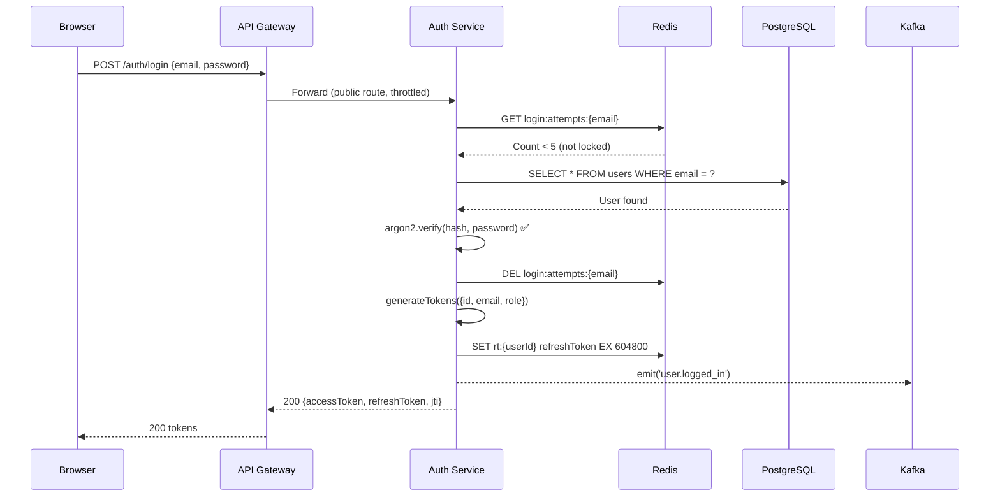
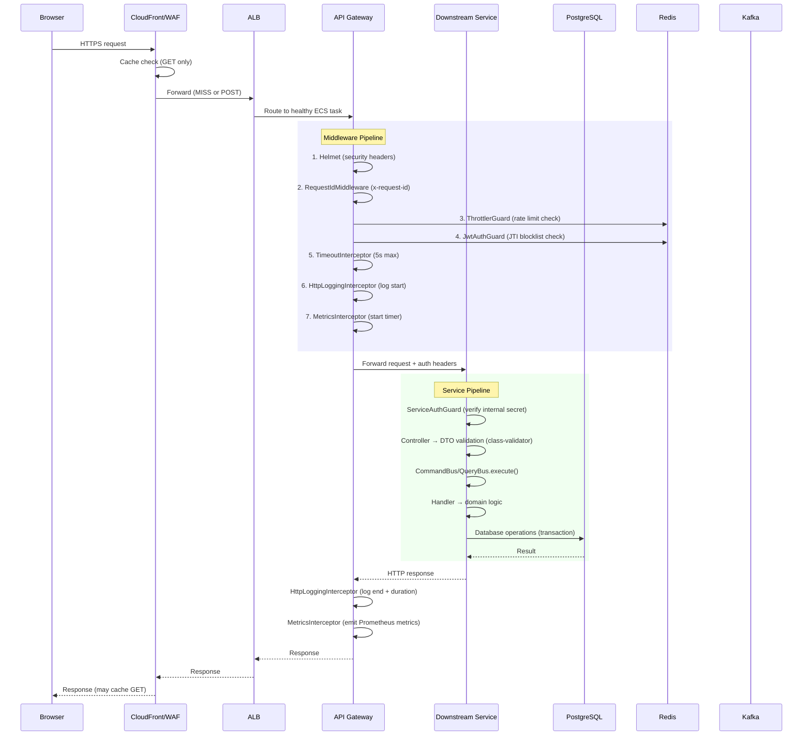

# Part II — Auth & Request Flow

> **Sections**: 4. Auth Flow (Authentication & Authorization) | 5. Request Flow (Request Lifecycle)

---

# Section 4: Auth Flow (Authentication & Authorization)

## 4.1 Authentication Architecture Overview

```
┌─────────────────────────────────────────────────────────────────┐
│                    AUTH ARCHITECTURE                              │
│                                                                   │
│  ┌──────────┐    JWT        ┌──────────────┐                    │
│  │ Browser  │──Bearer────→ │ API Gateway  │                    │
│  └──────────┘    Token      │ JwtAuthGuard │                    │
│       ▲                     │ (Passport)   │                    │
│       │                     └──────┬───────┘                    │
│       │ {accessToken,              │                            │
│       │  refreshToken}             │ Verify JWT:                │
│       │                            │ 1. Signature valid?        │
│       │                            │ 2. Not expired?            │
│       │                            │ 3. JTI not blocklisted?    │
│       │                            │    → Redis GET blocklist:  │
│       │                            │      jti:{jti}             │
│       │                            │                            │
│       │                     ┌──────▼───────┐                    │
│       │                     │ Auth Service │                    │
│       └─────────────────────│ /auth/*      │                    │
│                             │ (Public)     │                    │
│                             └──────┬───────┘                    │
│                                    │                            │
│                        ┌───────────┼───────────┐                │
│                        ▼           ▼           ▼                │
│                   ┌────────┐  ┌────────┐  ┌────────┐           │
│                   │ PG DB  │  │ Redis  │  │ Kafka  │           │
│                   │users   │  │tokens  │  │events  │           │
│                   └────────┘  └────────┘  └────────┘           │
└─────────────────────────────────────────────────────────────────┘
```

## 4.2 Login Flow (Step-by-Step)

```
Step 1:  Browser → POST /auth/login { email, password }
Step 2:  Route53 → CloudFront → Cache MISS (POST) → WAF → ALB → API Gateway
Step 3:  API Gateway → @Public route → skip JwtAuthGuard
Step 4:  API Gateway → ThrottlerGuard → Redis rate limit check
Step 5:  API Gateway → Forward to Auth Service
Step 6:  Auth Service → LoginHandler.execute()
Step 7:  loginAttemptService.isLocked(email) → Redis GET login:attempts:{email}
Step 8:  If locked (≥5 failed in 15min) → throw 429 TOO_MANY_REQUESTS
Step 9:  userRepository.findByEmail(email) → PostgreSQL
Step 10: If !user || !isActive → recordFailedAttempt → throw 401
Step 11: argon2.verify(storedHash, inputPassword) → timing-safe comparison
Step 12: If !valid → recordFailedAttempt → emit login_failed → throw 401
Step 13: loginAttemptService.clearAttempts(email) → DEL Redis counter
Step 14: jwtAdapterService.generateTokens({ id, email, role, tenantId, orgId })
Step 15: accessToken (15min TTL), refreshToken (7d TTL), jti (unique ID)
Step 16: tokenStoreService.storeRefreshToken(userId, refreshToken) → Redis SET
Step 17: kafkaClient.emit('user.logged_in', { userId, email, timestamp })
Step 18: Return { accessToken, refreshToken, jti }
```

### Login Sequence Diagram



## 4.3 JWT Structure

```json
{
  "sub": "usr-123e4567-e89b-12d3-a456-426614174000",
  "email": "john@example.com",
  "role": "CUSTOMER",
  "tenantId": "tenant-001",
  "orgId": "org-001",
  "jti": "jti-550e8400-e29b-41d4",
  "iat": 1711090800,
  "exp": 1711091700
}
```

| Claim | Purpose | Security Consideration |
|-------|---------|----------------------|
| `sub` | User ID | Primary identity |
| `role` | RBAC authorization | Never trust client-supplied role |
| `jti` | JWT ID for blocklisting | Enables per-token revocation |
| `tenantId` | Multi-tenancy isolation | Data-level access control |
| `exp` | 15min access token TTL | Short-lived reduces revocation window |

**Why short-lived access tokens?** 15-minute TTL means even if a token is stolen, the window of exploitation is small. JTI blocklisting in Redis provides immediate revocation capability within that window.

## 4.4 Token Lifecycle

```
┌──────────────────────────────────────────────────────────────────────┐
│                      TOKEN LIFECYCLE                                  │
│                                                                        │
│  LOGIN                                                                 │
│  ├─ Generate access token (15min) + refresh token (7d)                │
│  ├─ Store refresh token in Redis: rt:{userId} (TTL: 7d)              │
│  └─ Return both tokens to client                                      │
│                                                                        │
│  API REQUEST                                                           │
│  ├─ Client sends: Authorization: Bearer {accessToken}                 │
│  ├─ Gateway verifies: signature → expiry → JTI blocklist check       │
│  ├─ If valid → forward with x-user-id, x-user-role, x-user-jti      │
│  └─ If invalid → 401 Unauthorized                                     │
│                                                                        │
│  TOKEN REFRESH                                                         │
│  ├─ Client sends: POST /auth/refresh { refreshToken }                 │
│  ├─ Verify refresh token signature + expiry                           │
│  ├─ Compare with stored token in Redis (reuse detection)              │
│  ├─ If mismatch → THEFT DETECTED → revoke all tokens                 │
│  ├─ Generate new token pair                                            │
│  ├─ Overwrite old refresh token in Redis (rotation)                    │
│  └─ Return new { accessToken, refreshToken, jti }                     │
│                                                                        │
│  LOGOUT                                                                │
│  ├─ Client sends: POST /auth/logout + Bearer token                   │
│  ├─ DEL rt:{userId} from Redis (revoke refresh)                       │
│  ├─ SET blocklist:jti:{jti} "1" EX {remaining_ttl} (revoke access)   │
│  └─ Subsequent requests with old token → blocked by JTI check         │
│                                                                        │
│  Token Rotation (Theft Detection):                                     │
│  RT-1 issued → stored in Redis                                         │
│  RT-1 used → RT-2 issued → RT-1 overwritten                          │
│  RT-1 replayed → Redis has RT-2 → MISMATCH = stolen token detected   │
│  → Revoke ALL tokens for user                                          │
└──────────────────────────────────────────────────────────────────────┘
```

## 4.5 API Gateway Authentication Pipeline

```
Request → Helmet → RequestIdMiddleware → ThrottlerGuard → JwtAuthGuard → Route Handler

JwtAuthGuard pipeline:
  1. Check if route has @Public() decorator → skip authentication
  2. Extract Bearer token from Authorization header
  3. jwt.verify(token, JWT_SECRET) → decode payload
  4. Check JTI blocklist: Redis GET blocklist:jti:{jti}
     - If blocklisted → throw 401 (token revoked)
  5. Attach user context to request: { userId, email, role, jti }
  6. Forward to downstream service with headers:
     - x-user-id: {userId}
     - x-user-role: {role}
     - x-user-jti: {jti}
     - INTERNAL_AUTH_SECRET: {secret}
```

## 4.6 Service-to-Service Authentication

```
Gateway → Downstream Service:
  Headers added:
    x-internal-auth: {INTERNAL_AUTH_SECRET}    (shared secret from env)
    x-user-id: {userId}                        (from JWT, trusted)
    x-user-role: {role}                        (from JWT, trusted)

Downstream ServiceAuthGuard:
  1. Extract x-internal-auth header
  2. Compare with INTERNAL_AUTH_SECRET env var
  3. If mismatch → 403 Forbidden (external request rejection)
  4. Trust x-user-id and x-user-role (already verified by Gateway)
```

**Trade-off**: Shared secret is simple but requires rotation coordination. Future improvement: mTLS between services or service mesh (Envoy/Linkerd) with automatic certificate rotation.

## 4.7 Role-Based Access Control (RBAC)

```
Roles:
  CUSTOMER     → Browse products, manage own cart, place orders, view own orders
  ADMIN        → All CUSTOMER permissions + CRUD products, view all orders
  SUPER_ADMIN  → All ADMIN permissions + manage users, system config

Enforcement Points:
  1. API Gateway: JwtAuthGuard extracts role from JWT
  2. API Gateway: GatewayController can check role before forwarding
  3. Service Level: @Roles('ADMIN') decorator → RolesGuard
  4. Domain Level: Ownership checks (e.g., UserIdGuard — path userId == JWT sub)

Example — Cart Security:
  POST /cart/{userId}/items
  → JwtAuthGuard: verify JWT
  → UserIdGuard: path.userId === jwt.sub (prevent horizontal privilege escalation)
  If User A tries to modify User B's cart → 403 Forbidden
```

## 4.8 Security Considerations

| Concern | Mitigation |
|---------|------------|
| Password storage | Argon2id (memory-hard, timing-safe) — no bcrypt |
| Brute force login | Redis-backed attempt counter, 5 failures → 15min lockout |
| Token theft | Short-lived access (15min), refresh rotation with theft detection |
| XSS token exposure | Tokens in HTTP-only cookies (recommended) or secure storage |
| JWT secret compromise | Environment-specific secrets via AWS Secrets Manager |
| Timing attacks | argon2.verify is timing-safe; constant-time token comparison |
| Replay attacks | JTI blocklist in Redis, refresh token rotation |

---

# Section 5: Request Flow (Request Lifecycle)

## 5.1 End-to-End Request Path

```
┌─────────────────────────────────────────────────────────────────────────────┐
│                        REQUEST LIFECYCLE (Synchronous)                       │
│                                                                               │
│  1. Browser          → HTTPS request                                         │
│  2. Route53          → DNS resolution (api.example.com → CloudFront)        │
│  3. CloudFront       → CDN: cache HIT for static, MISS for API → origin    │
│  4. WAF              → Security: rate limit, IP block, SQL injection        │
│  5. ALB              → TLS termination, health-check routing to ECS         │
│  6. API Gateway      → RequestIdMW → Throttler → JwtAuth → Timeout(5s)    │
│  7. Service          → Controller → CommandBus → Handler → Domain → DB     │
│  8. Response         → Same path in reverse, structured logging at each     │
│                                                                               │
│                        REQUEST LIFECYCLE (Asynchronous Extension)             │
│                                                                               │
│  9.  Outbox          → Domain saves event atomically with state change      │
│  10. OutboxProcessor → Polls unprocessed events, publishes to Kafka         │
│  11. Kafka           → Message delivered to consumer group                   │
│  12. InboxService    → Dedup, CAS lock, execute handler in transaction      │
│  13. Handler         → Updates read model / triggers next saga step         │
│  14. DLQ             → If maxRetries exhausted → dead letter queue          │
└─────────────────────────────────────────────────────────────────────────────┘
```

## 5.2 Request Lifecycle Diagram



## 5.3 Middleware & Interceptor Chain

| Order | Component | Purpose | Failure Behavior |
|-------|-----------|---------|------------------|
| 1 | **Helmet** | Security headers (X-Frame-Options, CSP, HSTS) | N/A (always succeeds) |
| 2 | **RequestIdMiddleware** | Generate/propagate `x-request-id` for tracing | Generate new if missing |
| 3 | **ThrottlerGuard** | Rate limiting (Redis counter per IP) | 429 Too Many Requests |
| 4 | **JwtAuthGuard** | JWT verification + JTI blocklist check | 401 Unauthorized (or skip for @Public) |
| 5 | **TimeoutInterceptor** | 5-second request timeout | 504 Gateway Timeout |
| 6 | **HttpLoggingInterceptor** | Structured request/response logging | N/A (non-blocking) |
| 7 | **MetricsInterceptor** | Prometheus counters + histogram | N/A (non-blocking) |

## 5.4 Correlation ID & Distributed Tracing

```
Synchronous (HTTP):
  Browser → API Gateway → generates x-request-id (UUID)
  API Gateway → Downstream → propagates x-request-id
  OpenTelemetry auto-instrumentation:
    Root span created at Gateway
    W3C traceparent header propagated to downstream services
    Each service creates child spans

Asynchronous (Kafka):
  Producer → outbox event includes correlationId
  OutboxProcessor → adds x-correlation-id to Kafka message headers
  Consumer → InboxService stores correlationId in inbox_events table
  All logs and spans tagged with correlationId

This allows tracing a single user action across:
  Browser → Gateway → Order → Kafka → Inventory → Kafka → Payment → Kafka → Order
  All connected via the same correlationId
```

## 5.5 Error Handling Pipeline

```
Domain Exception (e.g., InsufficientStockException)
  → Caught by GlobalExceptionFilter
  → Mapped to HTTP status (422)
  → Structured JSON response with requestId
  → Logged with full context

Infrastructure Exception (e.g., PostgreSQL connection error)
  → Caught by GlobalExceptionFilter
  → Mapped to 500 Internal Server Error
  → Error details logged but NOT exposed to client
  → Prometheus error counter incremented

Timeout (>5s)
  → TimeoutInterceptor throws RequestTimeoutException
  → 504 Gateway Timeout
  → Logged with full trace context for debugging
```

## 5.6 Retry & Timeout Configuration

| Layer | Timeout | Retry | Strategy |
|-------|---------|-------|----------|
| CloudFront → Origin | 30s | 2 retries | CloudFront built-in |
| API Gateway → Service | 5s | 0 (no retry) | TimeoutInterceptor |
| Service → PostgreSQL | 3s | 3 retries, 200ms backoff | safeExecute FAIL_CLOSE |
| Service → Redis | 1s | 0 (fail-open) | safeExecute FAIL_OPEN |
| Service → Kafka | 2s | 0 (non-blocking) | safeExecute NON_BLOCKING |
| Service → External API (Stripe) | 10s | 3 retries, 500ms backoff | safeExecute FAIL_CLOSE |
